# Working with Oracle Identity Cloud Service APIs

The Oracle Identity Cloud Service REST APIs support SCIM 2.0 compliant endpoints with standard SCIM 2.0 core schemas and Oracle schema extensions to programmatically manage users, groups, applications, and identity functions, such as password management and administrative tasks. To make REST API calls to your Oracle Identity Cloud Service environment, you need an OAuth2 access token to use for authorization. The access token provides a session, that your client application can use to perform tasks in Oracle Identity Cloud Service.

As part of the following exercise you will use IDCS APIs to make queries to the back end and modify your Luna user id parameters. For the purposes of this lab we have already created a confidential application that you will interact with. You will find the information within the next steps.

## STEP 1: Create a confidential app

In this section, you register an application in Oracle Identity Cloud Service. This task is required to obtain the credentials (*Client ID and Client Secret*) that are used for authentication in REST API calls. The credentials are equivalent to service credentials (*ID and password*) that your client uses to communicate with Oracle Identity Cloud Service. This task also helps you determine which requests are authorized through the REST API.

1. Use your crendentials to login to OCI console. 

    

2. Log in to Oracle Identity Cloud Service. You can access it from the OCI console by typing **idcs** in the search bar and clicking **OracleIdentityCloudService** Identity Provider
   
   

3. In the service information windows, click on the **Oracle Identity Cloud Service Console** link
   

4. In the Oracle Identity Cloud Service administration console, expand the Navigation Drawer , click **Applications**, and then click **Add**.
    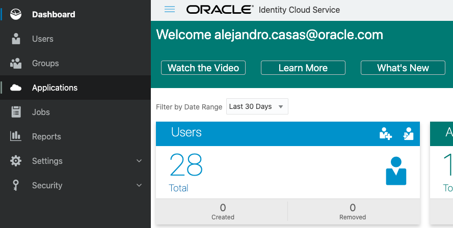
   
5. In the Add Application dialog box, select **Trusted Application** or **Confidential Application**.
   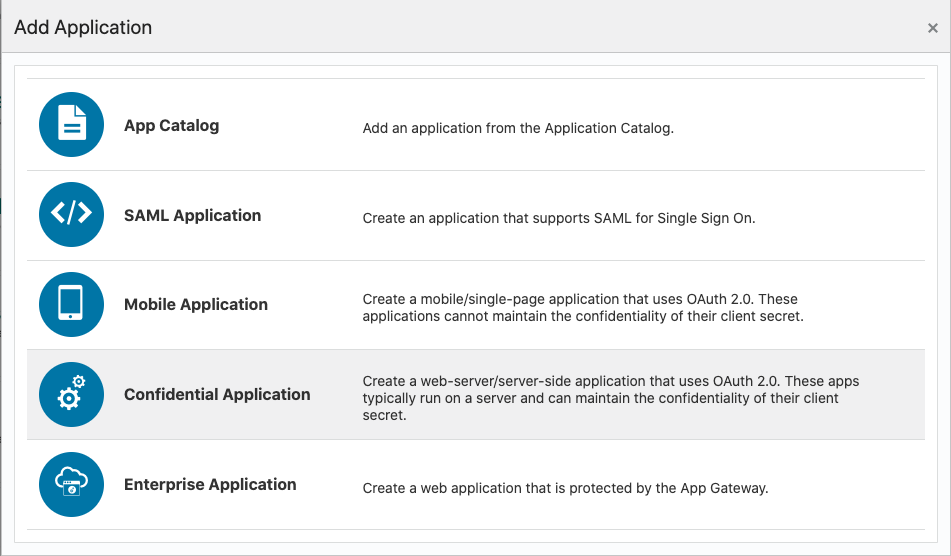
   
6. In the App Details section on the Add Trusted Application page, enter an application **name** and **description**, and then click **Next**.
   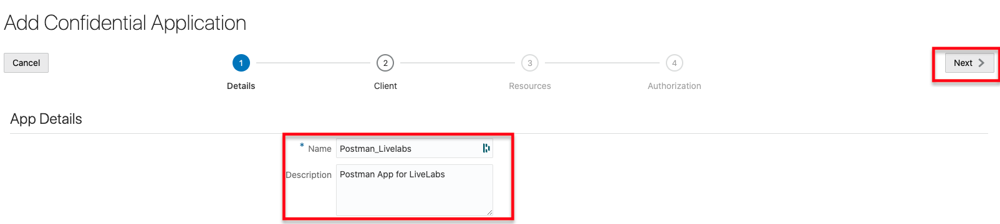
   
7. Select **Configure this application as a client now**, and then, in the Authorization section that appears, select only **Client Credentials** as the Allowed Grant Type.
    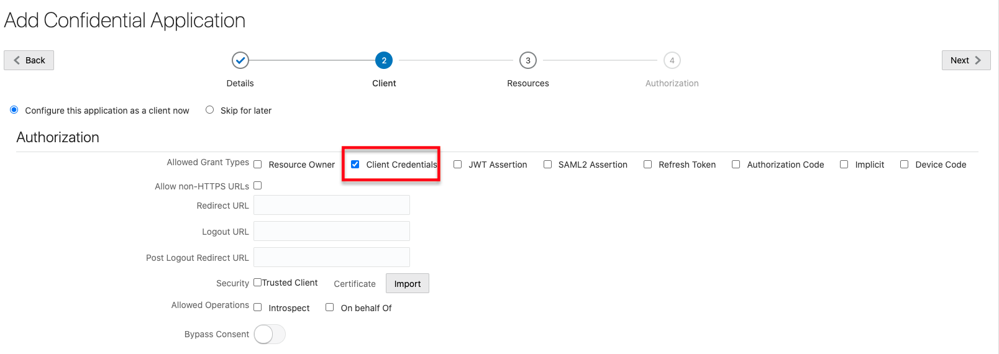
   
8.  Scroll down, and click the **Add** button below Grant the client access to Identity Cloud Service Admin APIs.
    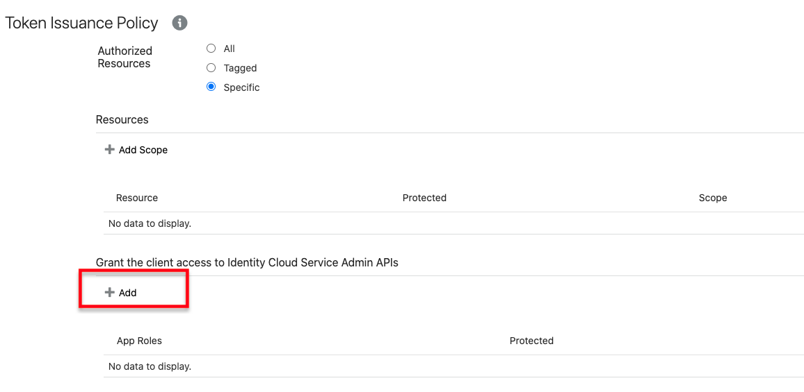
    
9.  In the Add App Role dialog window, select **Identity Domain Administrator** in the list, and then click **Add**.
    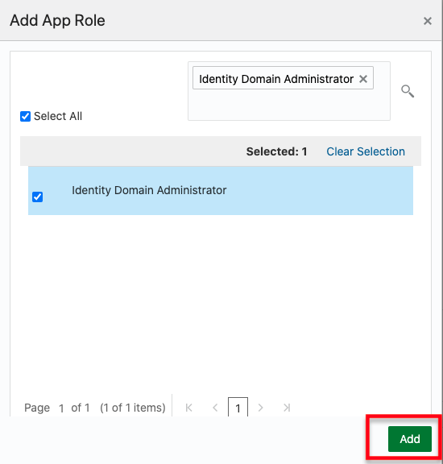
    
10. Click Next in the Client pane and in the following panes until you reach the last pane. Then click Finish.
    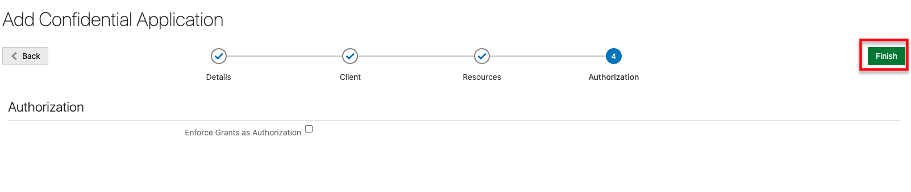
    
11. In the Application Added dialog box, copy the **Client ID** and the **Client Secret** to a text file, and then click Close. (*Note: Copy this information. You will use it as part of the next step*)
    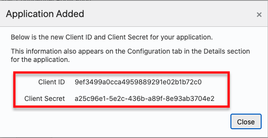
    
12. Click **Activate**, and then click **Ok** Application.
    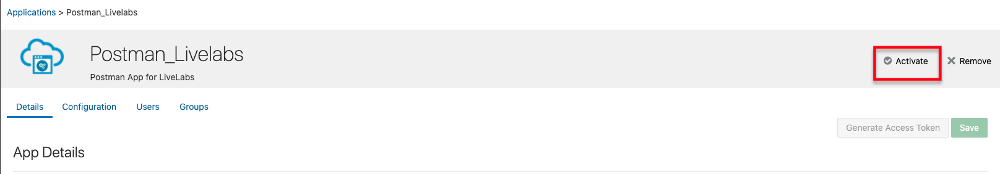

    

**What You have done**

You have created a confidential app to make REST API calls to your Oracle Identity Cloud Service environment. This allow developers and administrators to interface with IDCS and build their apps.

***

## STEP 2: Download and Configure Postman

1. We need first to download the API client. For the purpose of this lab we will use **Postman**. Copy the following URL and past it in Firefox. `https://www.postman.com/downloads/`. Click **Download** and select the version based on your Operating System. 

    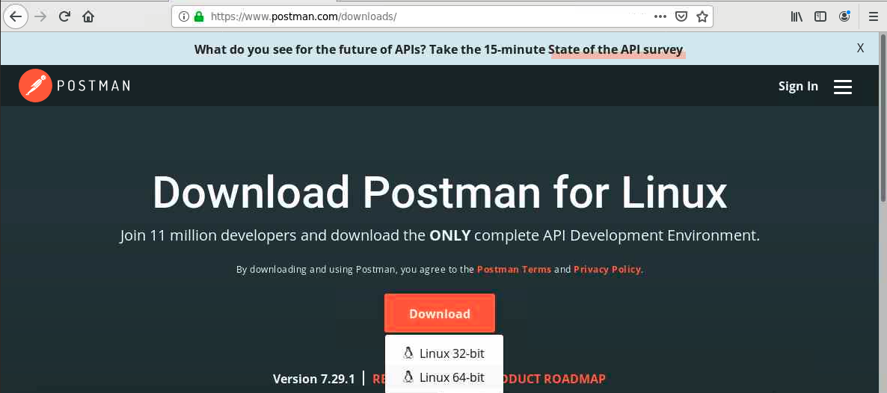

2. Confirm the download by clicking **OK**.

    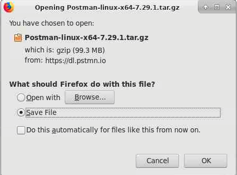

3. Once downloaded, Open a terminal window and execute the following commands from your home directory: *Note: For the purpose of this lab we will be using Oracle Linux, please refer to Postman and your Operating System documentation on how installing the Postman client. Your package version might vary, please verify the file name before continue.*

    `cd Downloads`

    `tar xvzf Postman-Linux-x64-7.29.1.tar.gz`

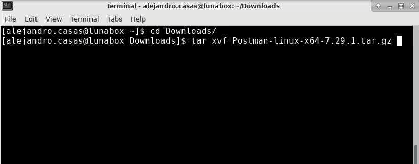

1. Now that the package has been extracted, you should be able to run the client. Go to the Postman directory using the following command `cd Postman` and run `./Postman`    

    

2. In the welcome screen click **Skip signing in and take me straight to the app** option located at the bottom of the window.

    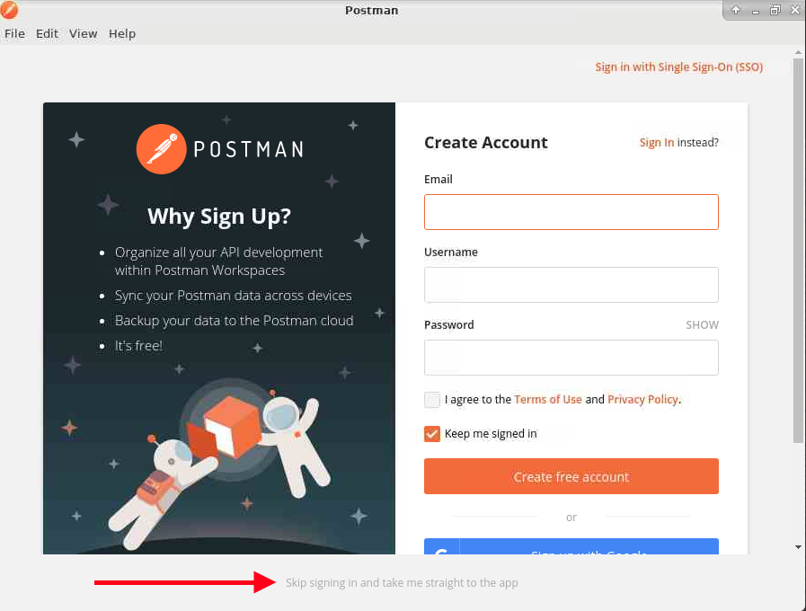

3. First we need to import IDCS Postman environment variables, global variables and IDCS API collection. Click the **Import** button on the left upper corner

    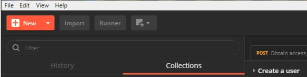

4. Select **Import from Link** and provide the following URL to import the environment variables. Click **Continue** and click **Import**.

    `https://github.com/oracle/idm-samples/raw/master/idcs-rest-clients/example_environment.json`

9. To import the Oracle Identity Cloud Service REST API Postman collection, on the Postman main page, click **Import**.

10. In the Import dialog box, select **Import From Link**, paste the following GitHub Postman collection URL into the box, click **Continue** and then click **Import**:

    `https://github.com/oracle/idm-samples/raw/master/idcs-rest-clients/REST_API_for_Oracle_Identity_Cloud_Service.postman_collection.json`

11. You should see the Oracle Identitiy Cloud Service REST API collection listed in the **Collections** tab.
    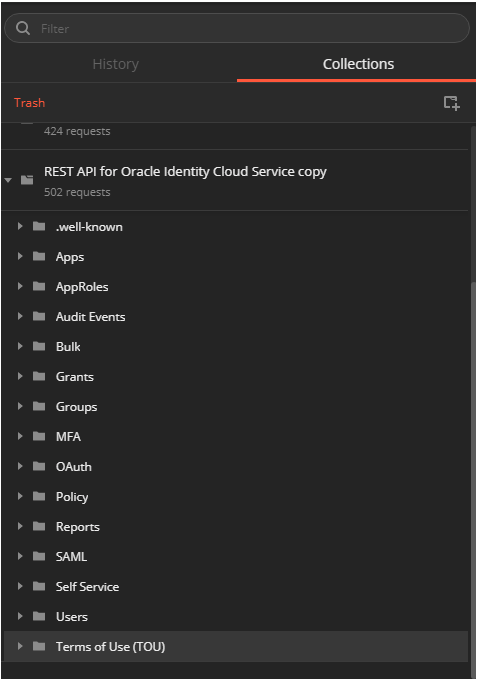

13. To import the global variables file, click **Import**.

14. In the Import dialog box, select **Import From Link**, paste the following GitHub Postman Globals URL into the box, click **Continue** and then click **Import**:

    `https://github.com/oracle/idm-samples/raw/master/idcs-rest-clients/oracle_identity_cloud_service_postman_globals.json`

    *NOTE: You might not receive a notification once the variables have been imported*

15. Click on the Settings button (cogwheel icon) to Manage Environments

    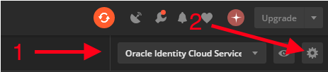

16. Click on the newly created environment which will be like **Oracle Identity Cloud Service Example Environment with Variables** to set the environment variables.

    

17. Set the following parameters values in order to be able to obtain an IDCS access token and click **Update**:

---

`HOST:https://idcs-<your_tenant_id>.identity.oraclecloud.com`

`CLIENT_ID: xxxxx`

`CLIENT_SECRET: xxxxx`

`USER_LOGIN: Your Luna User id`

`USER_PW: Your Luna User password`

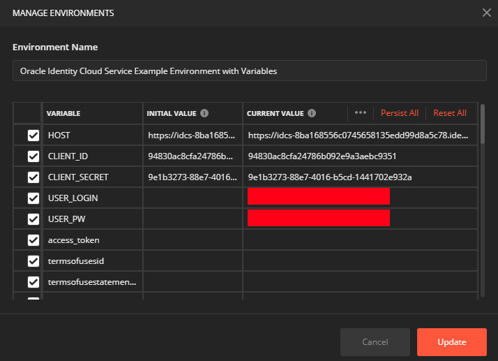

18.   Click the Environment drop-down list, and then select the updated environment from the list.

    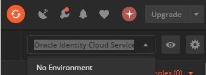

19.   On the Collections tab, expand **OAuth**, and then **Tokens**.

20.   Select **Obtain access_token (client credentials)**, and then click **Send**. The access token is returned in the response from Oracle Identity Cloud Service.

21.   Highlight the access token content between the quotation marks, and then **right-click**. In the shortcut menu, select Set: **Oracle Identity Cloud Service Example Environment with Variables**.

22.   In the secondary menu, select **access_token**. The highlighted content is assigned as the access token value as part of your local variables.

    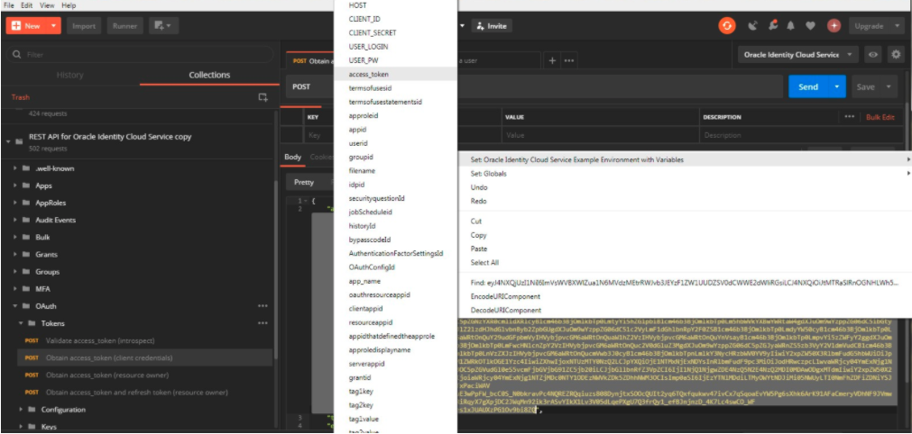

## STEP 3: Modifying users via Oracle Identity Cloud Service API

1. On the Collections tab, expand **Users**, and then **Search**.
2. Click on **Search all users (return specific attributes)**
3. Add the key `count` and the Value `1000`
4. Click on **Send**
5. On the result windown search your Luna user id and copy the **id** value without the quotes

    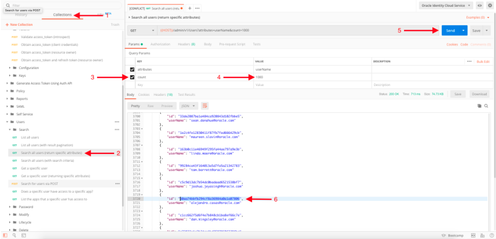

6. On the user collection select **Modify, and Update user (replace single attribute)**
   
7. On the patch parameters replace **{{userID}}** with your **ID** string copied in the previous step.
   
8. Select the **Body** Tab and update the **Phone value number** as shown on the screen and click **Send**

    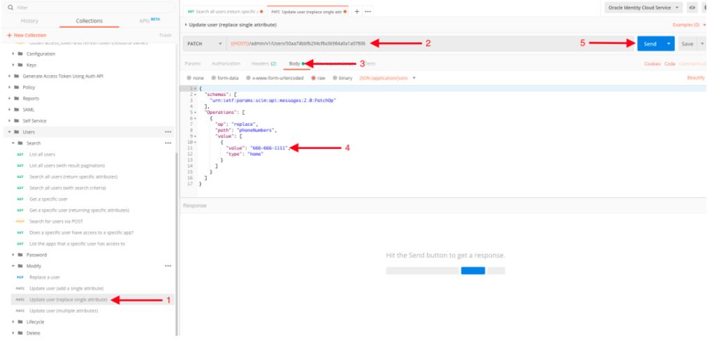

9.  You will receive an email with the profile update confirmation.

    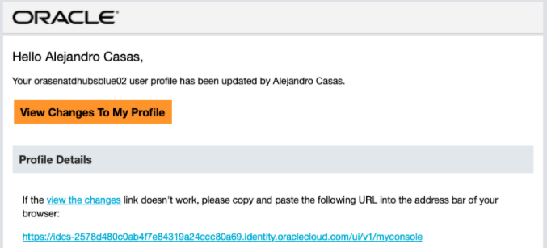

***
**What You have done**

You have used with REST application programming interface (API) calls to Oracle Identity Cloud Service using Postman to create, delete and modify users. For further information about using IDCS REST interface with postman, please visit Using the [Oracle Identity Cloud Service REST APIs with Postman](https://www.oracle.com/webfolder/technetwork/tutorials/obe/cloud/idcs/idcs_rest_postman_obe/rest_postman.html)
***