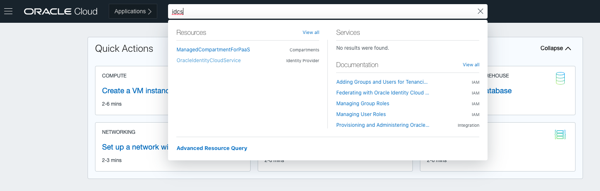
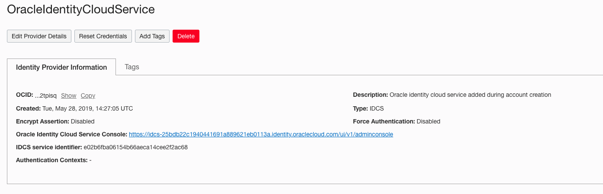
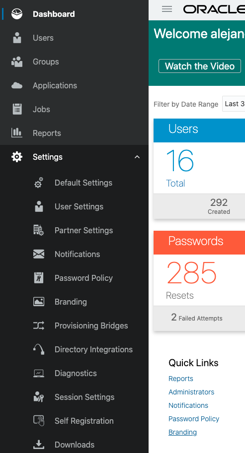

# Prerequisites

For the purposes of this lab you must have privileges to create two confidential apps in Oracle Identity Cloud Services. For further references about Identity Cloud users and roles, please refer to [About Oracle Identity Cloud Service Applications and Application Roles](https://docs.oracle.com/en/cloud/paas/identity-cloud/uaids/oracle-identity-cloud-service-applications-and-application-roles.html)

## STEP 1: Download the SDK 

Download Sample Application [HERE](./nodejs.zip). The package will be downloaded to your **Downloads** directory (*Note: Verify your OS configuration to find the location of your download directory*).

Below you will find the steps required to download the package from Oracle Identity Cloud Service Console. You can review them or move to the next section.

1. Use your crendentials to login to OCI console. 

    

2. Log in to Oracle Identity Cloud Service. You can access it from the OCI console by typing **idcs** in the search bar and clicking **OracleIdentityCloudService** Identity Provider
   
   

3. In the service information windows, click on the **Oracle Identity Cloud Service Console** link
   

4. In the Identity Cloud Service console, expand the Navigation Drawer, click Settings, and then click Downloads. The list of files to download appears.
   
   

5. Click **Download** to download the Identity Cloud Service SDK for **Node.js** SDK file, and save the zip file.
    

*Note: You will install the SDK after installing the other third-party libraries required for this lab.*