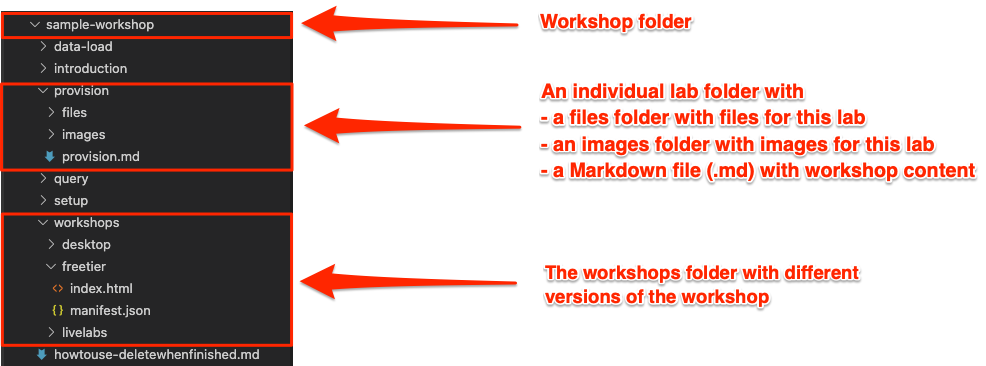
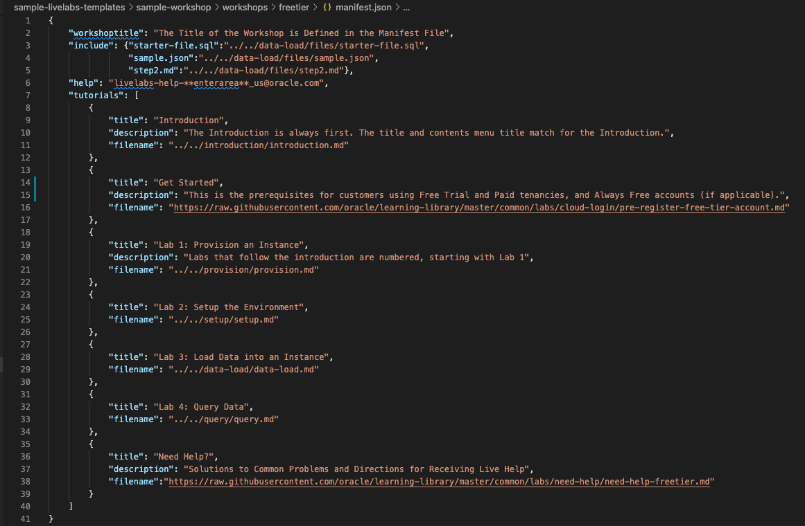

# Understand the learning-library folder structure

## Introduction

This lab describes the prescribed folder structure that we need to follow for developing LiveLabs workshops.

### Objectives

* Understand the **learning-library** folder structure.
* Familiarize yourself with the components of the workshop and the lab folders.

## Task 1: Folder Structure of the learning-library Repository

The following image shows a folder structure of the **sample-workshop** that is opened in the **Visual Studio Code** Editor, through the workshop folder **learning-library/sample-livelabs-templates**. You can see this structure at the following URL [https://github.com/oracle/learning-library/tree/master/sample-livelabs-templates/sample-workshop](https://github.com/oracle/learning-library/tree/master/sample-livelabs-templates/sample-workshop), or in the **sample-livelabs-templates/sample-workshop** folder of the clone on your machine. You can get started with workshop development by copying this sample workshop folder.

## Task 2: Understand the Components of the Workshop and Lab Folders
  The following describes the components of the above example:
  * The root folder of this example is the name of the workshop, **sample-workshop**.

>**Note:** You can create your project folder anywhere within your cloned repository. Please look into learning-library to see different libraries of workshops and decide a library for your workshop. If no existing libraries fit your workshop, please contact our LiveLabs team.

  * Each lab has its own folder, for example, **data-load**, **introduction**, **provision**, etc., each containing:
    * a **files** folder (optional) that contains the files used in this lab.
    * an **images** folder that contains the screenshots used in this lab.
    * a **.md** file that contains this lab's content.
  * The **workshops** folder contains the **desktop**, **freetier**, and/or **livelabs** folder, each containing:
    * an `index.html` file, which is executed when it is accessed by a browser. You can copy this file from the *sample-workshop* folder and use it without changes.
    * a `manifest.json` file defines the structure of the workshop that the `index.html` file renders. You can copy this file from the *sample-workshop* folder, but you need to customize it for your workshop.
    * a `README.md` file (optional), which contains the summary of the entire workshop. You can view it from your git repository.

    The following screenshot shows a sample `manifest.json` file that is opened in the **Visual Studio Code** Editor.
    

This concludes this lab. You may now **proceed to the next lab**.

## (Optional) Task 3: Customize Workshop for Events

Sometimes, workshop team may want to *customize the workshop for an upcoming event*, for example, having a different introduction of the workshop, adding or removing some labs. Meanwhile, the workshop team doesn't want to affect the workshop already in production. They can definitely have this customized version of workshop in production by following the instructions below.

Under the `workshops` folder, workshop team can create an event folder. Just like the `desktop`, `freetier`, and/or `livelabs` folder that already existed, this event folder also contains an `index.html` file and a `manifest.json` file. Workshop team can customize the workshop by updating the `manifest.json` file. Then, workshop team can use the link to the event folder for the event, leaving other workshops untouched.

Refer to Lab 3a -> Task 2 to use conditional formatting for event's content.

Refer to Lab 4 -> Task 9 to request to publish the workshop of type *Event*.

## Acknowledgements

* **Author:**
    * Anuradha Chepuri, Principal User Assistance Developer, Oracle GoldenGate
* **Contributors:**
    * Lauran Serhal, Principal User Assistance Developer, Oracle Database and Big Data User Assistance
    * Aslam Khan, Senior User Assistance Manager, ODI, OGG, EDQ
    * Tom McGinn, Database and Database Cloud Service Senior Principal Product Manager, DB Development - Documentation
    * Arabella Yao, Product Manager, Database Product Management

* **Last Updated By/Date:** Arabella Yao, March 2022
