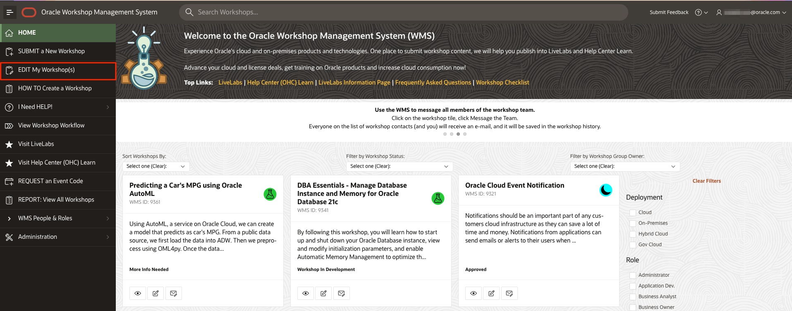
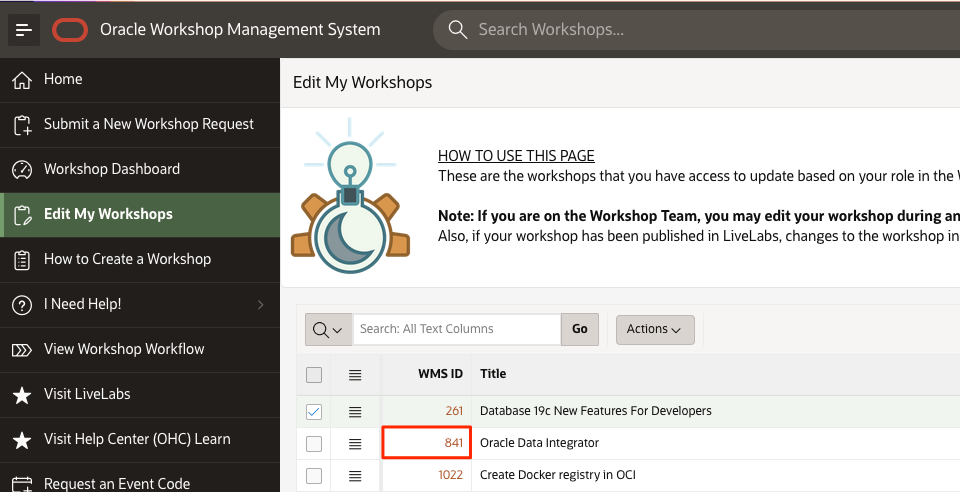
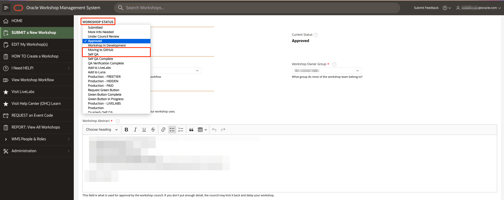
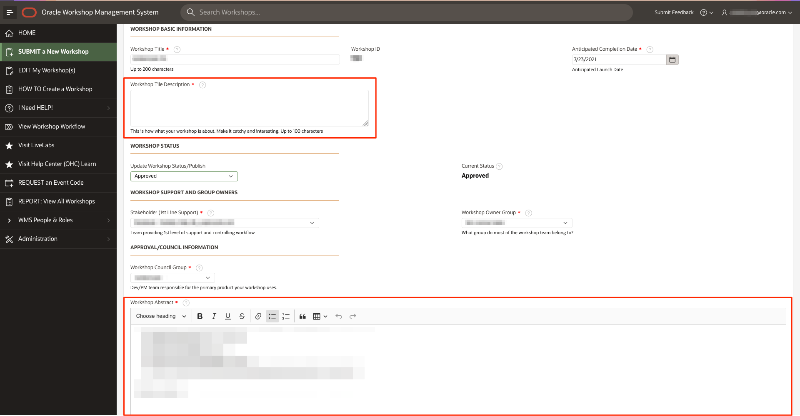
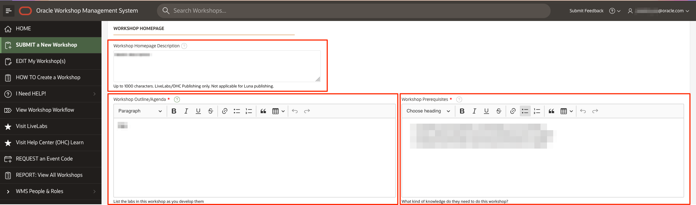
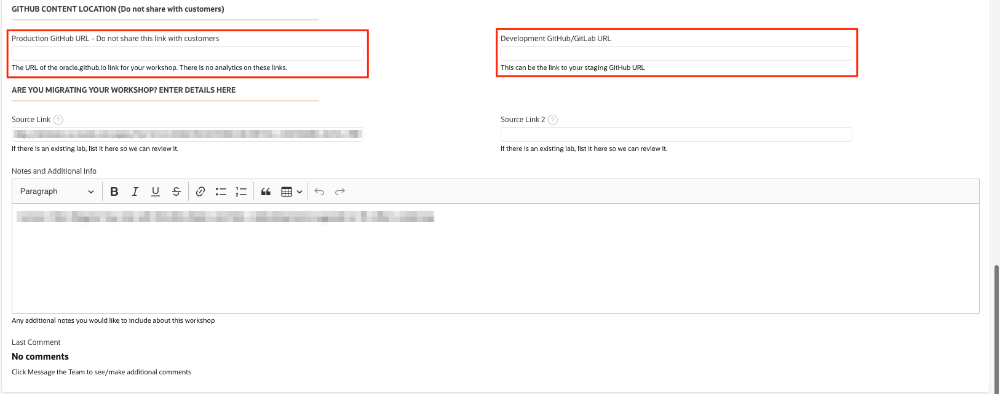
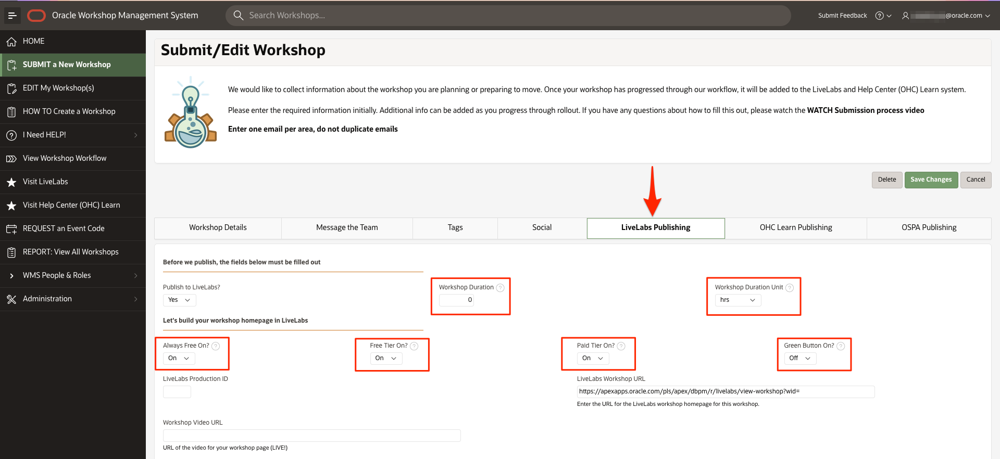
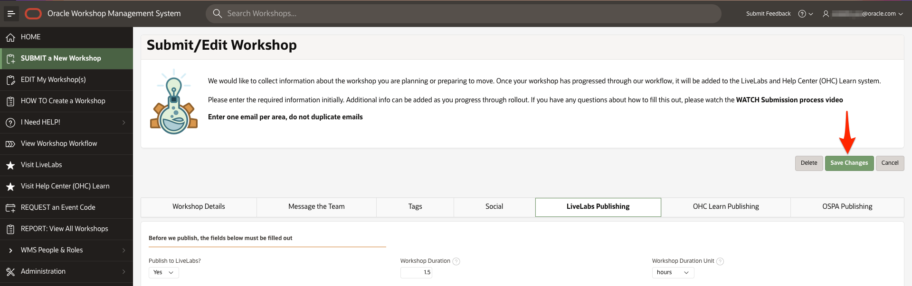
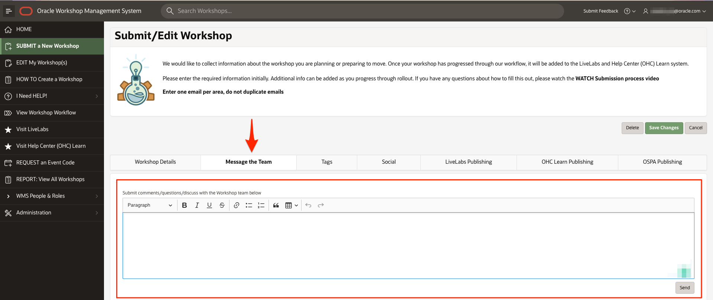
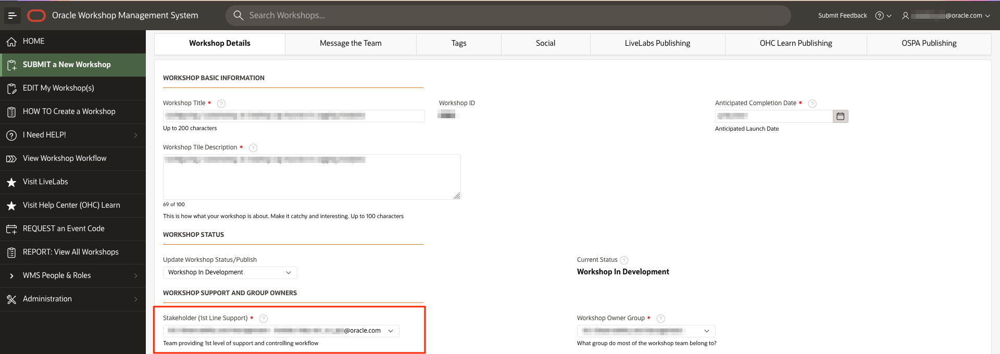

# Use GitHub Desktop to Commit to the GitHub Repository

## Introduction

As a best practice, merge your library everyday or whenever you start your GitHub Desktop application. *Merge* pulls all the commits (changes) from the [upstream/master repository (production)](https://github.com/oracle/learning-library), into your local filesystem clone (local machine). This keeps your local clone up-to-date with other people's work (commits) from the upstream/master. Next, you push the updated content from your clone into the origin of your clone, that is, your fork, to synchronize your clone with your fork. Merging also avoids the long time it could take to complete if you don't do that often.

### Objectives

* Commit your changes
* Request for a review
* Test your content
* Create a Pull Request to upload your content to master

### What Do You Need?
* Git Environment Setup
* GitHub Desktop client


This lab assumes that you have successfully completed **Lab 3: Use a Text Editor to Develop Markdown Content** in the **Contents** menu on the right.

## Task 1: Get Latest Updates from Production

Before you develop you should ensure you have the latest content from production to ensure you are developing off the latest code set.

1. Go to your personal github repo on the web and determine if your personal repo is behind the master.  If it is, perform the following steps to sync.  This should be done before you commit.

  

2. Start your **GitHub Desktop** client.  Go to **Branch** -> **Merge into Current Branch**.

  

3. Select the branch upstream/master (there may be a number of branches, search until you see *upstream/master*). Press the **merge upstream/master into master** button.

  

4. Finally, select **Push Origin**
  

4. To confirm, press refresh on your personal github repo on the web, you should have no commits *behind* now, only *ahead*.

  


## Task 2: Commit your Changes in your Clone
When you create, delete, or modify assets in your clone (local copy), you should commit (save) those changes to your clone, and then push those changes from your clone to your fork. Then these changes get saved to your forked learning-library repository.

To commit your changes:
1. Start your **GitHub Desktop** client.
2. In the **Summary (required)** text box on the left (next to your picture), enter a summary of your changes. You can optionally add a more detailed description of your changes in the **Description** text box.

  

3. Click **Commit to master**. This saves your changes in your local clone. **Fetch Origin** changes to **Push Origin**.

4. Click **Push origin** (it should have an upward arrow with a number). This pushes the updated content from your clone into the origin of this clone, that is, your fork.

  


## Task 3: Set Up GitHub Pages for your Fork to Test your Content

After you upload the content from your clone to your fork, request your review team members to review this content by providing them with access to your GitHub Pages site URL (or the URL of your forked repository).

The GitHub Web UI has a feature called as **Set Up GitHub Pages for Your Fork** to Test Your Content. This feature performs a dynamic conversion of the Markdown files (.md files you have developed using your Atom Editor) to HTML. You can preview your workshop and labs on your forked repository and provide this URL to your reviewers.

To publish your GitHub Pages site:
1. Login to [GitHub Web UI](http://github.com) using your GitHub account credentials, and then click your fork's link in the **Repositories** section to display your fork.

  

2. Click **Settings**.

   

3. Click **Options** and scroll down to the **GitHub Pages** section.

  

4. Under **Source**, select **master** (if it's not already selected) from the drop-down list.
5. Under **Theme Chooser**, click **Change Theme** and select a theme of your choice.

  This may take a few minutes to complete. After the GitHub Pages are enabled, the message under **GitHub Pages** changes to **Your site  is published at https://achepuri.github.io/learning-library**
  

## Task 4: Sharing your Workshop for Review
After you have successfully set up your GitHub pages, you can share your workshop for review.
To share and view your workshop:
1. In the browser, enter the URL of your GitHub Pages [https://achepuri.github.io/learning-library/](https://achepuri.github.io/learning-library/).
2. Append the URL with the details of your workshop.
    The complete URL will look similar to this: [https://achepuri.github.io/learning-library/sample-livelabs-templates/create-labs/labs/workshops/freetier/](https://achepuri.github.io/learning-library/sample-livelabs-templates/create-labs/labs/workshops/freetier/), which can be shared for review.

## Task 5: Create a Pull Request to Upload Your Content to the Master Repository

The **Pull Request** is a request that you send to the repository owners and code owners of the **oracle/learning-library** repository to approve and host your content on production **(upstream/master)** repository).

Note:  *Before executing a PR, make sure you have run Task 1 above and that your personal github repo on the web is not behind.  Failure to do so will result in conflicts.  You cannot issue a pull request without syncing first.  PRs will not be approved without your LWMS ID (Workshop ID)*

> **Note:** The owners can approve your request, ask for more information if required, or reject your request if your content does not meet the standards for Oracle GitHub.

To create a Pull Request:
1. In the **GitHub Desktop** client, select **Branch > Create pull request** to display a browser interface.

  

2. Click **Create pull request** to display an **Open a pull request** page.

  

3. Enter the title for the pull request, **include your LWMS ID** (you can find that by visiting the [LWMS](http://bit.ly/oraclelwms)) in the title.  PRs will not be approved without this ID.
4. Click **Create pull request**.
    
  A status page is displayed indicating that you have created a pull request along with the request number (for example, #1770), that it is pending review, and that merging is blocked.

  When your pull request is approved, the page gets updated with information about your commits being approved and merged into the **upstream/master** repository (production).

  When the pull request is approved and merged into the **upstream/master** repository, two emails are sent to the e-mail account associated with your GitHub account.

  > **Note:**
    * The first email notifies you that your pull request was approved (or rejected).
    * If your pull request was approved, then the second email notifies you that your pull request was merged into the **upstream/master** repository.  

  Your committed content is now visible to the public on the learning-library (upstream/master or production) repository.

## Task 6: Access your workshop in GitHub

After your pull request is complete, wait a few minutes and perform the steps below.  Github pages takes approximately 5 minutes for the pages to be copied

1.  Replace your GitHub pages site from Step 3 -> #5 with oracle.github.io.  This will take you to the full path of your workshop.  

  

2. This workshop for example is located in the link below.

  https://github.com/oracle/learning-library/tree/master/sample-livelabs-templates/create-labs/labs/workshops/freetier

3. The published version becomes:

  https://oracle.github.io/learning-library/sample-livelabs-templates/create-labs/labs/workshops/freetier

## Task 7: Change your status
Now that your workshop is in the learning library, change your status.
1. Go into the LWMS (Oracle employees only - [bit.ly/oraclelivelabs](https://bit.ly/oraclelivelabs)) and click **EDIT My Workshop(s)**.

  

2.  Go to the row for your workshop and click the **WMS ID** of your workshop.
    >**Note:** If your workshop is already in production, you will need to contact livelabs-admin_us@oracle.com to edit it.

    

3.  On the *Workshop Details* page, update your **Workshop Status** to at least **Moving to GitHub**, which means you still have some work to do. If you are finished with your workshop and ready to QA, change your status to **Self QA**.

  

4.  Still on the *Workshop Details* page, ensure **Workshop Tile Description**, **Workshop Abstract**, **Workshop Homepage Description**, **Workshop Outline/Agenda**, **Workshop Prerequisites** are all up-to-date. Click **?** beside each field to see its details.

  
  

5.  Scroll down and update the **Production GitHub URL**. Update it to the new oracle.github.io address you identified in Task 6. Update the **Development GithHub/GitLab URL** to your personal github page address.
  

6.  Click **LiveLabs Publishing** tab. Ensure **Workshop Duration**, **Workshop Duration Unit**, **Always Free On?**, **Free Tier On?**, **Paid Tier On?**, **Green Button On?** are correct.

    - Always Free On? - Can this workshop be done in an Always Free account using only Always Free services? (i.e. Compute Micro, ADB-Shared, etc). [Here](https://www.oracle.com/cloud/free/#always-free) is a list of Always Free eligible services.

    - Free Tier On? - Can this workshop be done in a Free Tier account using the $300 (or $500) credit and Always Free services? [Here](https://www.oracle.com/cloud/free/#free-cloud-trial) is a list of Free Tier eligible services.

    - Paid Tier On? - Can this workshop be done in a customer tenancy?

    - Green Button On? - Can this workshop be done in a registered LiveLabs tenancy, a.k.a Green Button? With Green Button, users can run the workshop in pre-provisioned environements. Users have to complete the workshop in a specified limited amount of time. After their reservations expire, any instances they create will be destroyed. However, users can extend their reservations up to 4 times. You can contact us via LWMS to request a Green Button for your workshop. Green Button can also be added after your workshop has already been in production.

    

7. Click **Save Changes**.

  

8.  If you have changed your Status to **Self QA**, you will receive a **Self QA form** from the stakeholder (e.g. livelabs-help-db_us@oracle.com) of your workshop. Download the [document](https://objectstorage.us-ashburn-1.oraclecloud.com/p/HgH-Q6WdAw9x91sy_DhhHK6L7oUxE3l8uXlUfm6BMgwvX5NV5nrYF5PC23nZ3tDA/n/c4u04/b/self-qa-form/o/qa-form/QA.docx). Check your workshop against the form and fill it out. Update your workshop and create a new pull request if necessary for the workshop to follow LiveLabs standards.

9. After you finish Self QA, and your changes are reflected in oracle.github.io page, set your **Workshop Status** to **Self QA Complete** in LWMS. Then, email your completed Self QA document to livelabs-help-db_us@oracle.com.

  

10. We will verify the QA within 2 business days. We will reach out to you via LWMS if there are more changes needed. Otherwise, we will move the workshop into **QA Verification Complete**. Then, we will move the workshop into LiveLabs, and you will receive a confirmation email from us, indicating the workshop is now in **Production** - congratulations!

11. If you have not heard back from us 2 business days after you submit the Self QA form, don't hesitate to reach out to us via LWMS.

  

12. Questions?  Go to your workshop and find your support url, and contact your assigned support team.  You can also ask in the #workshops-authors-help Slack channel.

  

You may now **proceed to the next lab**.

## **Appendix**: Troubleshooting Tips
### Issue: Conflicts


1. To fix this, in Github Desktop select **Fetch Origin**
  

2. Next, select **Branch -> Merge into Current Branch**
  

3. Then, click **Upstream/Master -> Merge Upstream/Master into Master**
  

4. Finally, select **Push Origin**
  

4. To confirm, press refresh on your personal github repo on the web, you should have no commits *behind* now, only *ahead*.

  

### Issue: Clone failed
  

  1. Execute the following commands to make sure .gitconfig is updated:                           

    ```
    <copy> git config --global core.longpaths true </copy>
    ```

    ```
    <copy> git config --global core.ignorecase false </copy>
    ```

This concludes this lab. You may now proceed to the next lab.

## Want to Learn More?

* [Using GitHub Desktop to merge, commit and make pull requests](https://otube.oracle.com/media/t/1_bxj0cfqf)

## Acknowledgements

* **Author:**
    * Anuradha Chepuri, Principal User Assistance Developer, Oracle GoldenGate
* **Contributors:**
    * Lauran Serhal, Principal User Assistance Developer, Oracle Database and Big Data User Assistance
    * Aslam Khan, Senior User Assistance Manager, ODI, OGG, EDQ
    * Tom McGinn, Database and Database Cloud Service Senior Principal Product Manager, DB Development - Documentation
    * Kamryn Vinson, Product Manager, Database

* **Last Updated By/Date:** Arabella Yao, Product Manager, Database Product Management, December 2021
