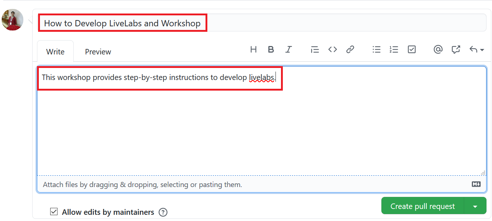

# Use GitHub Desktop to Commit to the GitHub Repository

## Introduction

As a best practice, merge your library everyday or whenever you start your GitHub Desktop application. Merge pulls all the commits (changes) from the [upstream/master repository (production)](https://github.com/oracle/learning-library), into your local filesystem clone (local machine). This keeps your local clone up-to-date with other people's work (commits) from the upstream/master. Next, you push the updated content from your clone into the origin of your clone, that is, your fork, to synchronize your clone with your fork. Merging also avoids the long time it could take to complete if you don't do that often.

### Objectives

* Commit your changes.
* Request for a review.
* Test your content.
* Create a Pull Request to upload your content to master.

### What Do You Need?
* Git Environment Setup
* GitHub Desktop client

This lab assumes that you have successfully completed **Lab 4: Using Atom Editor to Develop Content** in the **Contents** menu on the right.

## **STEP 1:** Commit your Changes in your Clone
When you create, delete, or modify assets in your clone (local copy), you should commit (save) those changes to your clone, and then push those changes from your clone to your fork. Then these changes get saved to your forked learning-library repository.

To commit your changes:
1. Start your **GitHub Desktop** client.
2. In the **Summary (required)** text box on the left (next to your picture), enter a summary of your changes. You can optionally add a more detailed description of your changes in the **Description** text box.

  

3. Click **Commit to master**. This saves your changes in your local clone. **Fetch Origin** changes to **Push Origin**.

4. Click **Push origin** (it should have an upward arrow with a number). This pushes the updated content from your clone into the origin of this clone, that is, your fork.

  

## **STEP 2:** Set Up GitHub Pages for your Fork to Test your Content

After you upload the content from your clone to your fork, request your review team members to review this content by providing them with access to your GitHub Pages site URL (or the URL of your forked repository).

The GitHub Web UI has a feature called as **Set Up GitHub Pages for Your Fork** to Test Your Content. This feature performs a dynamic conversion of the Markdown files (.md files you have developed using your Atom Editor) to HTML. You can preview your workshop and labs on your forked repository and provide this URL to your reviewers.

To publish your GitHub Pages site:
1. Login to [GitHub Web UI](http://github.com) using your GitHub account credentials, and then click your fork's link in the **Repositories** section to display your fork.

  

2. Click **Settings**.

   

3. Click **Options** and scroll down to the **GitHub Pages** section.

  

4. Under **Source**, select **master** (if it's not already selected) from the drop-down list.
5. Under **Theme Chooser**, click **Change Theme** and select a theme of your choice.

  This may take a few hours to complete. After the GitHub Pages are enabled, the message under **GitHub Pages** changes to **Your site  is published at https://achepuri.github.io/learning-library**
  

## **STEP 3:** Sharing your Workshop for Review
After you have successfully set up your GitHub pages, you can share your workshop for review.
To share and view your workshop:
1. In the browser, enter the URL of your GitHub Pages [https://achepuri.github.io/learning-library/](https://achepuri.github.io/learning-library/).
2. Append the URL with the details of your workshop.
    The complete URL will look similar to this: [https://achepuri.github.io/learning-library/sample-livelabs-templates/create-labs/labs/workshops/freetier/](https://achepuri.github.io/learning-library/sample-livelabs-templates/create-labs/labs/workshops/freetier/), which can be shared for review.

## **STEP 4**: Create a Pull Request to Upload Your Content to the Master Repository

The **Pull Request** is a request that you send to the repository owners and code owners of the **oracle/learning-library** repository to approve and host your content on production **(upstream/master)** repository).

**Note**: The owners can approve your request, ask for more information if required, or reject your request if your content does not meet the standards for Oracle GitHub.

To create a Pull Request:
1. In the **GitHub Desktop** client, select **Branch > Create pull request** to display a browser interface.

  

2. Click **Create pull request** to display an **Open a pull request** page.

  

3. Enter the title for the pull request, leave a comment (optional) and then click **Create pull request**.
    
  A status page is displayed indicating that you have created a pull request along with the request number (for example, #1770), that it is pending review, and that merging is blocked.

  When your pull request is approved, the page gets updated with information about your commits being approved and merged into the **upstream/master** repository (production).

  When the pull request is approved and merged into the **upstream/master** repository, two emails are sent to the e-mail account associated with your GitHub account.

  **Note**:
    * The first email notifies you that your pull request was approved (or rejected).
    * If your pull request was approved, then the second email notifies you that your pull request was merged into the **upstream/master** repository.  

  Your committed content is now visible to the public on the learning-library (upstream/master or production) repository.

**This concludes this lab. Please proceed to the next lab in the Contents menu.**

## Want to Learn More?

* [Using GitHub Desktop to merge, commit and make pull requests](https://otube.oracle.com/media/t/1_bxj0cfqf)
* [Use GitHub Desktop](https://confluence.oraclecorp.com/confluence/display/DBIDDP/Use+GitHub+Desktop)

## Acknowledgements

* **Author:**
    * Anuradha Chepuri, Principal User Assistance Developer, Oracle GoldenGate
* **Contributors:**
    * Lauran Serhal, Principal User Assistance Developer, Oracle Database and Big Data User Assistance
* **Reviewed by:**  
    * Aslam Khan, Senior User Assistance Manager, ODI, OGG, EDQ
    * Tom McGinn, Database and Database Cloud Service Senior Principal Product Manager, DB Development - Documentation
* **Last Updated By/Date:** Anuradha Chepuri, November 2020

## Need Help?  
Please submit feedback or ask for help using our [LiveLabs Support Forum](https://community.oracle.com/tech/developers/categories/livelabsdiscussions). Please click the **Log In** button and login using your Oracle Account. Click the **Ask A Question** button to the left to start a *New Discussion* or *Ask a Question*.  Please include your workshop name and lab name.  You can also include screenshots and attach files.  Engage directly with the author of the workshop.

If you do not have an Oracle Account, click [here](https://profile.oracle.com/myprofile/account/create-account.jspx) to create one.
