# Setup Graphical Remote Desktop

## Introduction
This lab shows you how to deploy and configure noVNC Graphical Remote Desktop on an Oracle Enterprise Linux (OEL) instance prior
to capturing the custom image.

### Objectives
- Deploy NoVNC Remote Desktop
- Configure Desktop
- Add Applications Shortcuts to Desktop
- Add Firefox bookmarks
- Configure remote clipboard
- Enable VNC password reset

### Prerequisites
This lab assumes you have:
- An Oracle Enterprise Linux (OEL) that meets requirement for marketplace publishing

## **STEP 1**: Deploy noVNC
1.  As root, create script */tmp/set-os-user.sh* to perform the first set of tasks.

    ```
    <copy>
    sudo su - || sudo sed -i -e 's|root:x:0:0:root:/root:.*$|root:x:0:0:root:/root:/bin/bash|g' /etc/passwd; sudo su -

    </copy>
    ```

    ```
    <copy>
    cat > /tmp/set-os-user.sh <<EOF
    #!/bin/bash
    echo ""
    echo "Your input is required!"
    echo ""
    read -p 'Press *ENTER* to Accept *oracle* as the OS user to configure for remote desktop access or type in another valid user. If no input is provided *oracle* is assumed: ' appuser

    appuser=\${appuser:-oracle}

    getent passwd \$appuser > /dev/null

    if [ $? -eq 0 ]; then
      if [[ \${appuser} == root ]]; then
         echo ""
         echo "***ERROR****"
         echo "-- Not allowed for root. -- VNC must be on a non-root account. e.g oracle. Please start over and enter a valid non-root OS user when prompted"
         echo ""
         exit 20
      fi
       echo \$appuser >/tmp/.appuser
    else
        echo ""
        echo "***ERROR****"
        echo "-- Invalid OS user. -- Please start over and enter a valid non-root OS user when prompted"
        echo ""
    fi
    EOF
    chmod +x /tmp/set-os-user.sh

    </copy>
    ```

2.  Run */tmp/set-os-user.sh* to set the OS user to be configured for remote desktop access. The default user is *oracle*.

    ```
    <copy>
    /tmp/set-os-user.sh
    </copy>
    ```

3. Create script */tmp/novnc-1.sh* to perform the first set of tasks.

    ```
    <copy>
    export appuser=$(cat /tmp/.appuser)
    cat > /tmp/novnc-1.sh <<EOF
    #!/bin/bash

    if [[ -z "\${appuser}" ]]; then
      echo "A valid OS user must be provided. e.g. oracle "
      exit 10
      if [[ \${appuser} == root ]]; then
        echo "Not allowed for root. VNC must be on non root account. e.g oracle"
        exit 20
      fi
    fi

    echo "Proceeding with configuration for OS user \$appuser"

    echo "Updating packages ..."
    yum -y update

    echo "Installing X-Server required packages ..."
    yum -y groupinstall "Server with GUI"

    echo "Installing other required packages ..."
    yum -y install \
    tigervnc-server \
    numpy \
    mailcap

    yum -y localinstall \
    http://mirror.dfw.rax.opendev.org:8080/rdo/centos7-master/deps/latest/noarch/novnc-1.1.0-6.el7.noarch.rpm \
    http://mirror.dfw.rax.opendev.org:8080/rdo/centos7-master/deps/latest/noarch/python2-websockify-0.8.0-13.el7.noarch.rpm

    echo "Updating VNC Service ..."
    cp /lib/systemd/system/vncserver@.service /etc/systemd/system/vncserver_\${appuser}@:1.service
    sed -i "s/<USER>/\${appuser}/g" /etc/systemd/system/vncserver_\${appuser}@:1.service
    sed -i "s/After=syslog.target network.target/After=syslog.target network.target resetvncpwd.service cloud-final.service/g" /etc/systemd/system/vncserver_\${appuser}@:1.service

    firewall-cmd --zone=public --permanent --add-service=vnc-server
    firewall-cmd --zone=public --permanent --add-port=5901/tcp
    firewall-cmd --permanent --add-port=6080/tcp

    firewall-cmd  --reload

    systemctl daemon-reload
    systemctl enable vncserver_\${appuser}@:1.service
    systemctl daemon-reload

    EOF
    cat >/usr/local/bin/resetvncpwd.sh <<EOF
    #!/bin/bash
    # Reset VNC password for user

    mypasswd=\$(curl -s -H "Authorization: Bearer Oracle" -L http://169.254.169.254/opc/v2/instance/metadata/vncpwd)

    if [[ \${#mypasswd} -ne 10  ]]; then
      echo "Required Random password string is missing from OCI metadata. No VNC password reset for user ${appuser} will be performed"
      exit 30
    else
      echo \$mypasswd | vncpasswd -f >/home/${appuser}/.vnc/passwd
      chmod 0600 /home/${appuser}/.vnc/passwd
      echo "VNC password for user ${appuser} reset successfully"
    fi
    EOF
    cat > /etc/systemd/system/websockify.service <<EOF
    [Unit]
    Description=Websockify Service
    After=network.target cloud-final.service

    [Service]
    Type=simple
    User=${appuser}
    ExecStart=/bin/websockify --web=/usr/share/novnc/ --wrap-mode=respawn 6080 localhost:5901
    Restart=on-abort

    [Install]
    WantedBy=multi-user.target
    EOF
    cat > /etc/systemd/system/resetvncpwd.service <<EOF
    [Unit]
    Description=ResetVncPwd Service
    After=syslog.target network.target

    [Service]
    Type=simple
    ExecStart=/usr/local/bin/resetvncpwd.sh ${appuser}

    [Install]
    WantedBy=multi-user.target
    EOF

    chmod +x /usr/local/bin/resetvncpwd.sh
    chmod +x /tmp/novnc-*.sh
    </copy>
    ```

4. Create script */tmp/novnc-2.sh* to perform the second set of tasks.

    ```
    <copy>
    cat > /tmp/novnc-2.sh <<EOF
    #!/bin/bash

    #Enable and Start services

    systemctl daemon-reload
    systemctl enable websockify.service
    systemctl start websockify.service
    systemctl enable resetvncpwd.service
    systemctl start resetvncpwd.service

    echo "noVNC has been successfully deployed on this host. Open the browser and navigate to the URL below to validate"
    echo ""
    echo "#================================================="
    echo "#"
    echo "# http://`curl -s ident.me`:6080/vnc.html?resize=remote"      
    echo "# or"
    echo "# http://`curl -s ident.me`:6080/vnc.html?password=LiveLabs.Rocks_99&resize=scale&quality=9&autoconnect=true"      
    echo "#================================================="
    echo ""
    EOF
    chmod +x /tmp/novnc-*.sh
    </copy>
    ```

    **Notes:** If the URL fails to load, verify that your VCN contains an *ingress* rule for port *6080*

5. Ensure that the *EPEL* Yum Repo is configured and enabled. i.e. contains the entry *enabled=1*. If not, update it accordingly before proceeding with the next step

    ```
    <copy>
    sed -i -e 's|enabled=.*$|enabled=1|g' /etc/yum.repos.d/oracle-epel-ol7.repo
    cat /etc/yum.repos.d/oracle-epel-ol7.repo|grep enable
    </copy>
    ```

    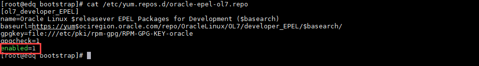

6. Run script *novnc-1.sh* with the desired VNC user as the sole input parameter. e.g. *oracle*

    ```
    <copy>
    /tmp/novnc-1.sh
    </copy>
    ```

7.  Set password for VNC user.

    ```
    <copy>
    vncpasswd ${appuser}
    </copy>
    ```

8. Provide password as prompted. e.g. "*LiveLabs.Rocks_99*". When prompted with *Would you like to enter a view-only password (y/n)?*, enter **N**

    ```
    <copy>
    LiveLabs.Rocks_99
    </copy>
    ```

9. Su over to the VNC user account and enforce the password.  when prompted

    ```
    <copy>
    sudo su - ${appuser}
    rm -rf $HOME/.vnc
    vncserver
    </copy>
    ```

10. Provide the same password as you did above. e.g. "*LiveLabs.Rocks_99*". When prompted with *Would you like to enter a view-only password (y/n)?*, enter **N**

    ```
    <copy>
    LiveLabs.Rocks_99
    </copy>
    ```

11. Stop the newly started VNC Server running on "**:1**" and exit (or *CTRL+D*) the session as vnc user to go back to *root*

    ```
    <copy>
    vncserver -kill :1
    exit
    </copy>
    ```

12. Start VNC Server using *systemctl*

    ```
    <copy>
    systemctl start vncserver_${appuser}@:1.service
    systemctl status vncserver_${appuser}@:1.service
    </copy>
    ```
13. Run script *novnc-2.sh* to finalize

    ```
    <copy>
    /tmp/novnc-2.sh
    </copy>
    ```

14. After validating successful setup from URL displayed by above script, remove all setup scripts from "*/tmp*"

    ```
    <copy>
    rm -rf /tmp/novnc-*.sh
    rm -rf /tmp/set-os-user.sh
    </copy>
    ```

## **STEP 2**: Configure Desktop   
LiveLabs compute instance are password-less and only accessible via SSH keys. As result it's important to adjust session settings to ensure a better user experience.

1. Launch your browser to the following URL

    ```
    <copy>http://[your instance public-ip address]:6080/vnc.html?password=LiveLabs.Rocks_99&resize=scale&quality=9&autoconnect=true</copy>
    ```

2. Follow steps in the screenshot below and run command provided below to resize desktop icons

    ```
    <copy>
    gsettings set org.gnome.nautilus.icon-view default-zoom-level small
    </copy>
    ```

    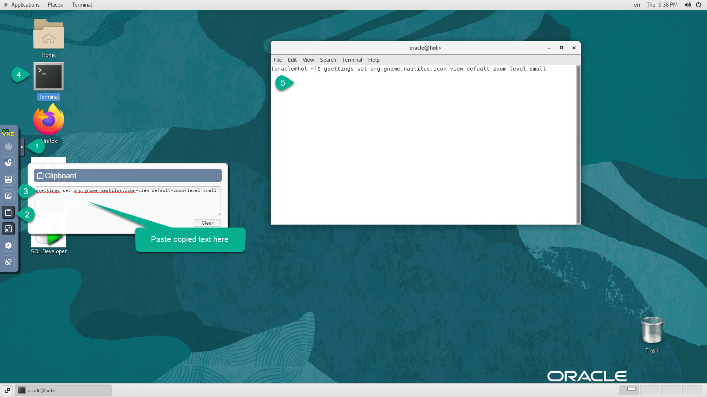
    

3. From the same Terminal window, run the following command to open *Startup Programs* configuration

    ```
    <copy>
    gnome-session-properties
    </copy>
    ```

    

4. Fill in the details as shown below and click *Add* to add *Firefox* to the list of applications to be started automatically on *VNC* Startup

    ```
    Name: <copy>Firefox Browser</copy>
    ```

    ```
    Command: <copy>firefox</copy>
    ```

    ```
    Comment: <copy>Launch Firefox on VNC Startup</copy>
    ```

    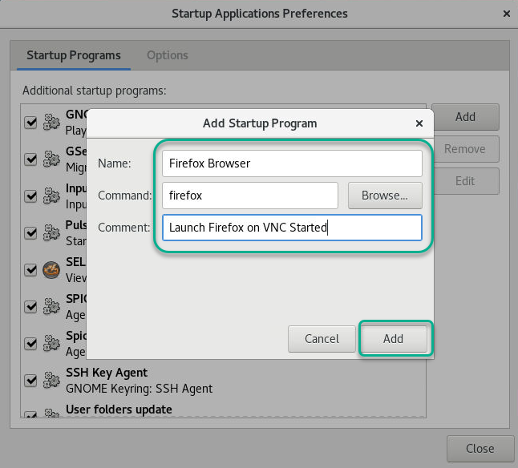

5. Navigate to "*Applications >> System Tools >> Settings*"

    

6. Click on "*Privacy*" and set **Screen Lock** to *Off*

    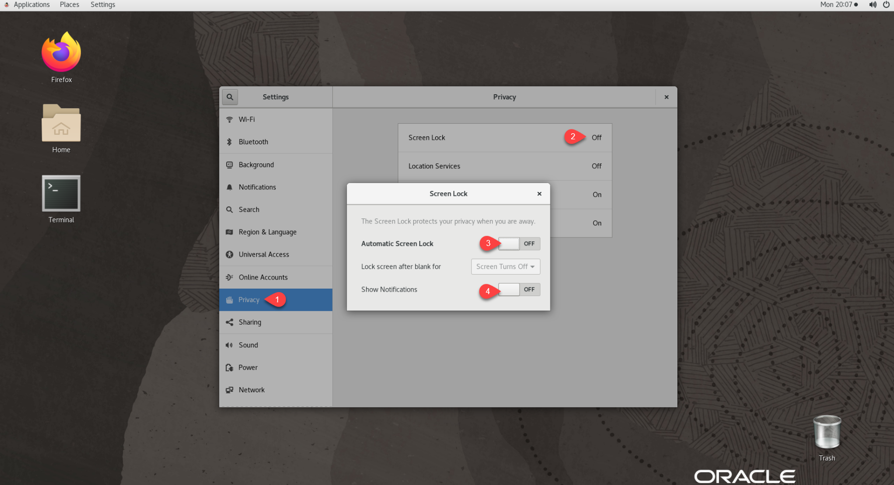

7. Click on "*Power*" and set **Blank Screen** under Power Saving to *Never*

    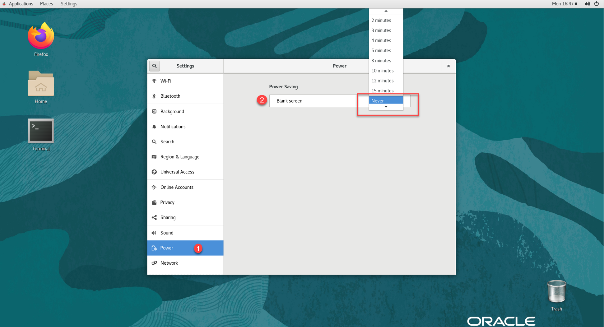

8. Click on "*Notifications*" and set **Notifications Popups** and **Lock Screen Notifications** to *Off*

    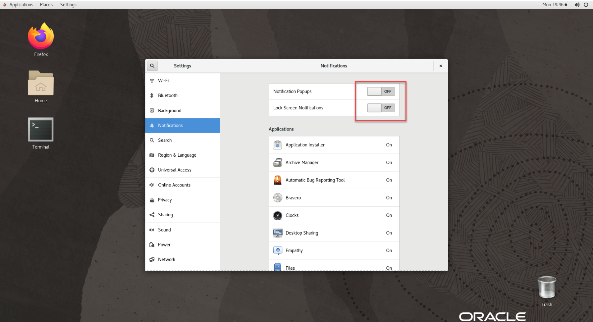

9. Scroll-down, Click on "*Devices >> Resolution*" and select **1920 x 1080 (16:9)**

    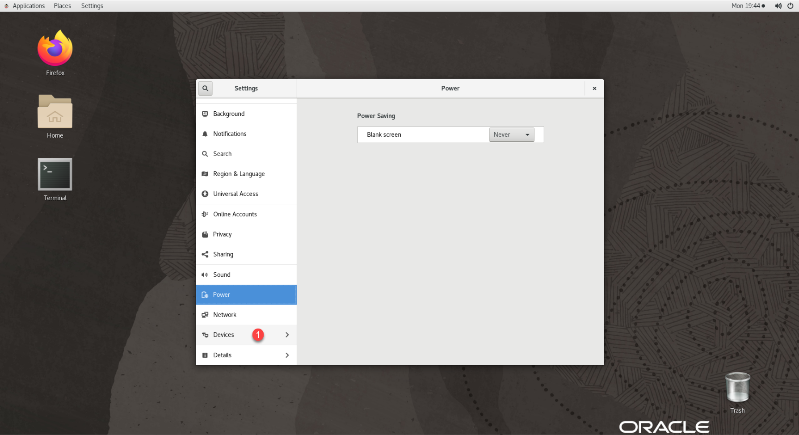
    

## **STEP 3**: Add Applications to Desktop   
For ease of access to desktop applications provided on the instance and needed to perform the labs, follow the steps below to add shortcuts to the desktop. In the example below, we will be adding a shortcut of *FireFox* browser.

1. On the desktop from the previous setup, click on *Home > Other Locations*, then navigate to *`/usr/share/applications`* and scroll-down to find *FireFox*

    

2. Right-click on *FireFox* and select *Copy to...*

    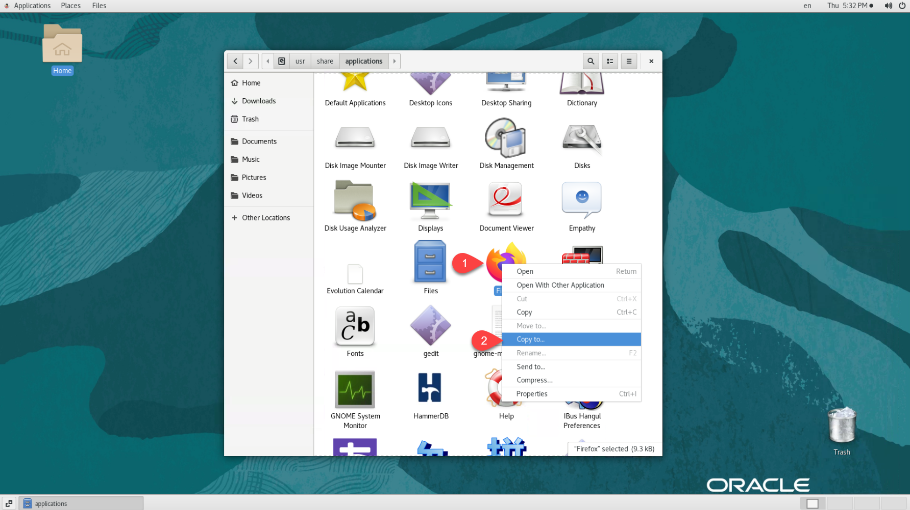

3. Navigate to *Home > Desktop* and Click on *Select*

    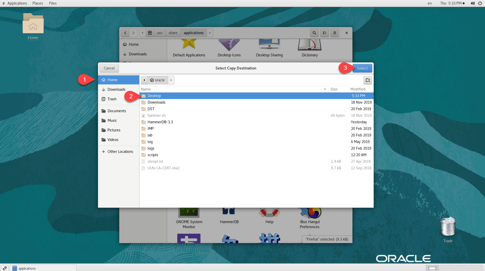

4. Double-click on the newly added icon on the desktop and click on *Trust and Launch*

    
    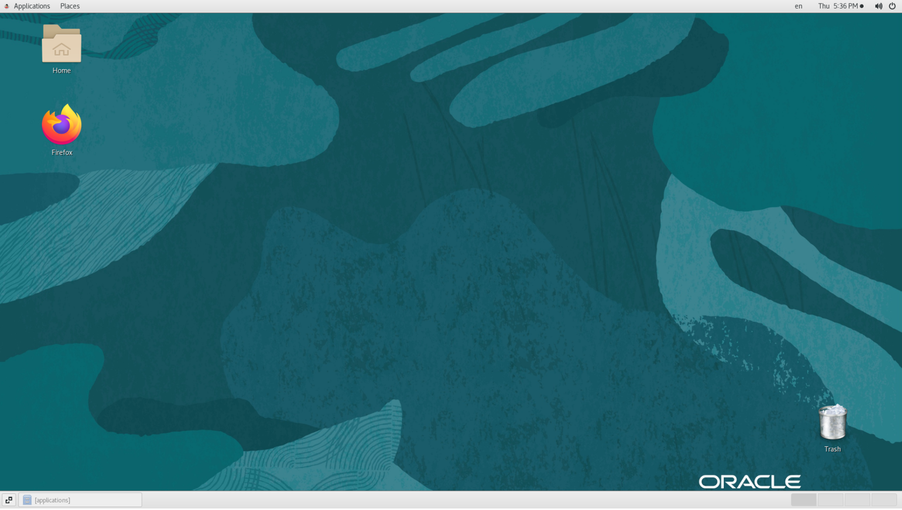

5. Repeat steps above to add any other required Application the workshop may need to the Desktop (e.g. Terminal, SQL Developer, etc...)

    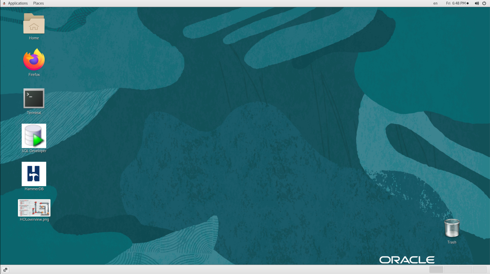

## **STEP 4**: Add Important Bookmarks to FireFox
Provide convenient access to LiveLabs and any relevant URL to your workshop by adding bookmarks to *FireFox* browser.

1. Launch *FireFox* and delete all default bookmarks shown in the *Bookmarks Toolbar* area. For each item listed, Right-Click to select and Click *Delete* to remove

    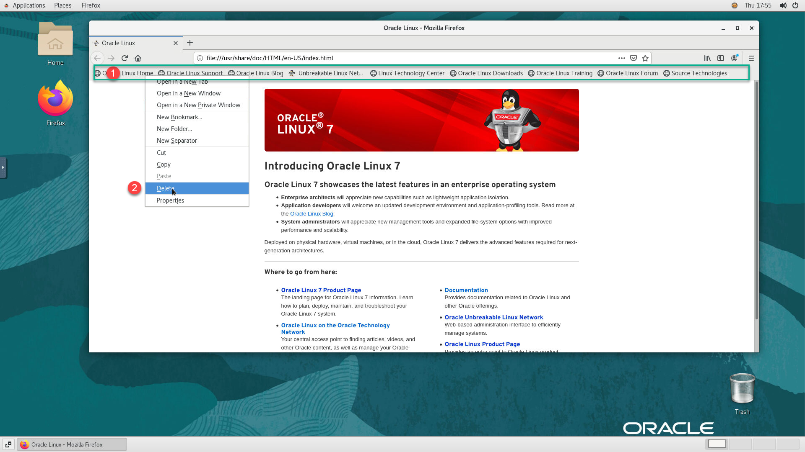

2. Right-Click in the *Bookmarks Toolbar* area and Click *New Bookmark*

    

3. Provide the following two inputs and click *Add* to create a bookmark to *LiveLabs*

    ```
    Name: <copy>Oracle LiveLabs</copy>
    ```

    ```
    Location: <copy>bit.ly/golivelabs</copy>
    ```

    

4. Click on the newly added bookmark to confirm successful page loading.

    

5. Right-Click in the *Bookmarks Toolbar* area and Click *New Folder*

    

7. Provide the following input and click *Add* to create the folder *Workshop Guides*

    ```
    Name: <copy>Workshop Guides</copy>
    ```

    

8. Repeat to create the folder *Workshop Links*

    ```
    Name: <copy>Workshop Links</copy>
    ```

    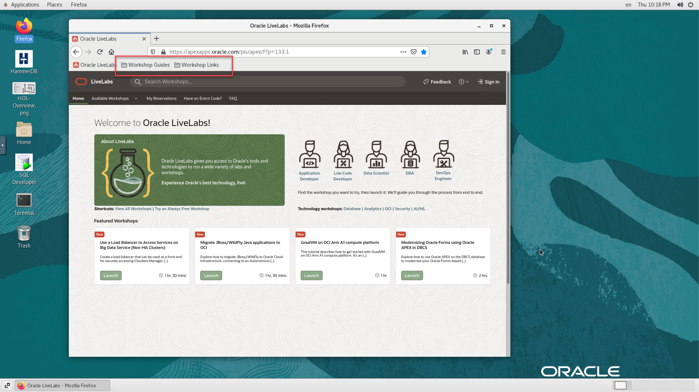

9. Right-Click on *Workshop Guides* and Select *New Bookmark*


    

10. Provide details to add a bookmark for your workshop(s). For most workshops this folder will content a single item. If your image is used by multiple workshops then repeat this action to add bookmarks for all relevant listings accordingly.

    ```
    Name: <copy><Your Workshop Name as recorded in WMS></copy>
    ```

    ```
    Location: <copy><Your Workshop Github URL ending with ./workshop/main></copy>
    ```

    *Note*: If you are still developing your workshop this URL may not yet be available. In that case, skip adding bookmarks to this folder and return when it's (they are) available.

    The example below is borrowed from the *Upgrade to Oracle Database 19c* Workshop.

    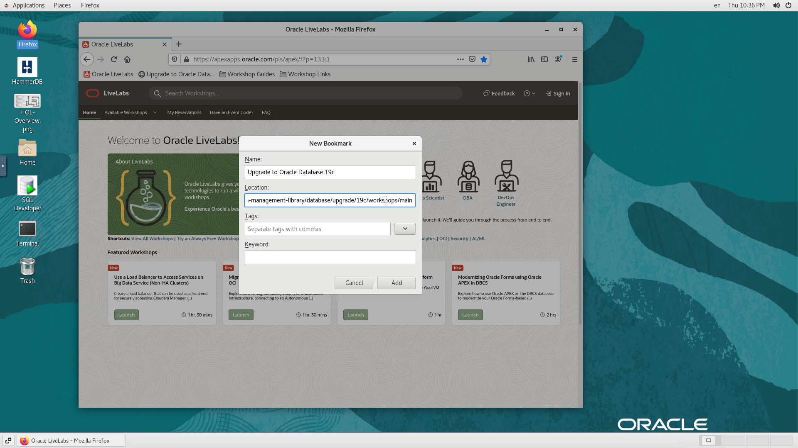
    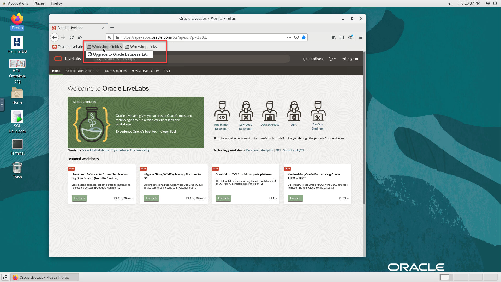

11. Repeat [9-10] above to add bookmarks to the *Workshop Guides* folder. The example below was borrowed from the *Database Security* portfolio of workshops and shows multiple entries in the two bookmark folders.

    
    

12. Click on the *Hamburger-Menu* from the upper-right corner and select *Preferences*

    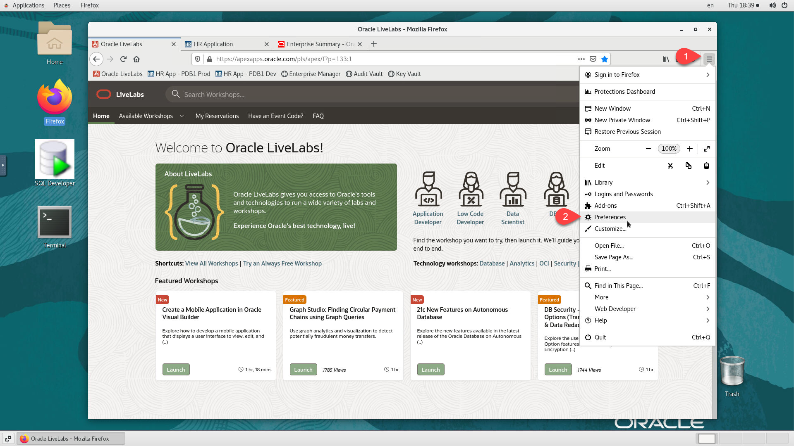

13. Check *Restore Previous Session* and Make other selections as shown below

    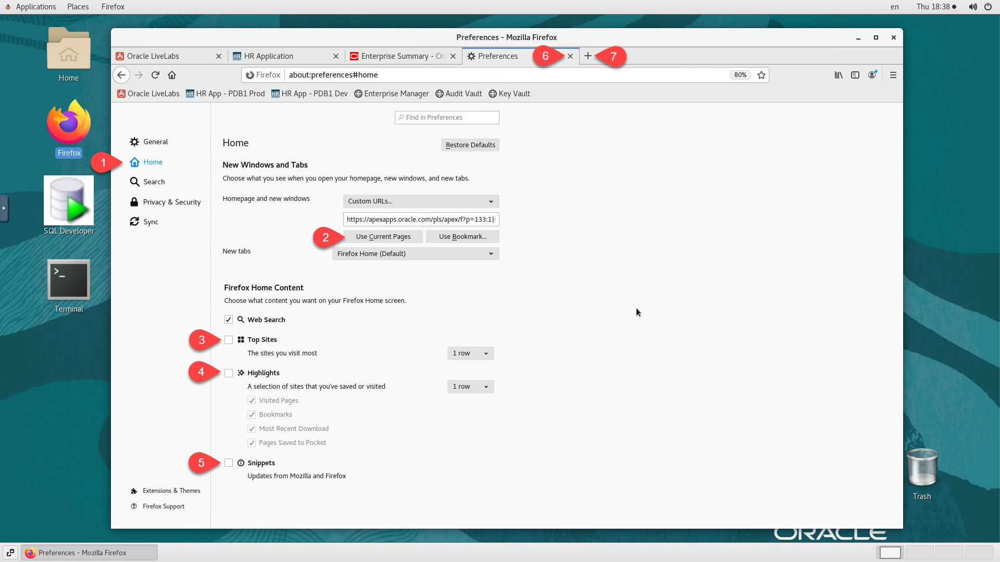

14. Click on *Home* and make selections as shown below.


    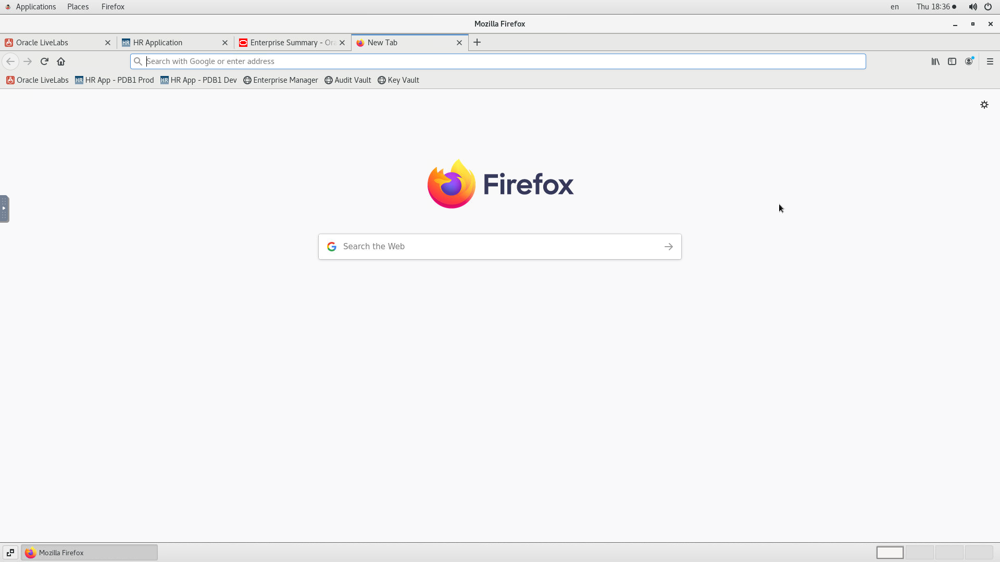

    - Uncheck *Top Sites*, *Highlights*, and *Snippets*

15. Expand *Bookmark Toolbar*, Select an item from the *Workshop Guides* Folder and click on *X* to close *Preferences*

    

16. Click on *+* to open a new tab and confirm that you are getting a clean new tab free of all elements such as *Top Sites* and *Highlights*

    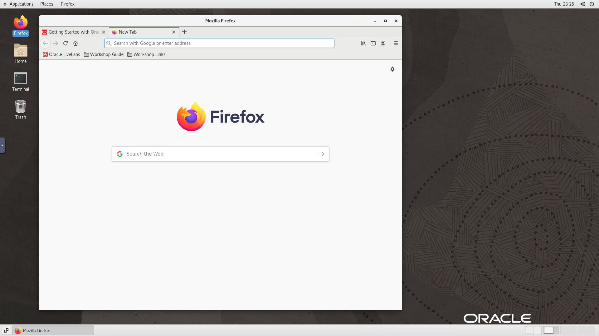

17. Open a second *Firefox* window and load it with a bookmark from the *Workshop Links* folder.

    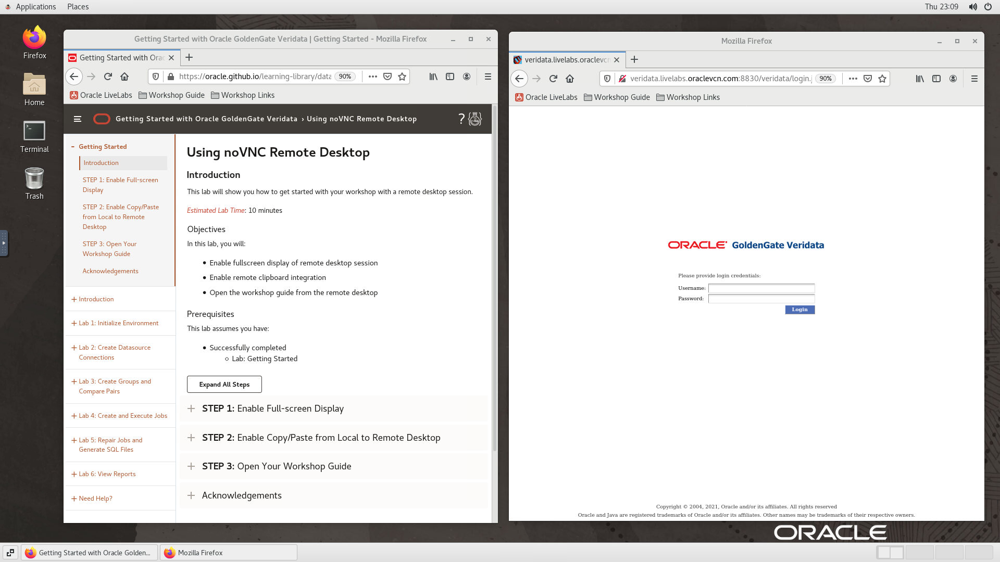

    Alternatively, if there is no relevant link for a second Firefox window or you prefer to use that space for a relevant application. e.g. SQL Developer, JDeveloper, etc., Right click on the respective icon to obtain the details needed to add the entry to the *Startup Programs* configuration in order to enable auto-start on VNC startup just like you did for *Firefox* in *STEP [2]*

    

18. Open a new tab and browse to *about:config*. Click on *Accept the Risk and Continue*

    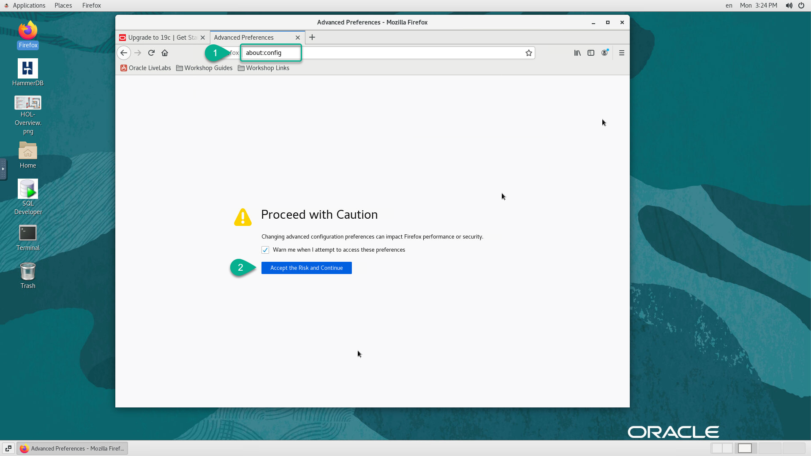

19. In the config search field do the following to always get bookmarks to open in tabs:
    - Type in the following
    ```
    <copy>browser.tabs.loadBookmarksInTabs</copy>
    ```
    - Double-click on *False* to toggle it to *True*
    - Click on *X* to close the tab
    - Click on a link from the *Workshop Guides* toolbar folder to confirm that it's opening in a new tab and not overwriting an existing one.

    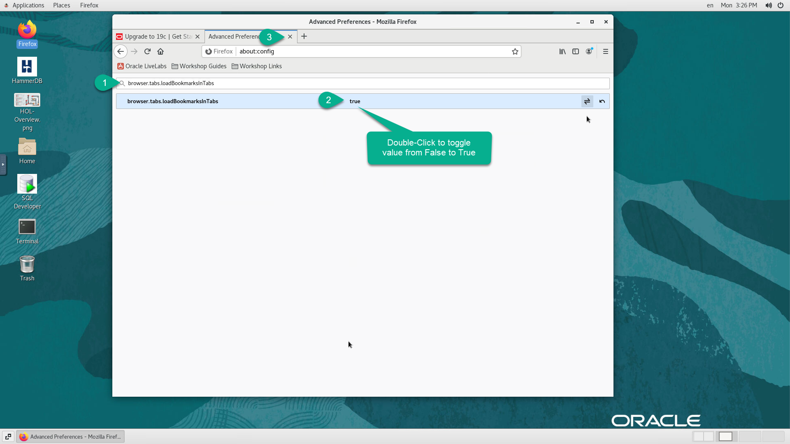

20. From you external SSH Terminal (e.g. PuTTy, MobaXterm, Mac Terminal, Cygwin, etc.), stop VNC Service to preserve the layout before proceeding with custom image creation

    ```
    <copy>
    systemctl stop vncserver_${appuser}@:1.service
    systemctl status vncserver_${appuser}@:1.service
    </copy>
    ```

    


You may now [proceed to the next lab](#next).

## Appendix 1: Enable VNC Password Reset for each instance provisioned from the image
Actions provided in this Appendix are not meant to be performed on the image. They are rather intended as guidance for workshop developers writing terraform scripts to provision instances from an image configured as prescribed in this guide.

For added security, update your Terraform/ORM stack with the tasks below to enable VNC password reset for each VM provisioned from the image.

1. Add provider *random* to *main.tf* or and any other *TF* file in your configuration if you not using *main.tf*

    ```
    <copy>
    terraform {
      required_version = "~> 0.13.0"
    }

    provider "oci" {
      tenancy_ocid = var.tenancy_ocid
      region       = var.region
    }

    provider "random" {}
    </copy>
    ```
2. Add a *random* resource in your *instance.tf* or any *TF* of your choice to generate a 10 characters random password with a mix of Number/Uppercase/Lowercase characters.

    ```
    <copy>
    resource "random_string" "vncpwd" {
      length  = 10
      upper   = true
      lower   = true
      number  = true
      special = false
    }
    </copy>
    ```

3. Add *`random_string`* result to the metadata property for resource *`oci_core_instance`*. This will store the random value generated above as part of the instance metadata that can be queried at any time to reset VNC Password.

    ```
    <copy>
    metadata = {
      ssh_authorized_keys = var.ssh_public_key
      vncpwd              = random_string.vncpwd.result
    }
    </copy>
    ```

4. Add the entry *`remote_desktop`* to your *output.tf* to provide the single-click URL for remote desktop access with auto resizable window and auto-login. Replace [instance-name] from the snippet below with your real instance name as provided the resource *`oci_core_instance`* block of *instance.tf*

    ```
    <copy>
    output "remote_desktop" {
      value = format("http://%s%s%s%s",
        oci_core_instance.[instance-name].public_ip,
        ":6080/index.html?password=",
        random_string.vncpwd.result,
        "&resize=scale&autoconnect=true&quality=9&reconnect=true"
      )
    }
    </copy>
    ```
5. Add output entry *`remote_desktop`* to your *schema.yaml* file

    ```
    <copy>
    outputGroups:
      - title: Resources Access Information
        outputs:
          - ${remote_desktop}

    outputs:
      remote_desktop:
        type: string
        title: Remote Desktop
        visible: true

    </copy>
    ```

6. Add an *ingress* rule to your *network.tf* to enable remote access to port *6080* when the VCN is created

    ```
    <copy>
    ingress_security_rules {
      protocol = "6"
      source   = "0.0.0.0/0"
      tcp_options {
        min = 6080
        max = 6080
      }
    }

    </copy>
    ```

7. Test out your ORM Stack and verify the output for *`remote_desktop`* as shown below

    

8. From to the *Application Information Tab* as shown above, click on the single-click URL to test it out.

    

    **Note:** Your source image instance is now configured to generate a random VNC password for every instance created from it, provided that the provisioning requests include the needed metadata storing the random string.


## Acknowledgements
* **Author** - Rene Fontcha, LiveLabs Platform Lead, NA Technology, September 2020
* **Contributors** - Robert Pastijn
* **Last Updated By/Date** - Rene Fontcha, LiveLabs Platform Lead, NA Technology, June 2021
