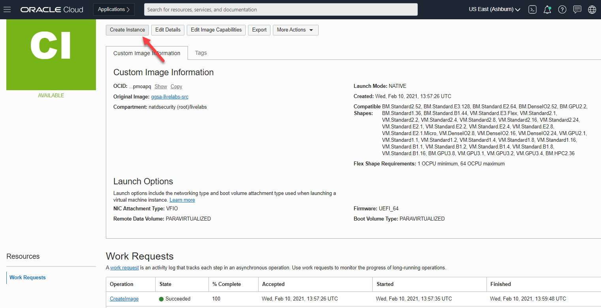

# Create Custom OCI Compute Image for Marketplace Publishing

## Introduction
This lab will show you how to prepare a host for custom image capture and create the custom image that meets stringent OCI marketplace requirements.

### Objectives
- Configure image for preserved static hostname
- Perform cleanup tasks to get the image in the desired state for custom image capture
- Create Custom Image

### Prerequisites
This lab assumes you have:
- An Oracle Enterprise Linux (OEL) that meets requirement for marketplace publishing

## **STEP 1**: Configure Preserved Static hostname
1.  As opc, run *sudo su -* to login as root

    ```
    <copy>
    sudo su - || sudo sed -i -e 's|root:x:0:0:root:/root:.*$|root:x:0:0:root:/root:/bin/bash|g' /etc/passwd; sudo su -

    </copy>
    ```

2. Create script */root/bootstrap/firstboot.sh* .

    ```
    <copy>
    mkdir -p /root/bootstrap
    cat > /root/bootstrap/firstboot.sh <<EOF
    #!/bin/bash
    # Copyright (c) 2021 Oracle and/or its affiliates. All rights reserved.

    ################################################################################
    #
    # Name: "firstboot.sh"
    #
    # Description:
    #   Script to perform one-time adjustment to an OCI instance upon booting for the
    #   first time to preserve a static hostname across reboots and adjust any setting
    #   specific to a given workshop
    #
    #  Pre-requisite: This should be executed as "root" user.
    #
    #  AUTHOR(S)
    #  -------
    #  Rene Fontcha, Oracle LiveLabs Platform Lead
    #
    #  MODIFIED        Date                 Comments
    #  --------        ----------           -----------------------------------
    #  Rene Fontcha    02/17/2021           Initial Creation
    #
    ###############################################################################

    # Preserve user configured hostname across instance reboots
    sed -i -r 's/^PRESERVE_HOSTINFO.*\$/PRESERVE_HOSTINFO=2/g' /etc/oci-hostname.conf

    # Preserve hostname info and set it for current boot
    hostnamectl set-hostname <host>.livelabs.oraclevcn.com

    # Add static name to /etc/hosts
    #echo "\$(oci-metadata -g privateIp --value-only | head -1)   <host>.livelabs.oraclevcn.com  <host>" >>/etc/hosts
    echo "\$(oci-metadata -g privateIp |sed -n -e 's/^.*Private IP address: //p')   <host>.livelabs.oraclevcn.com  <host>" >>/etc/hosts

    EOF
    </copy>
    ```

3. Create and run script */tmp/s_host.sh* to replace all occurrences of *<host>* from above file with the short name (not FQDN, so no domain) you would like permanently assigned to any instance created from the image. It requires providing the input for short hostname as prompted. e.g. *edq* resulting in FQDN *`edq.livelabs.oraclevcn.com`*

    ```
    <copy>
    cat > /tmp/s_host.sh <<EOF
    #!/bin/sh
    # Copyright (c) 2019 Oracle and/or its affiliates. All rights reserved.

    echo "Please provide the short hostname (not FQDN, so no domain) you would like permanently assigned to any instance created from the image:"
    read s_host
    echo ""
    echo "The permanent/preserved FQDN will be \${s_host}.livelabs.oraclevcn.com"
    sed -i "s/<host>/\${s_host}/g" /root/bootstrap/firstboot.sh
    EOF
    chmod +x /tmp/s_host.sh
    /tmp/s_host.sh
    </copy>
    ```

    *Note:* If you need to set a specific FQDN to satisfy an existing product setup, manually edit */root/bootstrap/firstboot.sh* and update replace all occurrences of *`<host>`* and *`livelabs.oraclevcn.com`* accordingly.

4. Make script */root/bootstrap/firstboot.sh* executable, add soft link to */var/lib/cloud/scripts/per-instance* and run it

    ```
    <copy>
    chmod +x /root/bootstrap/firstboot.sh
    ln -sf /root/bootstrap/firstboot.sh /var/lib/cloud/scripts/per-instance/firstboot.sh
    /var/lib/cloud/scripts/per-instance/firstboot.sh
    hostname
    exit

    </copy>
    ```

## **STEP 2**: Cleanup Instance for Image Capture   
1. As user *opc*, Download the latest *oci-image-cleanup.sh* script.

    ```
    <copy>
    cd /tmp
    wget https://raw.githubusercontent.com/oracle/oci-utils/master/libexec/oci-image-cleanup -O /tmp/oci-image-cleanup.sh
    chmod +x oci-image-cleanup.sh
    </copy>
    ```

2. Create and run script */tmp/cleanup.sh*

    ```
    <copy>
    cat > /tmp/cleanup.sh <<EOF
    #!/bin/bash
    sudo service rsyslog stop
    sudo service auditd stop
    sudo sh -c 'yes| /tmp/oci-image-cleanup.sh'
    sudo find /var/log -type f -exec cp /dev/null {} \;
    sudo find /var/log -type f -size 0 -exec rm {} +
    sudo rm -rf /var/lib/cloud/instances/*
    sudo rm -f /home/opc/get-pip.py
    sudo rm -f /home/opc/.bashrc-orig
    sudo rm -f /home/oracle/.bash_history
    sudo sed -i -e 's|\\\(^.*PermitRootLogin.*$\\\)|PermitRootLogin no|g' /etc/ssh/sshd_config
    sudo sed -i -e 's|root:x:0:0:root:/root:/bin/bash|root:x:0:0:root:/root:/sbin/nologin|g' /etc/passwd
    sudo ln -sf /root/bootstrap/firstboot.sh /var/lib/cloud/scripts/per-instance/firstboot.sh
    sudo ln -sf /root/bootstrap/eachboot.sh /var/lib/cloud/scripts/per-boot/eachboot.sh
    sudo rm -f /var/log/audit/audit.log
    EOF
    chmod +x /tmp/cleanup.sh
    /tmp/cleanup.sh

    </copy>
    ```

## **STEP 3**: Create Custom Image   
Your instance at this point is ready for clean capture. Proceed to OCI console to perform the next steps

1. Launch your browser to OCI console, then navigate to *"Compute > Instances"*

    

2. Select the instance on which you just performed the prior cleanup steps. Make sure to select the right compartment

    

3. Click on *"More Actions"* and select *"Create Custom Image"*

    

4. Enter a name for the image and click *"Create Custom Image"*

    

5. After successful image creation, click on *"Create Instance"* to provision a test instance from the image

    

6. After successful instance creation, logon to the host and validate


You may now [proceed to the next lab](#next).

## Learn More
* [Oracle Cloud Marketplace Partner Portal Documentation](https://docs.oracle.com/en/cloud/marketplace/partner-portal/index.html)
* [Oracle Cloud Marketplace Partner Portal Videos](https://docs.oracle.com/en/cloud/marketplace/partner-portal/videos.html)


## Acknowledgements
* **Author** - Rene Fontcha, LiveLabs Platform Lead, NA Technology, February 2021
* **Contributors** - - -
* **Last Updated By/Date** - Rene Fontcha, LiveLabs Platform Lead, NA Technology, March 2021
