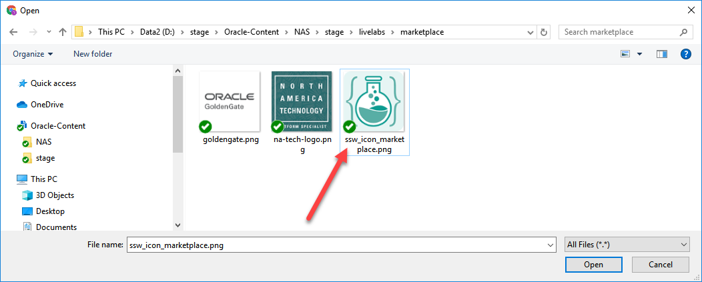

# Publish

## Introduction
This lab will show you how to prepare a host for custom image capture, create the custom image, and finally submit as part of listing in OCI marketplace.

### Objectives
- Configure image for preserved static hostname
- Perform cleanup tasks to get the image in the desired state for custom image capture
- Create Custom Image
- Create Marketplace Artifacts
- Create Marketplace Listing

### Prerequisites
This lab assumes you have:
- An Oracle Enterprise Linux (OEL) 7 that meets requirement for marketplace publishing

## **STEP 1**: Configure Preserved Static hostname
1.  As opc, run *sudo su -* to login as root

    ```
    <copy>
    sudo su - || sudo sed -i -e 's|root:x:0:0:root:/root:.*$|root:x:0:0:root:/root:/bin/bash|g' /etc/passwd; sudo su -

    </copy>
    ```

2. Create script */root/bootstrap/firstboot.sh* .

    ```
    <copy>
    mkdir -p /root/bootstrap
    cat > /root/bootstrap/firstboot.sh <<EOF
    #!/bin/bash
    # Copyright (c) 2021 Oracle and/or its affiliates. All rights reserved.

    ################################################################################
    #
    # Name: "firstboot.sh"
    #
    # Description:
    #   Script to perform one-time adjustment to an OCI instance upon booting for the
    #   first time to preserve a static hostname across reboots and adjust any setting
    #   specific to a given workshop
    #
    #  Pre-requisite: This should be executed as "root" user.
    #
    #  AUTHOR(S)
    #  -------
    #  Rene Fontcha, Oracle LiveLabs Platform Lead
    #
    #  MODIFIED        Date                 Comments
    #  --------        ----------           -----------------------------------
    #  Rene Fontcha    02/17/2021           Initial Creation
    #
    ###############################################################################

    ### Main ###

    # Preserve user configured hostname across instance reboots
    sed -i -r 's/^PRESERVE_HOSTINFO.*$/PRESERVE_HOSTINFO=2/g' /etc/oci-hostname.conf

    # Preserve hostname info and set it for current boot
    hostnamectl set-hostname <host>.livelabs.oraclevcn.com

    # Add static name to /etc/hosts
    echo "$(oci-metadata -g privateIp --value-only | head -1)   <host>.livelabs.oraclevcn.com  <host>" >>/etc/hosts
    EOF
    </copy>
    ```

3. Create and run script */tmp/s_host.sh* to replace all occurrences of *<host>* from above file with the short name (not FQDN, so no domain) you would like permanently assigned to any instance created from the image. It requires providing the input for short hostname as prompted. e.g. *edq* resulting in FQDN *`edq.livelabs.oraclevcn.com`*

    ```
    <copy>
    cat > /tmp/s_host.sh <<EOF
    #!/bin/sh
    # Copyright (c) 2019 Oracle and/or its affiliates. All rights reserved.

    echo "Please provide the short hostname (not FQDN, so no domain) you would like permanently assigned to any instance created from the image:"
    read s_host
    echo ""
    echo "The permanent/preserved FQDN will be ${s_host}.livelabs.oraclevcn.com"
    sed -i "s/<host>/${s_host}/g" /root/bootstrap/firstboot.sh
    EOF
    chmod +x /tmp/s_host.sh
    /tmp/s_host.sh
    </copy>
    ```

    *Note:* If you need to set a specific FQDN to satisfy an existing product setup, manually edit */root/bootstrap/firstboot.sh* and update replace all occurrences of *`<host>`* and *`livelabs.oraclevcn.com`* accordingly.

4. Make script */root/bootstrap/firstboot.sh* executable, add soft link to */var/lib/cloud/scripts/per-instance* and run it

    ```
    <copy>
    chmod +x /root/bootstrap/firstboot.sh
    ln -sf /root/bootstrap/firstboot.sh /var/lib/cloud/scripts/per-instance/firstboot.sh
    /var/lib/cloud/scripts/per-instance/firstboot.sh
    hostname
    exit

    </copy>
    ```

## **STEP 2**: Cleanup Instance for Image Capture   
1. As user *opc*, Download the latest *oci-image-cleanup.sh* script.

    ```
    <copy>
    cd /tmp
    wget https://raw.githubusercontent.com/oracle/oci-utils/master/libexec/oci-image-cleanup -O /tmp/oci-image-cleanup.sh
    chmod +x oci-image-cleanup.sh
    </copy>
    ```

2. Create and run script */tmp/cleanup.sh*

    ```
    <copy>
    cat > /tmp/cleanup.sh <<EOF
    #!/bin/bash
    sudo service rsyslog stop
    sudo service auditd stop
    sudo sh -c 'yes| /tmp/oci-image-cleanup.sh'
    sudo find /var/log -type f -exec cp /dev/null {} \;
    sudo find /var/log -type f -size 0 -exec rm {} +
    sudo rm -rf /var/lib/cloud/instances/*
    sudo rm -f /home/opc/get-pip.py
    sudo rm -f /home/opc/.bashrc-orig
    sudo rm -f /home/oracle/.bash_history
    sudo sed -i -e 's|\\(^.*PermitRootLogin.*$\\)|PermitRootLogin no|g' /etc/ssh/sshd_config
    sudo sed -i -e 's|root:x:0:0:root:/root:/bin/bash|root:x:0:0:root:/root:/sbin/nologin|g' /etc/passwd
    sudo ln -sf /root/bootstrap/firstboot.sh /var/lib/cloud/scripts/per-instance/firstboot.sh
    sudo ln -sf /root/bootstrap/eachboot.sh /var/lib/cloud/scripts/per-boot/eachboot.sh
    sudo rm -f /var/log/audit/audit.log
    EOF
    chmod +x /tmp/cleanup.sh
    /tmp/cleanup.sh

    </copy>
    ```

## **STEP 3**: Create Custom Image   
Your instance at this point is ready for clean capture. Proceed to OCI console to perform the next steps

1. Launch your browser to OCI console, then navigate to *"Compute > Instances"*

    

2. Select the instance on which you just performed the prior cleanup steps. Make sure to select the right compartment

    

3. Click on *"More Actions"* and select *"Create Custom Image"*

    

4. Enter a name for the image and click *"Create Custom Image"*

    

5. After successful image creation, click on *"Create Instance"* to provision a test instance from the image

    

6. After successful instance creation, logon to the host and validate

## **STEP 4**: Create Marketplace Artifacts   
At this point, it assumed that the test instance created in the prior has been successfully validated and can be submitted to OCI marketplace. This also assume that you have the required access for OCI Partner Portal. Proceed to OCI console to perform the next steps

1. Launch your browser to OCI Marketplace Partner Portal, then navigate to *"Compute > Instances"*

    ```
    URL: <copy>https://partner.cloudmarketplace.oracle.com/partner/index.html</copy>
    ```

2. Click on the 3rd icon on the left to access the Artifacts section

    

3. Click on *"Create Artifacts"*

    

4. Select *"OCI Compute Image"* from the dropdown, fill in the name, click on the search icon to lookup the custom image you created in the prior step, and click *"Create"*

    

5. Select the tenant, region, and compartment where your custom image was created, and select that image. It's assumed here that your tenant has been properly configured for marketplace integration. If not, click **"?"** at the upper right-hand corner to access the help page.

    

6. Scroll-down and check to confirm to confirm as indicated

    

7. Scroll-up and click *"Create"*  

    

8. Monitor creation progress.   

    

    *Note:* It can take 5 hours or more for the process to complete successfully. Upon completion you will receive an email notification. In case of failure, reach out to *#oci_marketplace_users* Slack channel

9. Confirm successful creation when status changes to *"Available"*

    

## **STEP 5**: Create Marketplace Listing   
1. Click on the 2nd icon on the top left to access the Listings section

    

2. Select *"OCI Application Listing"* and Click *"Create"*  

    

3. Fill in the details as indicated for *"App Name"*, *"Headline"*, and *"Categories"*, Click on *"Pricing Information"* and Select **Free**, then Click on *"Save"*

    
    

4. Click on *"Click to upload an icon"*, select the correct file from your local drive, and *"Upload"*

    
    
    
    

5. On the section labelled **"App by Oracle"**, Click on *"Edit"* and fill in the short and long descriptions

    
    

6. Click on  **"App Install Package"** tab, provide a version name/ID, and Click on *"Save"* to create the version

    

7. Scroll-down to the **"Configure OCI Compute Image"** section and Click on *"Edit"*

    

8. Click on the search icon, select the artifact you created in the previous step, click on *"Save"*, then click on the **"App Listing"** tab

    
    
    

9. Click on *"Submit"*

    

10. Provide a comment indicating the private listing nature, select the checkmark to confirm as shown, Click on *"Submit"*

    ```
    <copy>To be listed privately and exclusively for LiveLabs Workshops Platform</copy>
    ```

    

11. Review and Click on *"OK"*

    

12. The Listing is now submitted and pending approval by the Marketplace Team. Once approved the three dots ***(...)*** next to your listing icon will change to a green checkmark

    

13. Once the listing has been approved, click on the hamburger menu on the far right and select *"Publish as Private"*

    

14. It will take a few hours for the listing to be propagated to all OCI regions. An email notification will be sent out to you and the private URL will be listed as shown below.

    

15. Review your published listing by clicking on the hamburger menu, the selecting *"View Listing"*

    
    

16. With the image fully published and Available in all OCI regions, click on **"App Install Package"** tab, select the appropriate version, and collect the 3 key details needed for creating ORM stacks or to support a *"green button"* image configuration in LiveLabs Management System.

  - Listing Version
  - Listing OCID
  - Image OCID

    
    

**This concludes this lab.**

## Learn More
* [Oracle Cloud Marketplace Partner Portal Documentation](https://docs.oracle.com/en/cloud/marketplace/partner-portal/index.html)
* [Oracle Cloud Marketplace Partner Portal Videos](https://docs.oracle.com/en/cloud/marketplace/partner-portal/videos.html)


## Acknowledgements
* **Author** - Rene Fontcha, LiveLabs Platform Lead, NA Technology, February 2021
* **Contributors** - - -
* **Last Updated By/Date** - Rene Fontcha, LiveLabs Platform Lead, NA Technology, February 2021

## Need Help?
Please submit feedback or ask for help using our [LiveLabs Support Forum](https://community.oracle.com/tech/developers/categories/livelabsdiscussions). Please click the **Log In** button and login using your Oracle Account. Click the **Ask A Question** button to the left to start a *New Discussion* or *Ask a Question*.  Please include your workshop name and lab name.  You can also include screenshots and attach files.  Engage directly with the author of the workshop.

If you do not have an Oracle Account, click [here](https://profile.oracle.com/myprofile/account/create-account.jspx) to create one.
