# Application Onboarding

## Introduction

This lab walks you through the steps to onboard an application into Oracle Identity Governance(OIG) using the flat file connector.

Estimated Time: 25 minutes

### Objectives

In this lab, you will:
* Onboard an application into OIG using flat file connector

## Task 1: Launch the workshop instance

1. Launch a browser window to the following URL to access the instance.

    ```
    <copy>http://[your instance public-ip address]:6080/index.html?password=LiveLabs.Rocks_99&resize=remote&autoconnect=true/</copy>
    ```

    

    

## Task 2: Starting the OIG server

1. Launch a browser window and Click on the bookmark *Workshop Links* and click on Weblogic Admin Console.

    

2. Click on *Servers* under *Environment*

    

3. Click on Control tab. Select oim\_server1 and soa\_server1 and click on *Start* to start the servers. This may take about 5-8 minutes.

    

    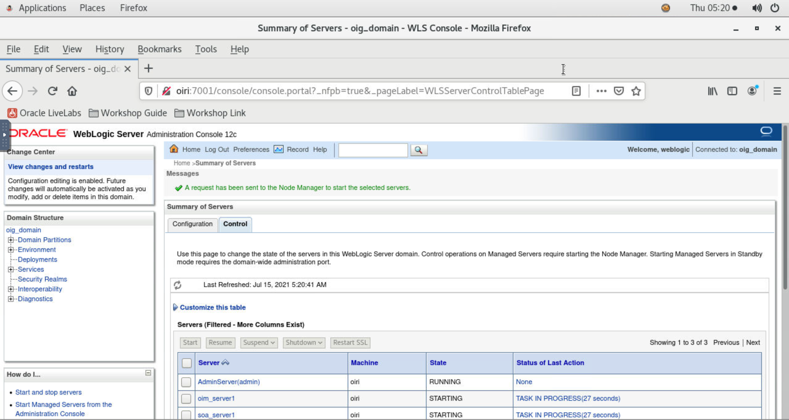

4. Notice that the servers are in *Running* state.

    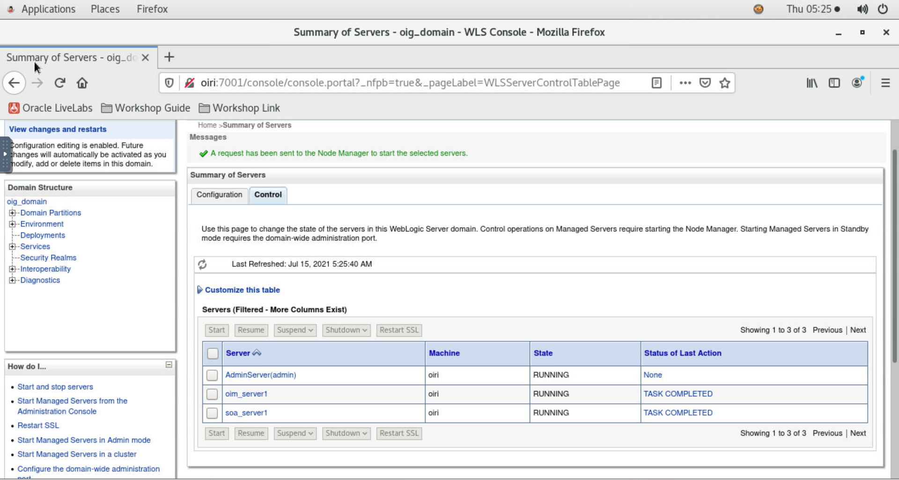

## Task 3: Copy the flat files into the directory

1. Open a terminal session as oracle user and copy the entitlement file.

    ```
    <copy>cd ~</copy>
    ```
    ```
    <copy>unzip /u01/files/target/access/archived/documents_16-06-2021_09-51-31.zip -d /u01/files/target/access/</copy>
    ```
    ```
    <copy>ls -latr /u01/files/target/access</copy>
    ```

    


2. Copy the User accounts file

    ```
    <copy>unzip /u01/files/target/accounts/archived/accounts_16-06-2021_09-53-03.zip -d /u01/files/target/accounts/</copy>
    ```
    ```
    <copy>ls -latr /u01/files/target/accounts</copy>
    ```

    

## Task 4: Create Application Screen

1. Click on *OIG Identity Console* under the *Workshop Links* bookmark folder. Login to the Identity Self Service console.

    ```
    Username: <copy>xelsysadm</copy>
    ```

    ```
    Password: <copy>Welcome1</copy>
    ```

    

2. Select the Application box on the Manage tab.

    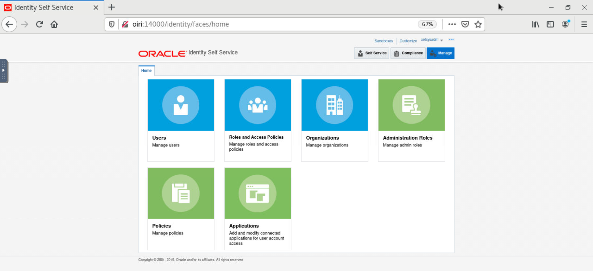

3. On the Applications page, click the Create menu on the toolbar, and then select the *Target* option to create a Target application.

    

## Task 5: Providing Basic Information

1. On the Basic Information page, ensure that the *Connector Package* option is selected.

2. From the Select Bundle drop-down list, select *Flat File Connector 12.2.1.3.0*.

3. Enter the Application Name, Display Name, and Description for the application.

    ```
    Application Name : <copy>DMS</copy>
    ```
    ```
    Display Name : <copy>Document Management System</copy>
    ```

    

4. Expand the Advanced Settings section, enter value for the parameter *flatFileLocation*.

    ```
    flatFileLocation : <copy>/u01/files/target/accounts/accounts.csv</copy>
    ```

    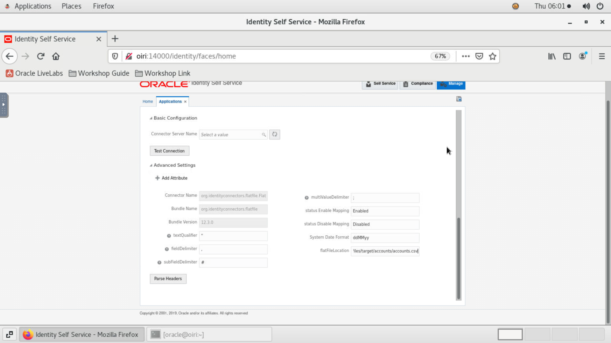

5. Click on *Parse Headers* to parse the headers of your flat file.

6. In the Flat File Schema Properties table.
    * Select the Name column for username attribute.
    * Select the UID column for id attribute.
    * Change the datatype of start_date attribute by selecting the Date datatype from the Data Type column.
    * Mark the document_access as multivalued by selecting the corresponding checkbox in the MVA column.

      

7. Click Next to proceed to the Schema page.

    

## Task 6: Updating Schema Information

1. Expand the *document_access* attribute and change the display name.

    ```
    Display Name : <copy>DMS Access</copy>
    ```

    

2. Click the Advanced Setting icon for *document_access* attribute.
    * Select the Lookup and Entitlement checkbox.
    * Provide these details

        ```
        List of values : <copy>lookup.dms.access</copy>
        ```

        ```
        Length : <copy>15</copy>
        ```

        

        

3. Select the Case Insensitive column for username,id and document_access attributes.

    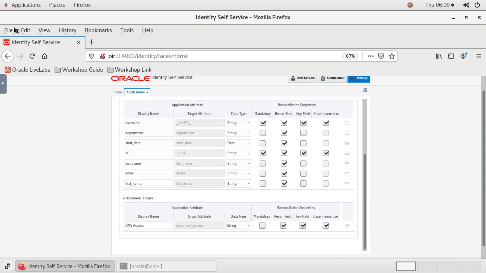

4. Click Next to proceed to the Settings page.

    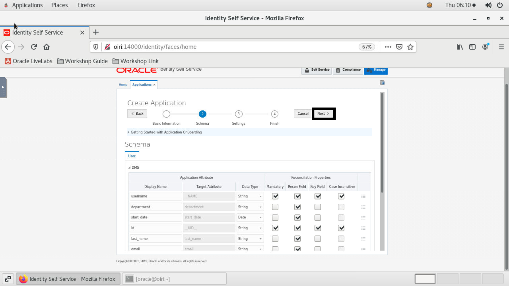

## Task 7: Providing Settings Information

1. In the Settings page,click on Preview Settings to preview the settings.

2. On the Provisioning tab, select the Account Name as *username* from the dropdown.

    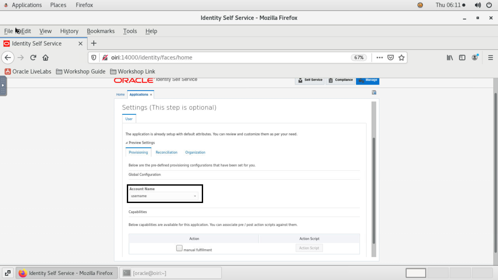

3. On the Reconciliation tab ,expand the Reconciliation Jobs.

    

    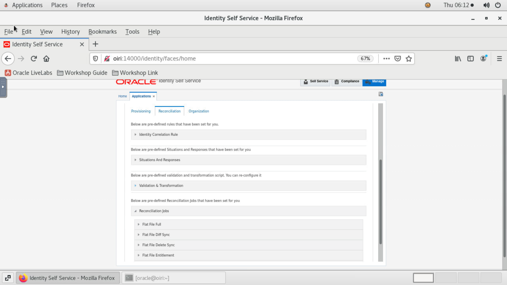


4. Delete the jobs under Flat File Diff Sync,Flat File Delete Sync and Flat File Delete as these jobs are not necessary for this workshop.

    

5. Expand the DMS Flat File Entitlements Loader under the Flat File Entitlement job and fill these details.

    ```
    Flat File directory : <copy>/u01/files/target/access/</copy>
    ```

    ```
    Lookup Name : <copy>lookup.dms.access</copy>
    ```

    ```
    Code Key Attribute : <copy>ID</copy>
    ```

    ```
    Decode Attribute : <copy>Access</copy>
    ```

    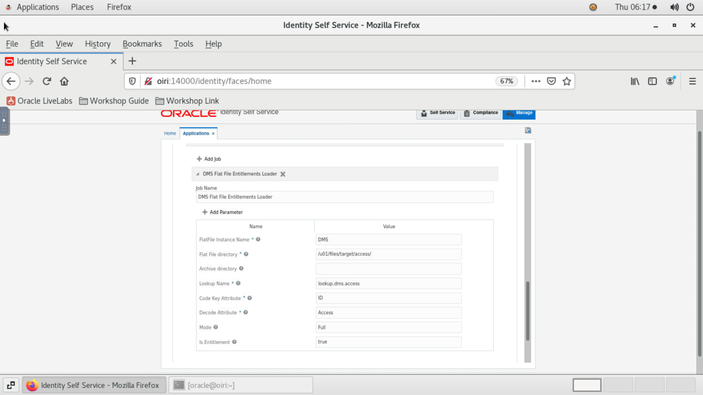

6. Expand the DMS Flat File Accounts Loader under the Flat File Full job and fill these details.

    ```
    Flat File directory : <copy>/u01/files/target/accounts/</copy>
    ```

    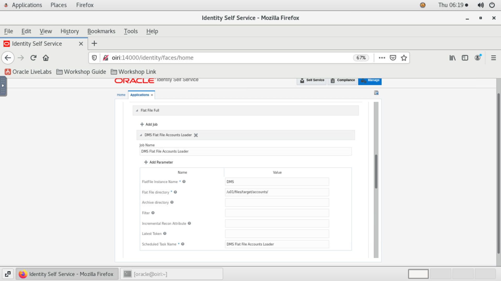

7. Click Next to proceed to the Finish page.

    

## Task 8: Reviewing and Submitting the Application Details

1. On the Finish page, review your application summary and click Finish to submit the application.

    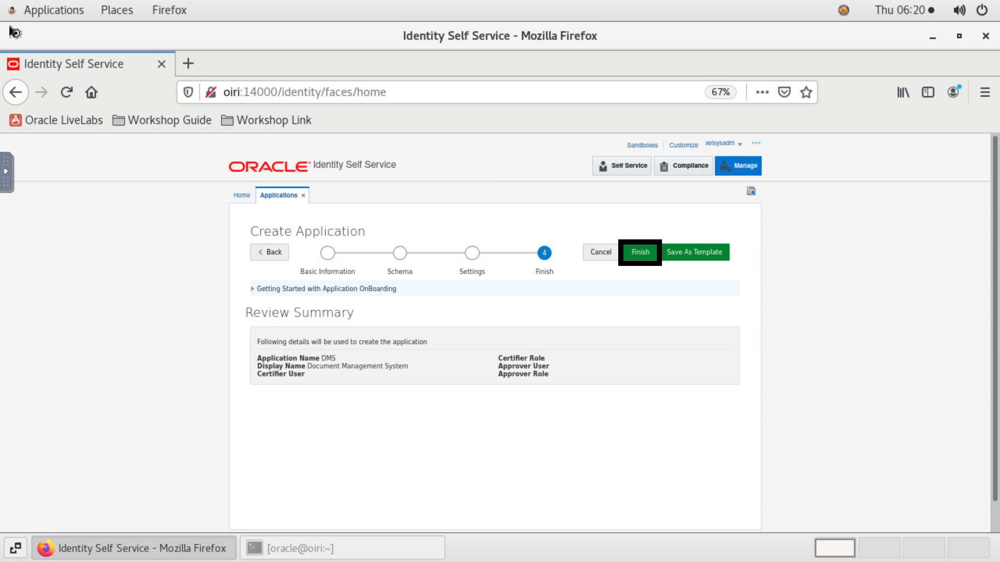

2. Click Yes to create default request form.

    

3. On the Application page, click on the Search icon. Notice that the DMS application we created is listed.

    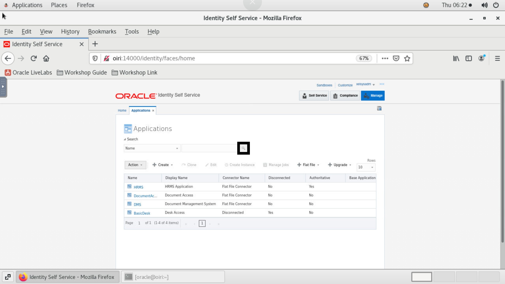

4. Log out and log in again into the Identity Self Service.

## Task 9: Performing Reconciliation
1. Choose the Applications box on the Manage tab.

2. Click Search icon and click on the DMS application.

3. Now select Manage Jobs.

    

4. Performing Entitlement Reconciliation
    - Expand the Flat File Entitlement and then expand the DMS Flat File Entitlements Loader.
    - Click Run now and click on the Refresh icon multiple times until you notice that the Success result appears under Job history

      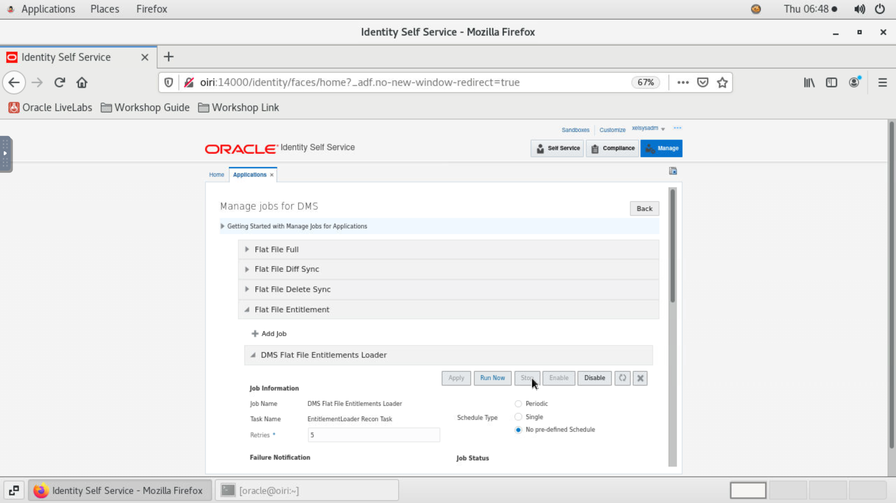

      

5. Performing Full Reconciliation
    - Expand the Flat File Full and then expand the DMS Flat File Accounts Loader.
    - Click Run now and click on the Refresh icon multiple times until you notice that the Success result appears under Job history

      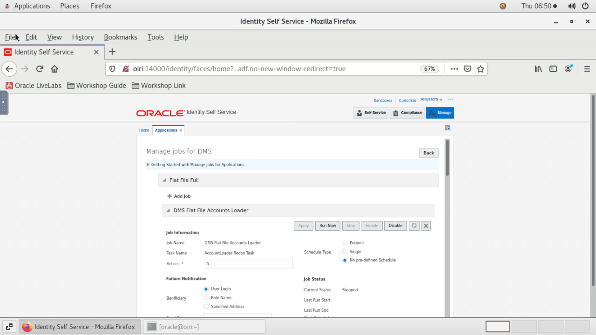

      

6. Go to Users box on the Manage tab and click any user.

    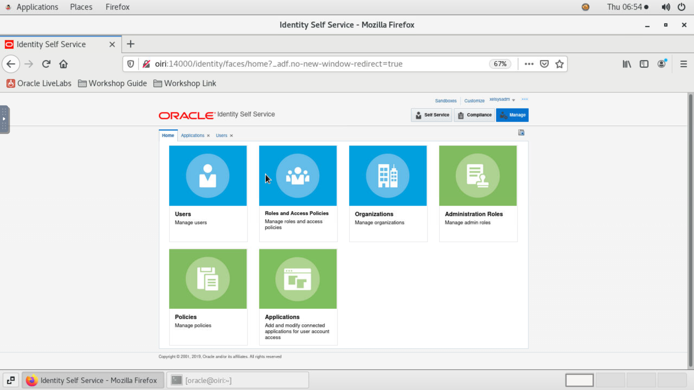

    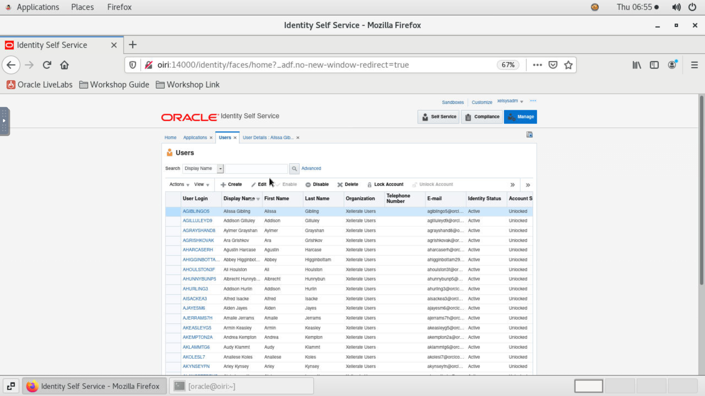

7. Click on the Entitelements tab and Accounts tab and notice that the user is provisioned to the "DMS" application with appropriate Entitlement.

    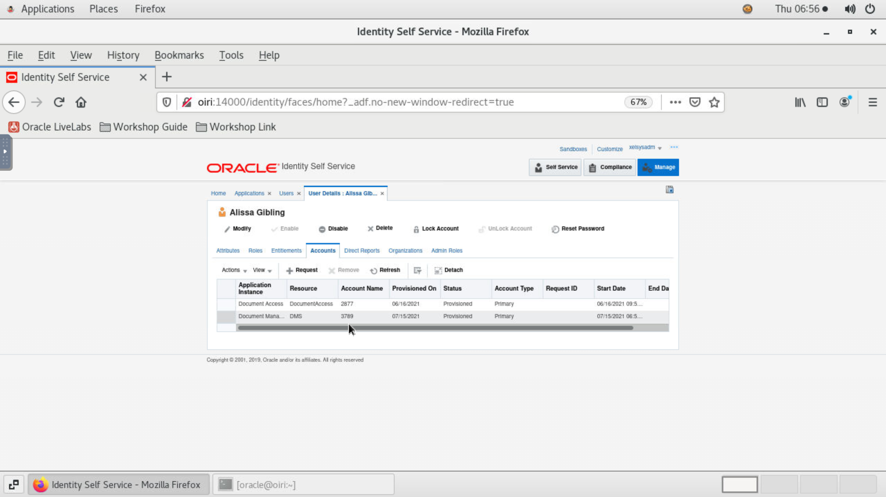

    


## Acknowledgements
* **Author** - Keerti R, Brijith TG, Vineeth Boopathy, NATD Solution Engineering
* **Contributors** -  Keerti R, Brijith TG, Vineeth Boopathy
* **Last Updated By/Date** - Keerti R, NATD Solution Engineering, October 2021
