# Oracle Audit Vault and DB Firewall (AVDF)

## Introduction
This workshop introduces the various features and functionality of Oracle Audit Vault and DB Firewall (AVDF). It gives the user an opportunity to learn how to configure those appliances in order to audit, monitor and protect access to sensitive data.

*Estimated Lab Time:* 120 minutes

*Version tested in this lab:* Oracle AVDF 20.1

### Video Preview
Watch a preview of "*Understanding Oracle Audit Vault and Database Firewall 20c (August 2020)*" [](youtube:9xG0GFKbVJk)

### Objectives
- Connect Audit Vault Server to an Oracle DB
- Configure the auditing for this Db and explore the auditing and reporting capacities
- Configure and manage the Firewalling monitoring
- Train the DB Firewall for expected SQL traffic and see the effects on a web App

### Prerequisites
This lab assumes you have:
- A Free Tier, Paid or LiveLabs Oracle Cloud account
- SSH Private Key to access the host via SSH
- You have completed:
    - Lab: Generate SSH Keys
    - Lab: Prepare Setup (Free Tier and Paid Oracle Cloud Accounts Only)
    - Lab: Environment Setup
    - Lab: Initialize Environment
    - Lab: DBSAT (please refer to the *Oracle Database Security Baseline Workshop*)

### Lab Timing (estimated)

| Step No. | Feature | Approx. Time |
|--|------------------------------------------------------------|-------------|
|| **Audit Vault Labs**||
|01| Run the Deploy Agent | <5 minutes|
|02| Register a Pluggable Database as Target | <5 minutes|
|03| Register an Audit Trail | <5 minutes|
|04| Manage Unified Audit Settings | 5 minutes|
|05| Retrieve User Entitlements | <5 minutes|
|06| Access Rights and User Activity on Sensitive Data | <5 minutes|
|07| Auditing Column Data Changes - Before and After Values | 15 minutes|
|08| Create Alert Policies | 10 minutes|
|| **DB Firewall Labs**||
|09| Add the DB Firewall Monitoring | 10 minutes|
|10| Configure and Verify the Glassfish App to Use the DB Firewall | 10 minutes|
|11| Train the DB Firewall for Expected SQL Traffic | 20 minutes|
|12| Build and Test the DB Firewall Allow-List Policy | 20 minutes|
|13| Restore the Glassfish App Configuration to Use Direct Mode | <5 minutes|
|| **AVDF Advanced Labs**||
|14| PostgreSQL Audit Collection | 10 minutes|
|15| Linux Audit Collection | 10 minutes|
|16| LDAP/Active Directory Configuration | <5 minutes|

<!-- Audit Vault in progress!
|06| Audit Vault - Audit Stored Procedures Changes | 5 minutes|
-->
<!-- DB Firewall in progress!
|14| Establish Trusted Users and Application Paths | 5 minutes|
|15| Refine, Publish and Deploy DB Firewall Policy | 5 minutes|
|16| Test the DB Firewall Policy with DBA Exceptions | 5 minutes|
|17| Refine, Publish and Deploy DB Firewall Policy to Monitor Sensitive Data | 5 minutes|
|18| Block SQL Injection | 5 minutes|
-->
<!-- Advanced Labs in progress!
|19| MySQL Audit Collection | 5 minutes|
-->

## **STEP 1**: Audit Vault - Run the Deploy Agent

1. Before beginning the Audit Vault labs, you must run this script to enable the pre-configure Audit Vault Server for this workshop

    - Open a SSH session on your **AVS VM as *opc* user**

    - Initialize the Audit Vault server

          ````
          <copy>sudo /root/bootstrap/fix-apex-login.sh</copy>
          ````

    - Close the session

2. Now, open a SSH session on your **DBSec-Lab VM as *oracle* user** (don't close it until the end of this AVDF workshop!)

      ````
      <copy>sudo su - oracle</copy>
      ````

3. Go to the scripts directory

      ````
      <copy>cd $DBSEC_LABS/avdf/avs</copy>
      ````

4. First, unpack the **avcli.jar** utility to install the Audit Vault Command Line Interface (avcli) so we can automate most of the Agent, host, and Audit Trail deployment

      ````
      <copy>./avs_deploy_avcli.sh</copy>
      ````

   

5. Next, we will use avcli to register the host, dbsec-lab, with Audit Vault. You will see that the commands being run are stored in the `avcli_register_host.av` file. In this step you will see a activation key. **Record this Activation Key for use later in the lab!**

      ````
      <copy>./avs_register_host.sh</copy>
      ````

   

    **Note**: Your output will look similar to this but your **Activation Key** will be different

6. Next, we will deploy the Audit Vault Agent

      ````
      <copy>./avs_deploy_agent.sh</copy>
      ````

   

    **Note**: This script will unpack the **agent.jar** file into the **/u01/app/avagent** directory

7. Once deployed, we will need to activate the Audit Vault Agent

      ````
      <copy>./avs_activate_agent.sh</copy>
      ````
    
   

    **Note**:
    - Remember the Activation Key we saw above and paste the key when prompted
    - Attention, because the Activation Key is enter like a password, it won't show on the screen!

8. As a final step, we will verify that the dbsec-lab host has been properly registered and is activated with Audit Vault

      ````
      <copy>./avs_show_host.sh</copy>
      ````

   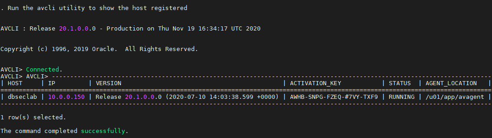

    **Note**: Notice the output says "**RUNNING**" for the Agent Status column

## **STEP 2**: Audit Vault - Register a Pluggable Database as Target

1. Use the avcli utility to register the pluggable database **pdb1** as an AV target (the password asked here is "*`Oracle123`*")

      ````
      <copy>./avs_register_pdb.sh</copy>
      ````

   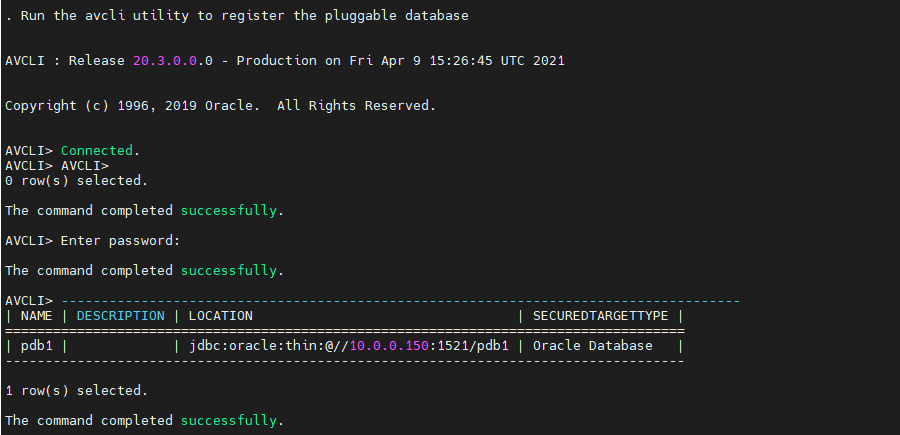

    **Note**:
    - You could also perform this register from the Audit Vault Web Console
    - This script will use the database user **AVAUDITUSER** that was created, and granted the appropriate privileges, to perform database audit collection and clean-up and has `SELECT` access on several dictionary tables (for more information please see the Oracle Audit Vault and Database Firewall documentation)

## **STEP 3**: Audit Vault - Register an Audit Trail

1. First, use the avcli utility to register the Unified Audit Trail for the pluggable database **pdb1** to collect audit data

      ````
      <copy>./avs_register_audit_trail.sh</copy>
      ````

   

2. Next, list the Audit Trails for the pluggable database **pdb1**

      ````
      <copy>./avs_list_audit_trails.sh</copy>
      ````

   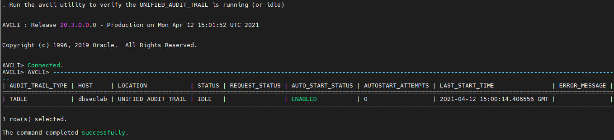

      **Note**:
      - You should see one row returned for the Unified Audit Trail
      - The `STATUS` column should say **COLLECTING** or **IDLE**
      - If it says something else please run the script again and verify it changes state

3. Using the Audit Vault Web Console view audit data collected via the All Activity Report 

    - Open a new Web Browser tab at the URL *`https://<AVS-VM_@IP-Public>`*
    - Login to Audit Vault Web Console as *`AVAUDITOR`* with the password "*`T06tron.`*" (keep it open for the rest of the lab)

       

    - Click on the **Reports** tab
    - Under the **Activity Reports** section titled **Summary**, click on the **All Activity** name to load the report
    - You should see a report that looks something like this:

       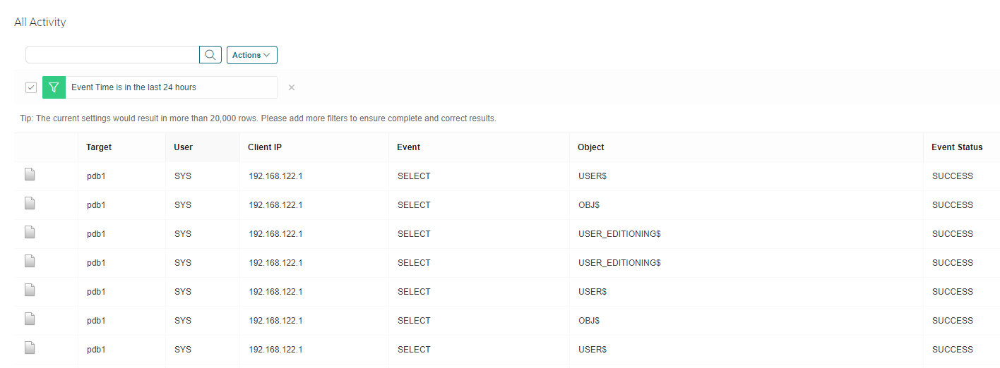

    - You can click on the **Event Status** header and narrow down the report to **Event Status = 'FAILURE'**
    - It might look something like this:

       

      **Note**:
      - This was just a small example to verify that audit data was being collected and is visible in Audit Vault
      - There will be more detailed report generation labs later in the workshop

4. You have completed the lab to register the Unified Audit Trail for pdb1 with Audit Vault

## **STEP 4**: Audit Vault - Manage Unified Audit Settings

You will retrieve and provision the Unified Audit settings for the **pdb1** pluggable database

1. Go back to Audit Vault Web Console as *`AVAUDITOR`*

   

2. Click on the **Targets** tab

3. Click on the Target **pdb1**

4. On the target screen, under **Audit Policy** perform the following:
    - Checkbox *Retrieve Immediately*
    - Change the **Schedule** radio button to *Enable*
    - Set **Repeat Every** to *1 Days*
    - Click [**Save**] to save and continue

      

5. Next, view the audit policy reports for **pdb1**
    - Click on the **Policies** tab and you will be placed on the **Audit Policies** page
    - Click on the Target Name **pdb1**
    - On this screen, you will see two tabs, **Unified Auditing** and **Traditional Auditing**. Since this is a modern version of Oracle, 12.1 or higher, we want to use Unified Auditing
    - In the **Unified Auditing** tab, go to the **Core Policies** section and ensure the following options are checkmarked
        - *`Critical Database Activity`*
        - *`Database Schema Changes`*
        - *`All Admin Activity`*
        - *`Center for Internet Security (CIS) Configuration`*
    - Click [**Provision Unified Policy**]

      

6. Verify the job completed successfully
    - Click on the **Settings** tab
    - Click on the **Jobs** section on the left menu bar
    - You should see at least one **Job Type** that says **Unified Audit Policy**
    - Verify it shows **Complete** and it was provisioned on **pdb1**

      

7. The next thing you can do is check which Unified Audit Policies exist and which Unified Audit Policies are enabled by using **SQL*Plus**

    - Go back to your SSH session and list **ALL** the Unified Audit Policies in **pdb1**

          ````
          <copy>./avs_query_all_unified_policies.sh</copy>
          ````

       

    - Next, show the **enabled** Unified Audit policies

          ````
          <copy>./avs_query_enabled_unified_policies.sh</copy>
          ````

       

8. If you want, you can re-do the previous steps and make changes to the Unified Audit Policies. For example, don't enable the **Center for Internet Security (CIS) Configuration** and re-run the two shell scripts to see what changes!

## **STEP 5**: Audit Vault - Retrieve User Entitlements

1. Go back to Audit Vault Web Console as *`AVAUDITOR`*

   

2. Click on the **Targets** tab

3. Click on the Target **pdb1**

4. Under **User Entitlements**
    - Checkbox *Retrieve Immediately*
    - Change the **Schedule** radio button to *Enable*
    - Set **Repeat Every** to *1 Days*
    - Click [**Save**] to save and continue

       

5. Click on the **Reports** tab

6. Scroll down and expand the **Entitlement Reports** section

   

7. Click on the **User Accounts** report
    - Under **Target Name**, select *`All`*
    - For **Label**, select *`Latest`*
    - Click [**Go**] and you will see a report that looks like this

       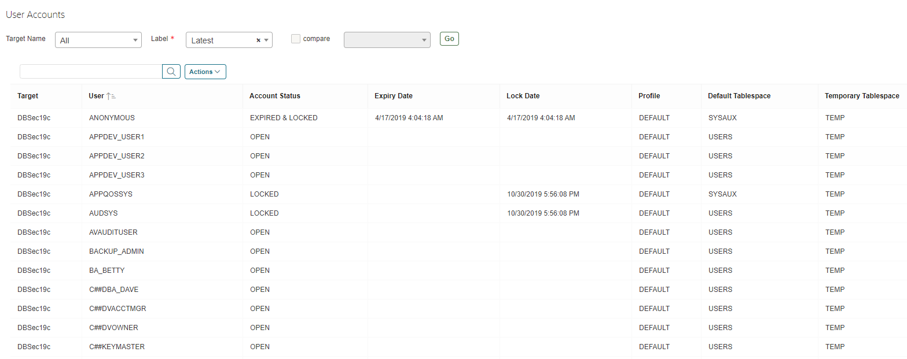

<!---
8. Now that we have seen a simple report, we will create a differential report:

    - Go back to the terminal and go to the scripts directory

      ````
      <copy>cd /home/oracle/DBSecLab/workshops/Database_Security_Labs/AVDF/Retrieve_User_Entitlements</copy>
      ````

    - Run the first script to create a new user `AUDITOR_ALAN`

      ````
      <copy>./01_create_new_user.sh</copy>
      ````

    - Using the browser, navigate back to the `Targets` tab and then to the `User Entitlement Snapshots` on the left-hand menu

   

    - Create a new label called `baseline` based on the snapshot we took during our initial entitlement configuration

   

    - From the `Targets` tab, click on the `Target Name` again and run another User Entitlements job by checkboxing  `Retrieve Immediately` and clicking [**Save**]

   

    **Note**: Make sure you update the `Start At` Day and time to reflect the time you currently have
--->

<!--
**STEP 6**: Audit Vault - Audit Stored Procedures Changes

In this lab you will enable, and test, the Audit Stored Procedure Changes for the pluggable database `pdb1`.

First, using your Linux terminal window, navigate to the following directory.

`cd /home/oracle/DBSecLab/workshops/Database_Security_Labs/AVDF/Audit_Stored_Procedure_Changes`

Execute the script to generate the creation of a PL/SQL function, creating a table, modifying a table, and modifying then deleting the PL/SQL function.

`./01_stored_procedure.sh`

Next, go back to Audit Vault Web Console as *`AVAUDITOR`*

   

- Click [**Targets**]

- Click **pdb1**

- Where the section `Stored Procedure Auditing` says `Disabled` change it to `Enabled`

    - Make sure the `Start At` time is approximately at, or ahead, of the current time

    - Change the `Repeat Every` to `1 Days`

    - Press `Save`

   

**Note**: If you receive an error stating the `Start At is less than specified minimium date` look at the `Audit Policy` or the `User Entitlements` sections and update their `Start At` dates to be similar what you set for the `Stored Procedure Auditing` date.

*View Stored Procedure Change Reports*

Now view the reports related to Stored Procedures.

- Click the `Reports` tab

- Scroll down until you get to `Stored Procedure Changes` and expand the section

   

- Click `Created Stored Procedures` and view the results.

This is an example of the kind of data you can collect with Audit Vault and Database Firewall.

You have completed the lab.
-->

## **STEP 6**: Audit Vault - Access Rights and User Activity on Sensitive Data

In this lab you will use the results from a **Database Security Assessment Tool (DBSAT)** collection job to identify the sensitive data with the pluggable database **pdb1**. For ease of execution, the required step from the DBSAT lab was performed and the output saved. The first step here will help download and stage it accordingly.

1. Before beginning the lab, you have to download to your local computer the sensitive data file (`pdb1_dbsat_discover.csv`) that we have generated for you from DBSAT:

    [> Click here to download the CSV file<](https://objectstorage.us-ashburn-1.oraclecloud.com/p/g7HGibfhPXhmVXvyiP5G4yGe_MH3yPGUkiCrccuYhCKewZvgd-mlPycLPxaOAxcC/n/natdsecurity/b/labs-files/o/pdb1_dbsat_discover.csv)

2. Next, grant privilege to the admin user "`AVADMIN`" to import sensitive data

    - Open an SSH session to your **AVS VM as *opc* user**

    - Now we need to become **oracle** user

          ````
          <copy>sudo su - oracle</copy>
          ````

    - Once we have switched to oracle user, we have to run the Python script to grant the additional role

          ````
          <copy>python /usr/local/dbfw/bin/av_sensitive_role grant avadmin</copy>
          ````

          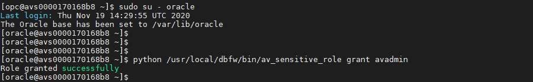

    - Close the session

3. Now that you have the role granted, you can load the data from our DBSAT file

    - Open a new Web Browser tab at the URL *`https://<AVS-VM_@IP-Public>`*
    - Login to Audit Vault Web Console as *`AVADMIN`* with the password "*`T06tron.`*" (keep it open for the rest of the lab)

          

    - Upload the `pdb1_dbsat_discover.csv` file you downloaded earlier into AVDF Console
        - Click the **Targets** tab
        - Click the target name **pdb1**
        - In the right, top, corner of the page click [**Sensitive Objects**]
        - Browse the *`pdb1_dbsat_discover.csv`* file you saved earlier to your local system

          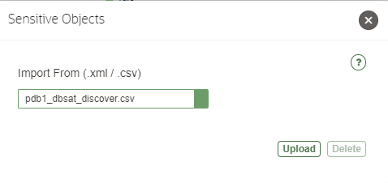

        - Click [**Upload**]
        - If you click [**Sensitive Objects**] again you will see you have the **.csv** file loaded

          

4. View the Sensitive Data

    - Go back to Audit Vault Web Console as *`AVAUDITOR`*

       

    - Click the **Reports** tab
    - On the left side menu, click **Compliance Reports**
    - Click [**Go**] to associate the **pdb1** target with the **Data Private Report (GDPR)** group
    - Checkbox **pdb1**
    - Click [**Add**]

       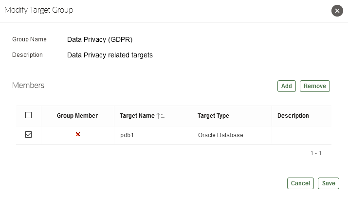

    - Click [**Save**]
    - Unfortunately, once you associate the target with the report, Audit Vault takes you to some unknown page, so please navigate back to the original page by clicking **Reports** then **Compliance Reports**
    - Click **Sensitive Data** and now you can see the Schema, Objects, Object Types, and Column Name and Sensitive Types

       

5. You can also view additional **Compliance Reports** about Sensitive Data

   

## **STEP 7**: Audit Vault - Auditing Column Data Changes - Before and After Values

**About Oracle Audit Vault Transaction Log Audit Trail Collection**

REDO LOG files also known as TRANSACTION LOG are files used by Oracle Database to maintain logs of all the transactions that have occurred in the database. This chapter contains the recommendations for setting initialization parameters to use the **Transaction Log Audit Trail** type to collect audit data from the Redo Logs of Oracle Database target.

These log files allow Oracle Database to **recover the changes made to the database in case of a failure**. For example, if a user updates a salary value in a table that contains employee related data, a REDO record is generated. It contains the value **BEFORE** this change (old value) and the **NEW** changed value. REDO records are used **to guarantee ACID** (Atomicity, Consistency, Isolation, and Durability) **properties over crash or hardware failure**. In case of a database crash, the system performs redo (re-process) of all the changes on data files that takes the database data back to the state it was when the last REDO record was written.

REDO log records contain Before and After values for every **DML** (Data Manipulation Language) and **DDL** (Data Definition Language) operations. Oracle AVDF provides the ability to **monitor the changed values from REDO logs using Transaction Log collector**.

Transaction Log collector takes advantage of **Oracle GoldenGate’s Integrated Extract process** to move the REDO log data from database to XML files. The extract process is configured to run against the source database or it is configured to run on a Downstream Mining database (Oracle only). It captures DML and DDL operations performed on the configured objects. **The captured operations from transaction logs are transferred to GoldenGate XML trail files**. Oracle AVDF's Transaction Log collector, collects transaction log records from generated XML files. **These logs are forwarded to the Audit Vault Server** to show the before and after values changed in the Data Modification Before-After Values report. The DDL changes are available in the All Activity report. The DML changes are available in the Data Modification Before-After Values report.

**Getting Started**

The first thing we need to do is to set up the database to be ready for Golden Gate

1. Go back to your SSH session on DBSec-Lab VM to create the Golden Gate Database Administration user **C##AVGGADMIN** in the container database **cdb1**

      ````
    <copy>./avs_create_oggadmin_db_user.sh</copy>
      ````

   

2. Next, we have to configure the database to have the appropriate `SGA_TARGET` and `STREAMS_POOL_SIZE` values, enable the `ENABLE_GOLDENGATE_REPLICATION` initialization parameter and **Forcing Logging** for redo collection

      ````
    <copy>./avs_configure_db_for_ogg.sh</copy>
      ````

   

     **Note**: This will require a reboot and this script will do this for you

3. Finally, verify connectivity to the **cdb1** container database before we continue with the configuration of the GoldenGate Extract

      ````
    <copy>./avs_test_dbuser_connectivity.sh</copy>
      ````

   

**Configuring a GoldenGate Extract**

4. In the DBSecLab VM, the Oracle GoldenGate software has been already installed and pre-configured, but ensure the Golden Gate Administration Service is up and running

      ````
    <copy>./avs_start_ogg.sh</copy>
      ```` 

   

    **Note**: The Golden Gate Administration Server URL is provided with your own DBSec-Lab VM Public IP address

5. Login to your Golden Gate Web Console

    - Open a new Web Browser tab at the URL *`http://<DBSECLAB-VM_@IP-Public>:50002/`*
    - Login to Golden Gate Web Console as *oggadmin* with the password "*Oracle123*"

       

6. In the top left corner, open the **Burger menu** and select **Configuration**

7. Click the [**+**] symbol next to **Credentials**

8. Next, create a new Credential with the following values

    - Credential Domain: *`cdb1`*
    - Credential Aalias: *`cdb1`*
    - User ID: *`c##avggadmin@(DESCRIPTION=(ADDRESS=(PROTOCOL=tcp)(HOST=10.0.0.150)(PORT=1521))(CONNECT_DATA=(SERVICE_NAME=cdb1)))`*
    - Password: *`Oracle123`*
    - Verify Password: *`Oracle123`*

       

    - Click [**Submit**]

9. Under **Action**, press the **Verify** button for the **cdb1** Domain

   

10. If your connection was successful, you should now see a **Checkpoint**, a **Transaction Information** and a **Heartbeat** section

   

11. Now we will navigate back to the GoldenGate Administration Server dashboard
    - In the top left corner, open the **Burger menu**
    - Select **Overview**

12. Create a new GoldenGate Extract

    - In the **Extracts** section, click the [**+**] symbol

          

    - Choose **Integrated Extract** and click [**Next**]
    - In the **Basic Information** section, fill out the fields with the following values
        - Process Name: *`pdb1`*
        - Description: *`Extract data from pdb1`*
        - Intent: *`Unidirectional`*
        - Credential Domain: *`cdb1`*
        - Credential Aalias: *`cdb1`*
        - Begin: *`Now`*
        - Trail Name: *`p1`*
        - Trail Size (MB): *`500`*

          

    - and in the **Registration Information** section
        - Register to PDBs: *`pdb1`*

          

    - Click [**Next**]

    - Replace the existing **Parameter File** with this

         ````
        <copy>extract pdb1
        useridalias cdb1 domain cdb1
        OUTPUTFORMAT XML _AUDIT_VAULT
        exttrail p1
        SOURCECATALOG pdb1
        DDL INCLUDE ALL
        TABLE employeesearch_prod.*;</copy>
         ````

    - It should look like this now

          

    - Click [**Create and Run**]

    - You will be redirected to the dashboard and you should now have a new Extract in **RUNNING** status

          

          **Note**: If it's not running, please start it:
          - On the **PDB1** Extract, click [**Action**] and click [**Start**]
          - Confirm you want to start the Extract process
          - Confirm your Extract now shows **RUNNING**

             


**Configure a new Audit Trail**

13. Go back to Audit Vault Web Console as *`AVADMIN`*

   

14. Click the **Targets** tab

15. Click the **pdb1** Target

16. Click [**Modify**] to add an attribute to the Target

17. Click the **Audit Collection Attributes** tab

18. Click [**Add**] to tell the collect this database is in your timezone

    - Name: *`av.collector.TimeZoneOffset`*
    - Value: *`<YOUR_DBSECLAB_VM_TIMEZONE>`* (here UTC time "`0:00`")

        

    - Click [**Save**]

19. In the **Audit Data Collection** section, click [**Add**]

20. For the new Audit Trail, use the following values

    - Audit Trail Type: *`TRANSACTION LOG`*
    - Trail Location: *`/u01/app/oracle/product/ogg/var/lib/data`*
    - Agent Host: *`dbseclab`*
    - Review the inputs for accuracy

        

    - Click [**Save**]

21. The new Audit Trail might say **STOPPED** but if you **refresh the page** then it should switch to **COLLECTING** or **IDLE**. Attention, don't go to next step while the Audit Trail is not started!

   

**Generate Changes and View the Audit Vault Reports**

22. Go back to your SSH session and generate data and object changes

      ````
    <copy>./avs_generate_employeesearch_prod_changes.sh</copy>
      ````

   

23. Go back to Audit Vault Web Console as *`AVAUDITOR`*

   

24. Click the **Reports** tab

25. In the **Data Access & Modification** section, click **Data Modification Before-After Values**

26. You should see an output similar to the following screenshot:

   

**Troubleshooting Issues and Errors**

27. If you are not seeing Before/After value changes in Audit Vault, ensure you:
    - Are logged in as "`AVAUDITOR`" to view the AV reports
    - You properly executed the scripts in `Before_and_After_Changes` folder to create the "`C##GGAVADMIN`" user and setup the database
    - Your GoldenGate Microservices are started
    - Golden Gate Extracts are in a state of `RUNNING` (if not, from the Golden Gate Web Console, click [**Action**] for the `pdb1` extract and set it to start)
    - The Timezone of your Audit Trail is correctly set to your VM Timezone
    - Your Audit Trail is up and running

## **STEP 8**: Audit Vault - Create Alert Policies

In this lab you will modify the Database Firewall connection for the pluggable database **pdb1**

1. Go back to Audit Vault Web Console as *`AVAUDITOR`*

   

2. Click the **Policies** tab

3. Click the **Alert Policies** tab

4. Click [**Create**]

5. Enter the following information for our new **Alert**

    - Alert Name: *`CREATE USER`*
    - Type: *`Oracle Database`*
    - Severity: *`Warning`*
    - Threshold (times): *`1`*
    - Duration (min): *`0`*
    - Description: *`Alert on CREATE USER statements`*
    - Condition: *`:EVENT_NAME = 'CREATE USER'`*
    - Template: *`Alert Notification Template`*

6. Your Alert should look like this

   

7. Click [**Save**]

8. Go back to your SSH session and create users within the **pdb1** pluggable database

      ````
      <copy>./avs_create_users.sh</copy>
      ````

   

9. Go back to the Audit Vault Web Console as *`AVAUDITOR`* to view alerts

   

10. Click on **Alerts** tab

11. View the Alerts that have occurred related to our user creation SQL commands

   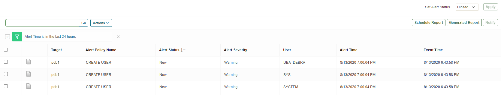

12. Click on the details of one of the alerts

   

13. Go back to your SSH session and drop the users we created in the previous script

      ````
      <copy>./avs_drop_users.sh</copy>
      ````

   

    **Note**: Once you understand how to create an alert, feel free to create another and test it manually

## **STEP 9**: DB Firewall - Add the DB Firewall Monitoring

1. Before beginning the DB Firewall labs, you must run this script to enable the pre-configure DB Firewall Server for this workshop

    - Open a SSH session on your **DBF VM as *opc* user**

    - Start Network Manager

          ````
          <copy>sudo systemctl start NetworkManager</copy>
          ````

    - Close the session

2. Now, go back to Audit Vault Web Console as *`AVADMIN`*

   

3. Click on **Database Firewalls** tab

4. Click on **dbfw** Database Firewall Name

   

5. Click **Network Settings**

   

6. Click on **eth0**

   

7. To add a **Proxy Port**
    - Click [**Add**]
    - Name it *`dbfw_proxy`*
    - Use the port *`15223`*

       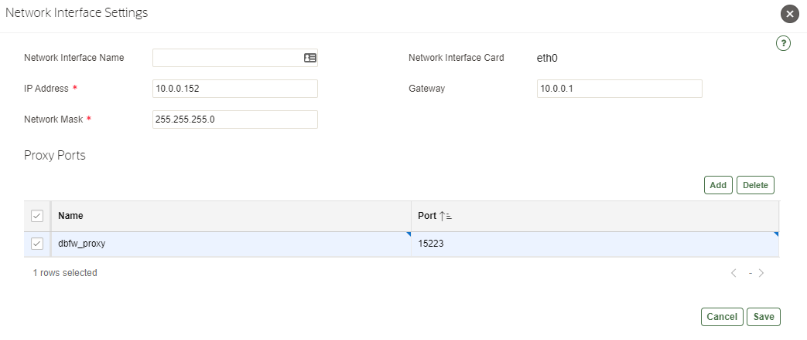

    - Click [**Save**]

8. Your Database Firewall Network Settings should now look like this:

   

9. Click [**Close**]

10. Now, you will enable DB Firewall Monitoring for `pdb1` using the Proxy Port we just created

11. Click the **Targets** tab and click **pdb1**

12. In the **Database Firewall Monitoring** section of this page, click [**Add**]

13. Fill out the following details

    - Database Firewall: *`dbfw`*
    - Mode: *`Monitoring / Blocking (Proxy)`*
    - Network Interface Card: *`eth0`*
    - Proxy Ports: *`dbfw_proxy (15223)`*

       

14. Click [**Add**]

15. Fill out the fields as following
    - Host Name / IP Address: *`10.0.0.150`*
    - Port: *`1521`*
    - Service Name: *`pdb1`*

       

        **Note**:
        - Ensure you use the IP Address not the hostname because the DBSecLab VMs are using DNS!
        - This is a demonstration environment limitation not an AVDF limitation

16. Click [**Save**]

17. The result should look like this:

   

18. Now, verify connectivity between the database and the DB Firewall

    - Go back to your SSH session and go to the DBF directoy
    
          ````
          <copy>cd $DBSEC_LABS/avdf/dbf</copy>
          ````

    - Verify connectivity to the database **without** the Database Firewall

          ````
          <copy>./dbf_sqlplus_without_dbfw.sh</copy>
          ````

          

          **Note**:
          - This will connect **directly** to the pluggable database `pdb1` on the standard listener port `1521`
          - You should see that the connection shows `10.0.0.150` which is the IP Address of the DBSec-Lab VM

    - Verify connectivity to the database **with** the Database Firewall

          ````
          <copy>./dbf_sqlplus_with_dbfw.sh</copy>
          ````

          

          **Note**:
          - This will connect to the pluggable database `pdb1` **through the proxy** on the port `15223` (DB Firewall Monitoring) we just configured
          - You should see that the connection shows `10.0.0.152` which is the IP Address of the DB Firewall VM

## **STEP 10**: DB Firewall - Configure and Verify the Glassfish App to Use the DB Firewall

In this lab you will modify the Glassfish connection (instead of connecting directly to the pluggable database **pdb1**, Glassfish will connect through the Oracle DB Firewall so we can monitor, and block, SQL commands)

1. First, open a new Web browser tab and launch the Glassfish app by navigating to this URL: *`http://<YOUR_DBSEC-LAB_VM_PUBLIC_IP>:8080/hr_prod_pdb1`*

    **Note**: Take the URL and use it to verify that the application functions **before** we make any changes to connection string!

2. Login to the application as *`hradmin`* with the password "*`Oracle123`*"

   

   

3. Click **Search Employees**

   

4. Click [**Search**]

   

5. In the top right hand corner of the App, click on the **Welcome HR Administrator** link and you will be sent to a page with session data

   

6. On the **Session Details** screen, you will see how the application is connected to the database. This information is taken from the **userenv** namespace by executing the `SYS_CONTEXT` function.

   

7. Logout

   

8. Now, go back to your SSH session and migrate the Glassfish Application connection string to proxy through the Database Firewall

      ````
      <copy>./dbf_start_proxy_glassfish.sh</copy>
      ````

   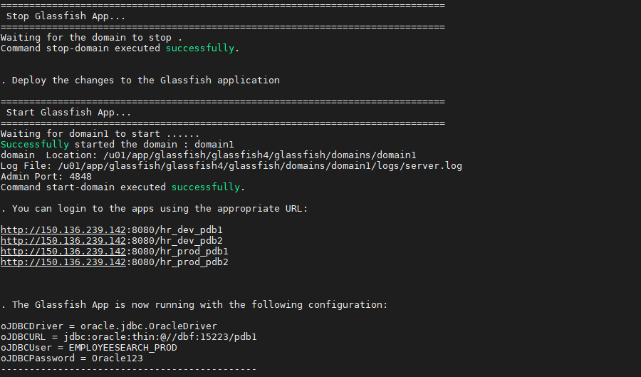

9. Next, verify the application functions as expected

    - Go back to your Glassfish App web page and login as *`hradmin`* with the password "*`Oracle123`*"
    - Click **Search Employees**
    - Click [**Search**]

       **Note**: You should see the same results as you did before connecting through the Database Firewall

    - In the top right hand corner of the App, click on the **Weclome HR Administrator** link to view the **Session Details** page
    - Now, you should see that the **IP Address** row has changed from `10.0.0.150` to `10.0.0.152`, which is the IP Address of the DB Firewall VM

       

## **STEP 11**: DB Firewall - Train the DB Firewall for Expected SQL Traffic
In this lab you will use the Glassfish Application to connect through the Oracle Database Firewall so we can monitor, and block, SQL commands

1. Go back to Audit Vault Web Console as *`AVADMIN`*

   

2. Click the **Database Firewalls** tab

3. Click on the Target name **dbfw**

4. Under **Configuration**, click **System Services**

    **Note**: According to your resources it can take up to several minutes to present the Tabs!

5. Select the **Date and Time** tab

6. Ensure the first NTP service is **ON** and the IP is *`169.254.169.254`*, and close the pop-up windows

   

7. Next, set the type of DB Firewall monitoring, so go back to Audit Vault Web Console as *`AVAUDITOR`*

   

8. On top, click on the **Targets** tab

9. Click **pdb1**

10. Click the **Database Firewall Monitoring** sub-tab

11. Change **Database Firewall Policy** from "`Pass all`" to "*`Log unique`*"

   

12. Click the **Green Check** to save

   

13. Now, generate Glassfish Application Traffic
    - Go back to your Glassfish App web page and login as *`hradmin`* with the password "*`Oracle123`*"
    - Click **Search Employees**

14. In the **HR ID** field enter "*`164`*" and click [**Search**]

   

15. Clear the **HR ID** field and click [**Search**] again to see all rows

   

16. Enter the following information in the **Search Employee** fields

    - HR ID: *`196`*
    - Active: *`Active`*
    - Employee Type: *`Full-Time Employee`*
    - First Name: *`William`*
    - Position: *`Administrator`*
    - Last Name: *`Harvey`*
    - Department: *`Marketing`*
    - City: *`London`*

17. Click [**Search**]

   

18. Click on "**Harvey, William**" to view the details of this employee

   

19. Now, let's view the Database Firewall Activity, so go back to Audit Vault Web Console as *`AVAUDITOR`*

   

20. Click **Reports**

21. Scroll down to **Database Firewall Reports**

22. Click **Database Firewall Monitored Activity**

    **Note**: Sometimes DB Firewall activity may take 5 minutes to appear in the Database Firewall Activity Reports

23. Your activity should show queries from `EMPLOYEESEARCH_PROD` using a "**JDBC Thin Client**"

   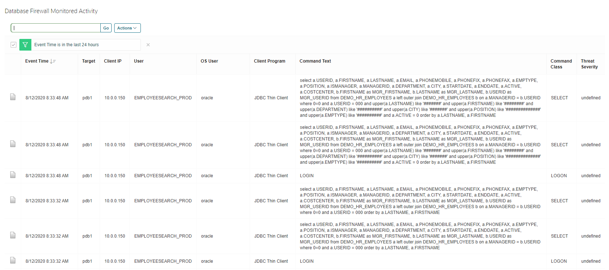

24. Click on the details of a query to see more information and notice the following information:
    - Policy Name: *`Log unique`*
    - Threat Severity: *`undefined`*
    - Log Cause: *`unseen`*
    - Location: *`Network`*

       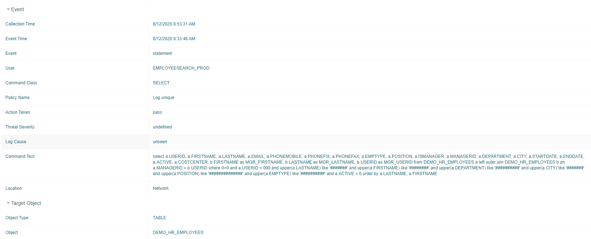

       **Note**:       
          - This information tells us a lot about our Database Firewall policies and why we are capturing this particular query
          - If your reports show a lot of unknown activity you probably have **Native Network Encryption** enabled
          - Please disable it from a terminal session and run the queries again:
             - To check, run the following script: `$DBSEC_LABS/nne/nne_view_sqlnet_ora.sh`
             - If it says `SQLNET.ENCRYPTION_SERVER=REQUESTED` or `SQLNET.ENCRYPTION_SERVER=REQUIRED` then it needs to be disabled
             - To disable it, run the following scripts: `$DBSEC_LABS/nne/nne_disable.sh`
             - To verify, run the following script: `$DBSEC_LABS/nne/nne_view_sqlnet_ora.sh`
          - It should return no contents now!

25. One of our favorite queries is this SQL statement:

    ```
    select USERID,FIRSTNAME,LASTNAME from DEMO_HR_USERS where ( USERSTATUS is NULL or upper( USERSTATUS ) = '######' ) and upper(USERID) = '#######' and password = '#########'
    ```

     **Note**:
     - We like this query because this is the authentication SQL the "`My HR App`" uses to validate the `hradmin` and `Oracle123` password. Remember, the application is authenticated against a table not the database so queries like this will be captured
     - Notice how the Database Firewall has removed the bind values that would have included the username and password. This is to minimize the collection of sensitive data within Audit Vault and Database Firewall

26. Feel free to continue to explore the captured SQL statements and once you are comfortable, please continue the labs!

## **STEP 12**: DB Firewall - Build and Test the DB Firewall Allow-List Policy

1. Before we build our policy we have to make sure DB Firewall has logged the SQL Statements from the **Train the Database Firewall for expected SQL traffic** Lab as well as SQL statements from our SQL*Plus scripts

2. Go back to your terminal session to demonstrate connectivity through the Database Firewall and the ability to query the `EMPLOYEESEARCH_PROD` tables **before applying the DB Firewall policy**

      ````
      <copy>./dbf_query_fw_policy.sh</copy>
      ````

   

     **Note**: You can see all rows!

3. Go back to Audit Vault Web Console as *`AVAUDITOR`* to create a Database Firewall Policy

   

4. Click the **Policies** tab

5. Click the **Database Firewall Policies** tab

6. Click [**Create**]

7. Create the Database Firewall Policy with the following information

    - Target Type: *`Oracle Database`*
    - Policy Name: *`HR Policy`*
    - Description: *`This policy will protect the My HR App`*

       

    - Click [**Save**]

8. Now, create the context of this policy by clicking [**Sets/Profiles**]

   

9. In the **SQL Cluster Sets** subtab, click [**Add**]

   

10. In the **Add SQL Cluster Set** screen, create the list of known queries as following

    - Name: *`HR SQL Cluster`*
    - Description: *`Known SQL statements for HR App`*
    - Target: *`pdb1`*
    - Show cluster for: *`Last 24 Hours`* (or make this `Last Week`)
    - Click [**Go**]

       
    
    - Click [**Actions**] and select "*`ALL`*" in **Row per page** option to display all the results

    - Check the **Select all** box next to the "**Cluster ID**" Header to add all "trained" queries into the SQL Clusters

    - But please **unselect the SQL*Plus query** run earlier in Step 12-1 to block it (because here we consider that it's not an official HR App query)

        ```
        select userid, firstname, lastname, emptype, position, city, ssn, sin, nino from employeesearch_prod.demo_hr_employees where rownum < 00
        ```

    - You should have something like this:

       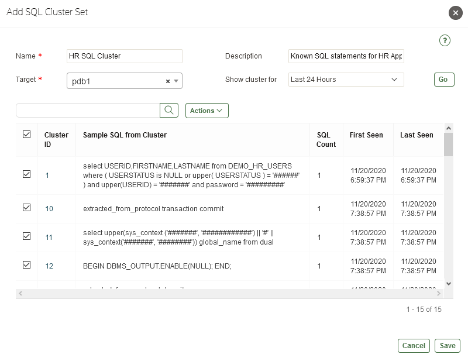

    - Click [**Save**]

11. Click [**Back**]

12. Select the **SQL Statement** sub-tab and click [**Add**]

13. Complete the **SQL Statement** with the following information to allow the **HR SQL Cluster** created previoulsy (here we consider that these queries are official and can be executed)

    - Rule Name: *`Allows HR SQL`*
    - Description: *`Allowed SQL statements for HR App`*
    - Profile: *`Default`*
    - Cluster Set(s): *`HR SQL Cluster`*
    - Action: *`Pass`*
    - Logging Level: *`Don't Log`*
    - Threat Severity: *`Minimal`*

       

    - Click [**Save**]

14. Next, add database users that we trust to connect to the database through the Database Firewall. We will create a **Database User Set** for our DB Admin (`SYSTEM`) and for the HR App's owner (`EMPLOYEESEARCH_PROD`). Only these 2 DB users will be able to run the **HR SQL Cluster**

15. Click [**Sets/Profiles**]

16. Select the **Database User Sets**` tab

17. Click [**Add**] and enter the following information

    - Name: *`Privileged Users`*
    - Description: *`Users We Trust`*
    - Sets Values: *`SYSTEM, EMPLOYEESEARCH_PROD`*

       

    - Click [**Save**]
    - Click [**Back**]

18. Finally, select the **Default** tab to specify what the DB Firewall policy has to do you if you are not in the context definied previously (here we will block all the "black-listed" queries and we will return a blank result)

    - Click on **Default Rule** under the Rule Name, to edit the Default rule, and enter the following information
    
        - Action: *`Block`*
        - Logging Level: *`One-Per-Session`*
        - Threat Severity: *`Moderate`*
        - Substitution SQL: *`SELECT 100 FROM dual WHERE 1=2`*

          

    - Click [**Save**]

19. Your HR Policy should look like this

    - From the **Session Context** sub-tab ("`No Session Context Created`")

       

    - From the **SQL Statement** sub-tab

       

    - From the **Database Objects** sub-tab ("`No Database Objects Created`")

       

    - From the **Default** sub-tab

       

20. Click [**Save**]

21. Then, click **Database Firewall Policies** sub-menu

22. Click the **checkbox** for **HR Policy** and click [**Publish**]

   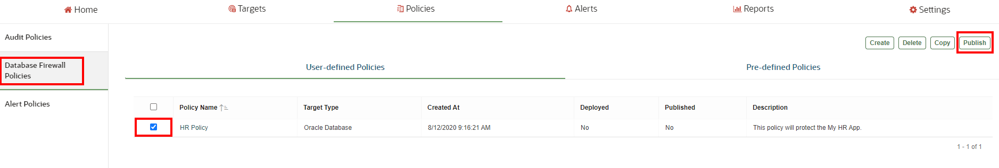

23. Click the **Targets** tab

24. Click the Target Name **pdb1**

25. Click the **Database Firewall Monitoring** sub-tab

26. Change **Database Firewall Policy** to "*`HR Policy`*"

   

27. Click the **Green Check** to implement this DB Firewall Policy

28. Once the DB Firewall Policy is enabled, we will validate the impact on the Glassfish App
    - Go back to your Glassfish App web page and login as *`hradmin`* with the password "*`Oracle123`*"
    - Click **Search Employees**
    - Click [**Search**]

       

    **Note**: All rows are returned... Remember, all "official" queries from the HR App have been allowed in **HR SQL Cluter** in your DB Firewall policy

29. Even if you add a search criteria and query again, you can access to the result

   

30. Now, go back to your SSH session and run the same script as at the beginning to see the impact of the DB Firewall policy

      ````
      <copy>./dbf_query_fw_policy.sh</copy>
      ````

31. The output should return "**no rows selected**" for the SQL query

   

    **Note**: Remember, this is because the DB Firewall policy substitute the result by "`SELECT 100 FROM dual WHERE 1=2`" for "unofficial" queries from the HR App, although you are still logged in with an authorized DB user (here SYSTEM)!

## **STEP 13**: DB Firewall - Restore the Glassfish App Configuration to Use Direct Mode

In this lab you will restore the Glassfish connection in order to connecting directly to the pluggable database **pdb1** without the Database Firewall

1. Restore the Glassfish App connection string to direct connect mode

      ````
      <copy>./dbf_stop_proxy_glassfish.sh</copy>
      ````

   

## **STEP 14**: Advanced Labs - PostgreSQL Audit Collection
The objective of this lab is to collect audit log records from PostgreSQL databases (with pgaudit configured) into Oracle Audit Vault and Database Firewall:
- Ensure to that **pgaudit** is installed extension:
    - The PostgreSQL Audit Extension (or pgaudit) provides detailed session and/or object audit logging via the standard logging facility provided by PostgreSQL
    - The audit collection will be incomplete and operational details are missed out from the reports in case this extension is not enabled
- Make sure that the LOG_DESTINATION parameter is set to **CSVLOG** in postgresql.conf file:
    - The AVDF PostgreSQL audit collector will only be able to process CSV files
- Parameter LOGGING_COLLECTOR needs to be set to **ON**
- The AVDF Agent OS user needs to have read permission on the directory specified on the LOG_DIRECTORY parameter and the generated CSV files to be able to read them

1. Go to the scripts directory

      ````
      <copy>cd $DBSEC_LABS/avdf/adv</copy>
      ````

2. Run the script as **postgres** user to setup the pgaudit and load data

      ````
      <copy>sudo -u postgres ./adv_pgsql_init.sh</copy>
      ````

   

3. Next, go back to Audit Vault Web Console as *`AVADMIN`*

   

4. Click the **Targets** tab

5. Click [**Register**]

   

6. Use the following information for your new target details

    - Name: *`PostgreSQL`*
    - Type: *`PostgreSQL`*
    - Description: *`PostgreSQL Database`*
    - Target Location: *`dbsec-lab`*
    - Leave the `USER NAME` and `PASSWORD` blank because we are going to use a "**Directory**" collector

       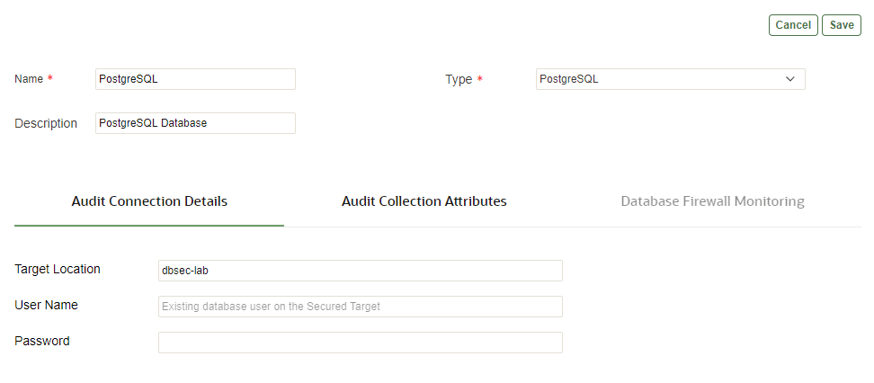

    - Click the **Audit Collection Attributes** sub-tab and add the following information

        - Name: *`av.collector.timezoneoffset`*  /  Value: *`<YOUR_DBSECLAB-VM_TIMEZONE>`* (here UTC Time: `0:00`)
        - Name: *`av.collector.securedTargetVersion`*  /  Value: *`11.0`*

       

    - Click [**Save**]

7. In the **Audit Data Collection** section, click [**Add**]

   

8. In the **Add Audit Trail** window add the following

    - Audit Trail Type: *`DIRECTORY`*
    - Trail Location: *`/var/log/pgsql`*
    - Agent Host: *`dbseclab`*

       

    - Click [**Save**]

9. Refresh the page until you see the **IDLE** status

   

10. Go back to your SSH session and generate traffic on the PostgreSQL database for auditing

      ````
      <copy>./adv_pgsql_generate_traffic.sh</copy>
      ````

   

11. Next, go back to Audit Vault Web Console as *`AVAUDITOR`*

   

12. Click the **Reports** tab

13. Click the **All Activity** report name

14. You should see audited events from the **PostgreSQL** target Database

   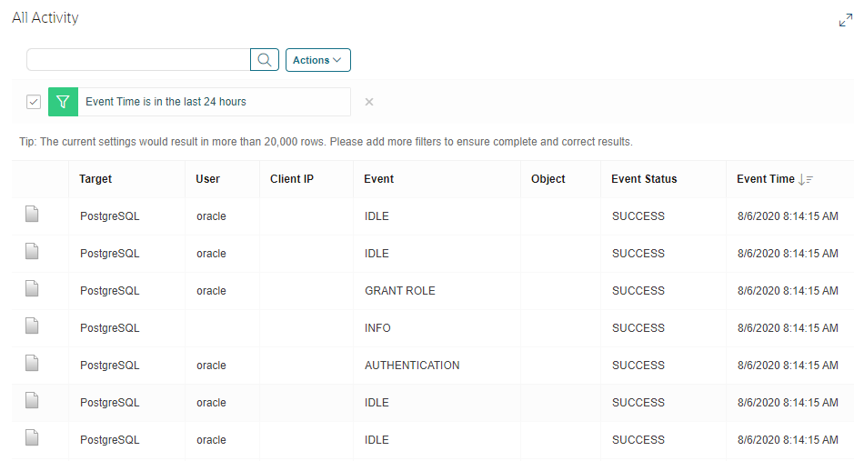

15. Finally, explore the filters and view the details on the audit data. For example, click on the **Event Status** tab and filter the report by **FAILURE**

   

16. You might see failures for multiple targets

   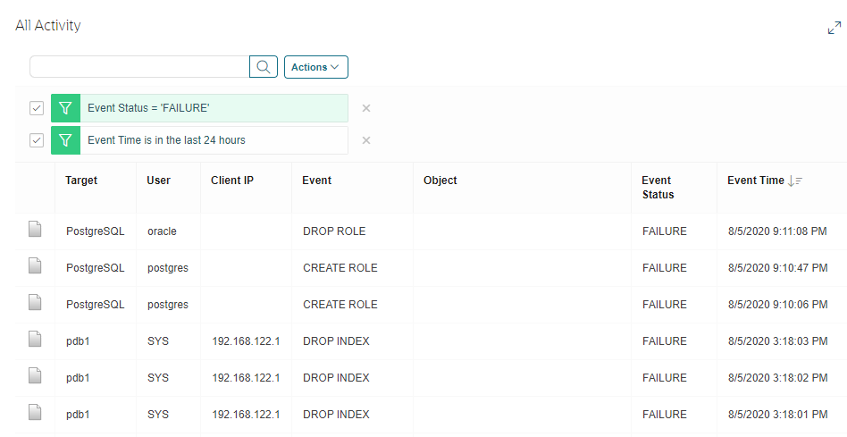

17. Click on the **paper icon** for first audit row for **DROP ROLE** and view the details. You should see a lot of audit details about this particular audited event

   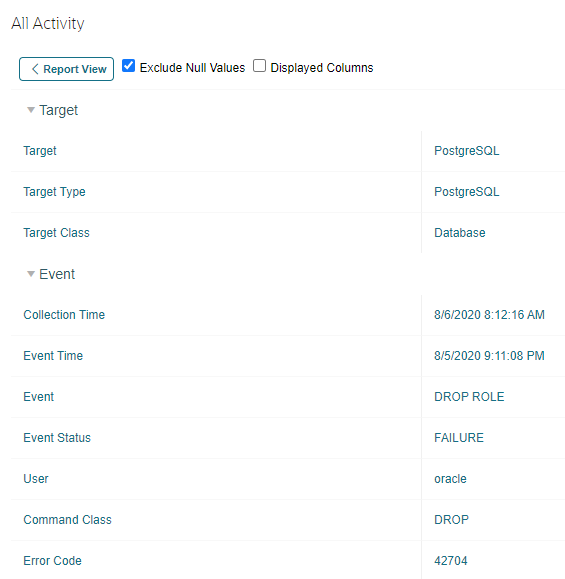

18. Continue to explore until you are comfortable!

19. Go back to your SSH session and reset the PostgreSQL database auditing

      ````
      <copy>sudo -u postgres ./adv_pgsql_cleanup.sh</copy>
      ````

   

## **STEP 15**: Advanced Labs - Linux Audit Collection

The objective of this lab is to collect event log from the Operating System

1. Setup the audit collection to write data with the **oinstall** Operating System group

      ````
      <copy>./adv_linux_setup_auditing.sh</copy>
      ````

   

2. Next, Go back to Audit Vault Web Console as *`AVADMIN`*

   

3. Click **Targets**

4. Click [**Register**]

5. Click [**Add**] and create a target with the following information

    - Name: *`dbsec-lab`*
    - Type: *`Linux`*
    - Description: *`Linux OS`*
    - In the **Audit Connection Details** section, Host Name/IP Address: *`dbsec-lab`*

       

    - Click [**Save**]

6. In the **Audit Data Collection** section, click [**Add**] and enter the following information

    - Audit Trail Type: *`DIRECTORY`*
    - Trail Location: *`/var/log/audit/audit*.log`*
    - Agent Host: *`dbseclab`*

       

    - Click [**Save**]

7. Refresh the page until you see the **IDLE** status

       

8. Go back to your terminal session and run the audit generation script

      ````
      <copy>./adv_linux_generate_traffic.sh</copy>
      ````

   

9. Next, go back to Audit Vault Web Console as *`AVAUDITOR`*

   

10. Click the **Reports** tab

11. Click the **All Activity** report name

12. You should see audited events from the **dbsec-lab** target Database

   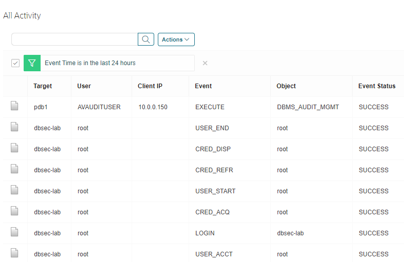

13. Finally, explore the filters and view the details on the audit data. For example, click on the **Event Status** tab and filter the report by **FAILURE**

   

14. You might see failures for multiple targets

   

15. Click on the **paper icon** for first audit row for **USER_CMD** and view the details. You should see a lot of audit details about this particular audited event

   

16. Continue to explore until you are comfortable!

17. Go back to your SSH session and reset the audit collection to the 'root' Linux OS group only

      ````
      <copy>./adv_linux_reset_auditing.sh</copy>
      ````

   

## **STEP 16**: Advanced Labs - LDAP/Active Directory Configuration

Important: before performing this lab, you must have:
- an Microsoft Active Directory Server 2016 or higher available in the same VCN as the DBSecLab VMs
- the knowledege to configure the `MS AD 2016` server appropriately

1. Go back to Audit Vault Web Console as *`AVADMIN`*

   

2. Navigate to the Audit vault settings

    - Click the **Settings** tab
    - Click the **LDAP/Active Directory Configuration** sub tab
    - Click [**Add**]

3. Enter the following information

    - Server Name: *`msad`*
    - Port: *`<YOUR_MSAD_PORT_FOR_SSL_CONNECTION>`*
    - Host Name / IP Address: *`<YOUR_MSAD_PRIVATE_IP_ADDRESS_10.0.0.XXX>`*
    - Domain Name: *`<YOUR_MSAD_DOMAIN_NAME>`*
    - Active Directory Username: *`<YOUR_MSAD_USERNAME>`*
    - Active Directory Password: *`<YOUR_MSAD_PASSWORD>`*
    - Wallet Password for Certificate: *`<YOUR_WALLET_PASSWORD>`*
    - Re-Type Wallet Password for Certificate: *`<YOUR_WALLET_PASSWORD>`*
    - Certificate: *`<YOUR_MSAD_SSL_CERTIFICATE>`*

   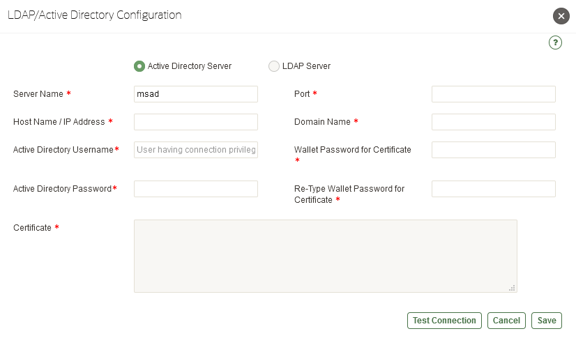

4. Click **Test Connection** to verify the connection is successful

5. Click [**Save**]

You may now proceed to the next lab.

## **Appendix**: About the Product
### **Overview**

Oracle Audit Vault and Database Firewall (AVDF) is a complete **Database Activity Monitoring (DAM)** solution that **combines native audit data with network-based SQL traffic capture**.

AVDF includes an enterprise quality **audit data warehouse**, host-based audit data collection agents, powerful reporting and analysis tools, alert framework, audit dashboard, and a multi-stage Database Firewall. The Database Firewall uses a sophisticated **grammar analysis engine** to inspect SQL statements before they reach the database and determines with high accuracy whether to allow, log, alert, substitute, or block the incoming SQL.

AVDF comes with **collectors for Oracle Database, Oracle MySQL, Microsoft SQL Server, PostgreSQL, IBM Db2 (on LUW), SAP Sybase, Oracle Key Vault, Microsoft Active Directory, Linux, Windows, AIX, Solaris, and HPUX**. A **Quick-JSON collector** simplifies ingesting audit data from databases like MongoDB. In addition to the provided collectors, AVDF's extensible framework allows simple configuration-based audit collection from **JDBC**-accessible databases and REST, JSON, or XML sources, making collection from most other systems easy. A full featured Java SDK allows creation of collectors for applications or databases that don't use a standard technology to record their audit trail.

   

- **Software Appliance**

Oracle Audit Vault and Database Firewall are packaged as a "**Soft Appliance**" and contain everything needed to install the product on bare hardware - or in this case virtual environments.

- **Fine Grained, Customizable Reporting and Alerting**

Dozens of out-of-the-box compliance reports provide easy, schedulable, customized reporting for regulations such as GDPR, PCI, GLBA, HIPAA, IRS 1075, SOX, and UK DPA.
Reports aggregate network events and audit data from the monitored systems. Summary reports, trend charts and anomaly reports can be used to quickly review characteristics of user activity and help identify anomalous events. Report data can be easily filtered, enabling quick analysis of specific systems or events. Security managers can define threshold based alert conditions on activities that may indicate attempts to gain unauthorized access and/or abuse system privileges. Fine-grained authorizations enable security managers to restrict auditors and other users to information from specific sources, allowing a single repository to be deployed for an entire enterprise.

   

- **Deployment Flexibility and Scalability**

Security controls can be customized with in-line monitoring and blocking on some databases and monitoring only on other databases. The multi-stage Database Firewall can be deployed in-line as a database proxy server, or out-of-band in network sniffing mode, or with a host-based agent that relays network activity back to the firewall for analysis and recording. Delivered as a pre-configured software appliance that can be deployed on Linux-compatible hardware of choice, a single Audit Vault Server can consolidate audit data and firewall events from thousands of databases. Both Audit Vault Server and the Database Firewall can be configured in a High Availability mode for fault tolerance.

Oracle Audit Vault and Database Firewall 20c **supports both Cloud and On-Premise databases with one single dashboard**, giving customers insight into the activities on their databases.

## Want to Learn More?
Technical Documentation:
- [Oracle Audit Vault & Database Firewall 20c](https://docs.oracle.com/en/database/oracle/audit-vault-database-firewall/20/index.html)

Video:
- *Auditing PostgreSQL and MongoDB with Oracle Audit Vault and Database Firewall (October 2020)* [](youtube:o0LqJXwS4L0)

## Acknowledgements
- **Author** - Hakim Loumi, Database Security PM
- **Contributors** - Angeline Dhanarani, Gian Sartor, Rene Fontcha
- **Last Updated By/Date** - Hakim Loumi, Database Security PM - December 2020

## Need Help?
Please submit feedback or ask for help using our [LiveLabs Support Forum](https://community.oracle.com/tech/developers/categories/livelabsdiscussions). Please click the **Log In** button and login using your Oracle Account. Click the **Ask A Question** button to the left to start a *New Discussion* or *Ask a Question*.  Please include your workshop name and lab name.  You can also include screenshots and attach files.  Engage directly with the author of the workshop.

If you do not have an Oracle Account, click [here](https://profile.oracle.com/myprofile/account/create-account.jspx) to create one.
