# Oracle Database Vault (DV)

## Introduction
This workshop introduces the various features and functionality of Oracle Database Vault (DV). It gives the user an opportunity to learn how to configure those features to prevent unauthorized privileged users from accessing sensitive data.

*Estimated Lab Time:* 45 minutes

*Version tested in this lab:* Oracle DB 19.8

### Video Preview
Watch a preview of "*Understanding Oracle Database Vault (March 2019)*" [](youtube:oVidZw7yWIQ)

### Objectives
- Enable Database Vault in the container and `PDB1` pluggable database
- Protect sensitive data using a Database Vault realm
- Safeguard service accounts using Trusted Path
- Test Database Vault Controls with Simulation mode
- Protect pluggable databases from Container Admins

### Prerequisites
This lab assumes you have:
- A Free Tier, Paid or LiveLabs Oracle Cloud account
- SSH Private Key to access the host via SSH
- You have completed:
    - Lab: Generate SSH Keys
    - Lab: Prepare Setup (Free Tier and Paid Oracle Cloud Accounts Only)
    - Lab: Environment Setup
    - Lab: Initialize Environment

### Lab Timing (estimated)
| Step No. | Feature | Approx. Time |
|--|------------------------------------------------------------|-------------|
| 1 | Enable Database Vault | 5 minutes |
| 2 | Create a Simple Realm | 10 minutes |
| 3 | Create a Trusted Path / Multi-factor Authorization | 10 minutes |
| 4 | Simulation Mode | 10 minutes |
| 5 | Ops Control | 5 minutes |
| 6 | (Optional) Disabling Database Vault | <5 minutes |

## **STEP 1**: Enable Database Vault

1. Open a SSH session on your DBSec-Lab VM as Oracle User

      ````
    <copy>sudo su - oracle</copy>
      ````

2. Go to the scripts directory

      ````
      <copy>cd $DBSEC_HOME/workshops/Database_Security_Labs/Database_Vault/Enable_Database_Vault</copy>
      ````

3. Start by enabling Database Vault in the container database.

      ````
      <copy>./01_config_enable_dv_on_cdb.sh</copy>
      ````

   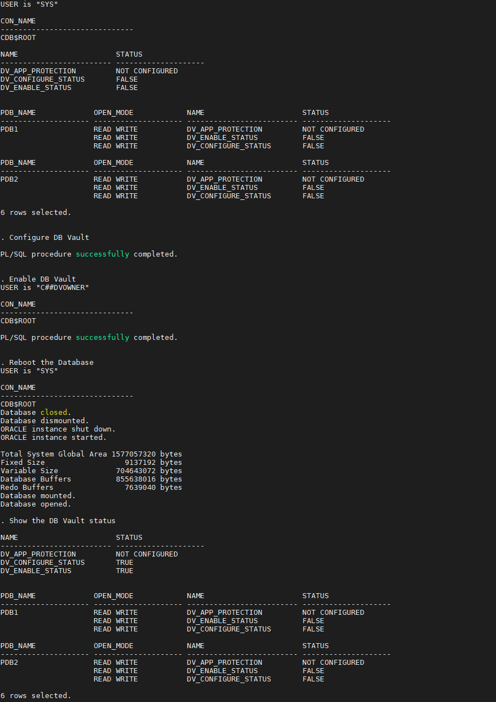

      **Note**: To enable DB Vault, database will be rebooted!

4. Next, enable it on the pluggable database. For now, just enable it on pdb1.

      ````
      <copy>./02_config_enable_dv_on_pdb.sh pdb1</copy>
      ````

   You should see a status like this:

   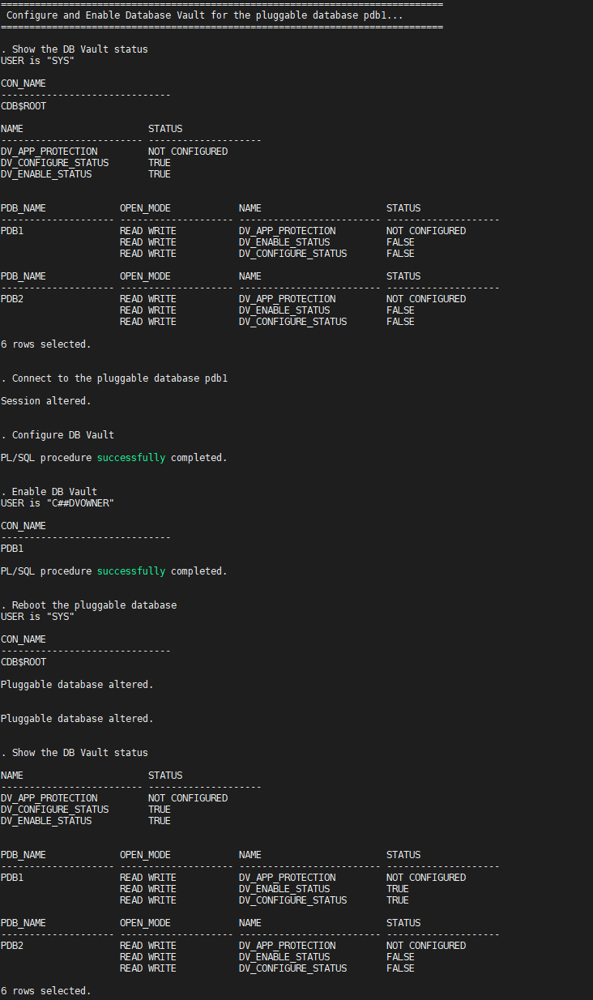

5. Now, Database Vault is enabled in the container database as well as `PDB1`!

## **STEP 2**: Create a Simple Realm

1. Open a web browser and launch the Glassfish app by navigating to this URL: `http://<YOUR_DBSEC-LAB_VM_PUBLIC_IP>:8080/hr_prod_pdb1`

2. Login to the application as `hradmin/Oracle123`

3. Click [**Search Employee**]

4. Click [**Search**]

5. Go back to your SSH session and go to the scripts directory

      ````
      <copy>cd $DBSEC_HOME/workshops/Database_Security_Labs/Database_Vault/Simple_Realm</copy>
      ````

6. Run the command to view the details about the Glassfish session

      ````
      <copy>./01_query_employee_data.sh</copy>
      ````

   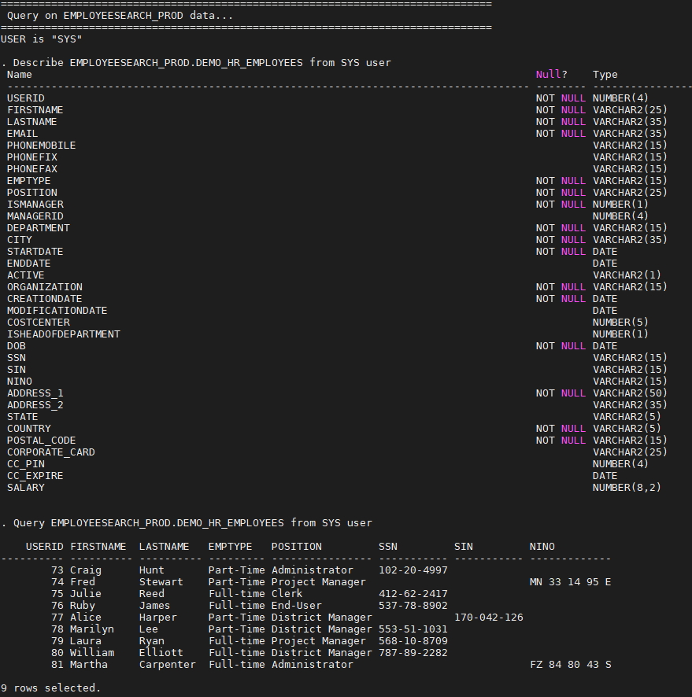

7. Now, create the Realm

      ````
      <copy>./02_create_realm.sh</copy>
      ````

   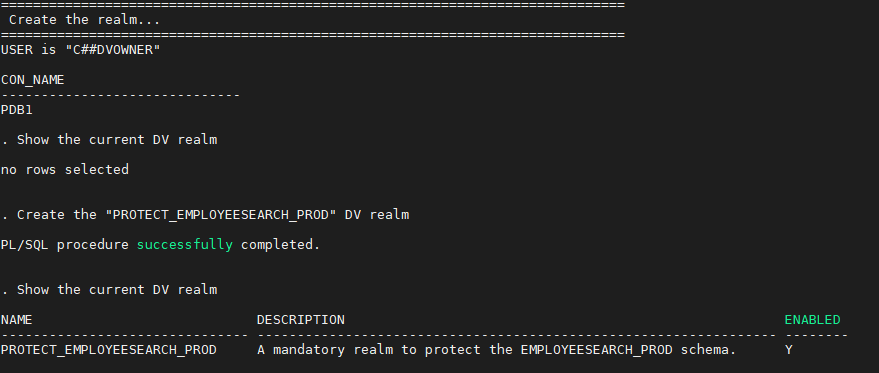

8. Add objects to the Realm to protect

      ````
      <copy>./03_add_objects_to_realm.sh</copy>
      ````

   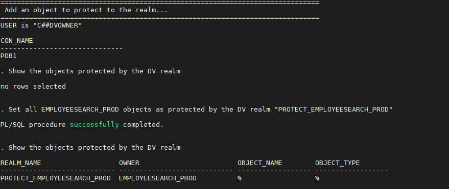

9. Make sure you have an authorized user in the realm. In this step, we will add `EMPLOYEESEARCH_PROD` as a realm authorized owner.

      ````
      <copy>./04_add_auth_to_realm.sh</copy>
      ````

   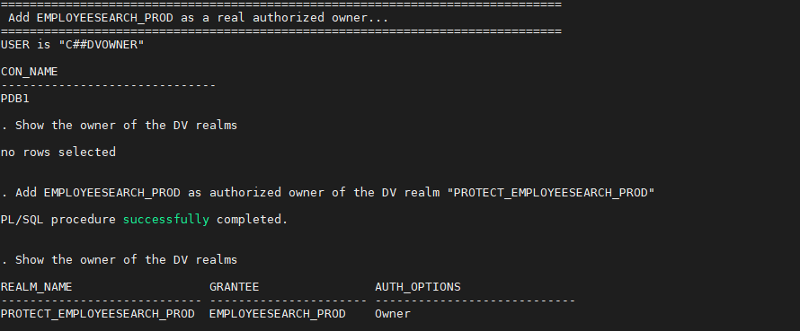

10. Re-execute the SQL query to show that SYS now receives the **insufficient privileges** error message

      ````
      <copy>./05_query_employee_data.sh</copy>
      ````

   

11. When you have completed this lab, you can drop the Realm

      ````
      <copy>./06_drop_realm.sh</copy>
      ````

## **STEP 3**: Create a Trusted Path / Multi-factor Authorization

1. Open a web browser and launch the Glassfish app by navigating to this URL: `http://<YOUR_DBSEC-LAB_VM_PUBLIC_IP>:8080/hr_prod_pdb1`

2. Login as `hradmin/Oracle123`

3. Click [**Search Employee**]

4. Click [**Search**]

5. Go back to your SSH session and go to the scripts directory

      ````
      <copy>cd $DBSEC_HOME/workshops/Database_Security_Labs/Database_Vault/Trusted_App_Path</copy>
      ````

6. Next, run this query to view the session information associated with the Glassfish application

      ````
      <copy>./01_query_employeesearch_usage.sh</copy>
      ````

   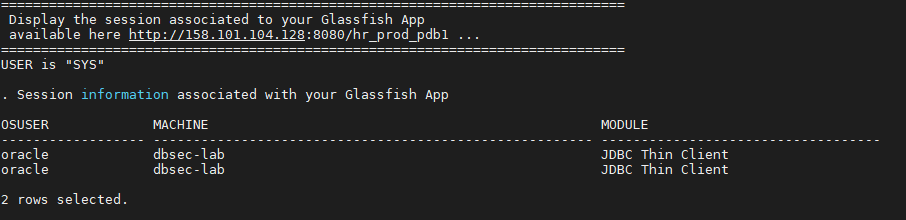

7. Now, query the `EMPLOYEESEARCH_PROD.DEMO_HR_EMPLOYEES` table as `SYS` to demonstrate it is accessible

      ````
      <copy>./02_query_employeesearch.sh</copy>
      ````

   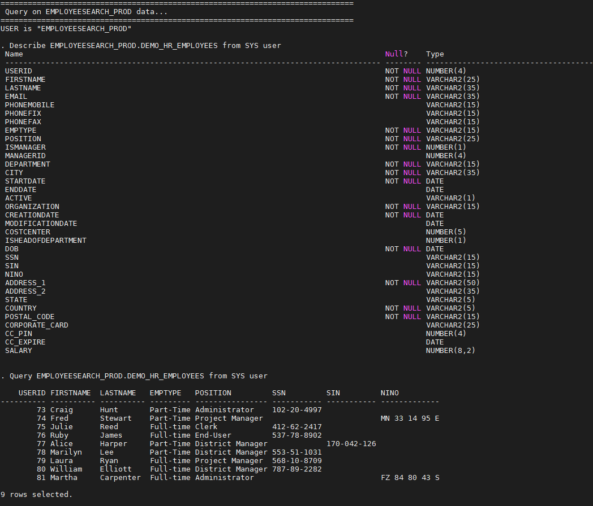

8. Begin protecting the application credentials by creating a Database Vault Rule

      ````
      <copy>./03_create_rule.sh</copy>
      ````

   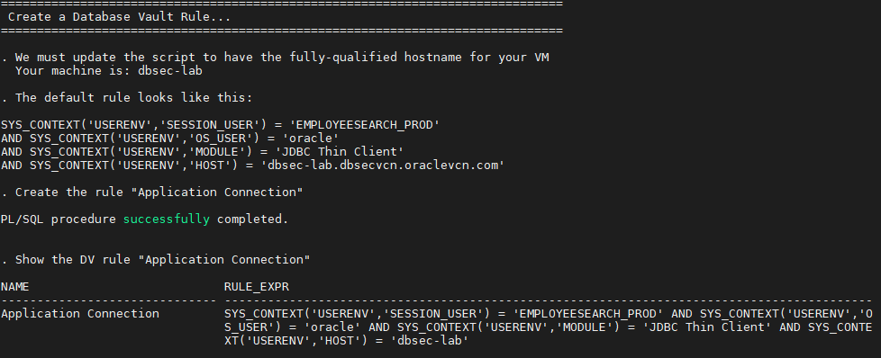

9. We use the Database Vault Rule by adding it to a DV Rule Set. You can have one or more rules in the rule set. If you have more than one, you can choose between the rule set evaluating all rules must be true or *any* rule must be true. Think of it like the difference between `IN` and `EXISTS` - `IN` includes all while `EXISTS` stops once it identifies one result matches

    ````
    <copy>./04_create_rule_set.sh</copy>
    ````

   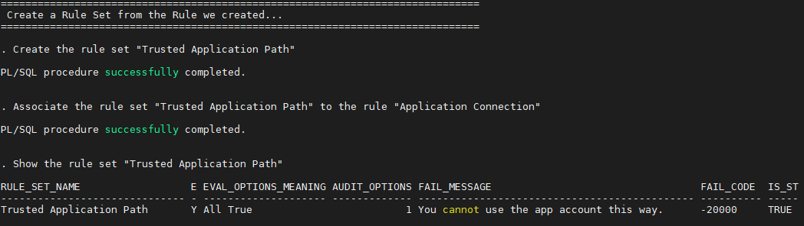

10. Create a Command Rule on Connect to protect the `EMPLOYEESEARCH_PROD` user. You can only `CONNECT` AS `EMPLOYEESEARCH_PROD` if you match the Rule Set we created

    ````
    <copy>./05_create_command_rule.sh</copy>
    ````

   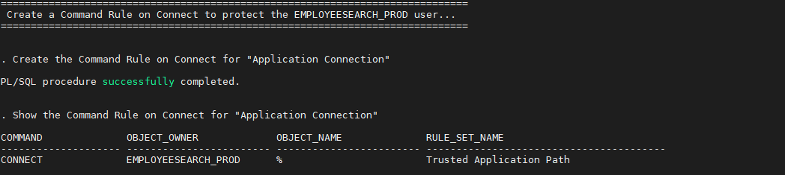

11. Go to your web browser and refresh a few times and run some queries by clicking [**Search**] and explore employee data

12. Go back to your terminal session and re-run our query of the application usage to verify that it still works.

    ````
    <copy>./06_query_employeesearch_usage.sh</copy>
    ````

   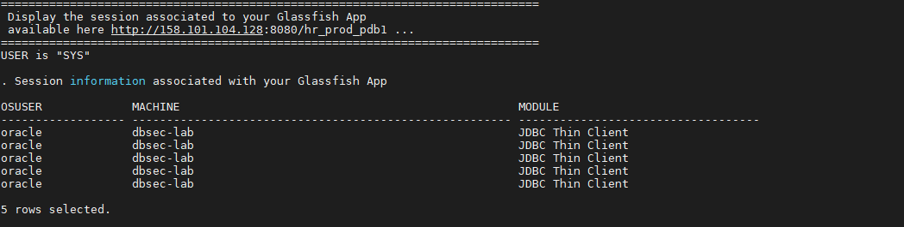

13. Now, try to query the `DEMO_HR_EMPLOYEES` table as `SYS`... You should be blocked!

    ````
    <copy>./07_query_employeesearch.sh</copy>
    ````

   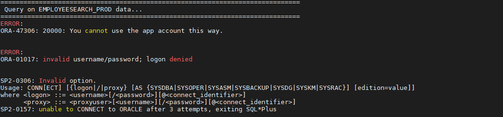

14. Once you have successfully completed the lab, you can delete the `Command Rule`, `Rule Set`, and `Rule` from Database Vault

    ````
    <copy>./08_delete_trusted_path.sh</copy>
    ````

   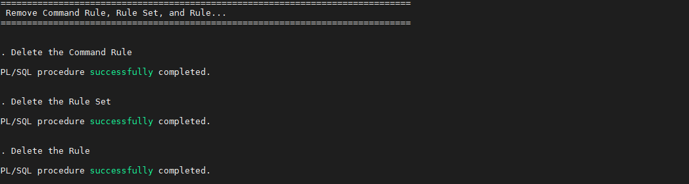

## **STEP 4**: Simulation Mode

1. Go to the scripts directory

      ````
      <copy>cd $DBSEC_HOME/workshops/Database_Security_Labs/Database_Vault/Simulation_Mode</copy>
      ````

2. First, query the simulation log to show that it has no current values

      ````
      <copy>./01_query_simulation_log.sh</copy>
      ````

   

3. Next, create a command rule that will simulate blocking all connections to the database. This is an easy way for us to identify who is connecting and where they are connecting from.

      ````
      <copy>./02_command_rule_sim_mode.sh</copy>
      ````

   

4. Execute a script to create some db connections and generate some log entries

      ````
      <copy>./03_run_queries.sh</copy>
      ````

   

5. Now, we query the simulation log again to see what new entries we have. Remember we created a command rule to simulate blocking user connections!

      ````
      <copy>./04_query_simulation_log.sh</copy>
      ````

   

   The log shows all the users who connected and would have been blocked by the rule. It also shows where they connected from and what client they used to connect

6. Run this script to get a list of distinct usernames

      ````
      <copy>./05_distinct_users_sim_log.sh</copy>
      ````

   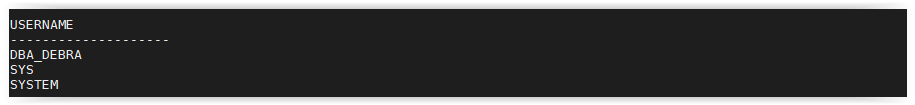

7. Although we only used Simulation mode on a `CONNECT` rule, we could have used this on a Realm to show what violations we would had

8. Before moving to the next lab, we will remove the command rule and clean out the log

      ````
      <copy>./06_purge_sim_log.sh</copy>
      ````

      ````
      <copy>./07_drop_command_rule.sh</copy>
      ````

## **STEP 5**: Ops Control

1. Go to the scripts directory

      ````
      <copy>cd $DBSEC_HOME/workshops/Database_Security_Labs/Database_Vault/Ops_Control</copy>
      ````

2. Check the status of Database Vault and Operations Control

      ````
      <copy>./01_query_dv_status.sh</copy>
      ````

   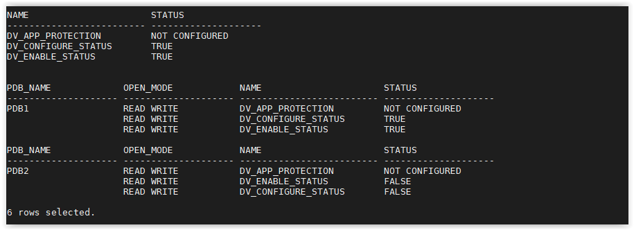

      **Note**: It is not yet configured!

3. Next, we will run the same queries as both container admin, `SAL` as well as `DBA_DEBRA`

      **Note**:
      - The query results are the same
      - The common user `SAL` has access to data in the PDB, just as the pdb admin has

      ````
      <copy>./02_query_w_pdb_debra.sh</copy>
      ````

   

      ````
      <copy>./03_query_with_sal.sh</copy>
      ````

   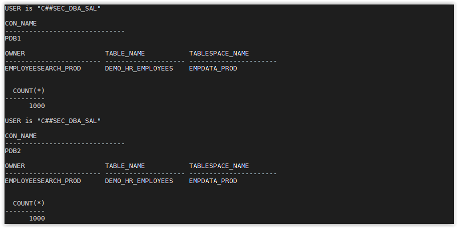

4. Enable Database Vault 19c Operations Control and run the queries again. Notice who can and who cannot query the `EMPLOYEESEARCH_PROD` schema data now. SAL should no longer be able to access data.

      ````
      <copy>./04_enable_ops_control.sh</copy>
      ````

   

      ````
      <copy>./05_query_dv_status.sh</copy>
      ````

   

      ````
      <copy>./06_query_w_pdb_debra.sh</copy>
      ````

   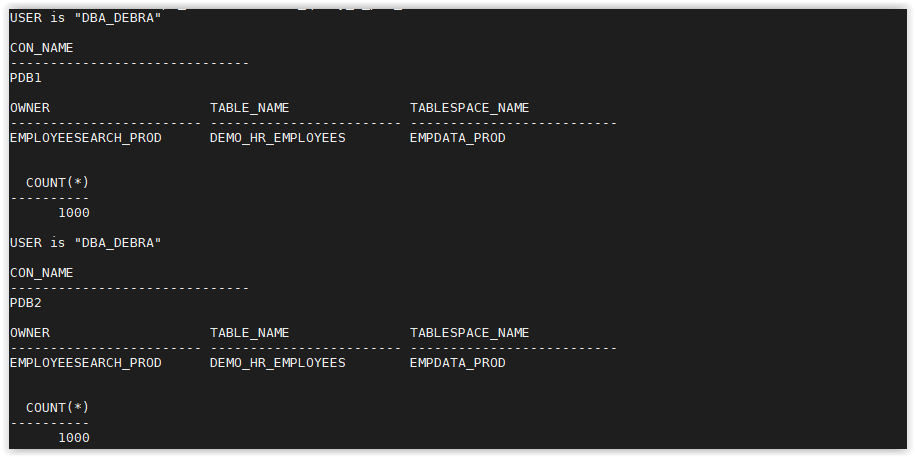

      ````
      <copy>./07_query_with_sal.sh</copy>
      ````

   


5. When you are have completed this lab, disable Ops Control

      ````
      <copy>./08_disable_ops_control.sh</copy>
      ````

   

## **STEP 6**: (Optional) Disabling Database Vault
**Attention: DO NOT run this lab if you want perfoming Oracle Label Security labs later!**

1. Go to the scripts directory

      ````
      <copy>cd $DBSEC_HOME/workshops/Database_Security_Labs/Database_Vault/Disable_Database_Vault</copy>
      ````

2. Disable the pluggable database `PDB1`

      ````
      <copy>./01_config_disable_dv_on_pdb.sh pdb1</copy>
      ````

   You should see a status like this:

   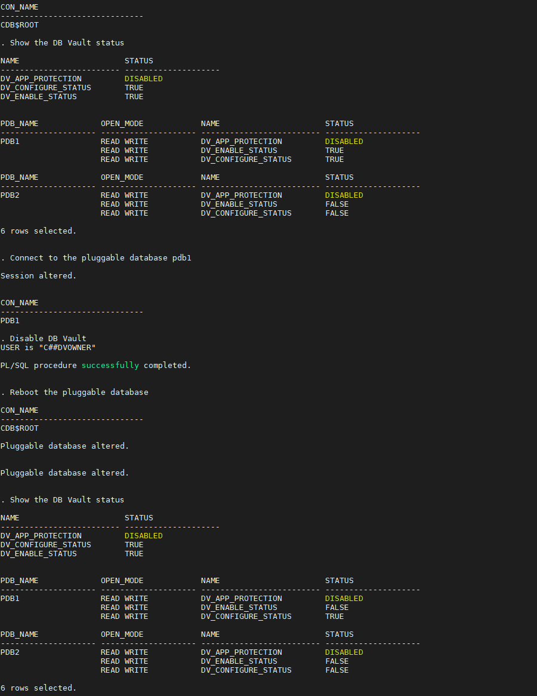

3. Now, Disable Database Vault in the container database

      ````
      <copy>./02_config_disable_dv_on_cdb.sh</copy>
      ````

   

      **Note**: To disable DB Vault, database will be rebooted!

4. Now, Database Vault is disabled in the container database as well as `PDB1`!

You may proceed to the next lab.

## **Appendix**: About the Product
### **Overview**
Oracle Database Vault provides controls to prevent unauthorized privileged users from accessing sensitive data and to prevent unauthorized database changes.

The Oracle Database Vault security controls protect application data from unauthorized access, and comply with privacy and regulatory requirements.

   

You can deploy controls to block privileged account access to application data and control sensitive operations inside the database using trusted path authorization.

Through the analysis of privileges and roles, you can increase the security of existing applications by using least privilege best practices.

Oracle Database Vault secures existing database environments transparently, eliminating costly and time consuming application changes.

Oracle Database Vault enables you to create a set of components to manage security for your database instance.

These components are as follows:

- **Realms**

A realm is a protection zone inside the database where database schemas, objects, and roles can be secured. For example, you can secure a set of schemas, objects, and roles that are related to accounting, sales, or human resources.
After you have secured these into a realm, you can use the realm to control the use of system and object privileges to specific accounts or roles. This enables you to provide fine-grained access controls for anyone who wants to use these schemas, objects, and roles.

- **Command rules**

A command rule is a special security policy that you can create to control how users can execute almost any SQL statement, including SELECT, ALTER SYSTEM, database definition language (DDL), and data manipulation language (DML) statements.
Command rules must work with rule sets to determine whether the statement is allowed.

- **Factors**

A factor is a named variable or attribute, such as a user location, database IP address, or session user, which Oracle Database Vault can recognize and use as a trusted path.
You can use factors in rules to control activities such as authorizing database accounts to connect to the database or the execution of a specific database command to restrict the visibility and manageability of data.
Each factor can have one or more identities. An identity is the actual value of a factor.
A factor can have several identities depending on the factor retrieval method or its identity mapping logic.

- **Rule sets**

A rule set is a collection of one or more rules that you can associate with a realm authorization, command rule, factor assignment, or secure application role.
The rule set evaluates to true or false based on the evaluation of each rule it contains and the evaluation type (All True or Any True).
The rule within a rule set is a PL/SQL expression that evaluates to true or false. You can have the same rule in multiple rule sets.

- **Secure application roles**

A secure application role is a special Oracle Database role that can be enabled based on the evaluation of an Oracle Database Vault rule set.

To augment these components, Oracle Database Vault provides a set of PL/SQL interfaces and packages.
In general, the first step you take is to create a realm composed of the database schemas or database objects that you want to secure.
You can further secure the realm by creating rules, command rules, factors, identities, rule sets, and secure application roles.
In addition, you can run reports on the activities these components monitor and protect.

### **Benefits of using Database Vault**
- Addresses compliance regulations to security awareness
- Protects privileged user accounts from many security breaches and data steal, both external and internal
- Helps you design flexible security policies for your database
- Addresses Database consolidation and cloud environments concerns to reduce cost and reduce exposure sensitive application data to those without a true need-to-know
- Works in a Multitenant Environment increasing security for consolidation

## Want to Learn More?
Technical Documentation:
  - [Oracle Database Vault 19c](https://docs.oracle.com/en/database/oracle/oracle-database/19/dvadm/introduction-to-oracle-database-vault.html#GUID-0C8AF1B2-6CE9-4408-BFB3-7B2C7F9E7284)

Video:
  - *Oracle Database Vault - Use Cases (Part1) (October 2019)* [](youtube:aW9YQT5IRmA)
  - *Oracle Database Vault - Use Cases (Part2) (November 2019)* [](youtube:hh-cX-ubCkY)


## Acknowledgements
- **Author** - Hakim Loumi, Database Security PM
- **Contributors** - Gian Sartor, Rene Fontcha
* **Last Updated By/Date** - Rene Fontcha, Master Principal Solutions Architect, NA Technology, October 2020

## Need Help?
Please submit feedback or ask for help using our [LiveLabs Support Forum](https://community.oracle.com/tech/developers/categories/livelabsdiscussions). Please click the **Log In** button and login using your Oracle Account. Click the **Ask A Question** button to the left to start a *New Discussion* or *Ask a Question*.  Please include your workshop name and lab name.  You can also include screenshots and attach files.  Engage directly with the author of the workshop.

If you do not have an Oracle Account, click [here](https://profile.oracle.com/myprofile/account/create-account.jspx) to create one.
