# Oracle Key Vault (OKV)

## Introduction
This workshop introduces the various features and functionality of Oracle Key Vault (OKV). It gives the user an opportunity to learn how to configure this appliance to manage keys.

*Estimated Lab Time:* 30 minutes

*Version tested in this lab:* Oracle OKV 18.4

### Video Preview
Watch a preview of "*Understanding Oracle Key Vault 18c (May 2019)*" [](youtube:1NVw0z6JEog)

### Objectives
- Connect an Oracle DB (encrypted by TDE) to OKV
- Manage with OKV the existing DB Wallet
- Migrate the DB Wallet and manage the Online Keys by OKV

### Prerequisites
This lab assumes you have:
- A Free Tier, Paid or LiveLabs Oracle Cloud account
- SSH Private Key to access the host via SSH
- You have completed:
    - Lab: Generate SSH Keys
    - Lab: Prepare Setup (Free Tier and Paid Oracle Cloud Accounts Only)
    - Lab: Environment Setup
    - Lab: Initialize Environment
    - Lab: Transparent Data Encryption (TDE)

### Lab Timing (estimated)

| Step No. | Feature | Approx. Time | Details |
|--|------------------------------------------------------------|-------------|--------------------|
| 1| Add an Endpoint | 10 minutes||
| 2| View the contents of the OKV Virtual Wallet | <5 minutes||
| 3| Perform Wallet Uploading | 10 minutes | To backup the Oracle Wallet into Oracle Key Vault |
| 4| Migrate to Online Master Key | 5 minutes | To re-configure the database to communicate directly with Oracle Key Vault |
| 5| Perform a ReKey operation | 5 minutes||

<!-- OKV Labs in progress
| 6| (Optional) Create a 2-node Multi-Master Cluster | 5 minutes||
| 7| Perform Wallet_Download | 5 minutes | To return master keys to an Oracle Wallet |
| 8| Create an External Keystore | 5 minutes | So the password to the OKV Endpoint is not known by the DBAs |
-->

## **STEP 1**: Add an Endpoint
First of all, we need Oracle Key Vault to know about our database server. We do this by creating it as an endpoint in OKV

1. Open a Web Browser at the URL `https://<OKV-VM_@IP-Public>`

2. Login to Oracle Key Vault Web Console as `RESTADMIN` with the password `T06tron.`

   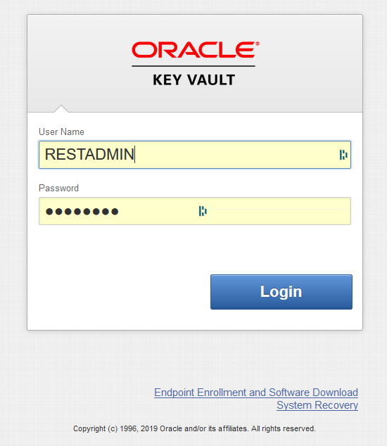

3. Click [**Endpoints**]

   

4. You will see that there are no endpoints available

   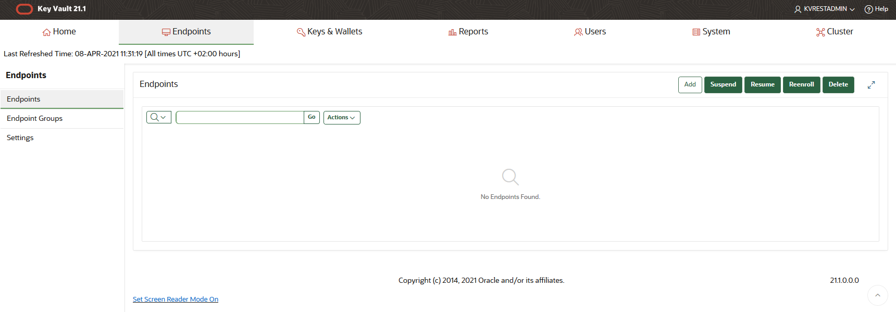

5. You will use the utility we have created, `OKVdeploy.tar`, to automate this process

    - Open a SSH session on your DBSec-Lab VM as Oracle User

          ````
        <copy>sudo su - oracle</copy>
          ````

    - Go to the scripts directory

          ````
        <copy>cd $DBSEC_HOME/workshops/Database_Security_Labs/Key_Vault/Add_Endpoint</copy>
          ````

    - Unpack the binary (file has been already downloaded into your VM by default)

          ````
        <copy>./01_unpack_restservice.sh</copy>
          ````

   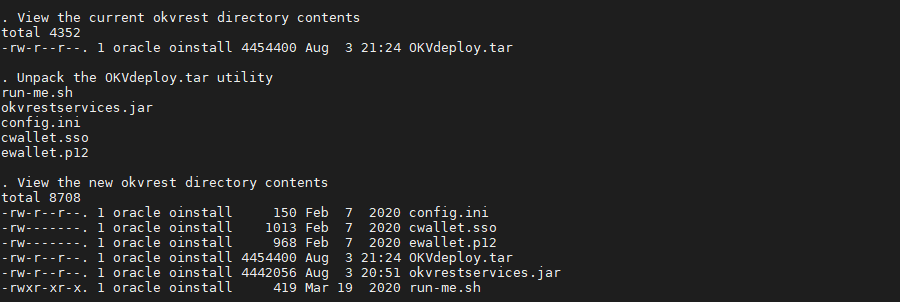

    - Check the OKV Server config

          ````
        <copy>./02_review_config.sh</copy>
          ````

   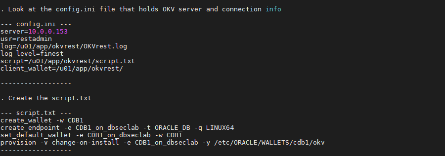

    - Add your `CDB1` database on DBSec-Lab VM as Endpoint

          ````
        <copy>./03_execute_scripts.sh</copy>
          ````

   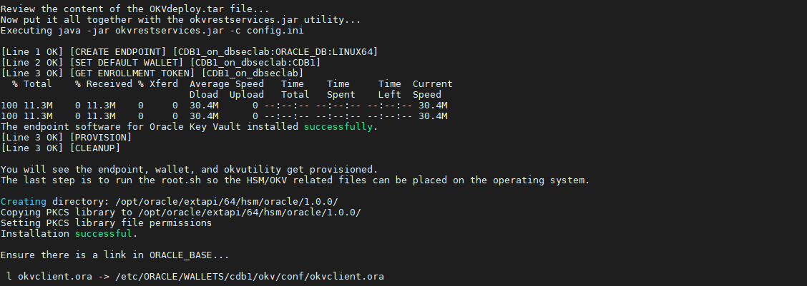

    - Before finishing, we want to change the endpoint password. This is the password the OKV endpoint client software uses to communicate with the Key Vault Server. Please modify default password `change-on-install` by `Oracle123`

          ````
        <copy>./04_change_endpoint_pw.sh</copy>
          ````

   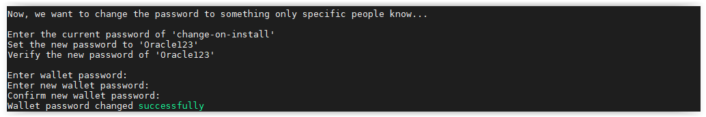

6. Go back to your OKV Console, refresh screen and now you should see the Endpoint just added

   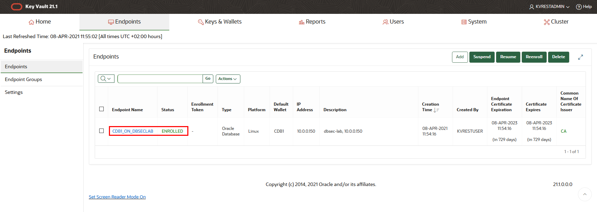

7. Click on the Endpoint name: here `CDB1_ON_DBSECLAB`

8. Confirm that the Wallet created in OKV is the default Wallet for this Endpoint (see the "Default" section)

   

**Your Endpoint is now added!**

## **STEP 2**: View the Contents of the OKV Virtual Wallet
Any time after adding the Endpoint to this host, you can run this script to view the contents of the Virtual Wallet in Oracle Key Vault

1. Go back to your terminal session on your DBSec-Lab VM (as `Oracle` User) and go to the scripts directory

      ````
    <copy>cd $DBSEC_HOME/workshops/Database_Security_Labs/Key_Vault/View_Wallet_in_Key_Vault</copy>
      ````

2. To view the contents run this script

      ````
    <copy>./01_view_wallet_in_kv.sh</copy>
      ````

   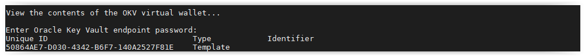

## **STEP 3**: Upload the Wallet

Typically, the first thing that users will do is upload their existing Oracle Wallets (ewallet.p12 files) to Oracle Key Vault

1. Go to the scripts directory

      ````
    <copy>cd $DBSEC_HOME/workshops/Database_Security_Labs/Key_Vault/Wallet_Upload</copy>
      ````

2. The first step is to look at the Wallet on the Operating System

      ````
    <copy>./01_view_wallet_on_os.sh</copy>
      ````

   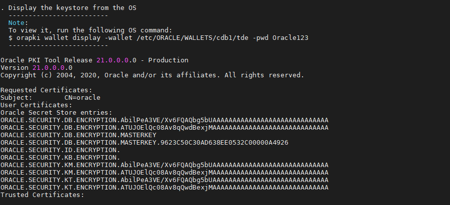

3. And within the database

      ````
    <copy>./02_view_wallet_in_db.sh</copy>
      ````

   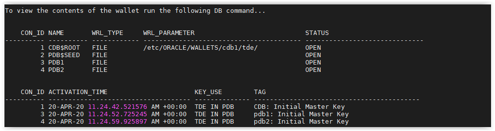

4. Then upload the wallet to Oracle Key Vault

      ````
    <copy>./03_upload_wallet.sh</copy>
      ````

   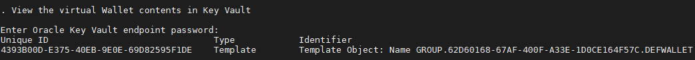

5. And after upload, view the contents in Key Vault

      ````
    <copy>./04_view_wallet_in_kv.sh</copy>
      ````

   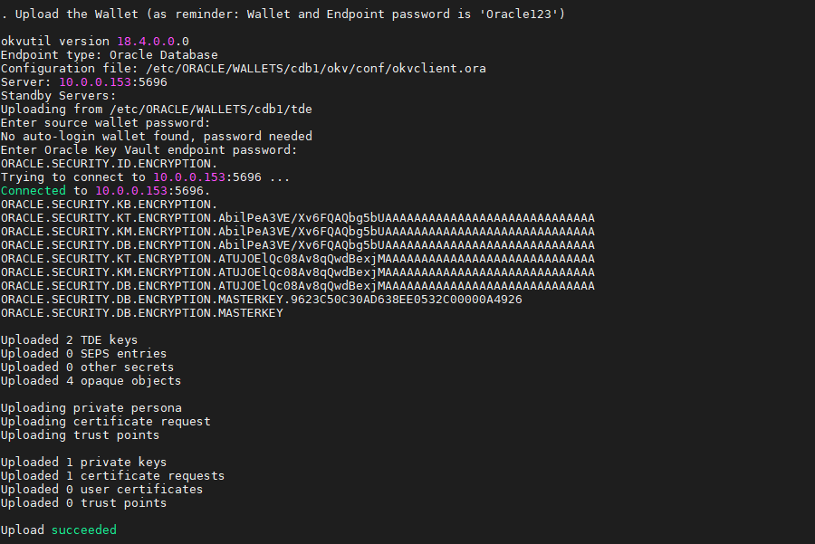

6. Now, let's go back to the OKV Web Console (as `RESTADMIN` User) to have a look of these information

7. Click on "**All Items**"

   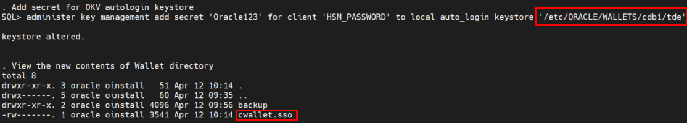

8. Filter by your EndPoint name: here `CDB1_ON_DBSECLAB`

   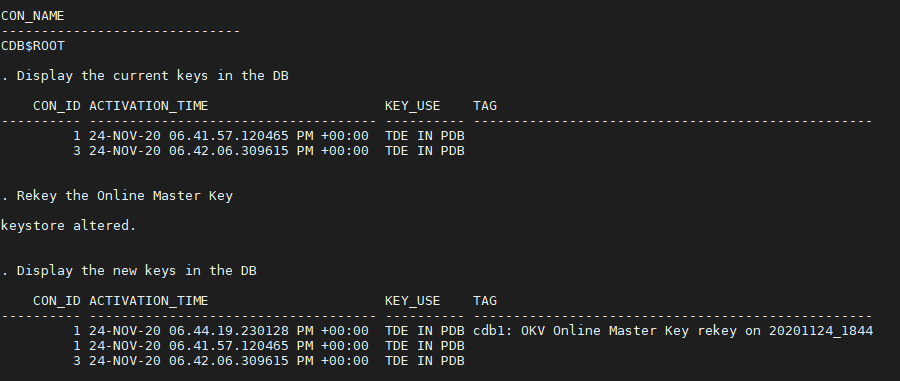

9. Click [**Go**]

10. Click [**Creation Time**] and sort **by Ascending**

   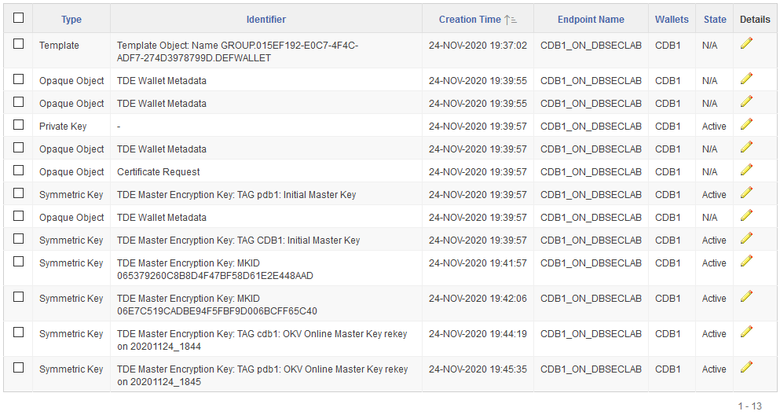

11. You can **see all your Wallet contents just uploaded**. It's exactly the same as what you can see from the script `04_view_wallet_in_kv.sh`

   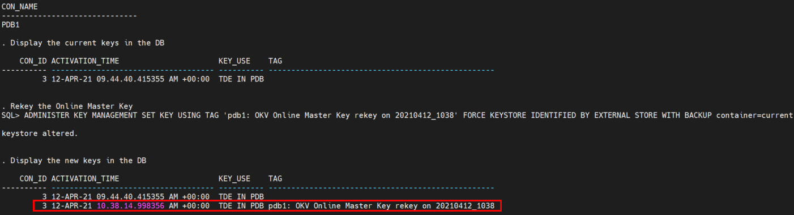

## **STEP 4**: Migrate to Online Master Key

Once we have uploaded the Oracle Wallet files into OKV Server, we can migrate from storing our Master Keys in Wallet files to querying them from Oracle Key Vault

1. Go to the scripts directory

      ````
    <copy>cd $DBSEC_HOME/workshops/Database_Security_Labs/Key_Vault/Migrate_to_Online_Master_Key</copy>
      ````

2. First, view the Wallet information on the Operating System...

      ````
    <copy>./01_view_wallet_on_os.sh</copy>
      ````

   

3. ..., in the database...

      ````
    <copy>./02_view_wallet_in_db.sh</copy>
      ````

   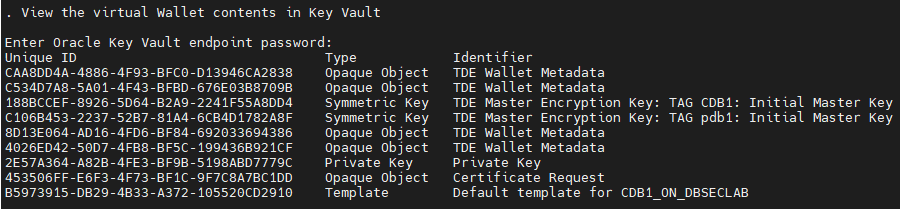

4. ..., and in Oracle Key Vault

      ````
    <copy>./03_view_wallet_in_kv.sh</copy>
      ````

   

5. Now that you are familiar with the contents and Oracle Key Vault, it's time to migrate to Online Master Key. In this step, we set the `tde_configuration` initialization parameters from `keystore_configuration=FILE` to `keystore_configuration=OKV|FILE`. This is a dynamic parameter so we do not need to restart the database.

      ````
    <copy>./04_migrate_to_kv.sh</copy>
      ````

   

6. Now, view the contents of the Wallet in the database. You will now see rows in `v$encryption_wallet` for `OKV`

      ````
    <copy>./05_view_wallet_in_db.sh</copy>
      ````

   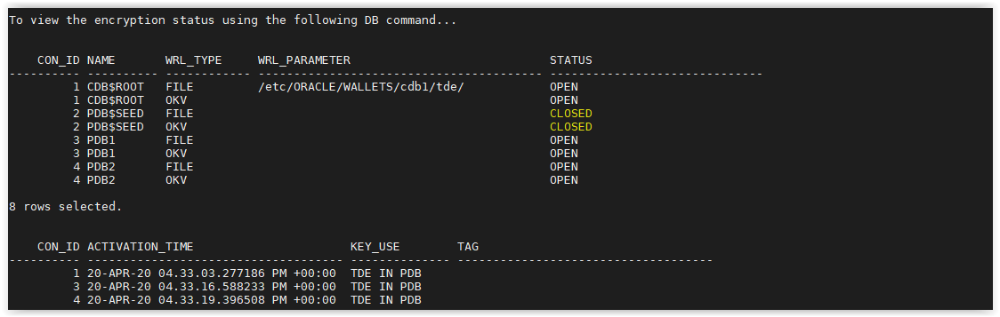

7. Then put the password in the `tde_seps` Wallet. This will allow the database to automatically access the master key in Oracle Key Vault

      ````
    <copy>./06_add_kv_password_to_seps.sh</copy>
      ````

   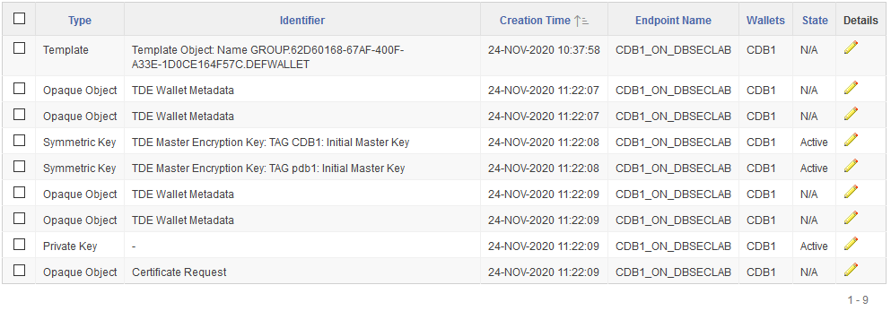

8. Once we are comfortable, we can delete the existing Wallet files in `WALLET_ROOT/tde`, which you can access using `echo $WALLET_DIR/tde`. To be safe, we will make a temporary backup directory into `$WALLET_DIR/tde/backup`and move the wallet-related files to it. If you want to actually delete it after you have verified everything was successful you can.

      ````
    <copy>./07_delete_wallet_files.sh</copy>
      ````

   

9. Finish the `tde_seps` Wallet and view the OS and Key Vault related wallet files

      ````
    <copy>./08_setup_external_store.sh</copy>
      ````

   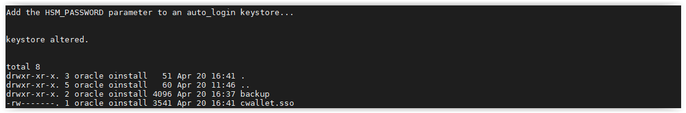

      ````
    <copy>./09_view_wallet_in_db.sh</copy>
      ````

   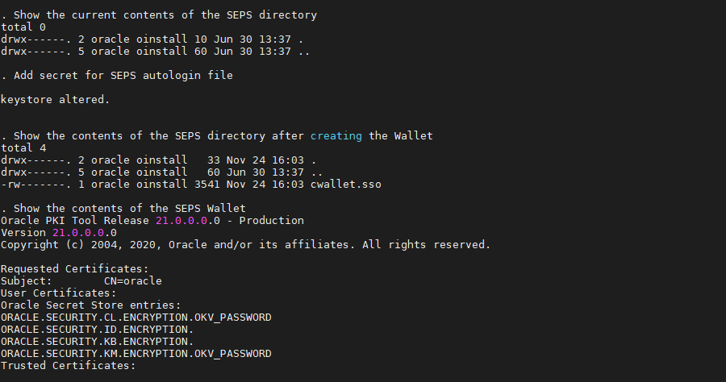

      ````
    <copy>./10_view_wallet_in_kv.sh</copy>
      ````

   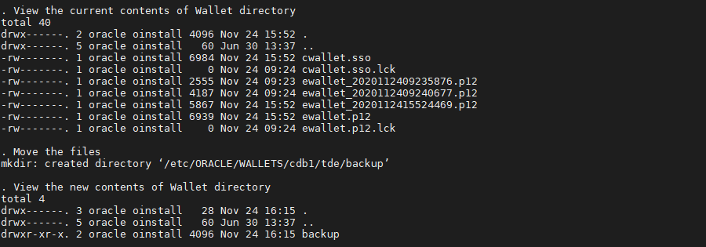

10. Now, let's go back to the OKV Web Console (as `RESTADMIN` User) to have a look of these information

11. Click on "**All Items**"

   

12. Filter by your EndPoint name: here `CDB1_ON_DBSECLAB`

   

13. Click [**Go**]

14. Sort by Ascending

   

15. You can see all your Wallet contents just migrated. It's exactly the same as what you can see from the script `10_view_wallet_in_kv.sh`

   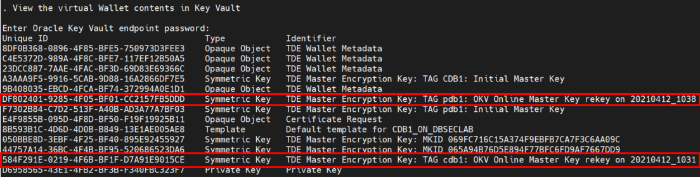

## **STEP 5**: Perform Rekey Operation

You must create a master key for the container database before continuing. Each pluggable database must have their own master key as well (except for PDB$SEED)

1. Go to the scripts directory

      ````
    <copy>cd $DBSEC_HOME/workshops/Database_Security_Labs/Key_Vault/Perform_Rekey</copy>
      ````

2. Rekey the container database TDE Master Key

      ````
    <copy>./01_online_cdb_rekey.sh</copy>
      ````

   

3. Rekey a Master Key for the pluggable database `PDB1`

      ````
    <copy>./02_online_pdb_rekey.sh pdb1</copy>
      ````

   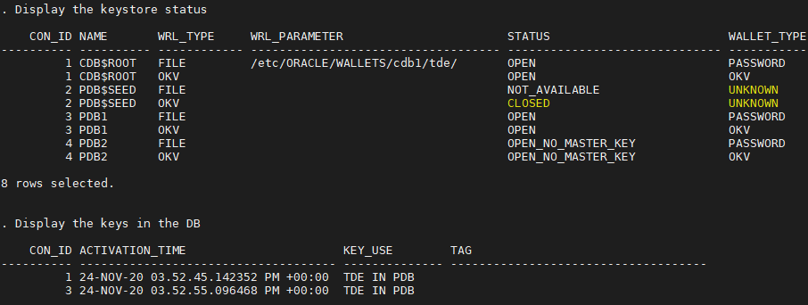

4. If you want, you can do the same for `PDB2`. This is not a requirement though but it might be helpful to show some databases with TDE and some without!

      ````
    <copy>./02_online_pdb_rekey.sh pdb2</copy>
      ````

   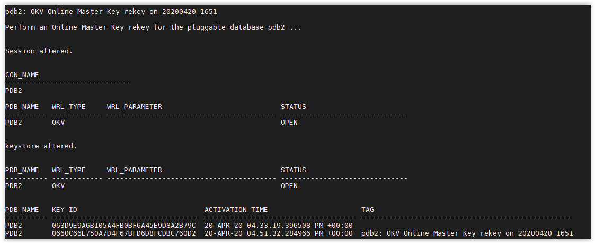

5. Now, let's go back to the OKV Web Console (as `RESTADMIN` User) to have a look of these information

6. Click on "**All Items**"

   

7. Filter by your EndPoint name: here `CDB1_ON_DBSECLAB`

   

8. Click [**Go**]

9. Sort by Ascending

   

10. You can see at the bottom your rekeyed Master Keys for CDB1, PDB1 (and PDB2 if you did it)

   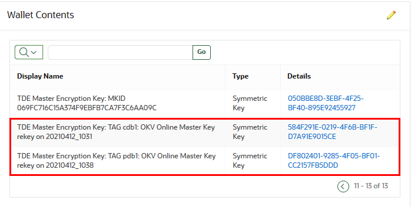

**Now you have rekeyed the Master Key** for the container and pluggable database(s)!

<!--
**STEP 6**: (Optional) Create a 2-node Multi-Master Cluster
Oracle provides deployment recommendations for deployments that have two or more nodes.

- **2-Node Deployment Recommendations**

    - Use a 2-node deployments for the following situations
        - Non-critical environments, such as test and development
        - Simple deployment of read-write pairs with both nodes active, replacing classic primary-standby
        - Single data center environments

    - Considerations for a two-node deployment
        - Availability is provided by multiple nodes
        - Maintenance will require down time
        - Good network connectivity between data centers is mandatory

- **3-Node Deployment Recommendations**

    - Use a 3-node deployment for the following situations
        - Single data center environments with minimal downtime requirement
        - Single read-write pair with additional read-only node to handle load
        - One read-only node is available for zero downtime during maintenance

    - Considerations for a three-node deployment
        - Take regular backups to remove destinations for disaster recovery

- **4 or More Node Deployment Recommendations**

    - Use a deployment of four or more nodes for the the following situations
        - Large data centers distributed across geographical locations
        - Deployment of read-write pairs with pair members spanning geography

    - Considerations for a large deployment
        - Availability is provided by multiple nodes
        - Additional read-only nodes can be used to handle load
        - Good network connectivity between data centers is mandatory


 **STEP 7**: (Optional) Perform  Wallet Download to return master keys to an Oracle Wallet. This does not disable the Online Master Key mode


 **STEP 8**: (Additionally) Create an External Store so the password to the OKV Endpoint is not known by the DBAs
-->

You may now proceed to the next lab.

## **Appendix**: About the Product
### **Overview**

Oracle Key Vault is a full-stack, security-hardened software appliance built to centralize the management of keys and security objects within the enterprise.

Oracle Key Vault is a robust, secure, and standards-compliant key management platform, where you can store, manage, and share your security objects.

   

Security objects that you can manage with Oracle Key Vault include as encryption keys, Oracle wallets, Java keystores (JKS), Java Cryptography Extension keystores (JCEKS), and credential files.

Oracle Key Vault centralizes encryption key storage across your organization quickly and efficiently. Built on Oracle Linux, Oracle Database, Oracle Database security features like Oracle Transparent Data Encryption, Oracle Database Vault, Oracle Virtual Private Database, and Oracle GoldenGate technology, Oracle Key Vault's centralized, highly available, and scalable security solution helps to overcome the biggest key-management challenges facing organizations today. With Oracle Key Vault you can retain, back up, and restore your security objects, prevent their accidental loss, and manage their lifecycle in a protected environment.

Oracle Key Vault is optimized for the Oracle Stack (database, middleware, systems), and Advanced Security Transparent Data Encryption (TDE). In addition, it complies with the industry standard OASIS Key Management Interoperability Protocol (KMIP) for compatibility with KMIP-based clients.

You can use Oracle Key Vault to manage a variety of other endpoints, such as MySQL TDE encryption keys.

Starting with Oracle Key Vault release 18.1, a new multi-master cluster mode of operation is available to provide increased availability and support geographic distribution.

The multi-master cluster nodes provide high availability, disaster recovery, load distribution, and geographic distribution to an Oracle Key Vault environment.

An Oracle Key Vault multi-master cluster provides a mechanism to create pairs of Oracle Key Vault nodes for maximum availability and reliability.

   

Oracle Key Vault supports two types of mode for cluster nodes: read-only restricted mode or read-write mode.

- **Read-only restricted mode**

  In this mode, only non-critical data can be updated or added to the node. Critical data can be updated or added only through replication in this mode. There are two situations in which a node is in read-only restricted mode:
    - A node is read-only and does not yet have a read-write peer.
    - A node is part of a read-write pair but there has been a breakdown in communication with its read-write peer or if there is a node failure. When one of the two nodes is non-operational, then the remaining node is set to be in the read-only restricted mode. When a read-write node is again able to communicate with its read-write peer, then the node reverts back to read-write mode from read-only restricted mode.

- **Read-write mode**

This mode enables both critical and non-critical information to be written to a node. A read-write node should always operate in the read-write mode.

You can add read-only Oracle Key Vault nodes to the cluster to provide even greater availability to endpoints that need Oracle wallets, encryption keys, Java keystores, certificates, credential files, and other objects.

An Oracle Key Vault multi-master cluster is an interconnected group of Oracle Key Vault nodes. Each node in the cluster is automatically configured to connect with all the other nodes, in a fully connected network. The nodes can be geographically distributed and Oracle Key Vault endpoints interact with any node in the cluster.

This configuration replicates data to all other nodes, reducing risk of data loss. To prevent data loss, you must configure pairs of nodes called read-write pairs to enable bi-directional synchronous replication. This configuration enables an update to one node to be replicated to the other node, and verifies this on the other node, before the update is considered successful. Critical data can only be added or updated within the read-write pairs. All added or updated data is asynchronously replicated to the rest of the cluster.

After you have completed the upgrade process, every node in the Oracle Key Vault cluster must be at Oracle Key Vault release 18.1 or later, and within one release update of all other nodes. Any new Oracle Key Vault server that is to join the cluster must be at the same release level as the cluster.

The clocks on all the nodes of the cluster must be synchronized. Consequently, all nodes of the cluster must have the Network Time Protocol (NTP) settings enabled.

Every node in the cluster can serve endpoints actively and independently while maintaining an identical dataset through continuous replication across the cluster. The smallest possible configuration is a 2-node cluster, and the largest configuration can have up to 16 nodes with several pairs spread across several data centers.

### **Benefits of Using Oracle Key Vault**
- Oracle Key Vault helps you to fight security threats, centralize key storage, and centralize key lifecycle management
- Deploying Oracle Key Vault in your organization will help you accomplish the following:
- Manage the lifecycle for endpoint security objects and keys, which includes key creation, rotation, deactivation, and removal
- Prevent the loss of keys and wallets due to forgotten passwords or accidental deletion
- Share keys securely between authorized endpoints across the organization
- Enroll and provision endpoints easily using a single software package that contains all the necessary binaries, configuration files, and endpoint certificates for mutually authenticated connections between endpoints and Oracle Key Vault
- Work with other Oracle products and features in addition to Transparent Data Encryption (TDE), such as Oracle Real Application Clusters (Oracle RAC), Oracle Data Guard, pluggable databases, and Oracle GoldenGate. Oracle Key Vault facilitates the movement of encrypted data using Oracle Data Pump and transportable tablespaces, a key feature of Oracle Database
- Oracle Key Vault multi-master cluster provides additional benefits, such as:
- Maximum key availability by providing multiple Oracle Key Vault nodes from which data may be retrived
- Zero endpoint downtime during Oracle Key Vault multi-master cluster maintenance

## Want to Learn More?
Technical Documentation:
- [Oracle Key Vault 18c](https://docs.oracle.com/en/database/oracle/key-vault/18.4/index.html)
- [Oracle Key Vault 18c - Multimaster](https://docs.oracle.com/en/database/oracle/key-vault/18.4/okvag/multimaster_concepts.html#GUID-E1A92D83-760F-470F-877F-D769169C6ABC)

## Acknowledgements
- **Author** - Hakim Loumi, Database Security PM
- **Contributors** - Peter Wahl, Gian Sartor, Rene Fontcha
* **Last Updated By/Date** - Rene Fontcha, Master Principal Solutions Architect, NA Technology, October 2020

## Need Help?
Please submit feedback or ask for help using our [LiveLabs Support Forum](https://community.oracle.com/tech/developers/categories/livelabsdiscussions). Please click the **Log In** button and login using your Oracle Account. Click the **Ask A Question** button to the left to start a *New Discussion* or *Ask a Question*.  Please include your workshop name and lab name.  You can also include screenshots and attach files.  Engage directly with the author of the workshop.

If you do not have an Oracle Account, click [here](https://profile.oracle.com/myprofile/account/create-account.jspx) to create one.
