# Oracle Data Safe for on-premises database

## Introduction
This workshop introduces the various features and functionality of Oracle Data Safe. It gives the user an opportunity to learn how to register an on-premise Oracle Database with Oracle Data Safe, provision audit and alert policies on your database, analyze alerts and audit reports, assess the security of your database configurations and users, and discover and mask sensitive data.

*Estimated Lab Time:* 120 minutes

*Version tested in this lab:* Oracle Data Safe on OCI and Oracle DB 19.13

### Video Preview

Watch a preview of "*Introduction to Oracle Data Safe (September 2019)*" [](youtube:wU-M5BlU0po)

### Objectives
- Register an on-premise Oracle Database with Oracle Data Safe
- Provision audit and alert policies on your database using Oracle Data Safe
- Collect audit data and generate alerts using Oracle Data Safe
- Assess the security of your database configurations and users using Oracle Data Safe
- Discover and mask sensitive data using Oracle Data Safe

### Prerequisites
This lab assumes you have:
- A Free Tier, Paid or LiveLabs Oracle Cloud account
- You have completed:
    - Lab: Prepare Setup (*Free-tier* and *Paid Tenants* only)
    - Lab: Environment Setup
    - Lab: Initialize Environment

### Lab Timing (estimated)

| Step No. | Feature | Approx. Time |
|--|------------------------------------------------------------|-------------|
|01| Register an on-premise Oracle Database | 20 minutes|
|02| Provision audit and alert policies | 20 minutes|
|03| Collect audit data and generate alerts | 20 minutes|
|04| Assess the security of your database configurations and users | 20 minutes|
|05| Discover and mask sensitive data | 30 minutes|
|06| (Optional) Reset Oracle Data Safe configuration | <10 minutes|

## Task 1: Register an on-premise Oracle Database

To use a database with Oracle Data Safe, you first need to register it with Oracle Data Safe

1. Open a web browser window to your OCI console and login with your OCI account

2. On the Burger menu, click on **Oracle Database**

    
 
3. Then, click on "**Data Safe**"

    

4. On **Connectivity Options** sub-menu, click  on **On-Premises Connectors**

    

5. Click [**Create On-Premises Connectors**]

    

6. Select your Compartment and fill out as following

    - Name: `<Your On-Premises Connectors Name>` (here "*`DBSec-Livelab_DBs`*")
    - Decription: *`On-Premises connector for DBSec Livelabs databases`*

       

7. Click [**Create On-Premises Connectors**]

8. Once is created, the On-Premises connector is "**INACTIVE**"

       

9. Now, let's active it

    - Click [**Download install Bundle**] to download the zip file onto your local machine and enter a password (here *`Oracle12345!`*)

        ````
        <copy>Oracle12345!</copy>
        ````

       

    - OCI Data Safe will generate a unique On-Premises connector and it can take up to one minute

       

    - Once is generated, select **Save File** and click [**OK**] to download it into your local machine

       

    - Browse the location where you want to store the zip file and click [**Save**]

        **Note**: The file name proposed a default value (here "*`DBSec-Livelab_DBs.zip`*"), please keep going with it

    - Now, upload the zip file downloaded into your DBSecLab VM to *`home/opc`*

    - Setup the Data Safe On-Premises connector

        - Open a Terminal session on your **DBSec-Lab** VM as OS user *oracle*

            ````
            <copy>sudo su - oracle</copy>
            ````

            **Note**: If you are using a remote desktop session, double-click on the *Terminal* icon on the desktop to launch a session

        - Copy Data Safe on-premises connector uploaded to your Data Safe directory (here *`$DS_HOME`*)

            ````
            <copy>
            sudo mv /home/opc/DBSec-Livelab_DBs.zip $DS_HOME
            sudo chown -R oracle:oinstall $DS_HOME
            sudo chmod -R 775 $DS_HOME
            </copy>
            ````

               

        - Install Data Safe On-Premises connector (enter the password defined for the zip file above - here *`Oracle12345!`*)

            ````
            <copy>
            cd $DS_HOME
            unzip DBSec-Livelab_DBs.zip
            python setup.py install --connector-port=1560
            </copy>
            ````

            ````
            <copy>Oracle12345!</copy>
            ````

               

            **Note**: In case of trouble, you can stop or start the Data Safe On-Premises connector with the following command lines:

            ````
            <copy>
            python $DS_HOME/setup.py stop
            python $DS_HOME/setup.py start
            </copy>
            ````

    - Go back to the Data Safe console to verify the status of the Data Safe On-Premises connector

        

        **Note**: It sould be "**ACTIVE**" now!

10. Go back to your terminal session to create the Data Safe **DS_ADMIN** user on `pdb1`

    ````
    <copy>
    cd $DBSEC_LABS/data-safe
    ./ds_create_user.sh pdb1
    </copy>
    ````

    

11. On Data Safe Console, register the Target database **pdb1**

    - Click on the **On-Premises Connectors** link
    
    
    
    - Click on **Target Databases** sub-menu

    

    - Click [**Register Database**]

    

    - Fill out the "Register Target Database" as following

        - Database Type: Select *`Oracle On-Premises Database`*
        - Data Safe Target Display Name: *`DBSec_Livelabs_pdb1`*
        - Description: *`On-Premises pluggable database of DBSeclab VM (pdb1)`*
        - Compartment: Select your own Compartment

            

        - Choose a connectivity option: *`On-Premises Connector`*
        - Select On-Premises Connector: Select *`DBSec-Livelab_DBs`*
        - TCP/TLS: *`TCP`*
        - Database Service Name: *`pdb1`*
        - Database IP Address: *`10.0.0.150`*
        - Database Port Number: *`1521`*
        - Database User Name: *`DS_ADMIN`* (in uppercase)
        - Database Password: *`Oracle123`*
    
            

    - Click [**Register**] to launch the registration process

        

    - Once is created, the new target should be "**ACTIVE**"

        

        **Note:**
        - On the **Target Database Details** tab, you can view the target database name and description, OCID, when the target database was registered and the compartment to where the target database was registered.
        - You can also view connection information, such as database type, database service name, and connection protocol (TCP or TLS). The connection information varies depending on the target database type.
        - The **Target Database Details** page provides options to edit the target database name and description, edit connection details, update the Oracle Data Safe service account and password on the target database (applicable to non-Autonomous Databases), and download a SQL privilege script that enables features on your target database.
        - From the **More Actions** menu, you can choose to move the target database to a different compartment, add tags, deactivate your target database, and deregister your target database.

12. Click on the **Target Databases** link to view the list of registered target databases to which you have access

    

    **Note:** All your registered target databases are listed on the right

    

13. Let's have a look on a quick overview of the **Security Center**

    - Click on **Security Center** sub-menu

        

        **Note**:
        - Make sure your compartment is still selected under **List Scope**
        - In Security Center, you can access the five main features of Oracle Data Safe, including Security Assessment, User Assessment, Data Discovery, Data Masking, and Activity Auditing
        - The Security Assessment and User Assessment features are now native in Oracle Cloud Infrastructure
        - The Data Discovery, Data Masking, and Activity Auditing features as well as the dashboard are available through the Oracle Data Safe Console

    - By default, the Security Assessment page is displayed and show you an overview of all risks for ALL your targets
        
        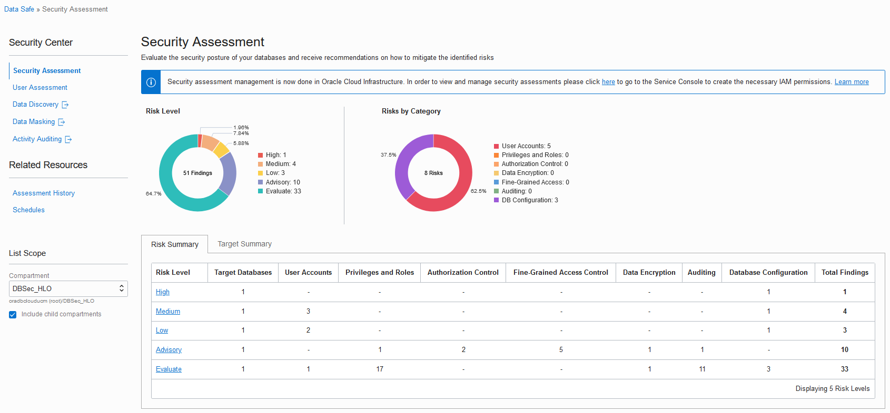

    - By selecting the **Target Summary** tab, you'll see the risks by target

        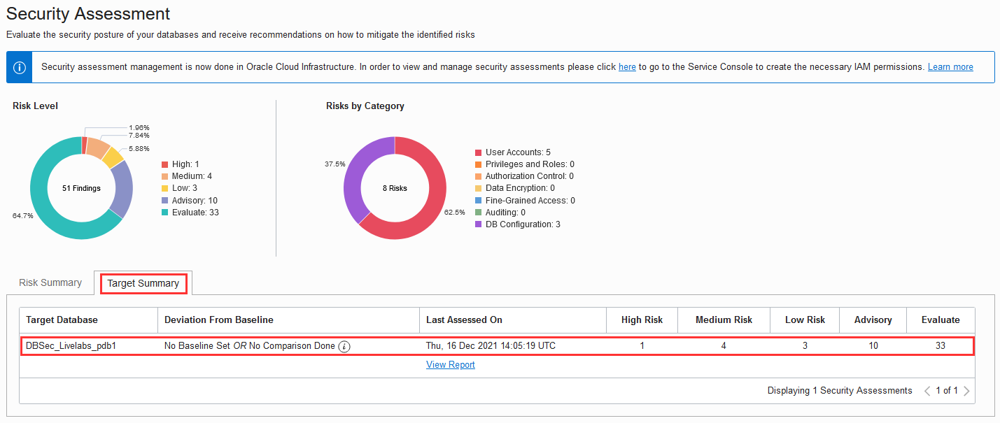

    - Click **Activity Auditing** sub-menuu

        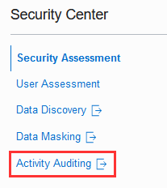

        **Note**: A new tab is opened because Activity Auditing is still part of the former Oracle Data Safe Console and will be migrated in the next year

        

    - To view the dashboard, click the **Home** tab

        

    - At the top of the page, new features with links to documentation and product announcements are listed

        

    - At the bottom of the page, the dashboard is a global overview of all your targets

        

    - Review the five tabs on the left side

        - These tabs let you navigate to each feature in Oracle Data Safe
        - The Security Assessment and User Assessment features are now available in the Oracle Cloud Infrastructure Console, therefore, if you click either tab, you are returned to Oracle Cloud Infrastructure
        - The Data Discovery, Data Masking, and Activity Auditing features are part of the Oracle Data Safe Console

            

    - Be familiar with each top tab and review the content on the page

        - The **Home** tab shows a dashboard
        - The **Targets** tab shows you a read-only list of registered target databases to which you have access
        - The **Library** tab lets you access repository resources, which are used for discovering and masking sensitive data. Resources include sensitive types, sensitive data models, masking formats, and masking policies
        - The **Reports** tab lets you access prebuilt and custom built reports for all Oracle Data Safe features
        - The **Alerts** tab shows you all open alerts for the past week, by default. If you need to view more alerts, you can remove the filters
        - The **Jobs** tab shows you all current, past, and scheduled jobs. Notice that you have two jobs started already - one for User Assessment and one for Security Assessment

            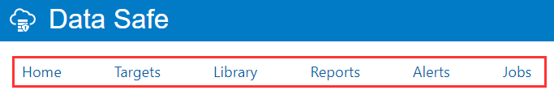

## Task 2: Provision audit and alert policies

With Oracle Data Safe, you can provision audit and alert policies on your target databases by using the Activity Auditing feature:
- An audit policy defines specific events to track in a target database. You can provision basic, administrator, user, and custom audit policies, as well as audit policies designed to help you meet compliance standards
- An alert is a message that notifies you when a particular audit event happens on a target database. The alerts generated depend on which alert policies you enabled for your database in Activity Auditing
- An audit trail is a database table that stores audit data. In Oracle Data Safe, audit data collection copies audit data from the database's audit trail into the Oracle Data Safe audit table

1. In Oracle Data Safe Console, click the **Home** tab

2. Then, click the **Activity Auditing** tab

3. Enter your database name (here *`DBSec_Livelabs_pdb1`*) into the filter box and click on the "**Search**" icon

    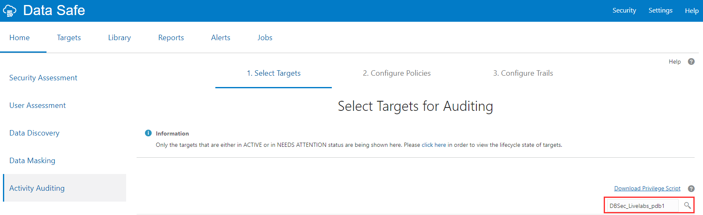

4. On the **Select Targets for Auditing** page, select the check box for your target database, and then click [**Continue**]

    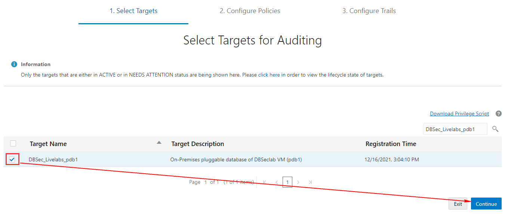

5. On the **Retrieve Audit Policies** page, select the check box for your target database, and then click [**Retrieve**] to retrieve the currently deployed audit policies from your database

    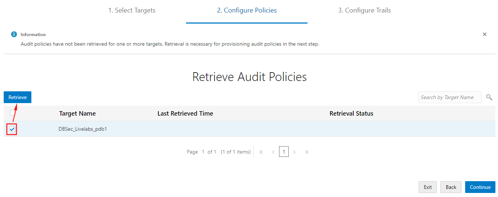

6. Wait until a green check mark is displayed in the **Retrieval Status** column

    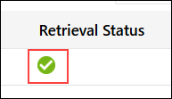

    **Note**: The check mark means that all of the audit policies are successfully retrieved

7. Then click [**Continue**]

    

8. On the **Review and Provision Audit and Alert Policies** page, review the types of audit policies already enabled on your target database

    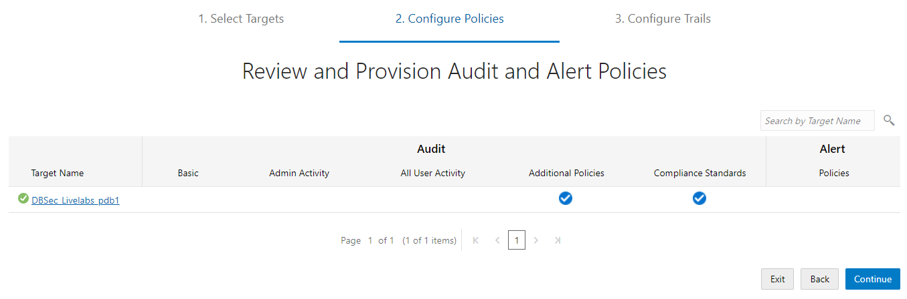

    **Note**:
    - The check mark under **Additional Policies** means that your target database has one or more predefined audit policies enabled on it
    - The check mark under **Compliance Standards** means that your target database has one or more compliance policies enabled on it; for example, the **Center for Internet Security (CIS) Configuration** audit policy
    - Currently, there are no basic, admin activity, or user activity audit policies provisioned on your target database, nor are there any alert policies

9. Click your target database name to provision more policies

    

10. Configure the policies

    - On the **Audit Policies** tab
    
        - Notice that the **Basic Auditing** and **Admin Activity Auditing** policies are selected to be provisioned
    
            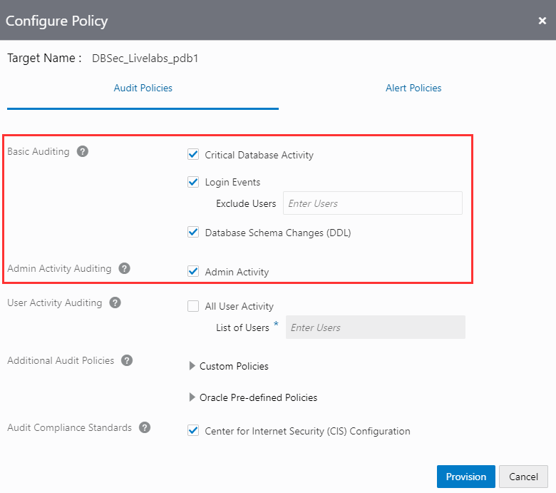
    
            **Note**: Oracle recommends that they be provisioned, so you can leave them selected!

        - Expand **Custom Policies** to view the list of custom policies on your target database

            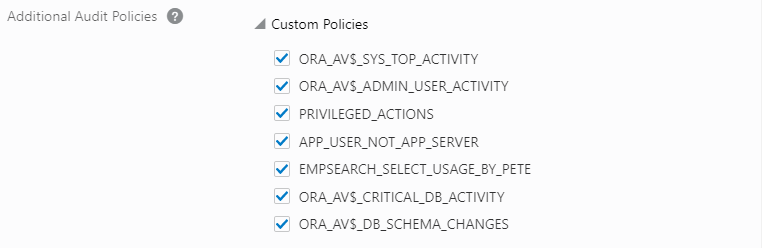

            **Note**: If a custom policy is selected, it means that it is already created and enabled on your target database

        - Expand **Oracle Pre-defined Policies** to view the list of Oracle predefined audit policies on your target database

            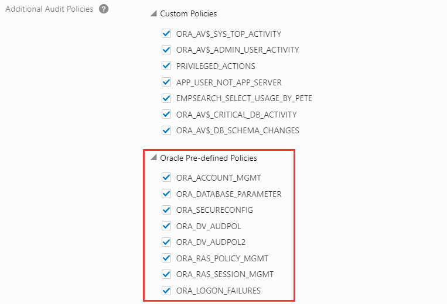

            **Note**:  By default, the following policies are provisioned on your database:
            - `ORA_ACCOUNT_MGMT`
            - `ORA_DATABASE_PARAMETER`
            - `ORA_SECURECONFIG`
            - `ORA_DV_AUDPOL`
            - `ORA_DV_AUDPOL2`
            - `ORA_RAS_POLICY_MGMT`
            - `ORA_RAS_SESSION_MGMT`
            - `ORA_LOGON_FAILURES`

        - Next to **Audit Compliance Standards**, notice that the **Center for Internet Security (CIS) Configuration** policy is created and enabled by default

            

    - Click the **Alert Policies** tab and review the alert policies selected to be provisioned

        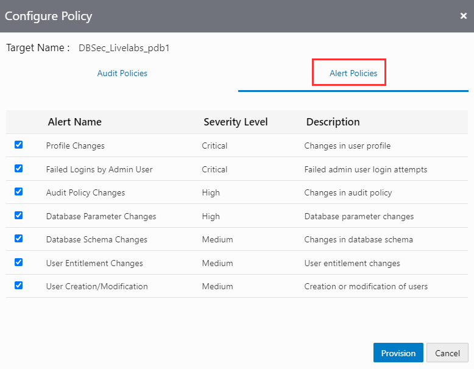

        **Note**:
        - Oracle recommends that you provision all of these alert policies
        - They are as follows:
            - `Profile Changes`
            - `Failed Logins by Admin User`
            - `Audit Policy Changes`
            - `Database Parameter Changes`
            - `Database Schema Changes`
            - `User Entitlement Changes`
            - `User Creation/Modification`

    - Click [**Provision**] to start provisioning the audit and alert policies on your target database

11. On the **Review and Provision Audit and Alert Policies** page, wait for check marks to appear under all audit policy types, except for **All User Activity**

    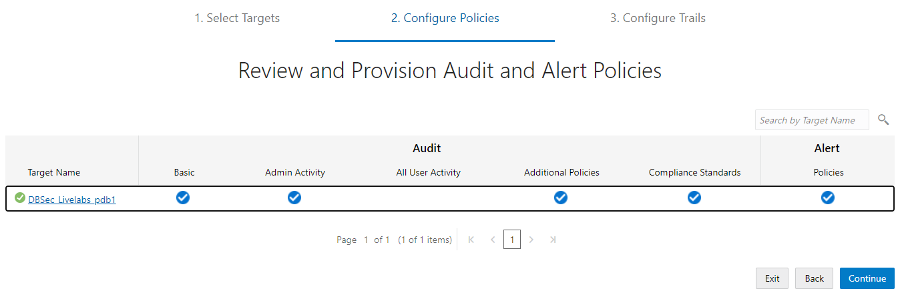

12. Then click [**Continue**]

13. On the **Start Audit Collection** page, observe the default values

    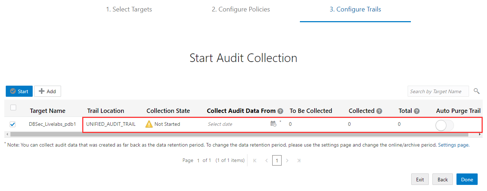

    **Note**:
    - The audit trail location is automatically set to `UNIFIED_AUDIT_TRAIL`
    - Audit collection is not yet started
    - The auto purge feature is not enabled by default (if you are signed in to Oracle Data Safe during a Free Trial, the auto purge option is not displayed)

14. You need to configure an "Audit Collection Start Date" in the **Collect Audit Data From** column

    - Click the calendar widget
    - Configure a start date of 12 months ago
    - Then click [**Done**]

        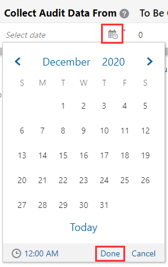

15. Wait for the **To Be Collected**, **Collected**, and **Total** columns to populate

    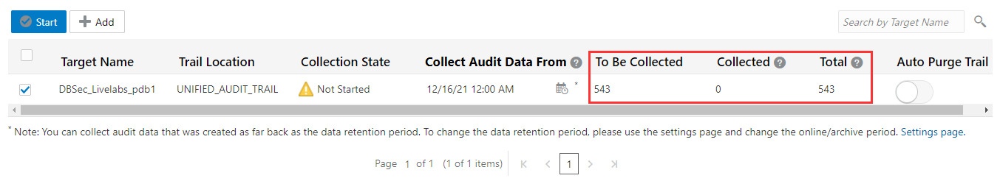

    **Note**:
    - Don't worry if your numbers are different than those shown in the screenshot below
    - The **To Be Collected** column shows you the number of records to be retrieved for the selected audit trail since the specified start date
    - The **Collected** column shows the number of audit records already collected for the current month for the target database (includes audit data collected from all the audit trails for the target database). This value helps you to determine whether you are going to exceed your monthly quota of one million records
    - The **Total** column totals the **To Be Collected** and **Collected** values for a target database. This value tells you the overall number of audit records you are going to collect for a target database for the current month

16. Click **Start** to start collecting audit data

    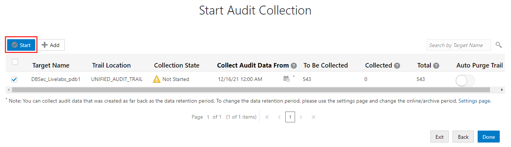

17. In the **Start Audit Collection** dialog box, click [**Start**] to confirm that you want to start the `UNIFIED_AUDIT_TRAIL`

    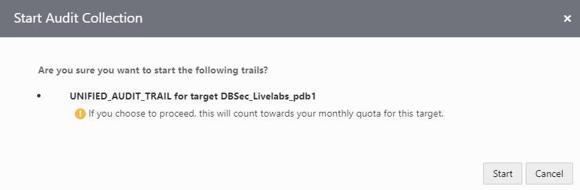

18. Wait for the message at the top of the page to state that `UNIFIED_AUDIT_TRAIL` is successfully created

    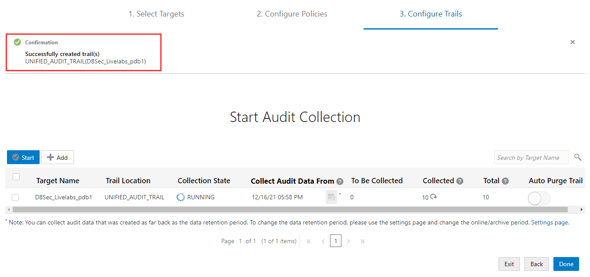

19. Click [**Done**]

    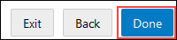

20. Notice that you are directed to the **Audit Trails** page, from where you can manage all of the audit trails for your target databases

    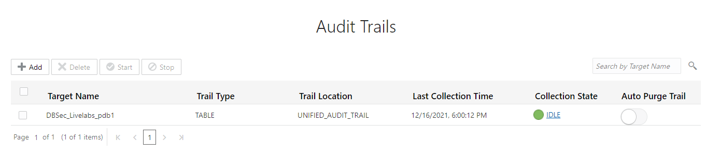

    **Note**: Observe that the **Collection State** column value changes from  `RUNNING` to `COLLECTING`, and then to `IDLE` (collection takes approximately 2 minutes)

21. View details for an audit trail

    - In the **Collection State** column on the **Audit Trails** page, click **COLLECTING** or **IDLE** (if the audit data is collected)

        

    - In the **Trail Log** dialog box, review the logs, and then click **X** to close the dialog box

        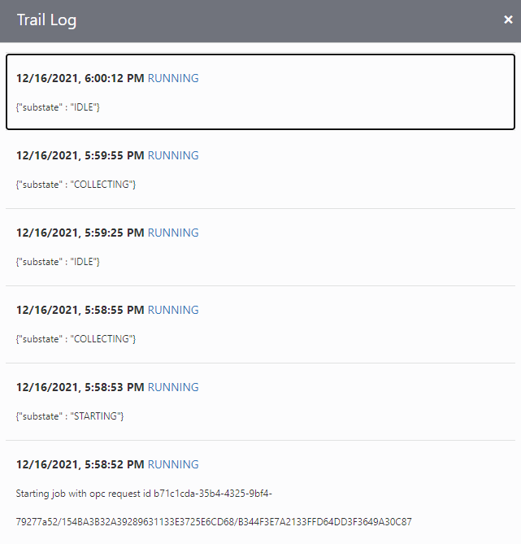

22. Click the **Home** tab and review the dashboard

    **Note**: Notice that the **All Activity**, **Admin Activity**, **Open Alerts**, **Feature Usage**, and **Audit Trails** charts now have data!


## Task 3: Collect audit data and generate alerts

After enabling audit data collection on a target database in Oracle Data Safe, you can analyze the audit data through alerts and audit reports

1. View alerts

    - In the Oracle Data Safe Console, click the **Alerts** tab

        

    - View the total number of target databases, critical risk alerts, high risk alerts, medium risk alerts, open alerts, and closed alerts

        

        **Note**: At a glance, you can better understand whether the security of your target database is in jeopardy and how you should prioritize your work

    - Scroll down to review the alerts in the table

        - The **DB User** column identifies who is doing the action
        - The **Operation** column identifies the action
        - The **Alert Severity** column indicates the seriousness of the action

            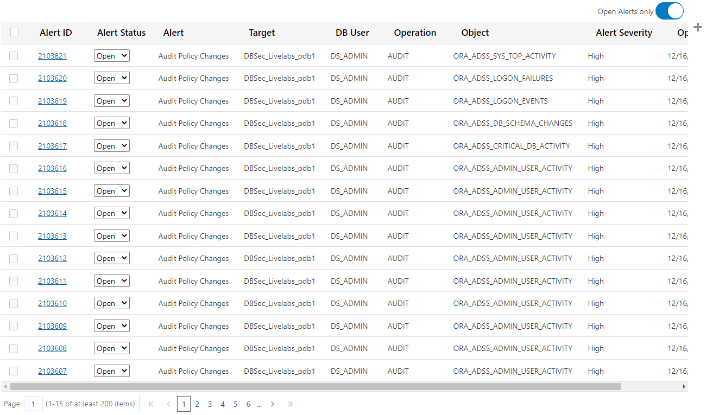

    - At the bottom of the page, click the page numbers to view other pages of alerts

2. Filter the report to show only open high alerts
    
    - At the top of the report, click [**+ Filter**] and then set the filter to be: **Alert Severity = High**
    
        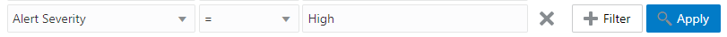
   
    - Click [**Apply**]
        
    - The table shows you the open high alerts

        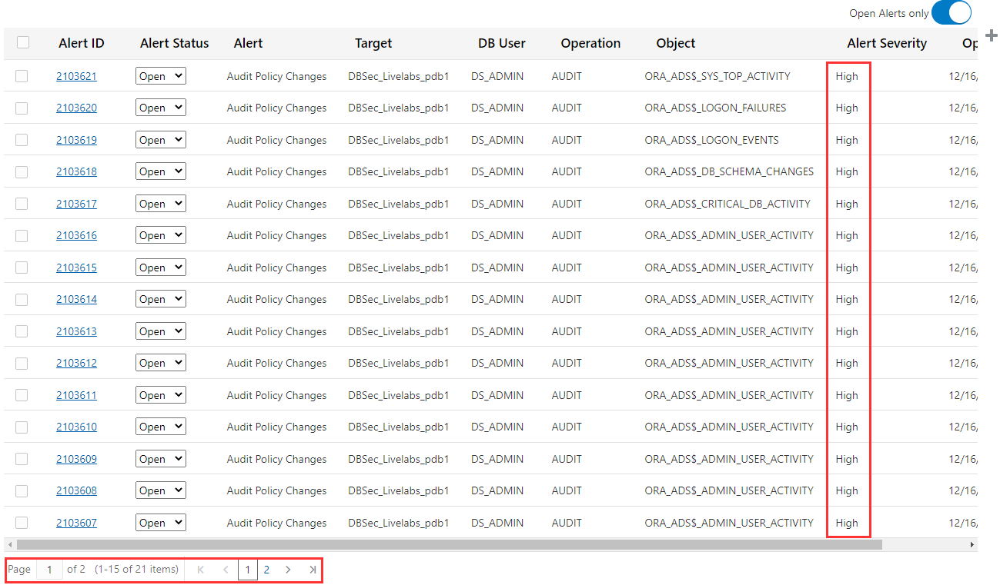

        **Note**: If the filters are not displayed, click on the **Active Filters** link beside the totals at the top of the page

        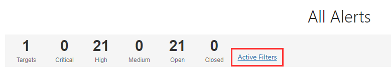
        
3. To sort the **Operation** column, position the cursor over the **Operation** column heading, and then click the arrow button

    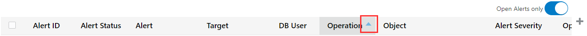

4. To view more detail for an alert, click the **Alert ID number**

    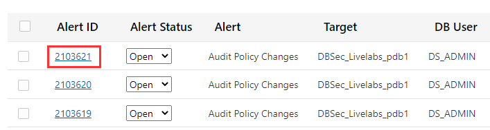

5. Review the information in the **Alert Details** dialog box, and then click **X** to close it
    
    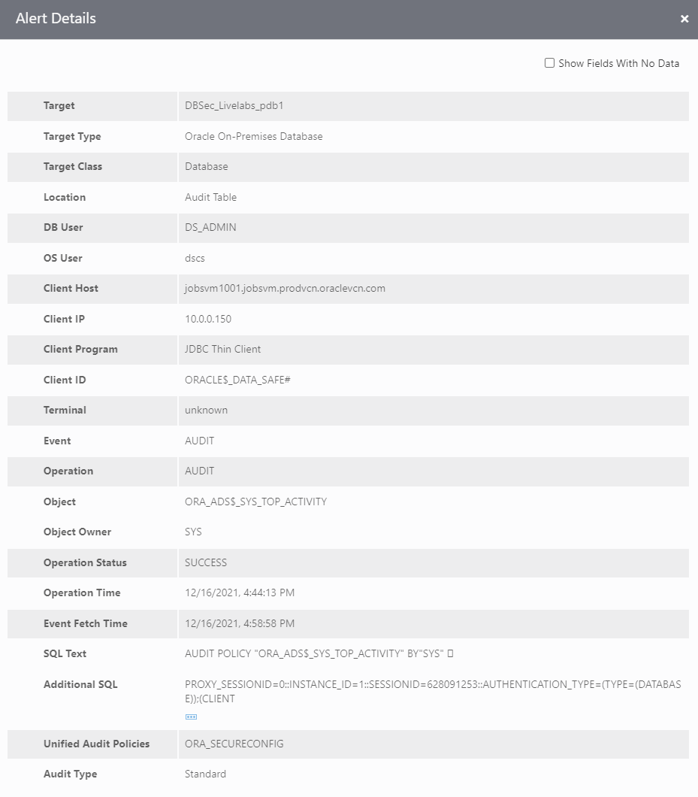

    **Note**: You can view the **DB User**, **Operation Status**, **SQL Text**, and much more

6. Close alerts

    - Create a filter to view the list of alerts for Audit Policy Changes

        - To do so, click **+ Filter**
        - Set the filter to be: **Alert = Audit Policy Changes**
        - Click [**Apply**]

        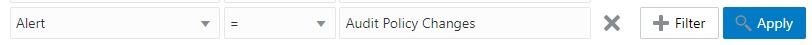

        - Review the alerts

        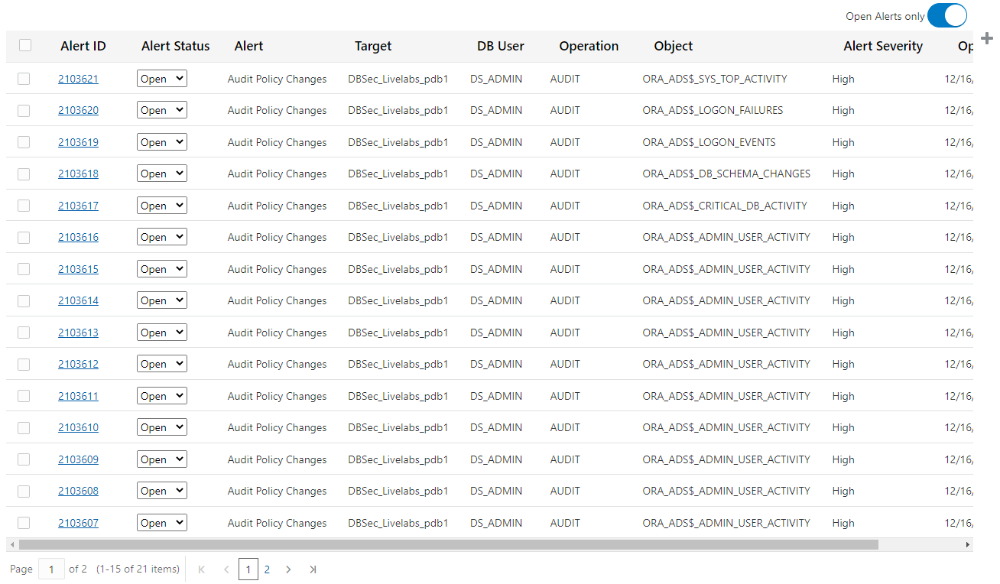

    - Suppose you are fine with these changes, now you can close the alerts
    
        - Select the check box in the top left corner of the table to select all of the alerts displayed

            
    
        - From the **Mark As** menu, select **Closed**

            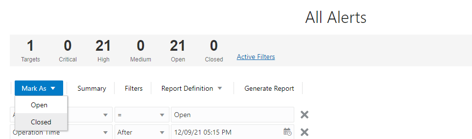

            **Note**:
            - The alerts selected on this page are now **closed** and the next page is displayed
            - Because there is another page of alerts that meet the filter criteria, repeat the previous step to mark all alerts as closed
            - Once it's done, you will have an empty page!

                

7. Remove the filters **Alert = Audit Policy Changes** and **Severity = High** by clicking the **X** next to each filter, and then click [**Apply**]

    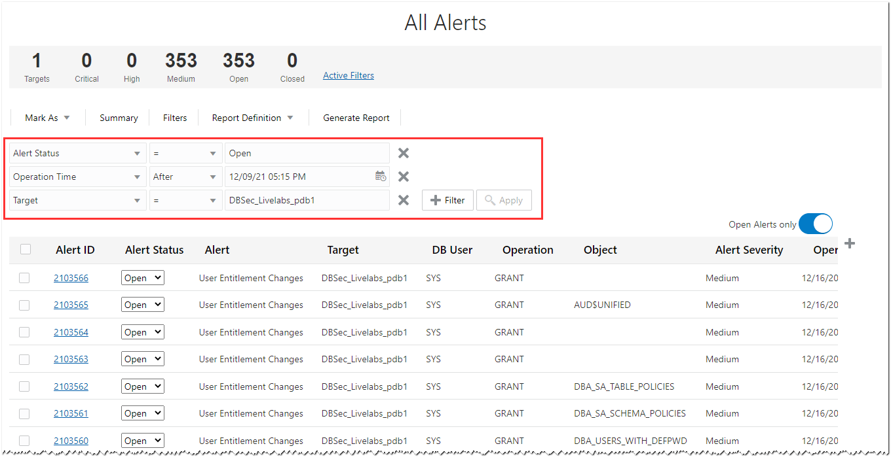
        
8. To show closed alerts on the pages, move the **Open Alerts only** slider to the left

    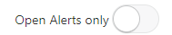
    
    **Note**: Now you can see the alerts that you've closed earlier
    
    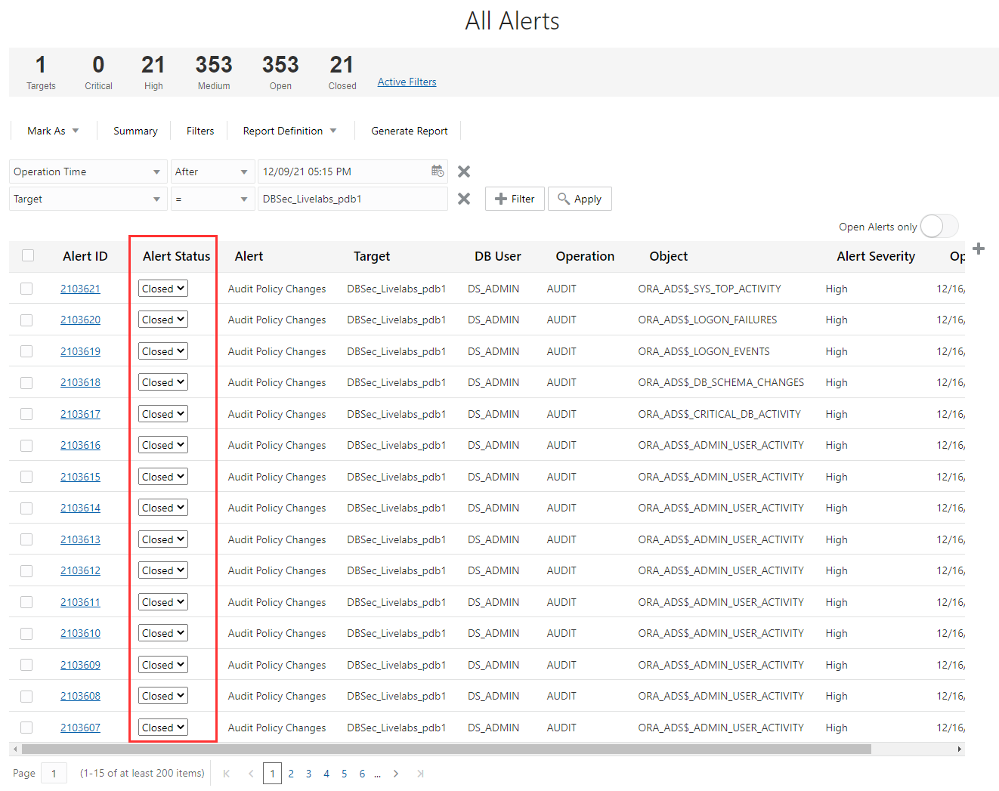

8. To hide closed alerts on the pages, move the **Open Alerts only** slider to the right

    

9. Create a logins report

    - Click the **Reports** tab

        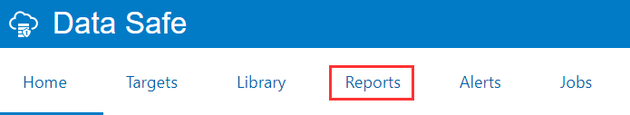

    - To view the **Login Activity** report, in the list under **Activity Auditing**, click **Login Activity**

        

    - Add 2 filters by clicking on **+ Filter**:
        - **"Operation Time" "After" "Select 1 year before today"**
        - **"Target" "=" "`DBSec_Livelabs_pdb1`"**
        
            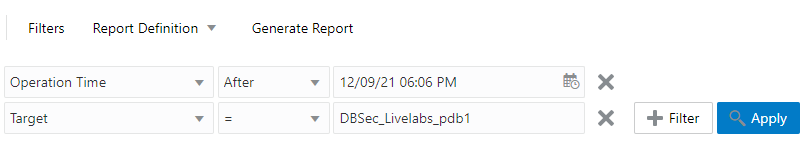

        - Then click [**Apply**]

            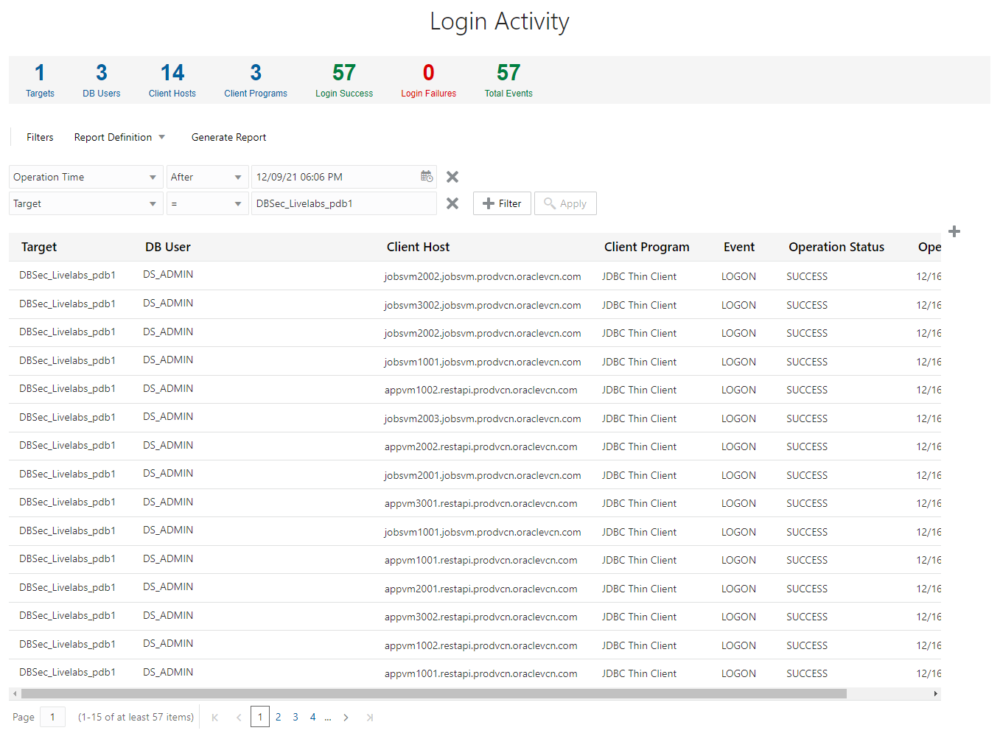

    - From the **Report Definition** menu, select **Save As New**

        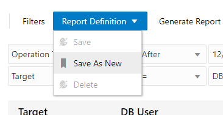

    - Fill out the **Save As** dialog box as following:
    
        - Report Name: *`Logins Reports`*
        - Description: *`Report all the logins to the database`*
        - Compartment: Select your compartment
        
            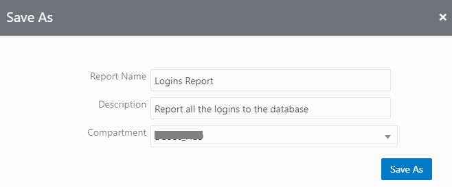

        - Click [**Save As**]
        
        **Note**: A confirmation message states that the report is successfully created!

        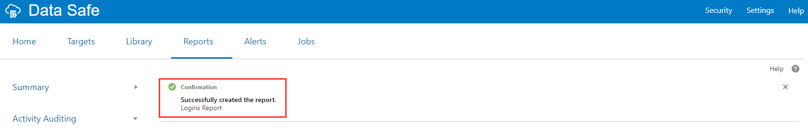

    - Click the **Reports** tab

    - At the top of the list under **Custom Reports**, click your **Logins Reports**

        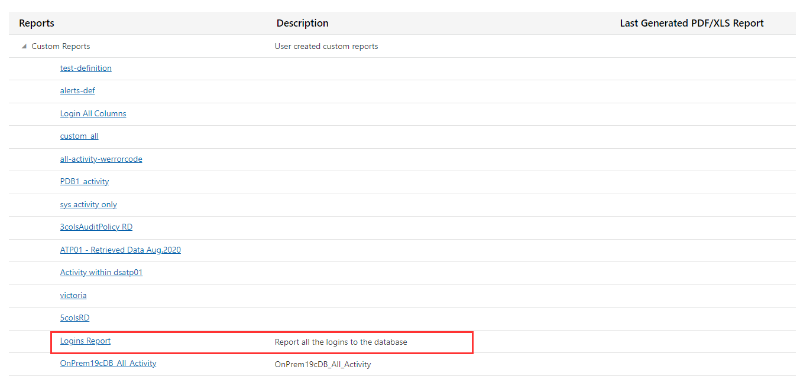

    - Click [**Generate Report**]

        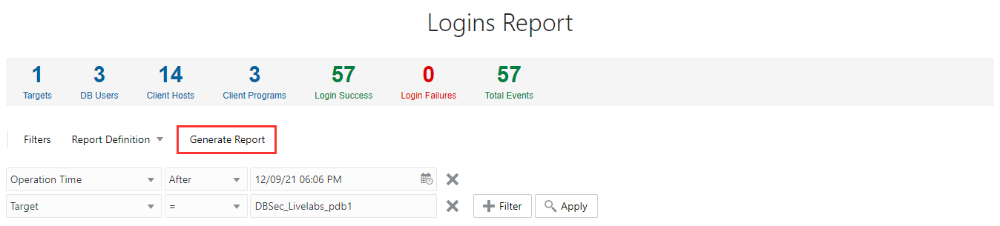

        - In the **Generate Report** dialog box
            - Leave **PDF** selected
            - Select your compartment

                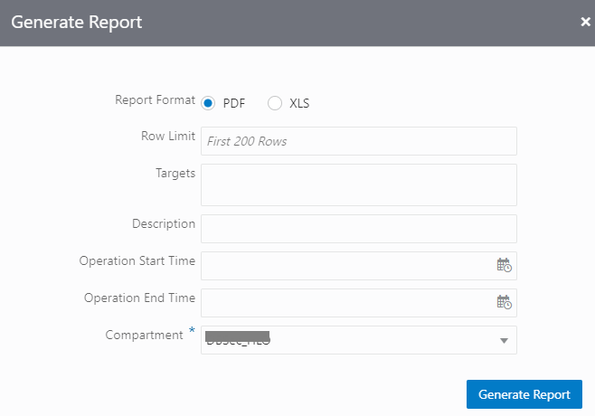

            - Then click [**Generate Report**]

        - Wait for a confirmation message that states that the **Report was generated successfully**

        - Click the **Download Report** link
    
        - The **Opening Logins.pdf** dialog box is displayed

        - Select the application with which you want to open the PDF, and click **OK**

        - Review the report, and then close it


## Task 4: Assess the security of your database configurations and users

In this lab, you explore Security Assessment and User Assessment. Because these features are similar, you perform some tasks in Security Assessment and others in User Assessment.

1. View the dashboard for **Security Assessment**

    - In Security Center, click **Security Assessment**

        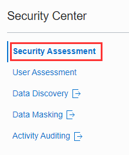

    **Note**: If you are in the Oracle Data Safe Console, click the **Home** tab, and then click the **Security Assessment** tab (you are navigated to Security Assessment in Security Center)

    - Under **List Scope**, select your compartment

        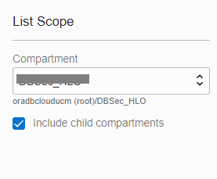

    **Note**: You can include target databases in child compartments by selecting the **Include child compartments** check box. The dashboard shows statistics across all the target databases listed.

    - At the top of the page, review the **Risk Level** and **Risks by Category** charts

        

        **Note**:
        - The **Risk Level** chart shows you a percentage breakdown of the different risk levels (High, Medium, Low, Advisory, and Evaluate) across all of your target databases
        - The **Risks by Category** chart shows you a percentage breakdown of the different risk categories (User Accounts, Privileges and Roles, Authorization Control, Data Encryption, Fine-Grained Access Control, Auditing, and Database Configurations) across all your target databases

    - View the **Risk Summary** tab

        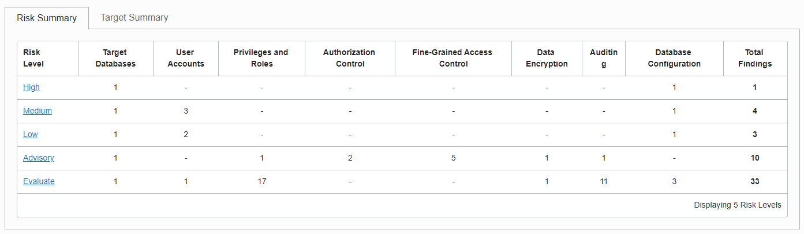

        **Note**:
        - The **Risk Summary** shows you how much risk you have across all target databases in the specified compartment(s)
        - You can compare the number of high, medium, low, advisory, and evaluate risk findings across all target databases, and view which risk categories have the greatest numbers
        - Risk categories include Target Databases, User Accounts, Privileges and Roles, Authorization Control, Fine-Grained Access Control, Data Encryption, Auditing, and Database Configuration
        - Make note of the **Total Findings** for high, medium, and low risk levels as you will compare them later to another assessment

    - Click the **Target Summary** tab and view the information

        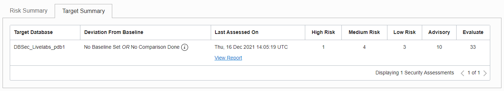

        **Note**:
        - The **Target Summary** shows you a view of the security posture of each of your target databases
        - You can view the number of high, medium, low, advisory, and evaluate risks for each database
        - You can view the assessment date and find out if the latest assessment deviates from a baseline (if one is set)
        - You can access the latest assessment report for each target database

2. View the latest security assessment for your target database

    - On the **Target Summary** tab, locate the line that has your target database, and click **View Report**
    
        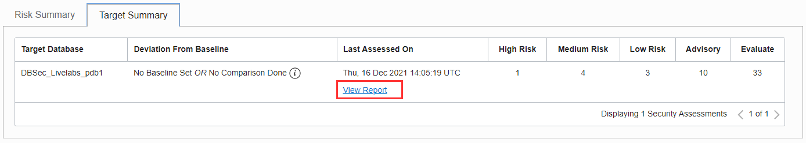

        **Note**: The latest assessment for your target database is displayed

        

    - Review the table on the **Assessment Summary** tab

        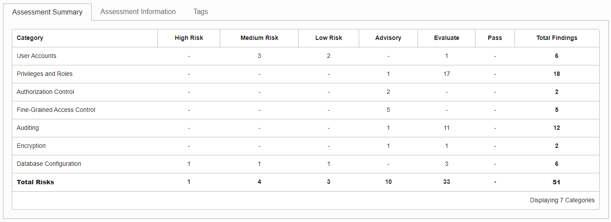
        
        **Note**:
        - This table compares the number of findings for each category in the report and counts the number of findings per risk level (**High Risk**, **Medium Risk**, **Low Risk**, **Advisory**, **Evaluate**, and **Pass**)
        - These values help you to identify areas that need attention

    - To view details about the assessment itself, click the **Assessment Information** tab

        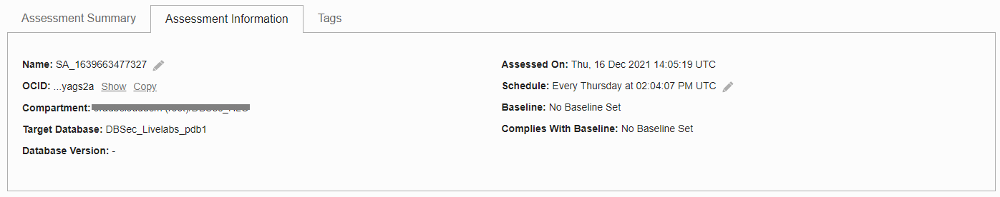

        **Note**: Details include assessment name, OCID, compartment to which the assessment was saved, target database name, target database version, assessment date, schedule (if applicable), name of the baseline assessment (if one is set), and complies with baseline flag (Yes, No, or No Baseline Set)

    - Scroll down and view the **Assessment Details** section

        

        **Note**:
        - This section shows you all the findings for each risk category
        - Risks are color-coded to help you easily identify categories that have high risk findings (red)

    - Under **Filters** on the left, notice that you can select the risk levels that you want displayed
    
        - Deselect **Evaluate**

            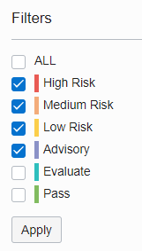

        - Then click [**Apply**]

        - Now, you see less Assessment details
        
            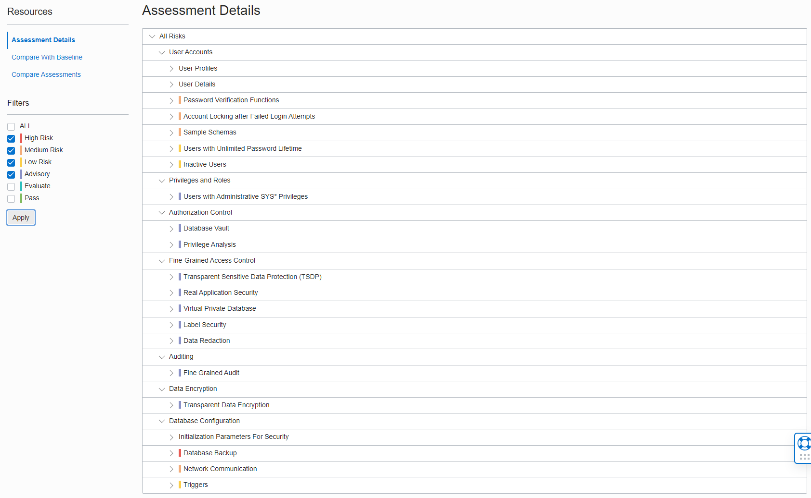

    - Under **User Accounts**, expand **User Details**

        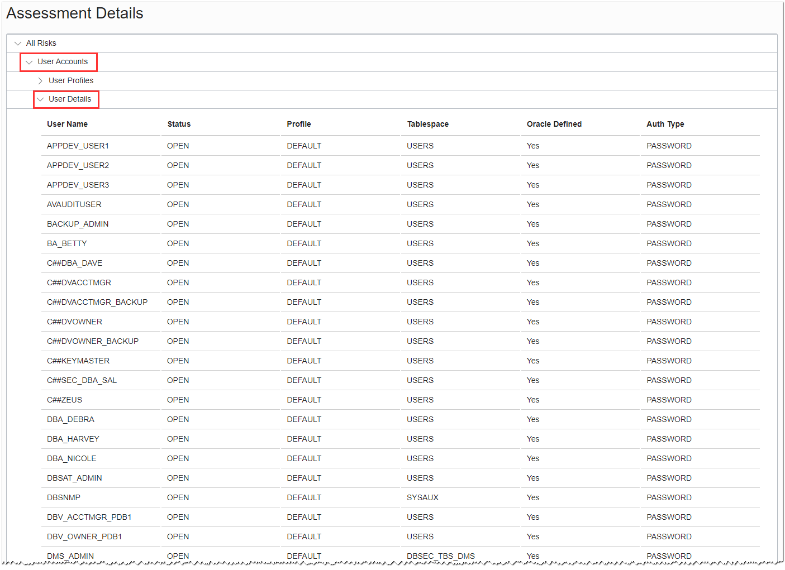

        **Note**: For each user in your target database, the table shows you the user status, profile used, the user's default tablespace, whether the user is Oracle Defined (Yes or No), and how the user is authenticated (Auth Type)

    - Expand another category, such as **Transparent Data Encryption**, and review the findings

        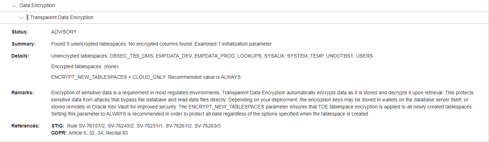

        **Note**:
        - Each finding shows you the status (risk level), a summary of the finding, details about the finding, remarks to help you to mitigate the risk, and references (whether a finding is recommended by the Center for Internet Security (**CIS**), European Union's General Data Protection Regulation (**GDPR**), and/or Security Technical Implementation Guide (**STIG**))
        - These references make it easy for you to identify the recommended security controls
        - In the example below, there are two references: STIG and GDPR

    - On the left under **Filters**, select all the filters, and click [**Apply**]

        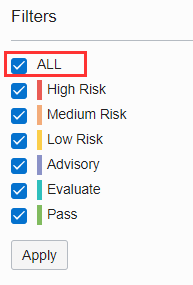

    - Collapse **User Accounts**, expand a few categories under **Privileges and Roles**, and review the findings

        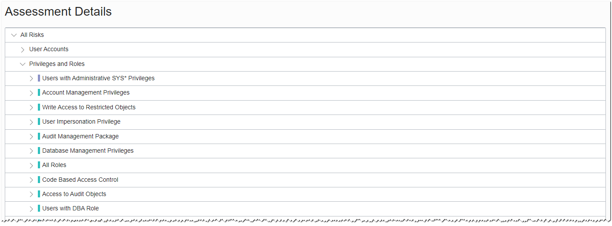

    - Scroll down further and expand other categories
    
        **Note**: Each category lists related findings about your target database and how you can make changes to improve its security

3. Refresh the latest security assessment and analyze the results

    - While you are still viewing the latest security assessment, at the top of the assessment, click [**Refresh Now**]
    
        

        **Note**: The **Refresh Now** page is displayed

    - In the **Save Latest Assessment** box
    
        - Enter *`My Security Assessment`*

            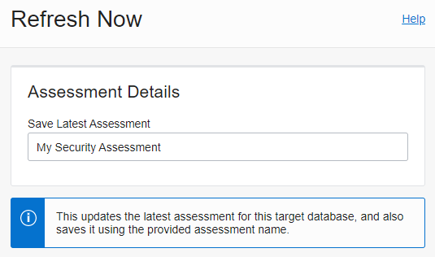

        - Then click [**Refresh Now**]
 
            **Note**:
            - This action updates the latest security assessment for your target database and also saves a copy named My Security Assessment in the Assessment History
            - The refresh operation takes about one minute

    - Click the **Assessment Information** tab and observe that the assessment date and time is right now

        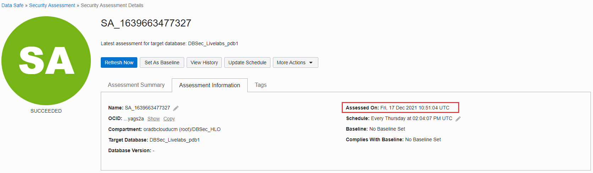

    - In the breadcrumb at the top of the page, click **Security Assessment** to return to the dashboard

        

    -  Review the total findings for high, medium, and low risk levels
    
        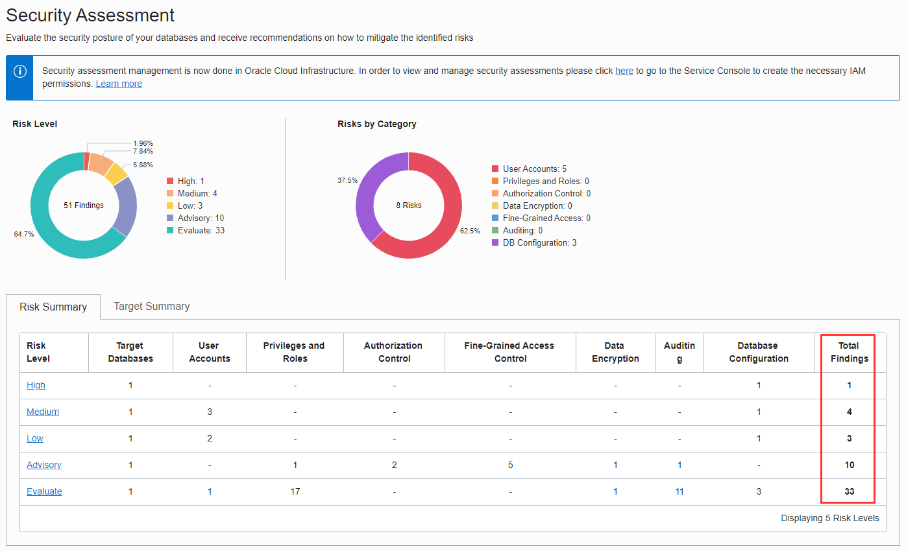

        **Note**: These values could be different than the values you viewed in the original assessment (in Step 1)

    - In the **Risk Level** column, click **High** to view all the high risk findings

        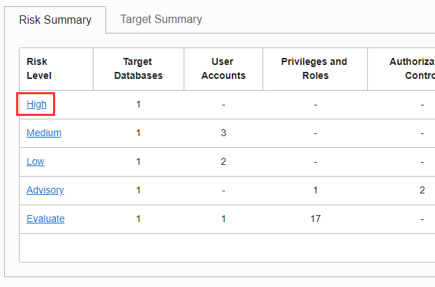

    - On the **Overview** tab, review the **Risks by Category** chart

        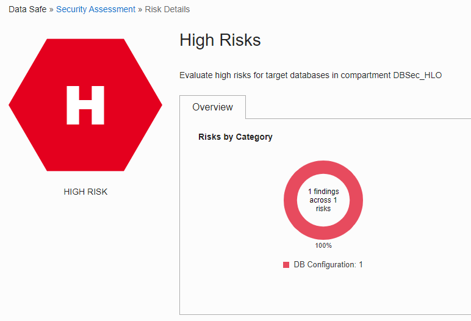

        **Note**: You can position your cursor over the percentage values to view the category name and count

    - In the **Risk Details** section, expand one of the high level risks, for example, **Database Backup**

        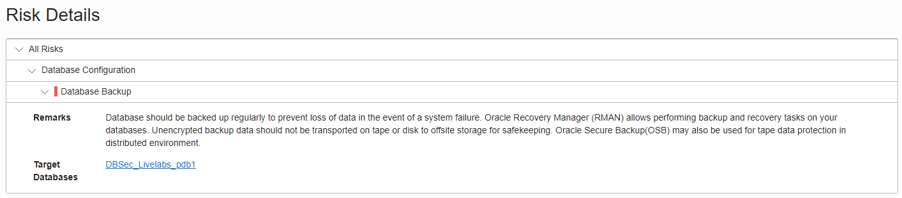

        **Note**:
        - The **Remarks** section explains the risk and how you can mitigate it
        - The **Target Databases** section lists the target databases to which the high risk applies

    - Click your target database name to view all the details about the finding for your target database

        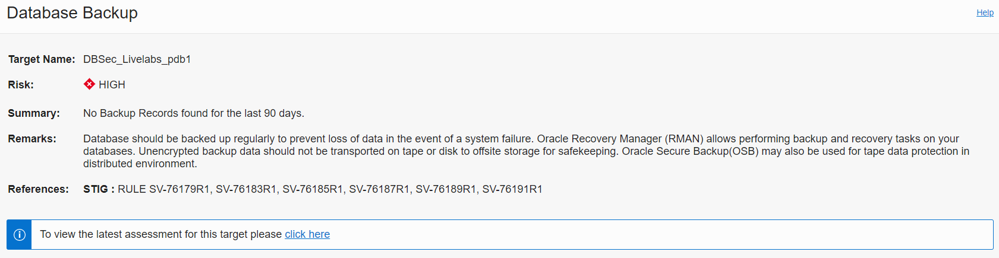
        
        **Note**: The finding includes your target database name, risk level, a summary about the risk, details on your target database, remarks that explain the risk and help you to mitigate it, and references

    - To view the latest assessment for your target database, click the **click here** link
    
        
        
        **Note**: You are returned to the latest security assessment

4. Add a schedule to save a security assessment for your target database every Sunday at 11:30 PM

    - In the breadcrumb at the top of the page, click **Security Assessment**

    - Under **Related Resources** on the left, click **Schedules**

        

    - In the table, notice that a schedule already exists
    
        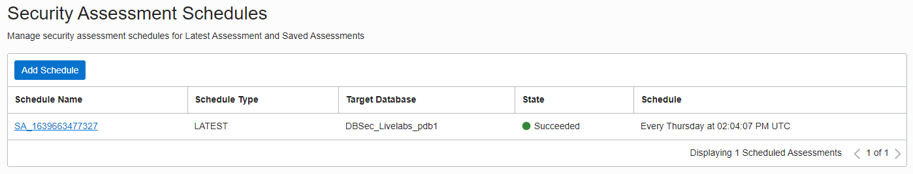

        **Note**:
        - It's type is LATEST
        - This is the default schedule that automatically runs a security assessment job on your target database once per week
        - You can update it and rename it, but you can't delete it

    - Click [**Add Schedule**]
    
    - The **Add Schedule To Save Assessments** page is displayed and fill it out

        - Target Database: Select *`DBSec_Livelabs_pdb1`*
        - Schedule Name: *`Sunday Security Assessment`*
        - Compartment To Save The Assessment: Select your compartment
        - Schedule Type: Select *`Weekly`*
        - Every: Select *`Sunday`*
        - Time: Select *`11:30 PM`*

            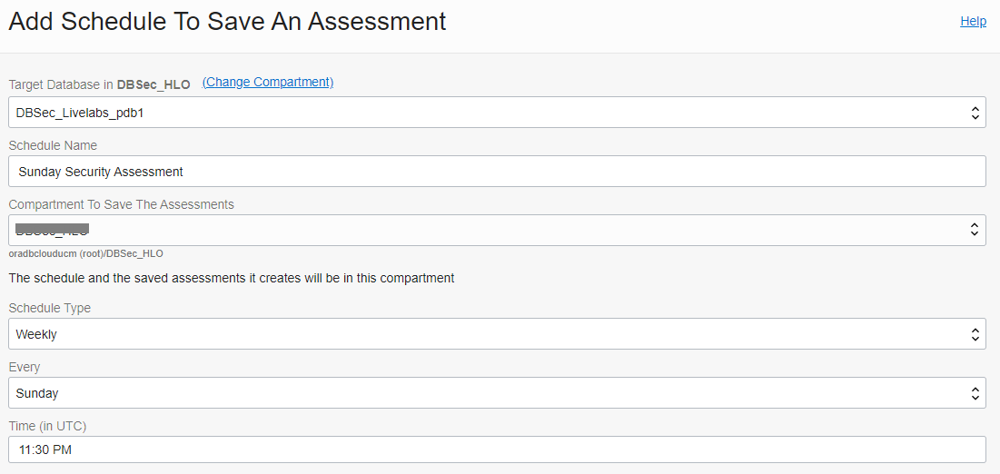

    - Click [**Add Schedule**]
    
        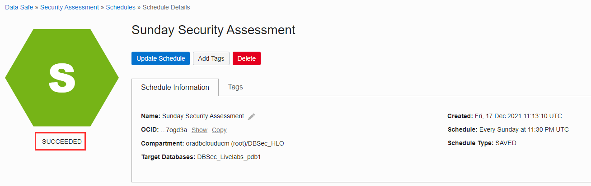

        **Note**: When the schedule is created, its status changes to **SUCCEEDED**

5. View the history of all security assessments for your target database

    - In the breadcrumb at the top of the page, click **Security Assessment**

    - Click the **Target Summary** tab

    - Click the **View Report** link for your target database

        **Note**: The latest security assessment is displayed

    - At the top of the page, click [**View History**]

        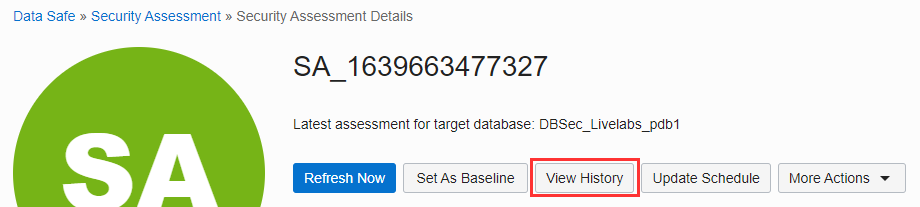

    - Review all the security assessments for your target database

        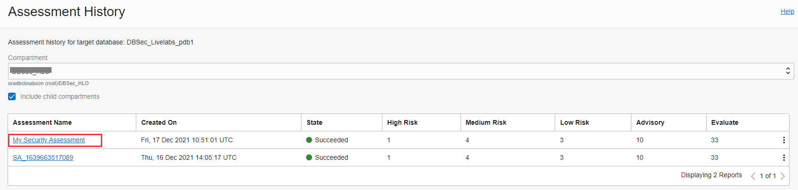

        **Note**:
        - So far, you should have two security assessments: The default assessment that was automatically generated for you by Oracle Data Safe, and the assessment that you saved earlier as My Security Assessment
        - If you don't see your assessments, make sure that your compartment is selected
        - To view assessments saved to a different compartment, select the compartment from the **Compartment** drop-down list
        - To also list assessments that were saved to child compartments of the selected compartment, select the **Include child compartments** check box

    - Review the number of findings for each risk level for your target database if the values changed between the two assessments, then click [**Close**]

6. Set a baseline and generate a Comparison report for Security Assessment

    A baseline assessment shows you data for all your target databases in a selected compartment at a given point in time. However, because we are only dealing with one Autonomous Database in your compartment, the baseline assessment shows data for only your database. When you do a baseline comparison, Oracle Data Safe automatically compares only the assessments that pertain to your database.

    - In the breadcrumb at the top of the page, click **Security Assessment**

    - Under **Related Resources**, click **Assessment History**

        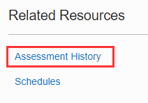

    - Click the name starts with **SA_** of the security assessment that Oracle Data Safe generated

        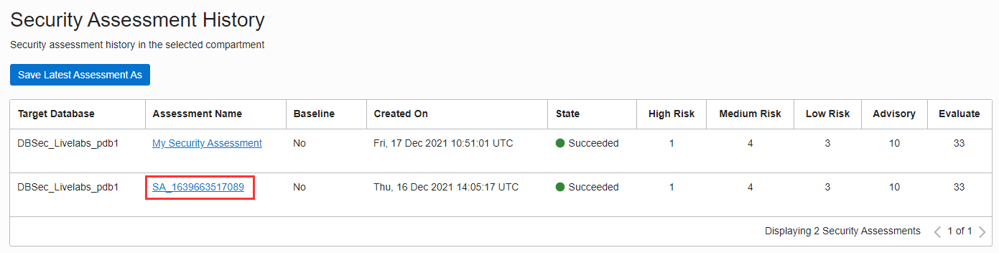
    
        **Note**: The security assessment is displayed

    - Click [**Set As Baseline**]

        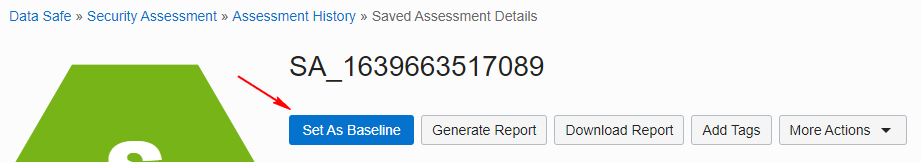

    - In the **Set As Baseline** dialog box, click **Yes** to confirm that you want to set these findings as the baseline

        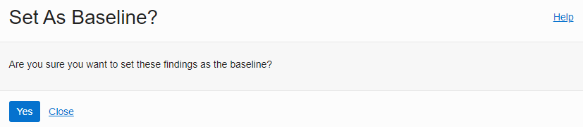

        **Important**: Stay on the page until the message **Baseline has been set** is displayed!

        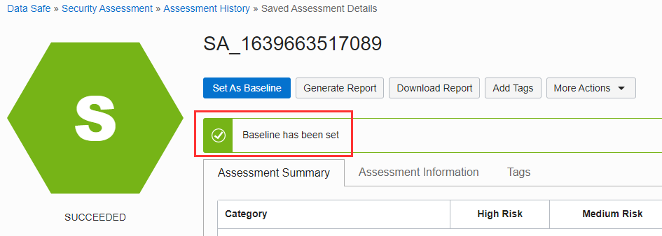

    - Access the latest assessment for your target database
    
        - To do this, in the breadcrumb, click **Security Assessment**
        - Click the **Target Summary** tab
        - Click **View Report** for your target database

    - Under **Resources** on the left, click **Compare with Baseline**
    
        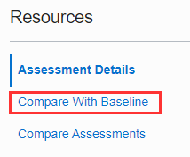
        
        **Note**: Oracle Data Safe automatically begins processing the comparison

    - When the comparison operation is completed, review the Comparison report (here we have nothing, but maybe you could have a few on your own comparison report)

        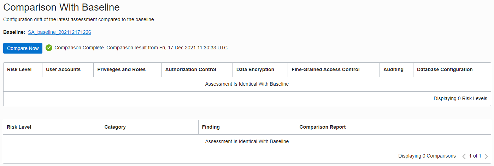

        - Review the number of findings per risk category for each risk level. Categories include **User Accounts**, **Privileges and Roles**, **Authorization Control**, **Data Encryption**, **Fine-Grained Access Control**, **Auditing**, and **Database Configuration**
        - You can identify where the changes have occurred on your target database by viewing cells that contain the word **Modified**
        - The number represents the total count of new, remediated, and modified risks on the target database
        - In the details table, you can view the risk level for each finding, the category to which the finding belongs, the finding name, and a description of what has changed on your target database
        -The Comparison Report column is important because it provides explanations of what is changed, added, or removed from the target database since the baseline report was generated

7. View the dashboard for **User Assessment**

    - Navigate to User Assessment
    
        - In the breadcrumb at the top of the page, click **Data Safe**

            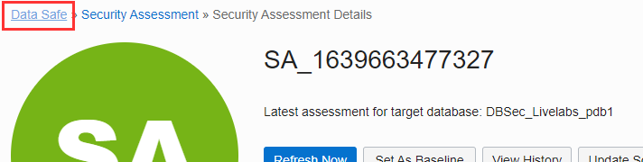

        - Click **Security Center**

            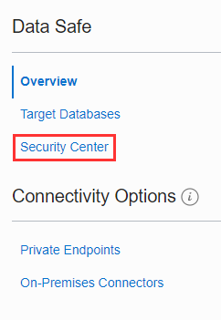

        - Then **User Assessment**

            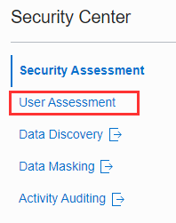

    - Under **List Scope**, select your compartment, if needed

    - At the top of the dashboard, review the four charts

        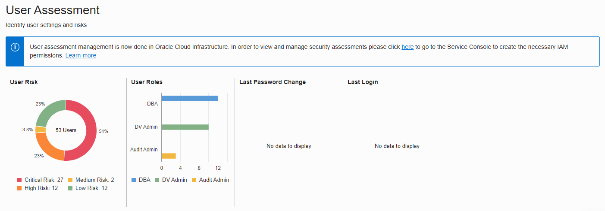

        **Note**:
        - The **User Risk** chart shows you the number and percentage of users who are **Critical Risk**, **High Risk**, **Medium Risk**, and **Low Risk**
        - The **User Roles** chart shows you the number of users with the **DBA**, **DV Admin**, and **Audit Admin** roles
        - The **Last Password Change** chart shows you the number and percentage of users who changed their passwords within the last 30 days, within the last 30-90 days, and 90 days ago or more
        - The **Last Login** chart shows you the number and percentage of users that signed in to the database within the last 24 hours, within the last week, within the current month, within the current year, and a year ago or more

    - Review the **Risk Summary** tab

        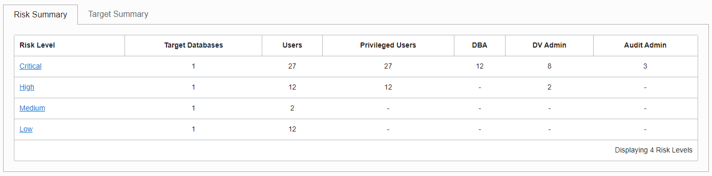

        **Note**:
        - The **Risk Summary** focuses on risks across all your target databases
        - It shows you risk levels, where the risks were found, the number of users at each risk level, and the roles held by the total number of users at each risk level

    - Click the **Target Summary** tab. This tab provides the following information:

        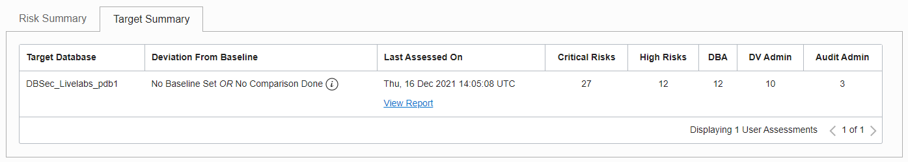

        **Note**:
        - Number of critical and high risk users, DBAs, DV Admins, and Audit Admins
        - Date and time of the lastest user assessment
        - Whether the latest assessment deviates from the baseline (if one is set)

8. Analyze users in the latest user assessment

    - On the **Target Summary** tab, click **View Report** to view the latest user assessment for your target database

    - At the top of the report, review the **User Risk**, **User Roles**, **Last Password Change**, and **Last Login** charts

        

    - Scroll down and review the **Assessment Details** section
    
        
    
        **Note**:
        This table provides the following information about each user:
        - User name
        - User type (for example, PRIVILEGED, SCHEMA)
        - Whether the user is a DBA, DV Admin, or Audit Admin
        - User risk level (for example, LOW, CRITICAL)
        - User's status (for example, OPEN, LOCKED)
        - Date and time the user last logged in to the target database
        - Audit records for the user

    - In the **User Name** column, click one of the users
    
        

        **Note**:
        The **User Details** page shows the following information about the user:
        - User name
        - Target database name
        - Date and time when the user was created
        - Risk level - Hover over the question mark to view what constitutes a critical risk user.
        - User type
        - User profile
        - Privileged roles (the Admin roles granted to the user)
        - Last login date and time
        - Roles - Expand **All Roles** to view all the roles granted to the user.
        - Privileges - Expand **All Privileges** to view all the privileges granted to the user.

    - Click [**Close**]

    - Notice at the top of the table that you can set filters

        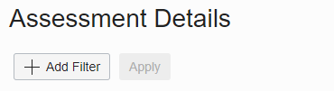

        - Click [**+ Add Filter**]
        - From the first drop-down list, select **Risk**
        - From the second drop-down list, select **=**
        - In the box, enter **CRITICAL**
        
        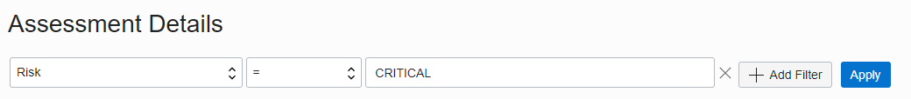
        
        - Click [**Apply**]
        
            **Note**: The table now shows you only critical risk users

            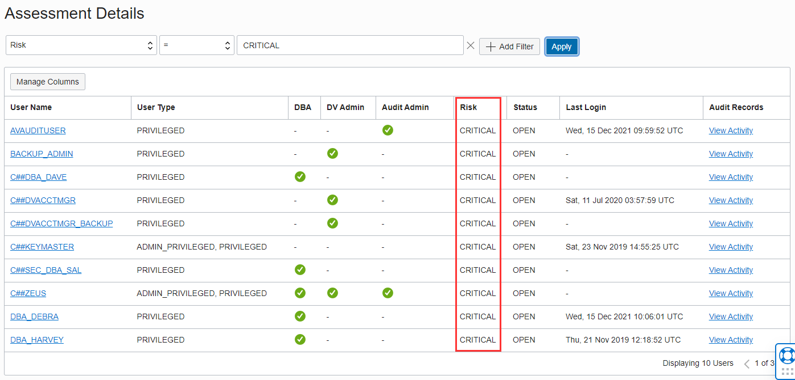

9. Review the `DS_ADMIN` user's audit records

    - Identify the row in the table for the `DS_ADMIN` user

        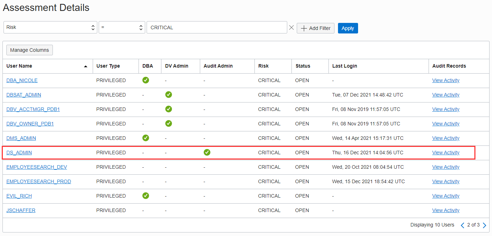

    - In the **Audit Records** column for the `DS_ADMIN` user, click **View Activity**
    
    - A new browser tab is opened and the **All Activity** report is displayed in the Oracle Data Safe Console

        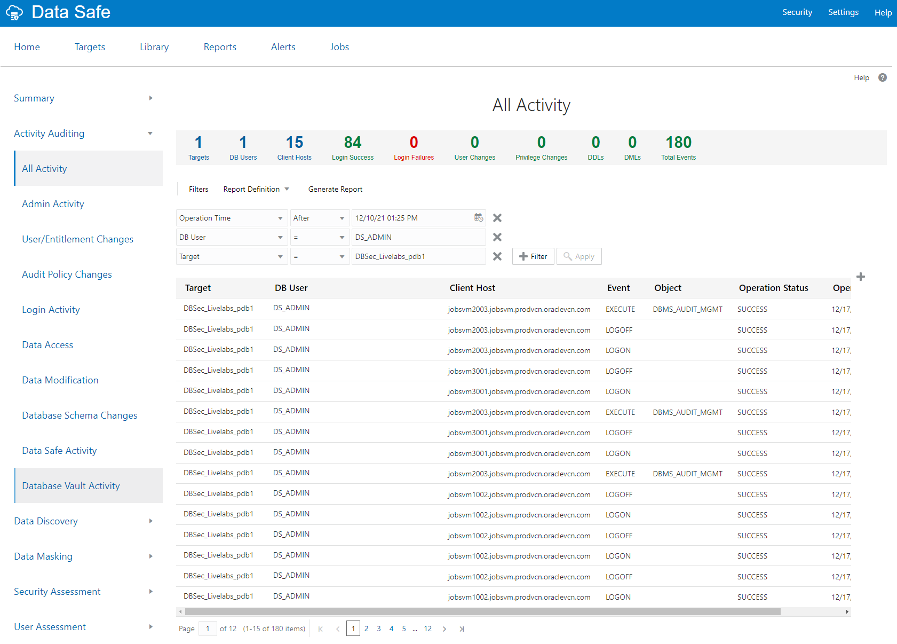

        **Note**: The report is automatically filtered to show you audit records for the past week, for the `DS_ADMIN` user, and for your target database

    - Examine the **All Activity** report for the `DS_ADMIN` user

        

        **Note**:
        - At the top of the report, you can view totals for **Targets**, **DB Users**, **Client Hosts**, **Login Success**, **Login Failures**, **User Changes**, **Privilege Changes**, **User Changes**, **DDLs**, **DMLs**, and **Total Events**
        - The **Event** column in the table shows you the types of activities performed by the `DS_ADMIN` user, for example, `EXECUTE`, `LOGON`, `LOGOFF`, and so on
        - At the bottom of the page, click the page numbers to view more audit records

    - Close the browser tab to return to the browser tab for Security Center

10. View the user **assessment history** for all target databases

    - In the breadcrumb at the top of the page, click **User Assessment**

        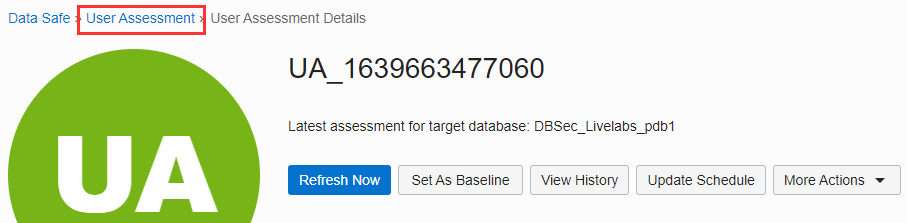

    - Under **Related Resources**, click **Assessment History**

        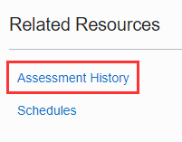

    - Review the assessment history for all target databases

        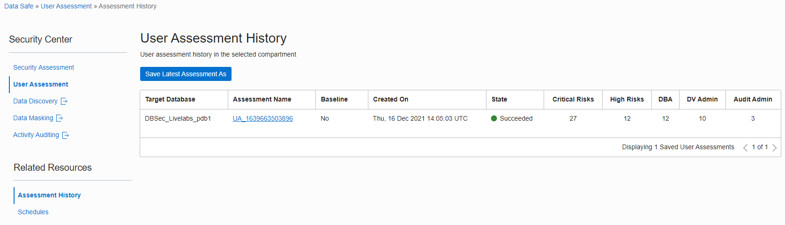

        **Note**:
        - You can compare the number of critical risks, high risks, DBAs, DV Admins, and Audit Admins across all target databases
        - You can also quickly identify user assessments that are set as baselines

    - Click the name starts with **UA_** of the user assessment for your target database

        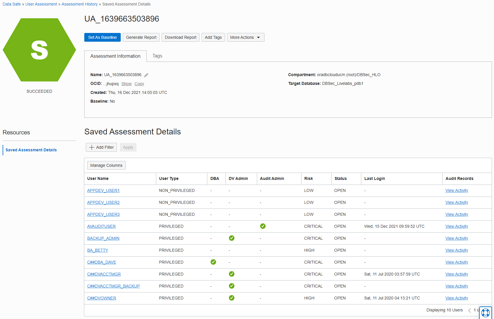

        **Note**:
        - This assessment was generated by Oracle Data Safe when you registered your target database
        - It is a saved copy of the latest assessment
        - Notice that you cannot refresh the data in a saved user assessment
        - Make note of the assessment's name (here the assessment's name ends with "3896"

            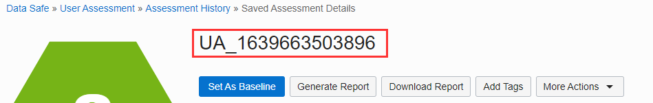

11. Refresh the latest user assessment and rename it

    Let's find the actual latest assessment (not a saved copy of it) and refresh it

    - In the breadcrumb at the top of the page, click **User Assessment**, and then click the **Target Summary** tab

    - Click **View Report** for your target database to open the latest assessment

        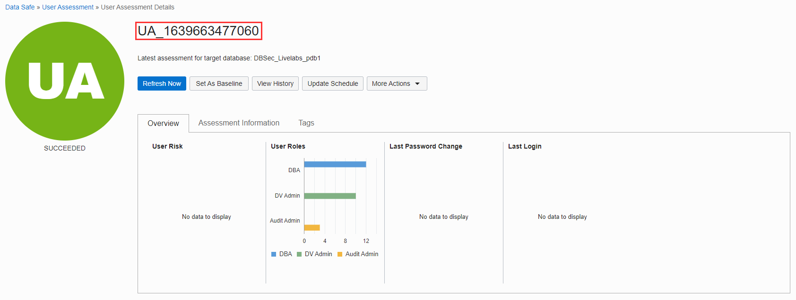

        **Note**:
        - Notice that this assessment's name ends with **7060** - not the same as the copy! It is a completely separate user assessment
        - Also notice that you can refresh this assessment, whereas you couldn't refresh the copy in the Assessment History

    - To refresh the latest user assessment
    
        - Click [**Refresh Now**]
    
            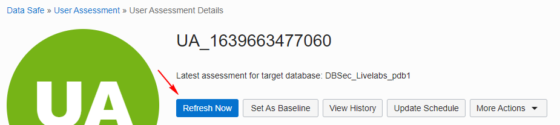

            **Note**: The **Refresh Now** window is displayed
        
        - For now, let's keep the default name as is, and click **Refresh Now**

            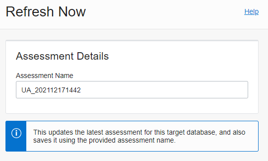

            **Note**: When you refresh the latest user assessment, Oracle Data Safe automatically saves a static copy of it to the Assessment History

    - Now, let's change the assessment name
    
        - Click the **Assessment Information** tab
        - Then click the **Pencil** icon next to the assessment name
        
            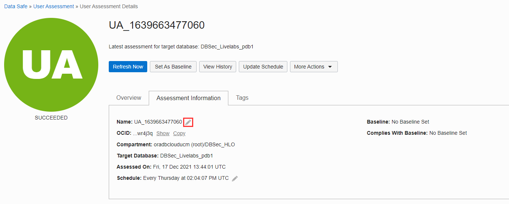
        
        - Change the name to *`Latest User Assessment`*
        - Then click the **Save** icon
        
            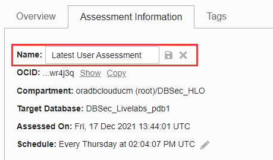

            **Note**: The name is updated on the page!

            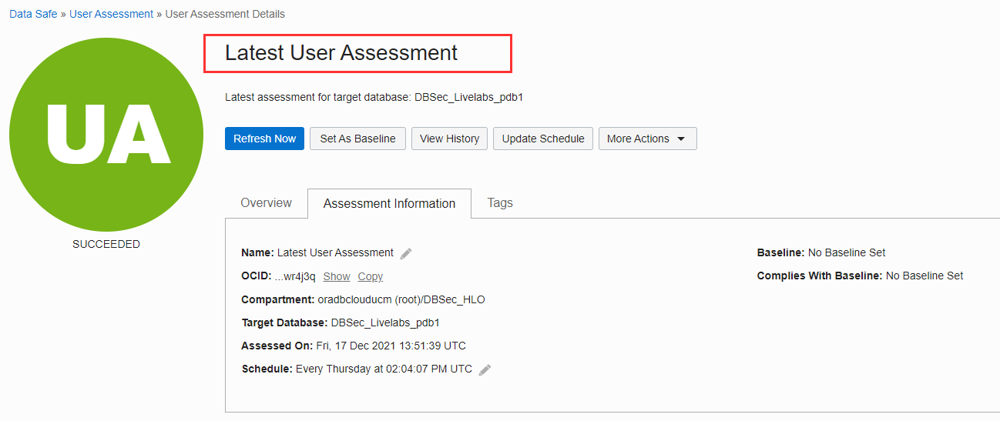

    - In the breadcrumb at the top of the page, click **User Assessment**. Under **Related Resources**, click **Assessment History**

        

        **Note**:
        - Notice that there are now two saved user assessments, none of which are called "Latest User Assessment"
        - The most current user assessment in the history shows the same number of critical and high risk users as the latest assessment because it is a copy of it

12. Download the latest user assessment as a PDF report

    - Return to the latest user assessment
    
        - Under **Security Center**, click **User Assessment**
        - On the **Target Summary** tab, click **View Report** for your target database

    - From the **More Actions** menu, click **Generate Report**

        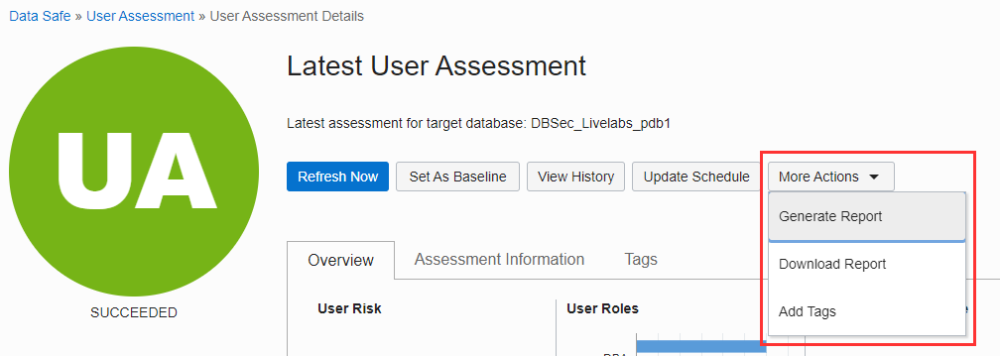

        **Note**: The **Generate Report** dialog box is displayed

        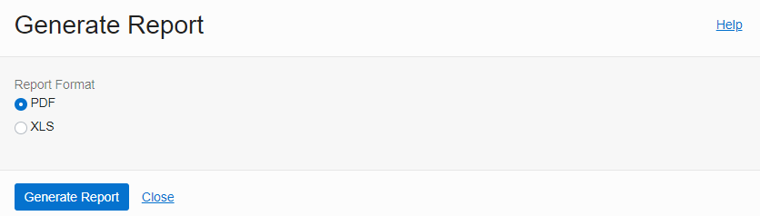

    - Leave **PDF** selected as the report format, and click [**Generate Report**]

    - Wait for a message that says the **PDF report generation is complete**, and then click **Close**

        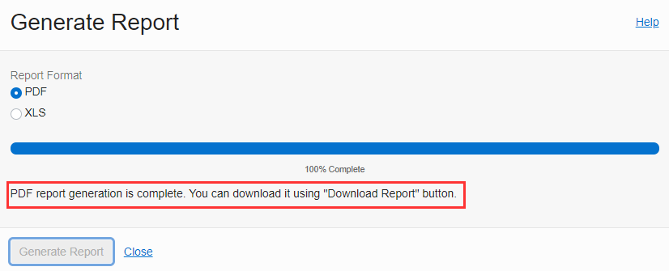

    - From the **More Actions** menu, click **Download Report**

        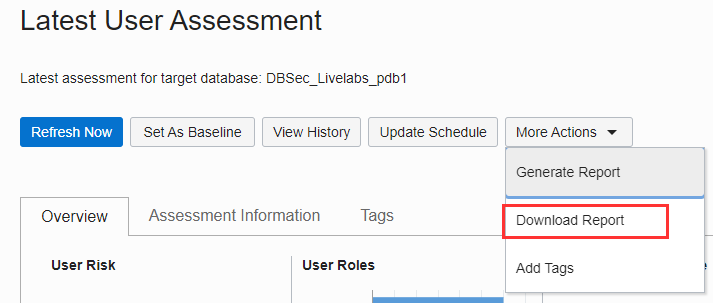

        **Note**: The **Download Report** dialog box is displayed
    
    - Leave the **PDF** report format selected, and click [**Download Report**]

        

    - In the **Save As** dialog box
    
        - Browse to the desktop where you want to dpwnload the file
        - Leave **user-assessment-report.pdf** set as the name
        - Click [**Save**]
    
    - On your desktop, open the PDF report and scroll through it

        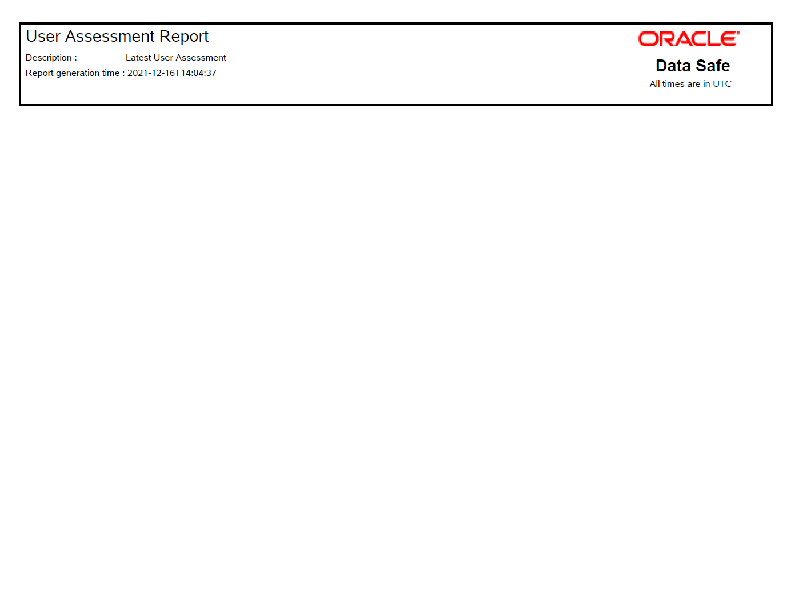
    
        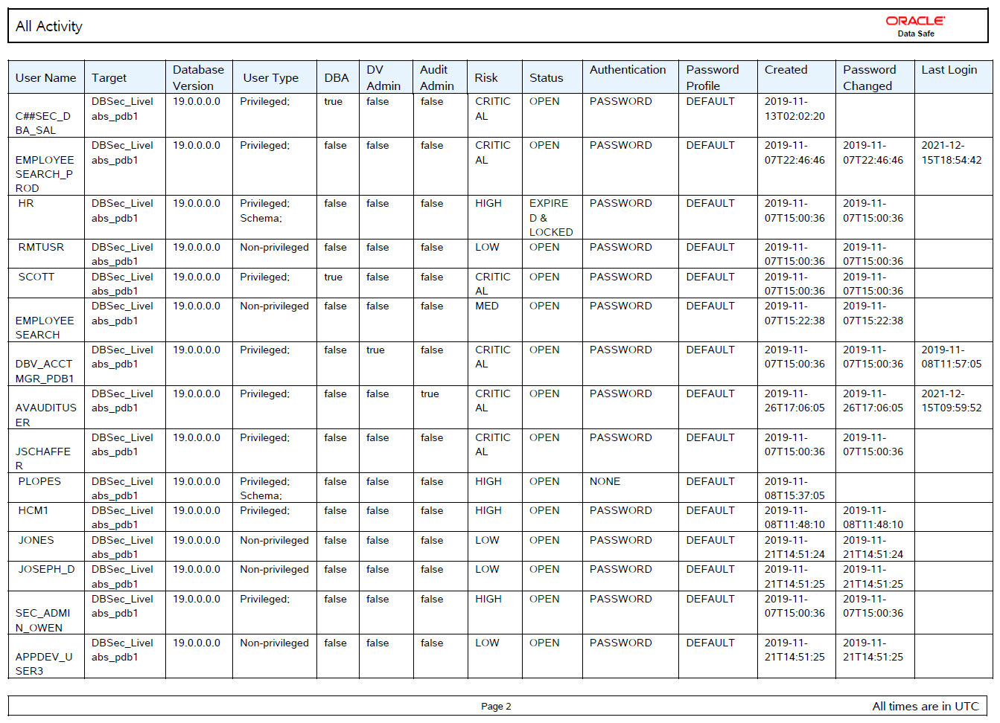

    - When you are done, close the PDF file

13. Compare the latest user assessment with another user assessment

    You can select a user assessment to compare with the latest user assessment and with this option, you don't need to set a baseline

    - On the left under **Resources**, click **Compare Assessments**

        

        **Note**: This option is only available when you are viewing the latest user assessment
    
    - Scroll down to the **Comparison with Other Assessments** section

    - If your compartment isn't shown, click **Change Compartment** and select your compartment

    - From the **Select Assessment** drop-down list, select the earliest assessment for your target database
    
        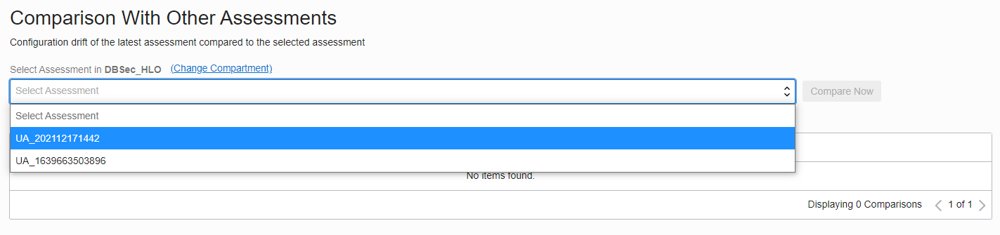
    
        **Note**: As soon as you select it, the comparison operation starts!

    - Review the Comparison report
    
        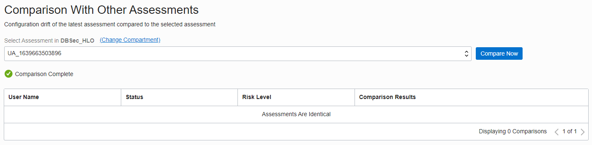

        **Note**:
        - If there's nothing in the **Comparison Results** column, it means that the assessments are identical and no changes have been applied
        - If not, click one of the **Open Details** links to view more information about a user
            - Here is an example of what you can see (for the user `MALFOY`)
        
                

            - Review the information about the user, and then click [**Close**]


## Task 5: Discover and mask sensitive data

Data Discovery helps you find sensitive data in your databases and Data Masking provides a way for you to mask sensitive data so that the data is safe for non-production purposes

1. View the original **sensitive data** in your database before masking

    - Go back to your Terminal session on your **DBSec-Lab** VM as OS user *oracle*

    - Review the sensitive data to mask

        ````
        <copy>
        cd $DBSEC_LABS/data-safe
        ./ds_query_employee_data.sh</copy>
        ````

        ... results in PROD (**data NOT to be masked!**)

        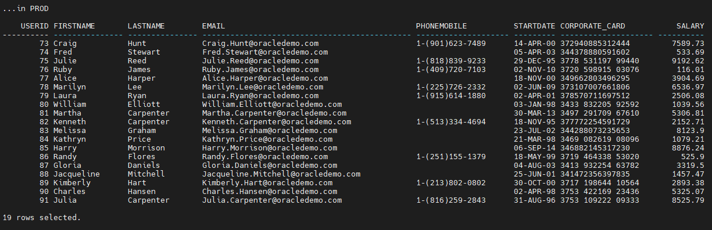

        ... results in DEV (**data to mask**)

        

        **Note**:
        - Here we query `DEMO_HR_EMPLOYEES` table in PROD and DEV to be sure that the value are similar
        - Data such as `FIRST_NAME`, `LAST_NAME`, `EMAIL`, `PHONEMOBILE`, `STARTDATE`, `CORPORATE_CARD` and `SALARY` are considered sensitive data and should be masked if shared for non-production use, such as development and analytics

2. Discover sensitive data (for DEV table) by using Data Discovery

    The Data Discovery wizard generates a sensitive data model that contains sensitive columns in your target database. When working in the wizard, you select the sensitive types that you want to discover in your target database

    - Return to the browser tab for the Oracle Cloud Infrastructure Console

        - From the navigation menu, select **Oracle Database** and then **Data Safe**
        - Click **Security Center**, and then click **Data Discovery**
        
            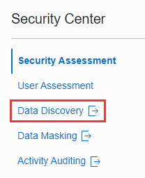

            **Note**: The Data Discovery wizard is displayed in the Oracle Data Safe Console

    - On the **Select Target for Sensitive Data Discovery** page, select your target database, and then click [**Continue**]

        

    - On the **Select Sensitive Data Model** page, fill it out:
    
        - Sensitive Data Model: select *`Create`*
        - Sensitive Data Model Name: *`SDM_Livelabs_DEV`*
        - Show and save sample data: *`Enable it`*
        - Compartment: select your Compartment
        
            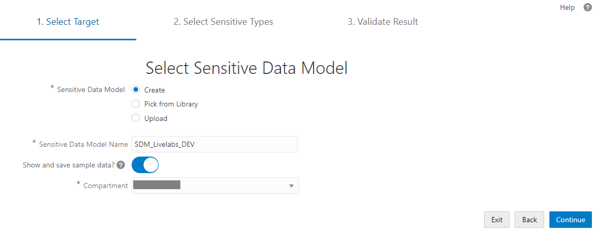
                
        - Then click [**Continue**]

    - On the **Select Schemas for Sensitive Data Discovery** page
    
        - Navigate through the results pages to find *`EMPLOYEESEARCH_DEV`* schema
        - Select it

            
        
        - Then click [**Continue**]

    - On the **Select Sensitive Types for Sensitive Data Discovery** page
    
        - Expand all of the categories by moving the slider to the right
    
            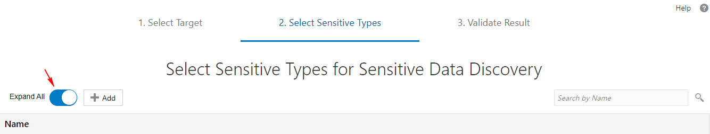

        - Then scroll down the page and review the sensitive types
        
            **Note**: Notice that you can select individual sensitive types, sensitive categories, and all sensitive types

        - At the top of the page, select the **Select All** check box, and then click [**Continue**] to start the data discovery job

            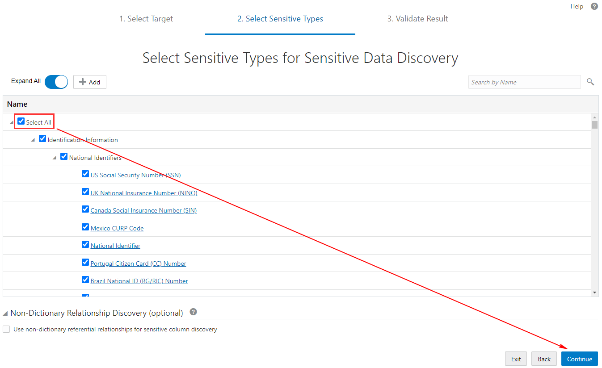

            **Note**: Accordingly the data volume and the resources, the job can take several minutes!

        - When the job is completed, ensure that the **Detail** column states "**Data discovery job finished successfully**"

            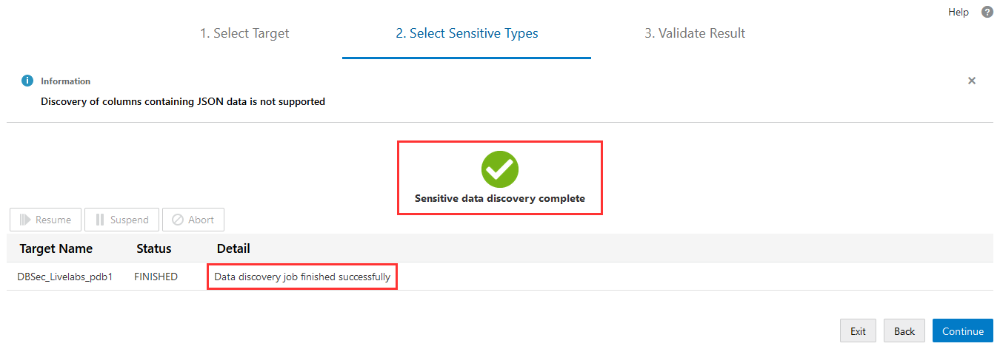

        - Then click [**Continue**]

    - On the **Sensitive Data Discovery Result** page, examine the sensitive data model created by the Data Discovery wizard
    
        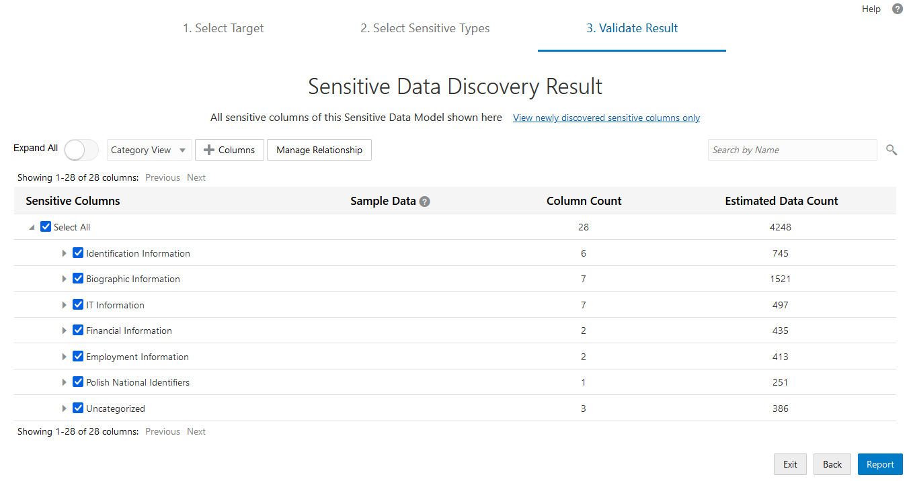
    
        **Note**: Oracle Data Safe automatically saves your sensitive data model to the Oracle Data Safe Library

    - To view all of the sensitive columns, move the **Expand All** slider to the right

        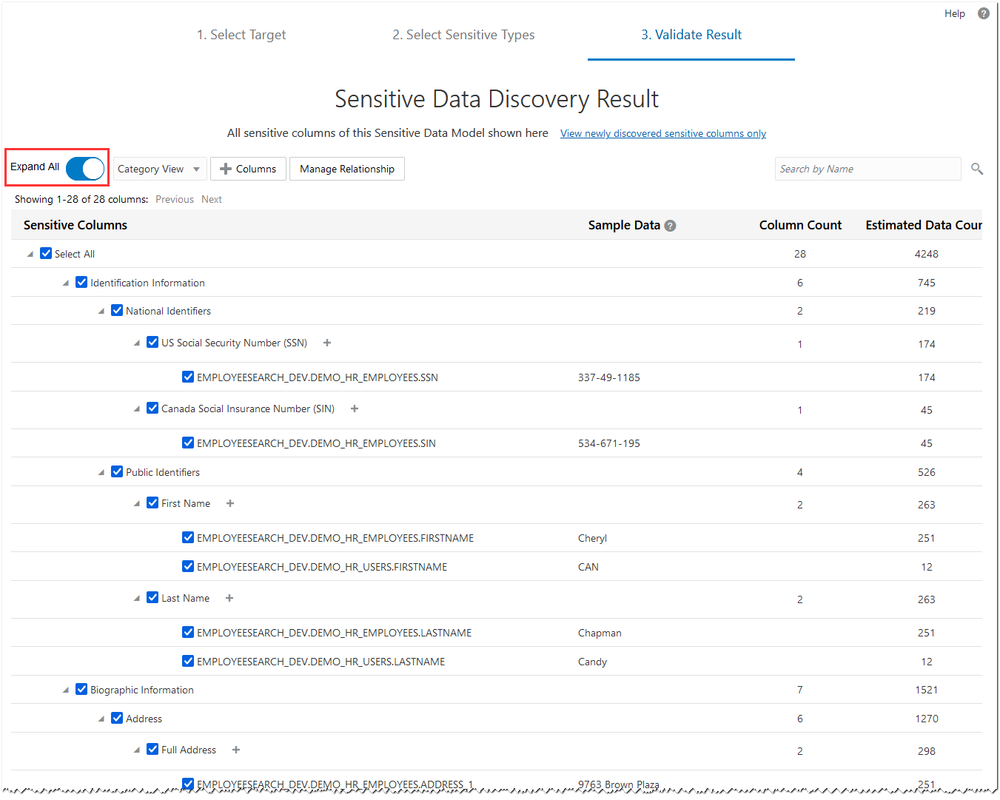

    - From the drop-down list, select "**Schema View**" instead of "Category View" to sort the sensitive columns by table name

        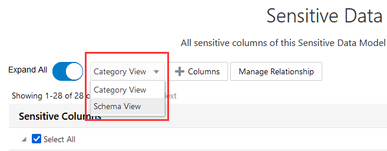

    - Scroll down the page to view the sensitive columns

        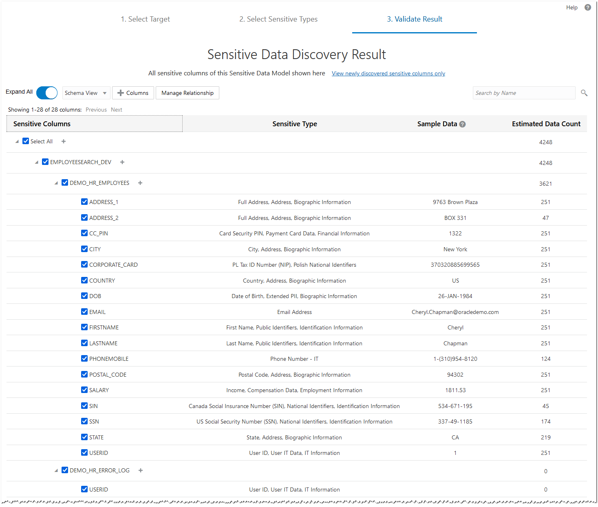

        - You can view sample data (if it's available for a sensitive column) and **estimated data counts**
        - In particular, view the sensitive columns that Data Discovery found in the `DEMO_HR_EMPLOYEES` table
        - Review the sample data provided to get an idea of what the sensitive data looks like

            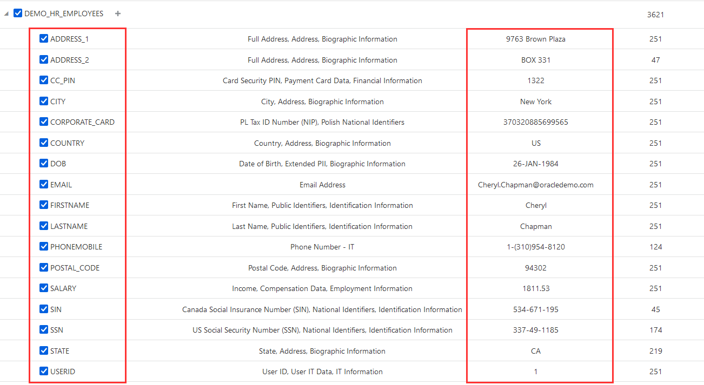

            **Note**:
            - Scroll down to `DEMO_HR_SUPPLEMENTAL_DATA` table, the Columns that do not have a check mark, such as `USERID`, are called referential relationships
            - They are included because they have a relationship to another sensitive column and that relationship is defined in the database's data dictionary

                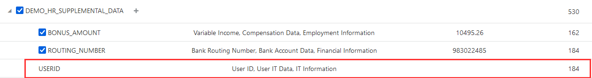

    - To generate the **Data Discovery** report, scroll to the bottom of the page, and then click [**Report**]

        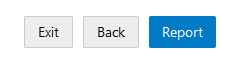

    - Review the **Data Discovery** report

        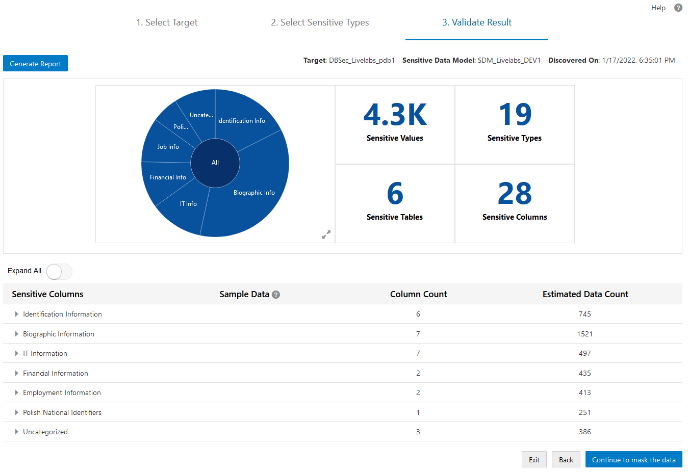

        **Note**:
        - The chart compares sensitive categories
        - You can view totals of sensitive values, sensitive types, sensitive tables, and sensitive columns
        - The table displays individual sensitive column names, sample data for the sensitive columns, column counts based on sensitive categories, and estimated data counts

    - Click the chart's **Expand** button

        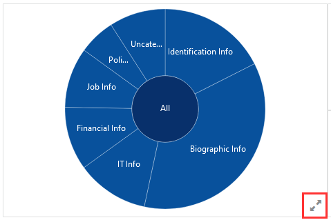

    - Position your mouse over **Identification Info** to view statistics

        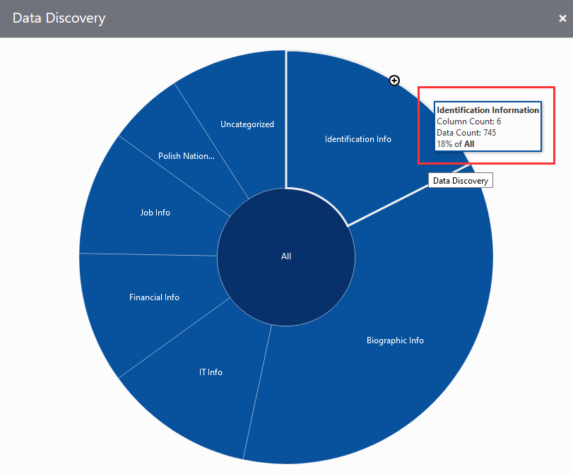

    - With your mouse still over **Identification Info**, click the **Expand** button ("+" icon) to drill down

        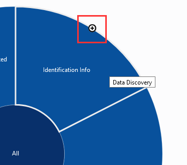

    - Notice that the **Identification Info** category is divided into two smaller categories (**National IDs** and **Public IDs**)
    
        
    
        **Note**: To drill-up, position your mouse over an expanded sensitive category (for example, **Identification Info**), and then click the **Collapse** button ("-" icon)

    - Click the **Close** button (**X**) to close the expanded chart and continue to work in the wizard

3. Mask sensitive data by using Data Masking

    The Data Masking wizard generates a masking policy for your target database based on a sensitive data model. In the wizard, you select the sensitive columns that you want to mask and the masking formats to use

    - At the bottom of the Data Discovery report, click [**Continue to mask the data**]
    
        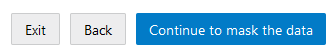
    
        **Note**: The Data Masking wizard is displayed!

    - On the **Select Target for Data Masking** page, leave your target database selected, and click [**Continue**]

        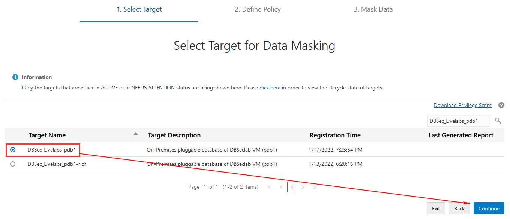

    - On the **Masking Policy** page, let's be familiar with the Data Masking formats
    
        - Move the **Expand All** slider to the right to view all of the sensitive columns

            

        - Scroll down the page and review the default masking format selected for each sensitive column

            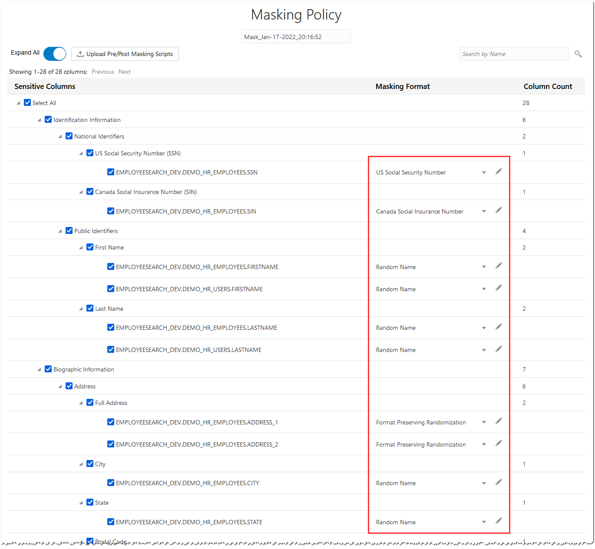

        - For the `EMPLOYEESEARCH_DEV.DEMO_HR_EMPLOYEES.FIRSTNAME` column, click the arrow to the right of the masking format to view other masking formats

            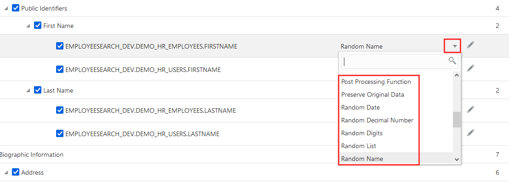

        - Next to the arrow, click the **Edit Format** button (pencil icon)

            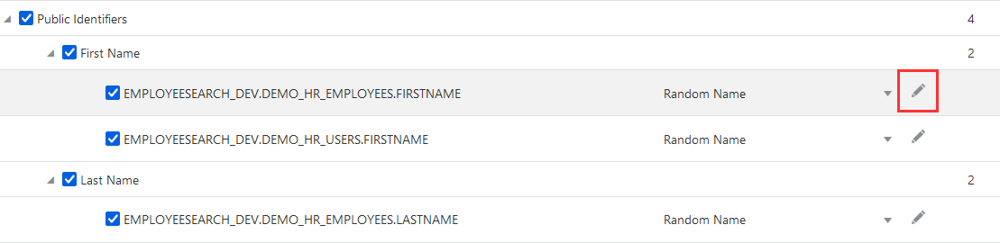

        - In the **Edit Format** dialog box, review the details for the masking format, including the datatype, description, examples, and default configuration

            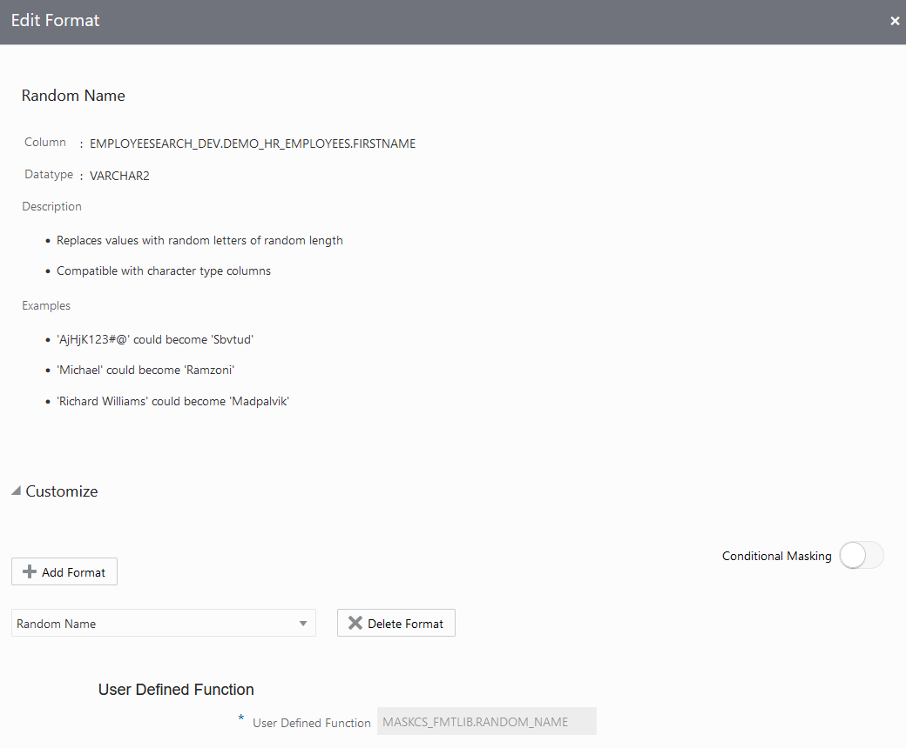

            **Note**: This is where you can modify a masking format, if needed!

        - Click [**Cancel**]

            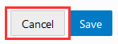
    
    - Now, let's generate the Data Masking script for only our sensitive columns
    
        - Unselect the "**Select All**" checkbox

            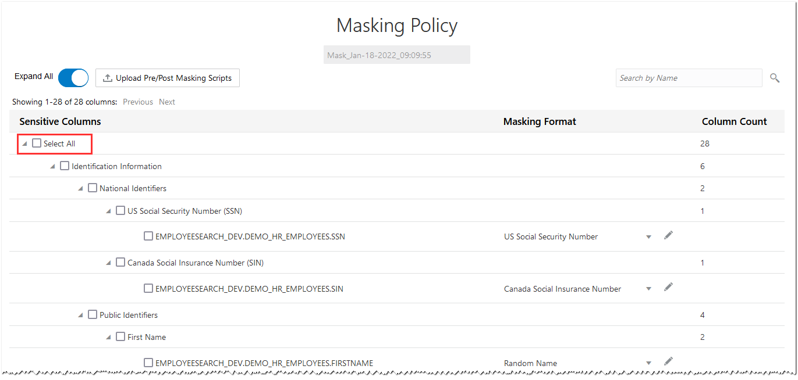

        - Scroll down and for *`EMPLOYEESEARCH_DEV.DEMO_HR_EMPLOYEES`* table only, select the columns *`FIRSTNAME`*, *`LASTNAME`*, *`SALARY`*, *`CORPORATE_CARD`*, *`EMAIL`* and *`PHONEMOBILE`*

            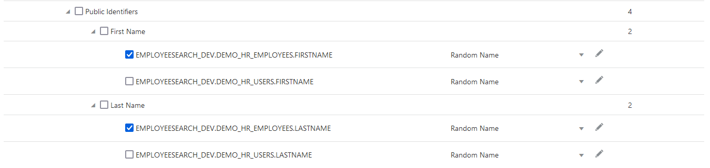

            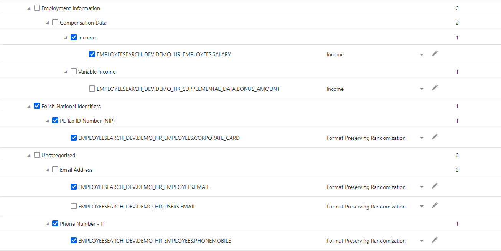

        - At the bottom of the page, click [**Confirm Policy**]

            

    - Wait a moment while Data Masking creates the masking policy

    - On the **Schedule the Masking Job** page, leave **Right Now** selected, and click [**Review**]

        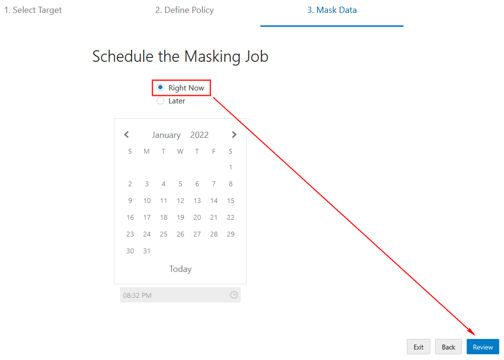

    - On the **Review and Submit** page, review the information, and then click [**Submit**] to start the data masking job

        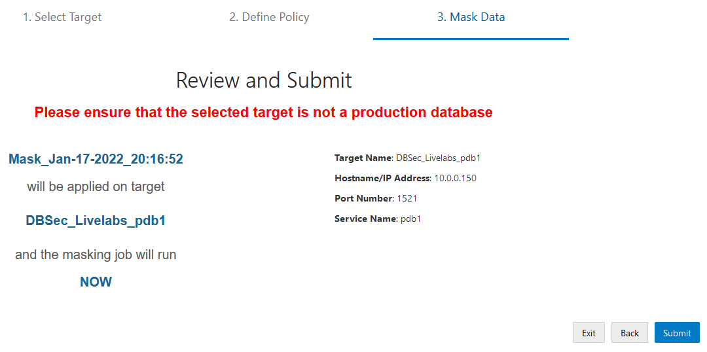

    - Wait for the data masking job to finish

        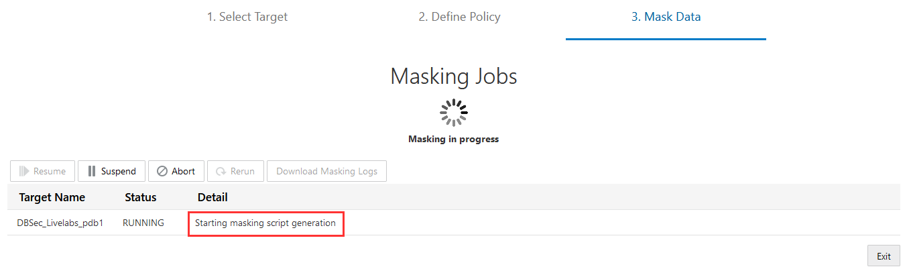

        **Note**:
        - It will start by creating the script and then execute it
        - It could take a couple of minutes and you can follow the completion of all steps on the **Masking Jobs** page

    - When the job is finished, the status must display "FINISHED"

        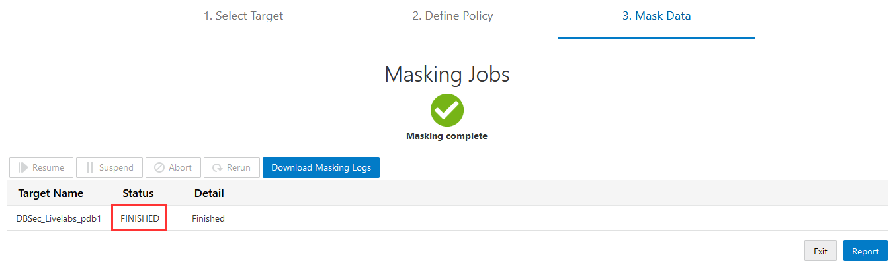

    - Now, click **Report**

        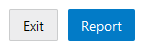

    - Examine the **Data Masking** report

        - At the top of the report, you can view the number of masked values, masked sensitive types, masked tables, and masked columns

            

            **Note**: The table shows you column counts for the sensitive categories and types

        - Expand all of the categories by moving the slider to the right
        
            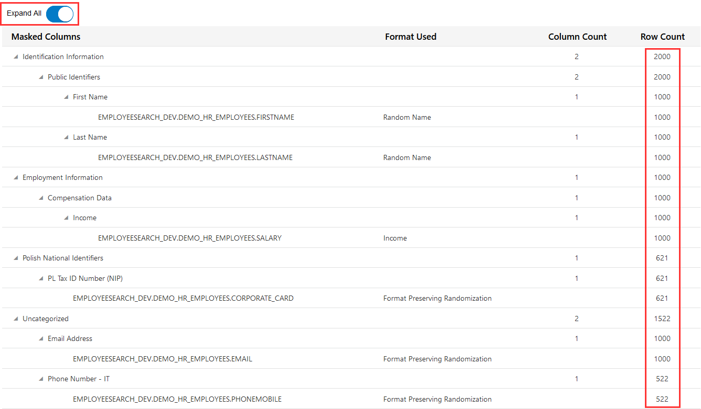

            **Note**: For each sensitive column, you can view the masking format used and the number of rows masked

4. Create a PDF of the Data Masking report

    - At the top of the report, click [**Generate Report**]
    
        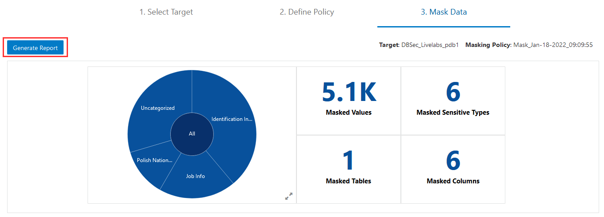

    - The **Generate Report** dialog box is displayed

        - Leave **PDF** selected

        - Enter *Masked "Employees Dev" sensitive data report* for the description

        - Select your compartment

            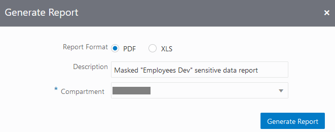

    - Click [**Generate Report**]
    
    - Wait for the report to generate

        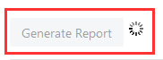

    - When a confirmation message states that the **Report was generated successfully**, click [**Download Report**]

        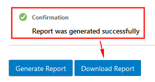

    - Save the report and then open it in Adobe Acrobat

        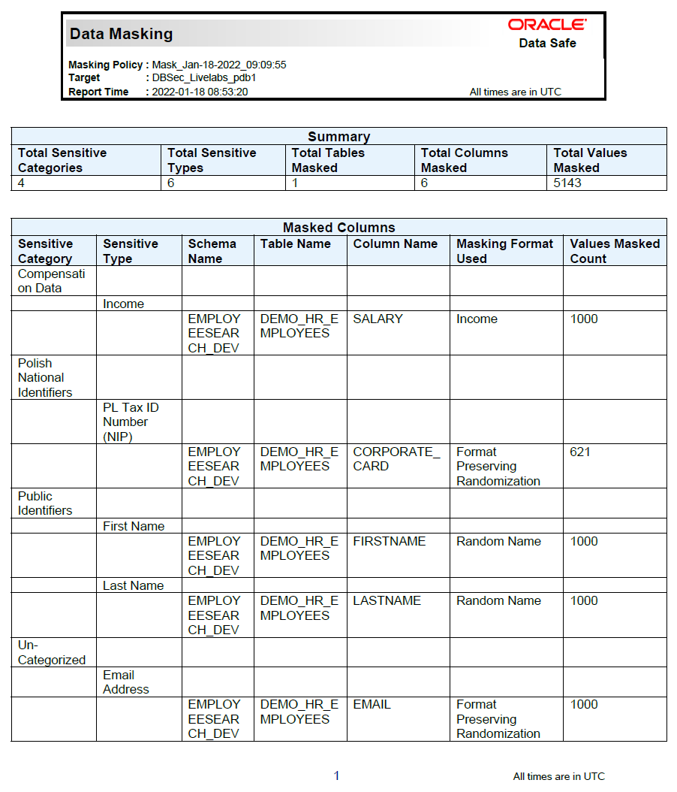

        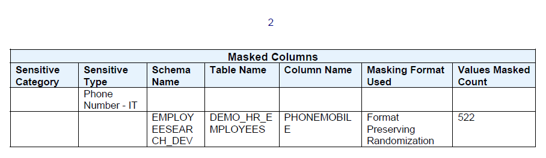

    - Review the data, and then close the report

5. Finally, let's validate the masked data in your database

    - Go back to your Terminal session on your **DBSec-Lab** VM as OS user *oracle*

    - Rerun the query to compare the sensitive data after masking it

        ````
        <copy>./ds_query_employee_data.sh</copy>
        ````

        ... results in PROD (**original data**)

        

        ... results in DEV (**data masked**)

        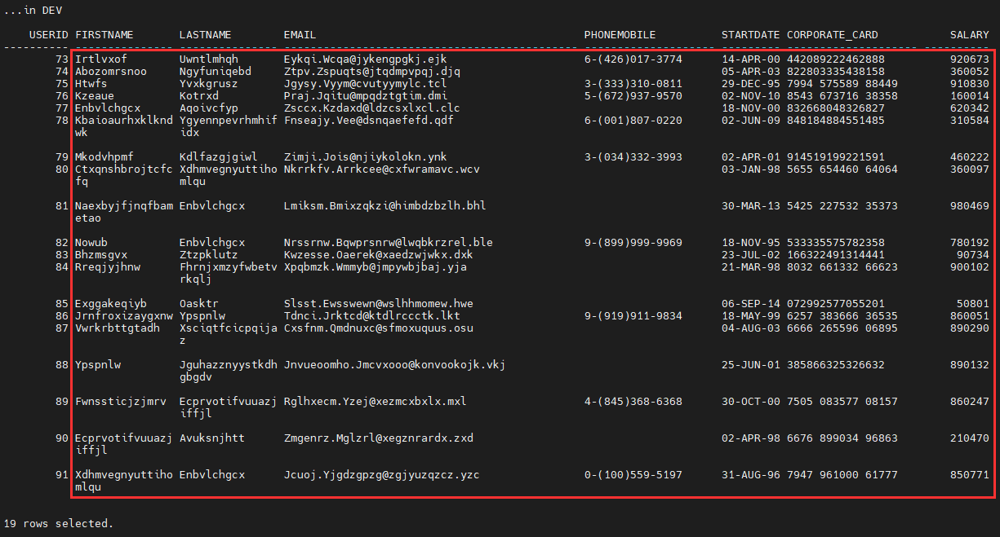

    - Take a moment to compare the original data (in PROD) to the masked data (in DEV) to check that it's different

6. Now, you can restore the masked data (DEV) from the orginial values (PROD)

    ````
    <copy>./ds_restore_pdb1_dev.sh</copy>
    ````

    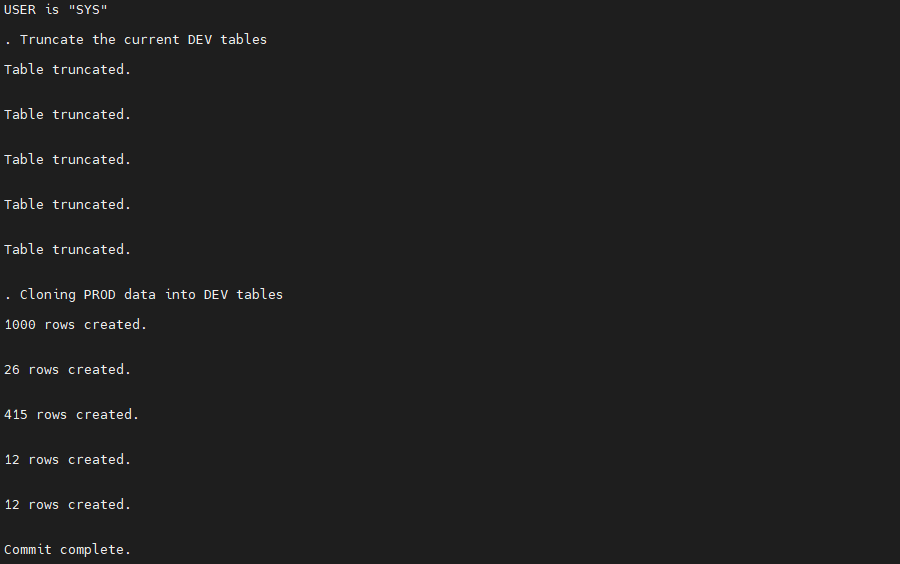


## Task 6: (Optional) Reset Oracle Data Safe configuration

1. From the Data Safe console

    - Deregister the target from Data Safe
        
        - On the Burger menu, click on **Oracle Database**, and then **Data Safe**

        - Click **Target Databases**

            

        - Click on the **Target Name** to deregister (here "*`DBSec_Livelabs_pdb1`*")

            

        - From the **More Actions** menu, click **Deregister**

            

        - Click [**Deregister**] to confirm the deregistration

            
        
        - The target is deregistered when the status is "**DELETED**" 

            

    - Next, delete the On-Premises connector from Data Safe

        - In the "**Connectivity Options** sub-menu, click on "**On-Premises Connectors**" 

            

        - Click on your **On-Premises Connector** (here "*`DBSec_Livelabs_DBs`*")

            

        - Click [**Delete**]

            

        - Click [**Delete**] to confirm the deletion

            
        
        - The On-Premises Connector should now have disappeared from the list!

2. Go back to your Terminal session on your **DBSec-Lab** VM as OS user *oracle*

    - Drop the Data Safe **DS_ADMIN** user on `pdb1`

        ````
        <copy>
        cd $DBSEC_LABS/data-safe
        ./ds_drop_user.sh pdb1
        </copy>
        ````

        

    - Delete the On-Premises connector from Database server

        ````
        <copy>
        python $DS_HOME/setup.py stop
        rm -Rf $DS_HOME/*
        </copy>
        ````

        

3. **Now your Data Safe configuration is correctly reset!**

You may now [proceed to the next lab](#next)

## **Appendix**: About the Product
### **Overview**

Oracle Data Safe is Oracle’s platform for securing data in databases. As a native Oracle Cloud Infrastructure service, Oracle Data Safe lets you assess the security of your database configurations, find your sensitive data, mask that data in non-production environments, discover the risks associated with database users, and monitor database activity.


### **Benefits of Using Oracle Data Safe**
XXXXXX

## Want to Learn More?
Technical Documentation:
- [Oracle Data Safe website](https://www.oracle.com/database/technologies/security/data-safe.html)
- [Oracle Data Safe documentation on Oracle Cloud Infrastructure](https://docs.oracle.com/en-us/iaas/data-safe/index.html)
- [Oracle Data Safe videos](https://docs.oracle.com/en/cloud/paas/data-safe/videos.html)
- [Oracle Data Safe data sheet](https://www.oracle.com/a/tech/docs/dbsec/data-safe/ds-security-data-safe.pdf)
- [Oracle Data Safe frequently asked questions](https://www.oracle.com/a/tech/docs/dbsec/data-safe/faq-security-data-safe.pdf)

Video:
- *Oracle Data Safe Update (May 2020)* [](youtube:SXJl-Ab_zIo)
- *Keeping your Data Safe - on-premises! (April 2021)* [](youtube:xq2gf2Gn63o)
- *Information Lifecycle Management in Data Safe (April 2021)* [](youtube:rPzumDNWBZs)
- *Advanced Data Masking scenarios in Data Safe (May 2021)* [](youtube:6h1dLzLS2p8)
- *Update on Data Safe target registration (July 2021)* [](youtube:5eMnM9mEcN0)
- *Oracle Data Safe Assessment: New features, new user interface (October 2021)* [](youtube:LzDLNUdn3hg)

## Acknowledgements
- **Author** - Hakim Loumi, Database Security PM
- **Contributors** - Bettina Schaeumer, Rene Fontcha
- **Last Updated By/Date** - Hakim Loumi, Database Security PM - December 2021
