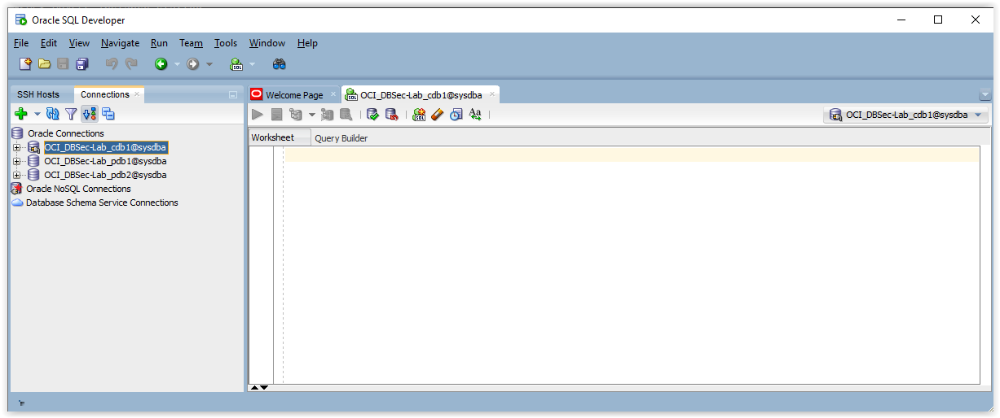

# Initialize Environment

## Introduction
This lab will show you how to initialize and start the DBSecLab environment

### Objectives
-   Import the latest labs scripts from Oracle repository
-   Start all the DBSec-Lab components

### Prerequisites
This lab assumes you have:
- A Free Tier, Paid or LiveLabs Oracle Cloud account
- SSH Private Key to access the host via SSH
- You have completed:
    - Lab: Generate SSH Keys
    - Lab: Prepare Setup (Free Tier and Paid Oracle Cloud Accounts Only)
    - Lab: Environment Setup

## **STEP 1**: Initialize the DBSec-Lab environment

Before performing the workshop, please make sure you have the latest labs scripts!

1. Open a SSH session on your DBSec-Lab VM as Oracle User

      ````
    <copy>sudo su - oracle</copy>
      ````

2. Go to the scripts directory

      ````
    <copy>cd $DBSEC_HOME</copy>
      ````

3. Import the latest workshop scripts from Oracle's GitHub repository

      ````
    <copy>./update_workshop.sh</copy>
      ````

	**Note**:
	- Oracle DB Security Product Management team is constantly updating the scripts labs (new features or corrections). So, please execute `./update_workshop.sh` as frequently as possible before using this workshop!
	- If your scripts are already up-to-date, you will have the following message:

   

    - Otherwise the new scripts will be imported!

## **STEP 2**: Start all the DBSec-Lab components

1. Start DBSec-Lab Environement

      ````
    <copy>./start_DBSecLab.sh</copy>
      ````

	**Note**: It can take up to 10 minutes (with 4 oCPUs)

2. Once it's started, check that all necessary labs resources are operational

	- From your web browser, make sure you have access the following resources:
		- Oracle EM 13c      : `https://<YOUR_DBSECLAB-VM_PUBLIC-IP>:7803/em`
		- "My HR Application" on Glassfish:
			- PDB1 PROD        : `http://<YOUR_DBSECLAB-VM_PUBLIC-IP>:8080/hr_prod_pdb1`
			- PDB1 DEV         : `http://<YOUR_DBSECLAB-VM_PUBLIC-IP>:8080/hr_dev_pdb1`   (bg: red)
		  	- PDB2 PROD        : `http://<YOUR_DBSECLAB-VM_PUBLIC-IP>:8080/hr_prod_pdb2`  (menu: red)
		  	- PDB2 DEV         : `http://<YOUR_DBSECLAB-VM_PUBLIC-IP>:8080/hr_dev_pdb2`   (bg: red & menu: red)

    - Optionally, run SQL Developer and connect to the databases CDB1, PDB1 and PDB2 (Port 1521) directly or through a SSH Host

      

      **Note**: In case of error, please check your **internet connection settings** (Web Application Firewall (WAF) or Web Proxy)

3. **Congratulations, now your environment is up and running and you can start performing the labs!**

## Acknowledgements
- **Author** - Hakim Loumi, Database Security PM
- **Contributors** - Pedro Lopes, Gian Sartor, Rene Fontcha
* **Last Updated By/Date** - Rene Fontcha, Master Principal Solutions Architect, NA Technology, October 2020

## Need Help?
Please submit feedback or ask for help using our [LiveLabs Support Forum](https://community.oracle.com/tech/developers/categories/livelabsdiscussions). Please click the **Log In** button and login using your Oracle Account. Click the **Ask A Question** button to the left to start a *New Discussion* or *Ask a Question*.  Please include your workshop name and lab name.  You can also include screenshots and attach files.  Engage directly with the author of the workshop.

If you do not have an Oracle Account, click [here](https://profile.oracle.com/myprofile/account/create-account.jspx) to create one.
