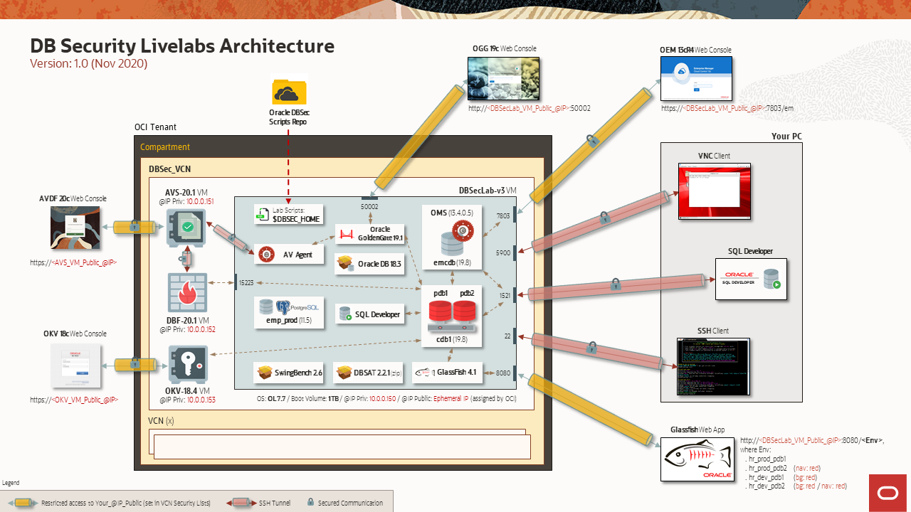

# Introduction

## About this Workshop
### Overview
*Estimated Time to complete the workshop*: 110 minutes

This workshop is the FIRST PART of the Hands-On Labs dedicated to the Oracle Database Security features and functionalities - for the second workshop, please refer to the *DB Security Fundamentals*.

Based on an OCI architecture, deployed in a few minutes with a simple internet connection, it allows you to test DB Security use cases in a complete environment already pre-configured by the Oracle Database Security Product Manager Team.

Now, you no longer need important resources on your PC (storage, CPU or memory), nor complex tools to master, making you completely autonomous to discover at your rhythm all new DB Security features.

### Components
The complete architecture of the DB Security Hands-On Labs is as following:

  

It's composed of 4 VMs:
  - **DBSec-Lab VM** (mandatory for all workshops: Baseline and Advanced workshops)
  - **Audit Vault Server VM** (for Advanced workshop only)
  - **DB Firewall Server VM** (for Advanced workshop only)
  - **Key Vault Server VM** (for Advanced workshop only)

During this mini-lab, you'll use different resources to interact with these VMs:
  - SSH Terminal Client
  - (Optionally) SQL Developer

So that your experience of this workshop is the best possible, DO NOT FORGET to perform "Lab: *Initialize Environment*" to be sure that all these resources are correctly set!

### Objectives
This Hands-On Labs give the user an opportunity to learn how to configure the DB Security features to protect and secure their databases from the Baseline to the Maximum Security Architecture (MSA).

In this mini-lab, you will learn how to use the **Oracle Database Security Assessment Tool** (DBSAT) features.

The entire DB Security PMs Team wishes you an excellent workshop!

## Acknowledgements
- **Author** - Hakim Loumi, Database Security PM
- **Contributors** - Pedro Lopes, Gian Sartor, Rene Fontcha
- **Last Updated By/Date** - Hakim Loumi, 2nd November 2020

## Need Help?
Please submit feedback or ask for help using our [LiveLabs Support Forum](https://community.oracle.com/tech/developers/categories/livelabsdiscussions). Please click the **Log In** button and login using your Oracle Account. Click the **Ask A Question** button to the left to start a *New Discussion* or *Ask a Question*.  Please include your workshop name and lab name.  You can also include screenshots and attach files.  Engage directly with the author of the workshop.

If you do not have an Oracle Account, click [here](https://profile.oracle.com/myprofile/account/create-account.jspx) to create one.
