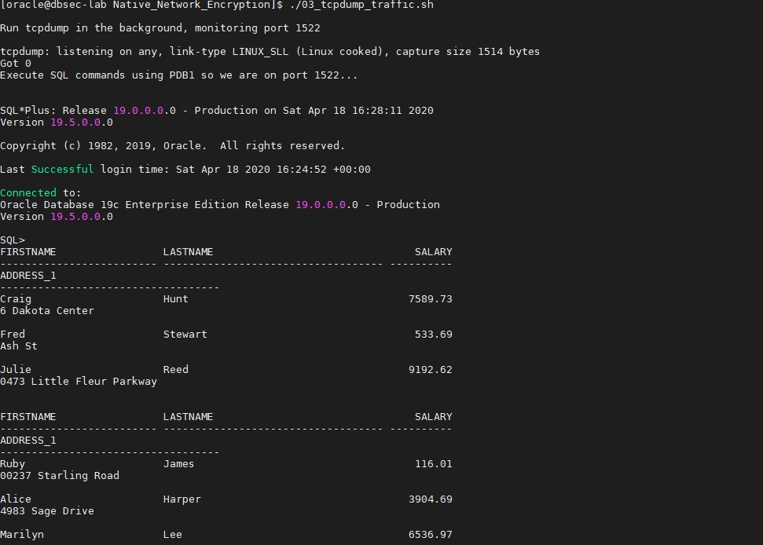
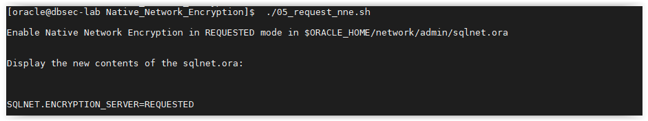

# Oracle Native Network Encryption (NNE)

## Introduction
This workshop introduces the functionality of Oracle Native Network Encryption (NNE). It gives the user an opportunity to learn how to configure this feature to encrypt and secure its data in-motion.

*Estimated Lab Time:* 15 minutes

*Version tested in this lab:* Oracle DB 19.8

### Objectives
- Enable/Disable the Native Network Encryption on your database
- Check the network encryption effects before/after enabling

### Prerequisites
This lab assumes you have:
- A Free Tier, Paid or LiveLabs Oracle Cloud account
- SSH Private Key to access the host via SSH
- You have completed:
    - Lab: Generate SSH Keys
    - Lab: Prepare Setup (Free Tier and Paid Oracle Cloud Accounts Only)
    - Lab: Environment Setup
    - Lab: Initialize Environment

### Lab Timing (estimated)
| Step No. | Feature | Approx. Time |
|--|------------------------------------------------------------|-------------|
| 1 | Check the current network configuration | <5 minutes |
| 2 | Generate and capture SQL traffic | 5 minutes |
| 3 | Enable the network encryption | 5 minutes |
| 4 | (Optional) Disable the network encryption | <5 minutes |

## **STEP 1**: Check the current network configuration

1. Open a SSH session on your DBSec-Lab VM as Oracle User

      ````
      <copy>sudo su - oracle</copy>
      ````

2. Go to the scripts directory

      ````
      <copy>cd $DBSEC_HOME/workshops/Database_Security_Labs/Network_Encryption/Native_Network_Encryption</copy>
      ````

3. View your SQL*Net.ora file content

      ````
      <copy>./01_view_sqlnet_ora.sh</copy>
      ````

    **Note**: It should be empty!

   

4. Check if the network is already encrypted

      ````
      <copy>./02_is_session_encrypted.sh</copy>
      ````

   


## **STEP 2**: Generate and capture SQL traffic

1. Run tcpdump on the traffic to analyze the packets in transit on the network

      ````
      <copy>./03_tcpdump_traffic.sh</copy>
      ````

   

    **Note**:
    - The output has been saved to tcpdump.pcap
    - There are a lot of tools available to analyze pcap files

2. Next, we will capture traffic across the wire for the Glassfish application. Open a web browser window to `http://<YOUR_DBSEC-LAB_VM_PUBLIC_IP>:8080/hr_prod_pdb1`

3. On your terminal session, begin the capture script

      ````
      <copy>./04_capture_empsearch_traffic.sh</copy>
      ````

4. On your Glassfish App, perform the the following steps:

    - Login to the HR Application as `hradmin` with the password `Oracle123`

   

   

    - Click on **Search Employees**

   

    - Click [**Search**]

   

5. Go back to your terminal session to see traffic content

   

6. When you have seen the un-encrypted data, use `[Ctrl]+C` to stop the `04_capture_empsearch_traffic.sh` script

## **STEP 3**: Enable the network encryption
You will enable SQL*Net encryption with the `REQUESTED` value for `SQLNET.ENCRYPTION_SERVER`

1. To begin with, we use this option because it will allow non-encrypted connections to still connect. While this rarely has an impact, it is often important to do this so the change does not interfere with production systems that cannot encrypt between the client and the database!

      ````
      <copy>./05_request_nne.sh</copy>
      ````

   

    **Note**: There's an alternative to Native Network Encryption, it's TLS certificates but those require user management and more configuration

2. Now, re-run the script to check if the session is encrypted

      ````
      <copy>./06_is_session_encrypted.sh</copy>
      ````

   

    **Note**: You should notice an additional line that says `AES256 Encryption service adapter for Linux`

3. Now, re-run tcpdump on the traffic

      ````
      <copy>./07_tcpdump_traffic.sh</copy>
      ````

   

    **Note**: The `DEMO_HR_EMPLOYEES` table data is still queryable but when it shows up in tcpdump it shows up as **junk** because the session is encrypted

4. Now, you will test the Glassfish application queries to see the impact of the network encryption

    - On your terminal session capture the traffic generated

          ````
        <copy>./08_capture_empsearch_traffic.sh</copy>
          ````

   

    - In your browser, **logout** the Glassfish application and **login** again as `hradmin` to see what happens when we sniff this traffic

   

   

    - Click on **Search Employees**

   

    - Click [**Search**]

   

5. Go back to your terminal session to see traffic content

   

    **Note**:
    - The data is encrypted between our Glassfish application (JDBC Thin Client) and the database
    - This works immediately (or after a refresh) because our Glassfish application creates a new connection for each query. A real application would probably need to be stopped and restarted to disconnect the existing application connections from the database!

6. When you have seen the encrypted data, use `[Ctrl]+C` to stop the `08_capture_empsearch_traffic.sh` script

## **STEP 4**: (Optional) Disable the network encryption

1. When you have completed the lab, you can return the Native Network Encryption to the default settings

      ````
      <copy>./09_remove_nne.sh</copy>
      ````

   

You may proceed to the next lab.

## **Appendix**: About the Product
### **Overview**

Oracle Database provides native **data network encryption and integrity** to ensure that data in-motion is secure as it travels across the network.

   

The purpose of a secure cryptosystem is to convert plaintext data into unintelligible ciphertext based on a key, in such a way that it is very hard (computationally infeasible) to convert ciphertext back into its corresponding plaintext without knowledge of the correct key.

In a symmetric cryptosystem, the same key is used both for encryption and decryption of the same data. Oracle Database provides the **Advanced Encryption Standard (AES) symmetric cryptosystem** for protecting the confidentiality of Oracle Net Services traffic.

Oracle SQL*Net traffic can be encrypted by using:
- Native Network Encryption
- TLS certificate-based encryption

## Want to Learn More?
Technical Documentation: [Oracle Native Network Encryption 19c](https://docs.oracle.com/en/database/oracle/oracle-database/19/dbseg/configuring-network-data-encryption-and-integrity.html)

## Acknowledgements
- **Author** - Hakim Loumi, Database Security PM
- **Contributors** - Gian Sartor, Rene Fontcha
* **Last Updated By/Date** - Rene Fontcha, Master Principal Solutions Architect, NA Technology, October 2020

## Need Help?
Please submit feedback or ask for help using our [LiveLabs Support Forum](https://community.oracle.com/tech/developers/categories/livelabsdiscussions). Please click the **Log In** button and login using your Oracle Account. Click the **Ask A Question** button to the left to start a *New Discussion* or *Ask a Question*.  Please include your workshop name and lab name.  You can also include screenshots and attach files.  Engage directly with the author of the workshop.

If you do not have an Oracle Account, click [here](https://profile.oracle.com/myprofile/account/create-account.jspx) to create one.
