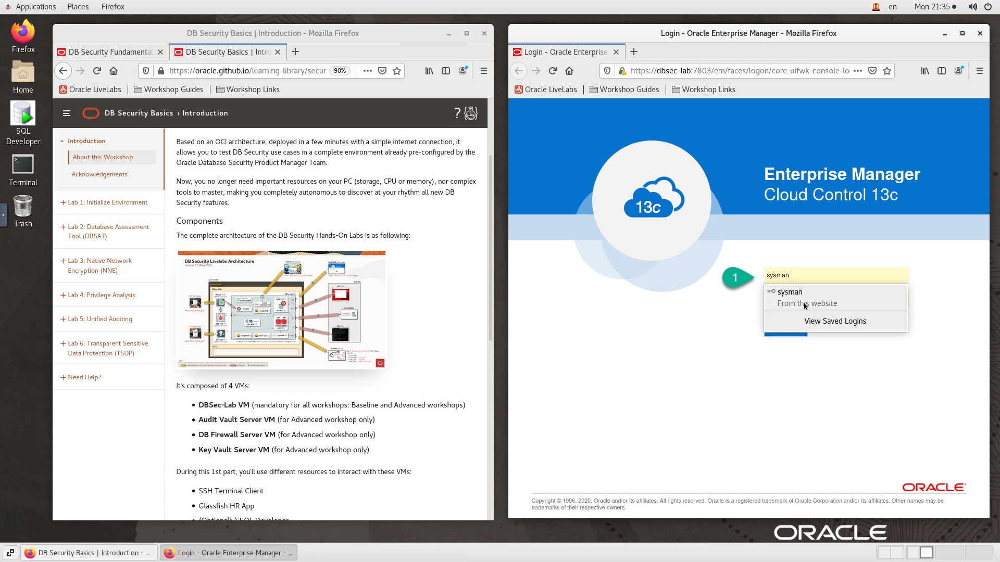

# Initialize Environment

## Introduction

In this lab we will review and startup all components required to successfully run this workshop.

*Estimated Lab Time:* 10 Minutes.

### Objectives
- Initialize the workshop environment.

### Prerequisites
This lab assumes you have:
- A Free Tier, Paid or LiveLabs Oracle Cloud account
- SSH Private Key to access the host via SSH
- You have completed:
    - Lab: Generate SSH Keys (*Free-tier* and *Paid Tenants* only)
    - Lab: Prepare Setup (*Free-tier* and *Paid Tenants* only)
    - Lab: Environment Setup

## **STEP 1:** Validate That Required Processes are Up and Running.

*Note:* All screenshots for SSH terminal type tasks featured throughout this workshop were captured using the *MobaXterm* SSH Client as described in this step. As a result when executing such tasks from within the graphical remote desktop session you can skip steps requiring you to login as user *oracle* using *sudo su - oracle*, the reason being that the remote desktop session is under user *oracle*.

1. Now with access to your remote desktop session, proceed as indicated below to validate your environment before you start executing the subsequent labs. The following Processes should be up and running:

    - Database Listener
    - Database Servers (emcdb and cdb1)
    - Enterprise Manager - Management server (OMS)
    - Enterprise Manager - Management Agent (emagent)
    - My HR Applications on Glassfish

2. On the *Firefox* window on the right preloaded with *Enterprise Manager*, do the following:
    - Click on the *Workshop Links* folder in the *Firefox* toolbar area
    - Open the *Common to All Workshops* folder
    - Click on *Open All in Tabs*.  

    

    - Optionally, If you want to further validate login for *Enterprise Manager*, click on the *Username* field and select the saved credentials to login. These credentials have been saved within *Firefox* and are provided below for reference

    ```
    Username: <copy>sysman</copy>
    ```

    ```
    Password: <copy>Oracle123</copy>
    ```

    

3. Confirm successful rendering of *EM 13c Console* and *My HR Applications* in 3 new tabs. Please note that it takes about 10 minutes after instance provisioning for all processes to fully start.

    If all are successful, then your environment is ready.  

4. If you are still unable to get all 3 links to render successfully, open a terminal session and proceed as indicated below to validate the services.

    - Database services (All databases and Standard Listener)

        ```
        <copy>
        sudo systemctl status oracle-database
        </copy>
        ```

        
        

    - DBSec-lab Service (Enterprise Manager 13c and My HR Applications on Glassfish)

        ```
        <copy>
        sudo systemctl status oracle-dbsec-lab
        </copy>
        ```

        

5. If you see questionable output(s), failure or down component(s), restart the corresponding service(s) accordingly

    - Database and Listener
        ```
        <copy>
        sudo systemctl restart oracle-database
        </copy>
        ```

    - DBSec-lab Service

        ```
        <copy>
        sudo systemctl restart oracle-dbsec-lab
        </copy>
        ```

You may now [proceed to the next lab](#next).

## Appendix 1: Managing Startup Services

1. Database services (All databases and Standard Listener)

    - Start

    ```
    <copy>sudo systemctl start oracle-database</copy>
    ```
    - Stop

    ```
    <copy>sudo systemctl stop oracle-database</copy>
    ```

    - Status

    ```
    <copy>sudo systemctl status oracle-database</copy>
    ```

    - Restart

    ```
    <copy>sudo systemctl restart oracle-database</copy>
    ```

2. DBSec-lab Service (Enterprise Manager 13c and My HR Applications on Glassfish)

    - Start

    ```
    <copy>sudo systemctl start oracle-dbsec-lab</copy>
    ```

    - Stop

    ```
    <copy>sudo systemctl stop oracle-dbsec-lab</copy>
    ```

    - Status

    ```
    <copy>sudo systemctl status oracle-dbsec-lab</copy>
    ```

    - Restart

    ```
    <copy>sudo systemctl restart oracle-dbsec-lab</copy>
    ```

## Appendix 2: External Web Access

If for any reason you want to login from a location that is external to your remote desktop session such as your workstation/laptop, then refer to the details below.

1.  Enterprise Manager 13c Console

    ```
    Username: <copy>sysman</copy>
    ```

    ```
    Password: <copy>Oracle123</copy>
    ```

    ```
    URL: <copy>http://<Your Instance public_ip>:7803/em</copy>
    ```

    - *Note:* You may see an error on the browser while accessing the Web Console - “*Your connection is not private*” as shown below. Ignore and add the exception to proceed.

    
    

2. My HR Applications on Glassfish

    - PDB1
      - Prod        : `http://<YOUR_DBSECLAB-VM_PUBLIC-IP>:8080/hr_prod_pdb1`
      - Dev         : `http://<YOUR_DBSECLAB-VM_PUBLIC-IP>:8080/hr_dev_pdb1`   (bg: red)
    - PDB2
      - Prod        : `http://<YOUR_DBSECLAB-VM_PUBLIC-IP>:8080/hr_prod_pdb2`  (menu: red)
      - Dev         : `http://<YOUR_DBSECLAB-VM_PUBLIC-IP>:8080/hr_dev_pdb2`   (bg: red & menu: red)

## Appendix 3: External Terminal Access (using SSH Key Based Authentication)

While you will only need the browser to perform all tasks included in this workshop, you can optionally use your preferred SSH client to connect to the instance should you prefer to run SSH Terminal tasks from a local client (e.g. Putty, MobaXterm, MacOS Terminal, etc.) or need to perform any troubleshooting task such as restarting processes, rebooting the instance, or just look around.

1. Refer to *Lab Environment Setup* for detailed instructions relevant to your SSH client type (e.g. Putty on Windows or Native such as terminal on Mac OS):

    - From the web session where you completed your provisioning request, do:
        - For **Reserve Workshop on LiveLabs** - Navigate to "*My Reservations* >> *Launch Workshop* >> *Workshop Instructions* >> *Lab: Environment Setup*"
        - For **Launch Free Trial Workshop** and **Run on Your Tenancy** - Click on the corresponding provisioning option and open *Lab: Environment Setup*
    - Authentication OS User - “*opc*”
    - Authentication method - *SSH RSA Key*
    - OS User – “*oracle*”.

1. First login as “*opc*” using your SSH Private Key

2. Then sudo to “*oracle*”. E.g.

    ```
    <copy>sudo su - oracle</copy>
    ```

## Acknowledgements
- **Author** - Rene Fontcha, LiveLabs Platform Lead, NA Technology
- **Contributors** - Hakim Loumi
* **Last Updated By/Date** - Rene Fontcha, LiveLabs Platform Lead, NA Technology, July 2021
