# Analyze Alerts and Audit Reports

## Introduction
After you enable audit data collection on a target database in Oracle Data Safe, you can analyze the audit data via alerts and audit reports. Begin by viewing and manipulating the generated alerts for your Autonomous Transaction Processing (ATP) database. You can do so from the Alerts tab and from the dashboard on the Home tab in the Oracle Data Safe Console. Also analyze the collected audit data by viewing and modifying various audit reports. Finish by creating your own custom report that shows user login activity.

Estimated Lab Time: 20 minutes

### Objectives

You learn how to perform the following tasks:

- View and close alerts
- Analyze open alerts from the dashboard
- View all audit records for the past week
- View a summary of collected audit events and raised alerts
- Create a logins report

### Prerequisites

Before starting, be sure that you have completed the following prerequisite tasks:

- You obtained an Oracle Cloud account and signed in to the Oracle Cloud Infrastructure Console.
- You prepared your environment for this workshop. If not, see [Prepare Your Environment](?lab=prepare-environment). It's important that your ATP database is registered with Oracle Data Safe, the Activity Auditing feature is enabled on your database, and you have the appropriate privileges in Oracle Data Safe to use the Activity Auditing feature with your database.
- You registered your Autonomous Database with Oracle Data Safe and loaded sample data into it. If not, see [Register an Autonomous Database](?lab=register-autonomous-database).
- Audit data collection is started in Oracle Data Safe for your database. If not, see [Provision Audit and Alert Policies](?lab=provision-audit-alert-policies).

### Assumptions

- Your data values are most likely different than those shown in the screenshots.

## **STEP 1**: View and close alerts

1. If you are already signed in to the Oracle Data Safe Console, click the **Oracle Data Safe** tab in your browser.

2. If you are not signed in to the Oracle Data Safe Console, do the following:

    1. Click the browser tab named **Oracle Cloud Infrastructure**, and sign in to the Console if needed.
    2. From the navigation menu, select **Oracle Database**, and then **Data Safe**. The **Overview** page for the Oracle Data Safe service is displayed.
    3. Click **Service Console**. The **Home** tab in the Oracle Data Safe Console is displayed.

3. In Oracle Data Safe Console, click the **Alerts** tab.

4. View the total number of target databases, critical risk alerts, high risk alerts, medium risk alerts, open alerts, and closed alerts. At a glance, you can better understand whether the security of your database is in jeopardy and how you should prioritize your work.

    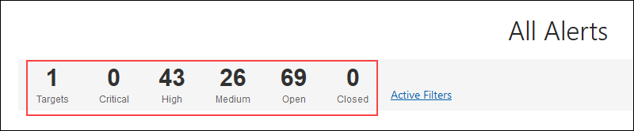

5. Scroll down to review the alerts in the table.

    - The **DB User** column identifies who is doing the action.
    - The **Operation** column identifies the action.
    - The **Alert Severity** column indicates the seriousness of the action.

    

6. At the bottom of the page, click the page numbers to view other pages of alerts.

7. To filter the report to show only open high alerts, at the top of the report, click **+ Filter** and then set the filter to be: **Alert Severity = High**. Click **Apply**.

    - If the filters are not displayed, click **Filters** below the totals at the top of the page.
    - Leave the default filters on **Alert Status** and **Operation Time** set as is.

    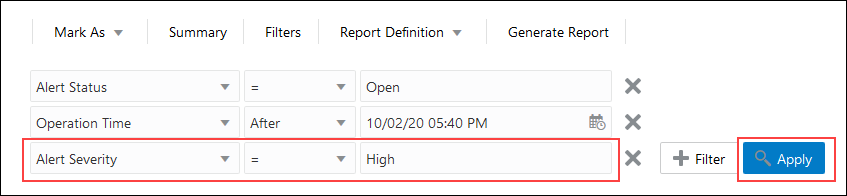

    The table shows you the open high alerts.

8. To sort the **Operation** column, position the cursor over the **Operation** column heading, and then click the arrow button.

    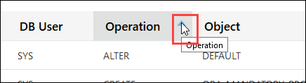

9. To view more detail for an alert, click the alert ID.

    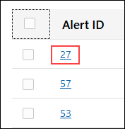

10. Review the information in the **Alert Details** dialog box, and then click **X** to close it. You can view the **DB User**, **Operation Status**, **SQL Text**, and much more.

    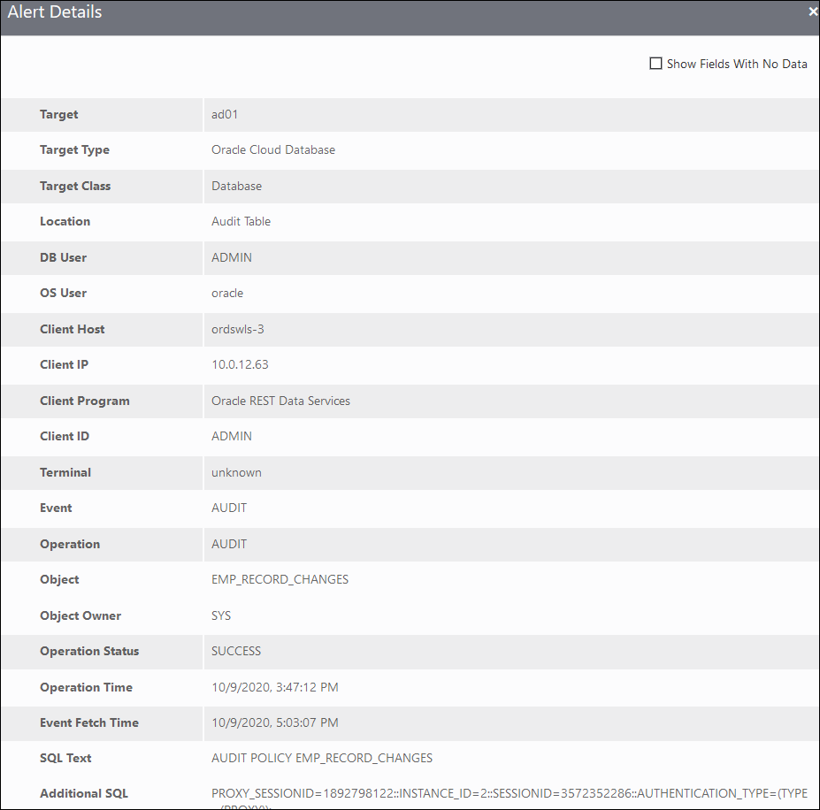

11. To remove the filters, click the **X** next to each filter, and then click **Apply**.

12. To create a filter to view the list of alerts for user entitlement changes, do the following:

    1. Click **+ Filter**.
    2. Set the filter to be: **Alert = User Entitlement Changes**.
    3. Click **Apply**.

13. Review the alerts.

    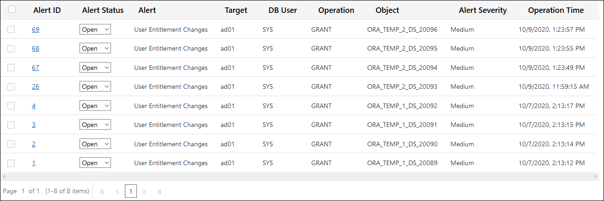

14. Suppose you are fine with these entitlement changes. Now you can close the alerts. Select the check box in the top left corner of the table to select all of the alerts displayed.

15. From the **Mark As** menu, select **Closed**. The alerts selected on this page are closed and the next page is displayed.

    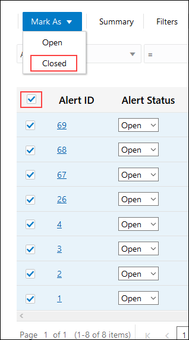

16. Because there is another page of alerts that meet the filter criteria, repeat the previous step to mark all alerts with entitlement changes as closed.

17. Remove the filter **Alert = User Entitlement Changes**. Both open and closed alerts are displayed.

18. To hide closed alerts on the pages, move the **Open Alerts only** slider to the right.

      

## **STEP 2**: Analyze open alerts from the dashboard

1. Click the **Home** tab.

2. In the **Open Alerts** chart, notice that the chart shows the number of open alerts for the last 7 days. Click the last node in the chart.

      

3. In the **Open Alerts** dialog box, view the number of open alerts for the last 7 days.

    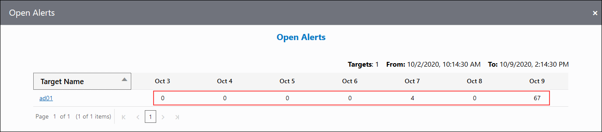  

4. Hover over the counts to view the number of **Critical**, **High**, and **Medium** alerts for each day.

5. Click the name of your target database to open the **All Alerts** report. The **All Alerts** report is filtered to show only the open alerts for your target database for the past 7 days.

    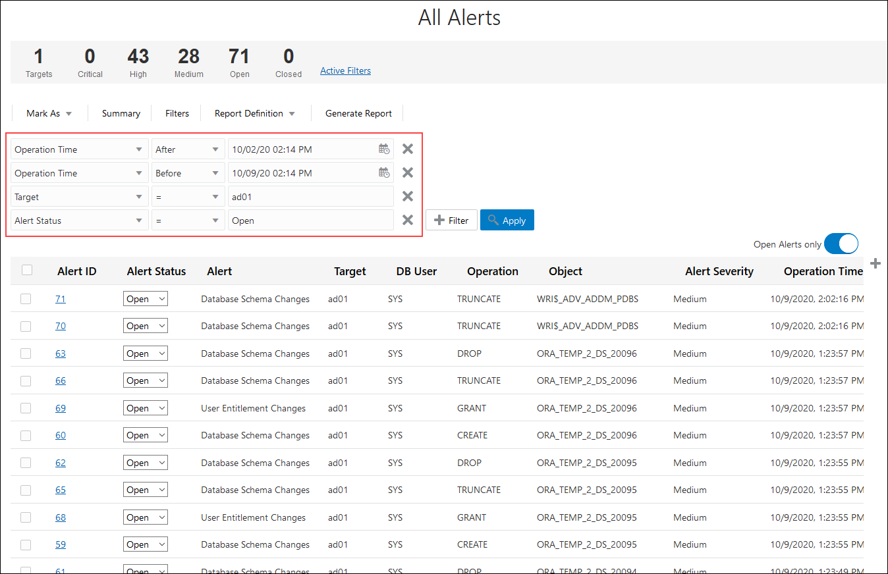  

## **STEP 3**: View all audit records for the past week

1. Click the **Reports** tab.

2. On the left, under **Activity Auditing**, click the **All Activity** report.

3. At the top of the report, view the totals for **Targets**, **DB Users**, **Client Hosts**, **Login Success**, **Login Failures**, **User Changes**, **Privilege Changes**, **DDLs**, **DMLs**, and **Total Events**.

    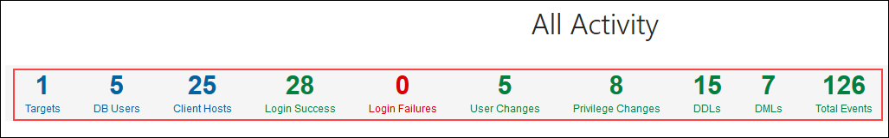  

4. Review the data in the table. The report is automatically filtered to show one week's worth of audit data for your target database. If the filter is not displayed, click **Filters**.

      

## **STEP 4**: View a summary of audit events collected and alerts raised

1. On the left, expand **Summary**, and then click **Audit Summary**.

    - The **Audit Summary** report helps you to gain an understanding of the activity trends of your target databases. By default, the report shows you data for all of your target databases for the past week.

2. View the totals to learn how many target databases are represented in the charts, how many users are audited, and how many client hosts have connected to your target database. The report is filtered to show data for the last week.

    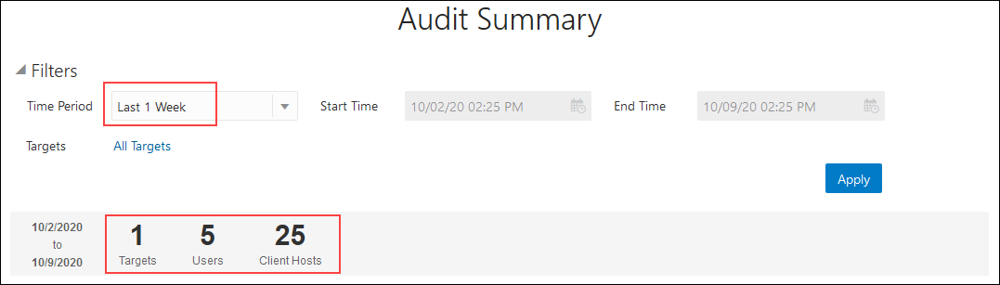  

3. Review the charts.

    - The **Open Alerts** chart compares the number of critical, high, and medium open alerts for the past week.
    - The **Admin Activity** chart compares the number of logins, database schema changes, audit setting changes, and entitlement changes for the past week.
    - The **Login Activity** chart compares the number of failed and successful logins for the past week.
    - The **All Activity** chart compares the total number of events for the past week.

    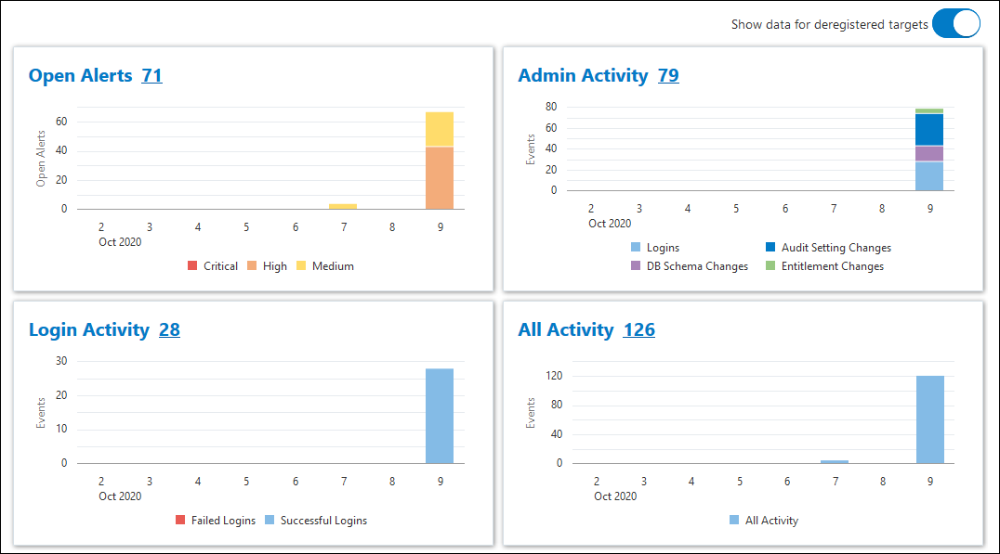  

4. To filter the time period for the report, at the top, select **Last 1 Month**, and then click **Apply**.

5. To filter the target database for the report, do the following:

    1. In the **Filters** section, click **All Targets**.

    2. In the **Select Targets** dialog box, deselect the check box for **All Targets**, click the field, select your target database, and then click **Done**.

    3. Click **Apply**. Your target database is now set as a filter.

    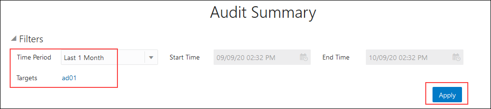  

## **STEP 5**: Create a logins report

1. Click the **Reports** tab.

2. To view the **Login Activity** report, in the list under **Activity Auditing**, click **Login Activity**.

3. From the **Report Definition** menu, select **Save As New**.

4. In the **Save As** dialog box, enter the report name **Logins**, enter the description **Logins report**, select your compartment, and then click **Save As**. A confirmation message states that the report is successfully created.

5. Click the **Reports** tab.

6. At the top of the list under **Custom Reports**, click your **Logins** report.

      

7. Click **Generate Report**.

8. In the **Generate Report** dialog box, leave **PDF** selected, select your compartment, and then click **Generate Report**.

9. Wait for a confirmation message that states that the **Report was generated successfully**.

10. Click the **Download Report** link.  The **Opening Logins.pdf** dialog box is displayed.

11. Select the application with which you want to open the PDF, and click **OK**.

12. Review the report, and then close it.

    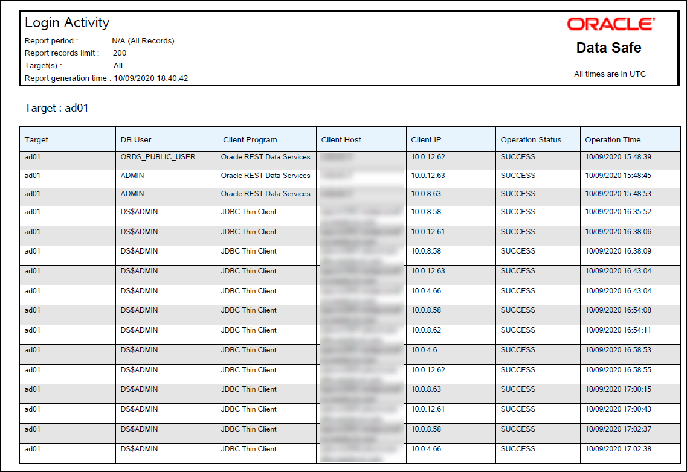

## Learn More

* [Activity Auditing Reports](https://docs.oracle.com/en-us/iaas/data-safe/doc/activity-auditing-reports.html)
* [Manage Alerts](https://docs.oracle.com/en-us/iaas/data-safe/doc/manage-alerts.html)

## Acknowledgements
* **Author** - Jody Glover, Principal User Assistance Developer, Database Development
* **Last Updated By/Date** - Jody Glover, May 28 2021
