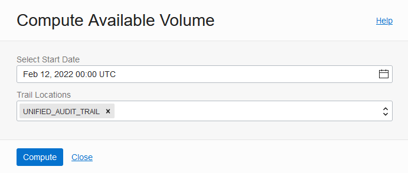
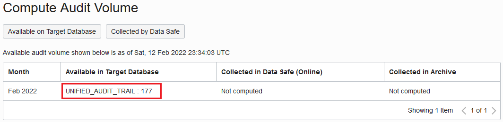
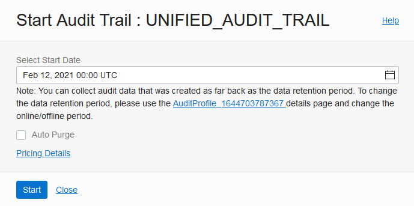
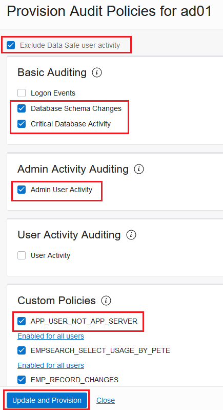
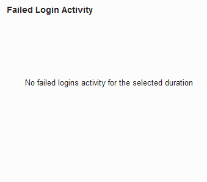
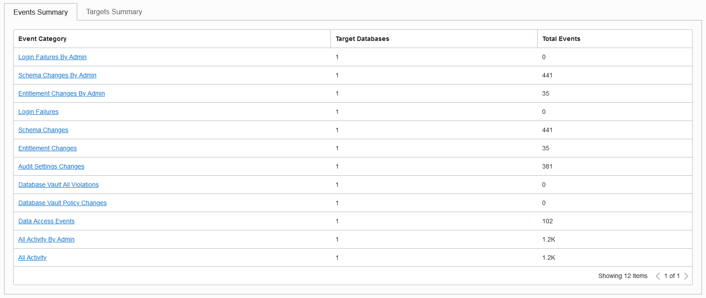
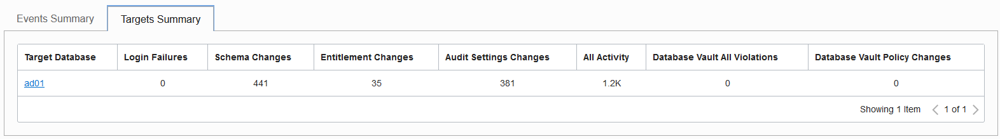
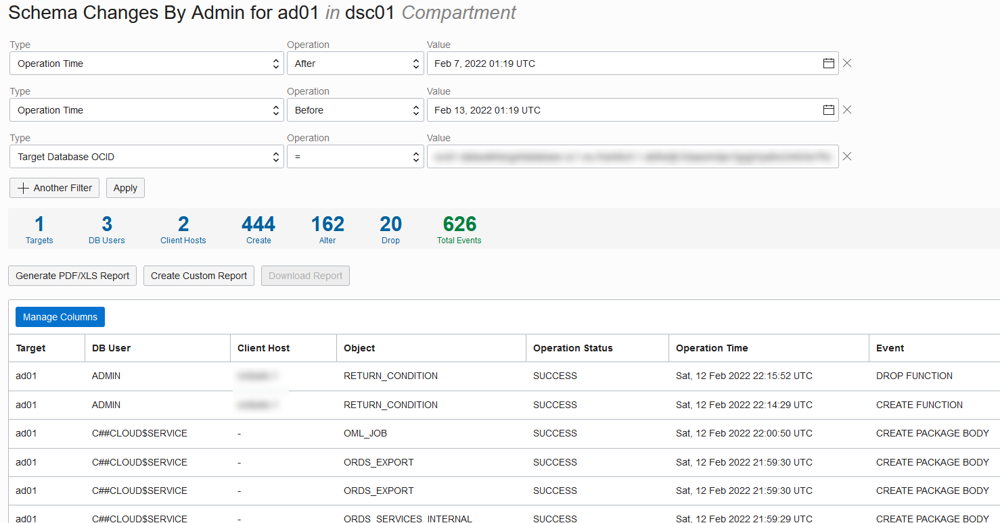
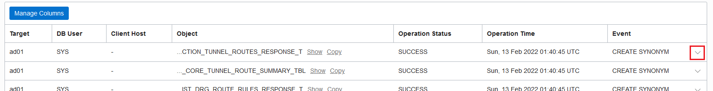
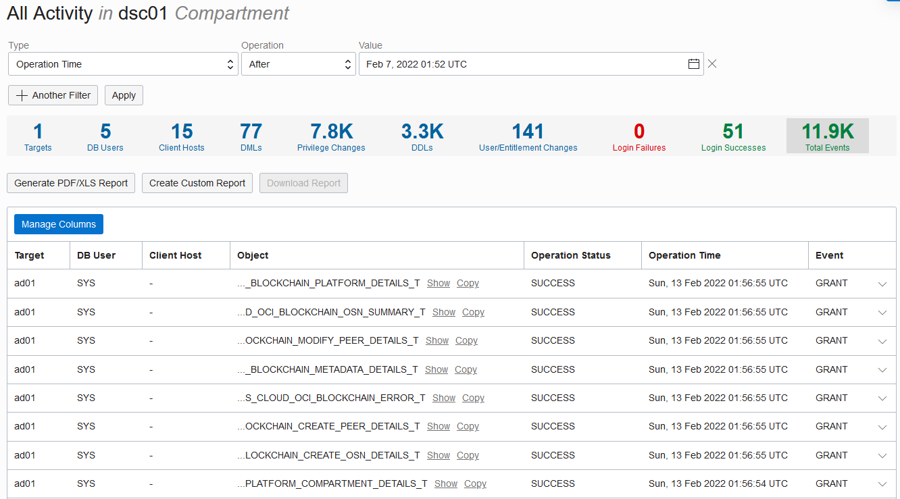

# Audit Database Activity

## Introduction

In Oracle Data Safe, you can provision audit policies on your target databases and collect audit data into the Oracle Data Safe repository. There are basic, administrator, user, Oracle pre-defined and custom audit policies, as well as audit policies designed to help you meet compliance standards. When you register an Autonomous Database, Oracle Data Safe automatically creates an audit profile, audit policy, and an audit trail.

Start by reviewing the audit profile, audit policy, and audit trail for your target database. Start audit data collection on your target database and provision a few audit policies. Analyze the audit events, view reports, and then create a custom audit report.

Estimated Lab Time: 20 minutes

### Objectives

In this lab, you will:

- Review the global settings for Oracle Data Safe and the audit profile for your target database
- Review the audit policy for your target database
- Review the audit trail for your target database
- View the quantity of audit records available on your target database for the discovered audit trail
- Start audit data collection
- Provision audit policies on your target database
- Analyze audit events across all your target databases
- View the All Activity report
- Create a custom audit report

### Prerequisites

This lab assumes you have:

- Obtained an Oracle Cloud account and signed in to the Oracle Cloud Infrastructure Console
- Prepared your environment for this workshop (see [Prepare Your Environment](?lab=prepare-environment)). It's important that Activity Auditing is enabled on your target database, and that you have permissions in Oracle Cloud Infrastructure Identity and Access Management (IAM) to use the Activity Auditing feature in Oracle Data Safe.
- Registered your Autonomous Database with Oracle Data Safe and loaded sample data into it (see [Register an Autonomous Database](?lab=register-autonomous-database))
- Accessed Security Center

### Assumptions

- Your data values are most likely different than those shown in the screenshots.

## Task 1: Review the global settings for Oracle Data Safe and the audit profile for your target database

1. In Security Center, click **Settings**, and review the global settings.

    - Each regional Oracle Data Safe service has global settings for paid usage, online retention period, and archive retention period.
    - Global settings are applied to all target databases unless their audit profiles override them.
    - By default, the online retention period is set to the maximum value of 12 months, the archive retention period is set to the minimum value of 0 months, and paid usage is enabled for all target databases.

    

2. On the left, click **Activity Auditing**.

3. Under **Related Resources**, click **Audit Profiles**.

4. From the **Compartment** drop-down list under **List Scope**, make sure that your compartment is selected.

5. On the right, click the name of your target database to view its audit profile.

    

6. Review the audit profile.

    - There are default settings for paid usage, online retention period, and offline retention period.
    - All initial audit profile settings are inherited from the global settings for Oracle Data Safe, but you can modify them here as needed.

    

## Task 2: Review the audit policy for your target database

1. In the breadcrumb at the top of the page, click **Activity Auditing**.

2. Under **Related Resources**, click **Audit Policies**.

3. From the **Compartment** drop-down list, select your compartment if needed.

4. From the **Target Databases** drop-down list, select your target database.

5. On the right, review the information provided for your target database's audit policy, and then click your target database name to view more detail.

    

6. On the **Audit Policy Details** page, scroll down and review the list of audit policies available for your target database.

    - A grey circle indicates the audit policy is not yet provisioned on the target database. A green circle indicates that the audit policy is provisioned.
    - You can choose to provision any number of audit policies on your target database and set filters on users and roles.

    

## Task 3: Review the audit trail for your target database

1. In the breadcrumb at the top of the page, click **Activity Auditing**.

2. On the left under **Related Resources**, click **Audit Trails**.

3. From the **Compartment** drop-down list, select your compartment.

4. From the **Target Databases** drop-down list, select your target database.

5. On the right, notice that there is one audit trail discovered for your Autonomous Database (UNIFIED_AUDIT_TRAIL). Review the information in the table, and then click your target database name to view more detail.

    

6. Review the information on the **Audit Trail Details** page. This is where you can manage audit data collection for the audit trail.

    

## Task 4: View the quantity of audit records available on your target database for the discovered audit trails

1. In the breadcrumb at the top of the page, click **Activity Auditing**.

2. On the left under **Related Resources**, click **Audit Profiles**.

3. From the **Compartment** drop-down list, select your compartment.

4. From the **Target Databases** drop-down list, select your target database.

5. On the right, click the name of your target database.

6. Scroll down to the **Compute Audit Volume** section, and click **Available on Target Database**.

    

    The **Compute Available Volume** dialog box is displayed.

8. In the **Select Start Date** box, enter the current date. You can use the calendar widget to help you.

9. From the **Trail Locations** drop-down list, select `UNIFIED_AUDIT_TRAIL`.

10. Click **Compute** and wait for Oracle Data Safe to calculate the available audit volume.

    

11. In the **Available in Target Database** column, view the number of audit records for the `UNIFIED_AUDIT_TRAIL`.

    - There is a small number of audit records in the `UNIFIED_AUDIT_TRAIL` because your target database has just been provisioned. However, for an older target database where there are many more audit records, Oracle Data Safe splits up the numbers by month. These values help you to decide on a start date for the Oracle Data Safe audit trail.

    

## Task 5: Start audit data collection

1. In the breadcrumb at the top of the page, click **Activity Auditing**.

2. On the left under **Related Resources**, click **Audit Trails**.

3. From the **Compartment** drop-down list, select your compartment.

4. From the **Target Databases** drop-down list, select your target database.

5. On the right, click the name of your target database. The **Audit Trail Details** page is displayed.

6. Click **Start**. A **Start Audit Trail: UNIFIED\_AUDIT\_TRAIL** dialog box is displayed.

7. Configure a start date of 12 months ago, and then click **Start**.

    

8. Notice when the **Collection State** changes to **Idle**.

    

## Task 6: Provision audit policies

1. In the breadcrumb at the top of the page, click **Activity Auditing**.

2. Under **Related Resources**, click **Audit Policies**.

3. From the **Compartment** drop-down list, select your compartment.

4. From the **Target Databases** drop-down list, select your target database.

5. On the right, click the name of your target database.

6. Click **Update and Provision**. The **Provision Audit Policies** panel is displayed.

    

7. Select **Exclude Data Safe user activity**.

8. Under **Basic Auditing**, select **Database Schema Changes** and **Critical Database Activity**.

9. Under **Admin Activity Auditing**, select **Admin User Activity**.

10. Under **Custom Policies**, select **APP\_USER\_NOT\_APP\_SERVER**.

11. Click **Update and Provision** to provision the selected policies on your target database.

    

12. Wait for the provisioning to finish, and then view the updated policy information on the page.

## Task 7: Analyze audit events across all your target databases

1. In the breadcrumb at the top of the page, click **Activity Auditing**.

    - By default, the Activity Auditing dashboard shows you a summary of audit events for the last one week for all target databases in the form of charts and tables. You can filter by compartment, time period, and target database.

2. From the **Compartments** drop-down list on the left, select your compartment.

3. From the **Targets** drop-down list on the left, select your target database.

    - The dashboard automatically is updated to include audit event statistics for only your target database.

4. Review the **Failed Login Activity** chart. It shows you the number of failed logins on all or selected target databases for the specified time period. Currently there are no failed logins.

    

5. Review the **Admin Activity** chart. It shows you the number of database schema changes, logins, audit setting changes, and entitlement changes on all or selected target databases for the specified time period.

    

6. Review the **All Activity** chart. It shows you the total count of audit events on all or selected target databases for the specified time period.

    

7. On the **Events Summary** tab, review the statistics for audit event categories. Statistics include the number of target databases that have an audit event in each event category and the total number of events per category.

    

8. On the **Targets Summary** tab, review the various audit event counts per target database. Audit events include the number of login failures, schema changes, entitlement changes, audit settings changes, all activity (all audit events), database vault realm violations and command rule violations, and database vault policy changes. If there are no audit events for a target database, the target database isn't listed.

    

9. Return to the **Events Summary** tab and click **Schema Changes By Admin** to view more detail.

    

10. On the **Schema Changes By Admin** page, review the following:

    - The filters set at the top of the page
    - The total number of database users, client hosts, create statements, alter statements, and drop statements
    - The total number of events
    - The individual audit events

    

11. Click a down arrow at the end of a row in the event table to view more detail about the event.

    

## Task 8: View the All Activity report

1. Under **Related Resources**, click **Audit Reports**. Oracle Data Safe has the following predefined audit reports:

    - Login Activity
    - Data Access
    - Admin Activity
    - Audit Policy Changes
    - Database Vault Activity
    - User/Entitlement Changes
    - Data Modification
    - Data Safe Activity
    - Database Schema Changes
    - All Activity

    

2. Click the **All Activity** report to view it.

3. View the filters set in the report.

    - By default, the report is filtered to shows audit events for the past one week for all target databases in the selected compartment.

4. View the totals in the report.

    - You can click **Targets**, **DB Users**, and **Client Hosts** to view the list of targets, database users, and client hosts respectively.
    - If you click **DMLs**, **Privilege Changes**, **DDLs**, **User/Entitlement Changes**, **Login Failures**, **Login Successes**, or **Total Events**, the audit events table is filtered accordingly.

5. Scroll down and view the individual audit events.

6. To view more detail for a particular audit event, click the down arrow to expand the row and show details for the particular event. For some details, you can copy their values to the clipboard.

    

## Task 9: Create a custom audit report

1. At the top of the All Activity report, add the following two filters. To add a filter, click **+ Another Filter**. When you are done setting the filter parameters, click **Apply**.

    - **Target = your-target-database-name**
    - **Object Owner = HCM1**

2. Click **Manage Columns**. In the **Manage Columns** panel, select **Target**, **DB User**, **Object**, **Operation Time**, **Event**, and **Unified Audit Policies** columns. Click **Apply Changes**. The table displays the selected columns. Also notice that the totals are adjusted too.

    

3. Click **Create Custom Report**.

4. In the **Custom Report** dialog box, enter the report name **All Activity Report on schema: HCM1 in the target your-target-database-name**. Enter an optional description. Select your compartment. Click **Create Custom Report** and wait for the report to generate.

    

5. In the **Create Custom Report** dialog box, click the **click here** link to navigate to your custom report.

    - If you need to modify your custom report, you can click **Save Report** to save the changes.

6. To view your custom report in the future, under **Related Resources**, click **Audit Reports**. Click the **Custom Reports** tab, and then click the name of your custom audit report.

## Learn More

* [Activity Auditing Overview](https://www.oracle.com/pls/topic/lookup?ctx=en/cloud/paas/data-safe&id=UDSCS-GUID-741E8CFE-041E-46C4-9C04-D849573A4DB7)

## Acknowledgements

* **Author** - Jody Glover, Consulting User Assistance Developer, Database Development
* **Last Updated By/Date** - Jody Glover, February 12, 2022
