# Discover and Mask Sensitive Data

## Introduction

Data Discovery helps you find sensitive data in your databases. You tell Data Discovery what kind of sensitive data to search for, and it inspects the actual data in your database and its data dictionary, and then returns to you a list of sensitive columns. By default, Data Discovery can search for a wide variety of sensitive data pertaining to identification, biographic, IT, financial, healthcare, employment, and academic information.

Data Masking provides a way for you to mask sensitive data so that the data is safe for non-production purposes. For example, organizations often need to create copies of their production data to support development and test activities. Simply copying the production data exposes sensitive data to new users. To avoid a security risk, you can use Data Masking to replace the sensitive data with realistic, but fictitious data.

In this lab, start by discovering sensitive data on your database by using the Data Discovery feature. Then, mask the sensitive data by using the default masking policy generated by the Data Masking feature. View the before and after effect on the masked data by using the web tool in Oracle Cloud Infrastructure called Database Actions.

Estimated Lab Time: 30 minutes

### Objectives

In this lab, you will:

- View sensitive data in your database
- Discover sensitive data in your database by using the Data Discovery feature
- Create a PDF of the Sensitive Data Model report
- Create a masking policy
- Mask sensitive data in your database by using the Data Masking feature
- Create a PDF of the Data Masking report
- Validate the masked data in your database

### Prerequisites

This lab assumes you have:

- Obtained an Oracle Cloud account and signed in to the Oracle Cloud Infrastructure Console
- Prepared your environment for this workshop (see [Prepare Your Environment](?lab=prepare-environment)). It's important that your ATP database is registered with Oracle Data Safe, the Data Discovery and Data Masking features are enabled on your database, and you have the appropriate permissions in Oracle Cloud Infrastructure Identity and Access Management to use the Data Discovery and Data Masking features with your database.
- Registered your Autonomous Database with Oracle Data Safe and loaded sample data into it. Make sure to have the `ADMIN` password for your database on hand (see [Register an Autonomous Database](?lab=register-autonomous-database)).

### Assumptions

- Your data values are most likely different than those shown in the screenshots.

## Task 1: View sensitive data in your database

Use Oracle Database Actions to query sensitive data in your database. You can access Database Actions from your database's Console in Oracle Cloud Infrastructure.

1. Select the browser tab that is signed in to the Oracle Cloud Infrastructure Console. If needed, sign in again.

2. In the Oracle Cloud Infrastructure Console, make sure that the correct region is selected in your tenancy.

3. From the navigation menu, select **Oracle Database**, and then **Autonomous Transaction Processing**.

4. Under **COMPARTMENT**, make sure that your compartment is selected.

5. From the **Workload Type** drop-down list, select **All**.

5. Click the name of your database.

7. On the **Autonomous Database Details** page, click the **Tools** subtab.

8. In the **Database Actions** section, click **Open Database Actions**. A new browser tab is opened displaying the sign in page for Oracle Database Actions.

9. In the **Username** field, enter `ADMIN`, and then click **Next**.

10. In the **Password** field, enter the password for the `ADMIN` user, and then click **Sign In**.

11. Under **Development**, click **SQL**.

12. If a help note is displayed, click the **X** button to close it.

13. On the **Navigator** tab, select the `HCM1` schema from the first drop-down list. In the second drop-down list, leave **Tables** selected.

    

14. Drag the `EMPLOYEES` table to the worksheet.

    

15. When prompted to choose an insertion type, click **Select**, and then click **Apply**.

    

16. View the SQL query on the worksheet.

    

17. On the toolbar, click the **Run Statement** button (green circle with a white arrow) to execute the query.

    

18. Review the query results. If needed, click the **Query Result** tab.

    - Data such as `employee_id`, `first_name`, `last_name`, `email`, `phone_number`, and `hire_date`, are considered sensitive data and should be masked if shared for non-production use, such as development and analytics.
    - Keep this tab open so that you can return to it later.

    

## Task 2: Discover sensitive data by using Data Discovery

Data Discovery generates a sensitive data model that contains sensitive columns in your target database. When configuring the data discovery job, you select the sensitive types that you want to discover in your target database.

1. Return to the browser tab for the Oracle Cloud Infrastructure Console. If needed, sign in again.

2. From the navigation menu, select **Oracle Database** and then **Data Safe**. The **Overview** page for the Oracle Data Safe service is displayed.

3. Click **Security Center**, and then click **Data Discovery**.

    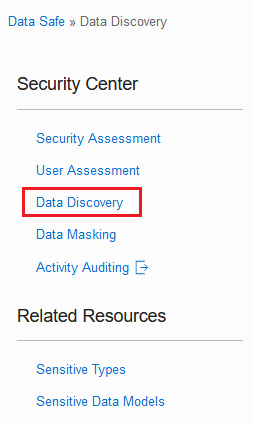

4. From the **Compartment** drop-down list, select your compartment.

    A Data Discovery dashboard is displayed with statistics for the top five target databases in your compartment. Your dashboard is most likely empty because this is the first time you are using Data Discovery in this workshop.

    

5. Click **Discover Sensitive Data**.

6. On the **Sensitive Data Model Information** page, do the following, and then click **Next**.

    - In the **Name** box, enter **SDM1** for the sensitive data model.
    - Leave the compartment set to your compartment.
    - In the **Description** box, enter **Sensitive Data Model 1**.
    - Select your target database

    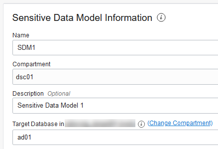

7. On the **Select Schemas** page, scroll down and select the **HCM** schema, and then click **Next**. You may need to click the right arrow button at the bottom of the page to navigate to page 2.

    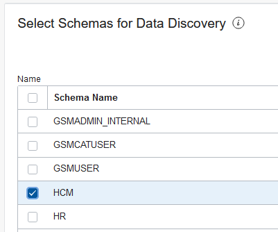

8. On the **Select Sensitive Types** page, expand all of the categories by moving the **Expand All** slider to the right, and then scroll down the page and review the sensitive types. Notice that you can select individual sensitive types, sensitive categories, and all sensitive types. At the top of the page, select the **All** check box, and then click **Next**.

    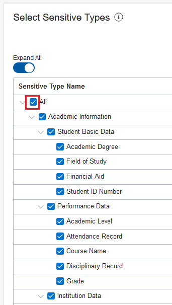

9. On the **Select Discovery Options** page, select **Collect, display and store sample data**, and then click **Create Sensitive Data Model** at the bottom of the page to begin the data discovery process.

    

10. After your sensitive data model is created, review its information on the **Sensitive Data Model Details** page.

    - The **Sensitive Data Model Information** tab lists information about your sensitive data model, including its name and Oracle Cloud identifier (OCID), the work request to create it, the compartment to which you saved it, the date and time when it was created and last updated, and the name of the target database associated with it. The pie chart compares the number of sensitive values per sensitive category and sensitive type.
    - The **Sensitive Columns** table lists the sensitive columns retrieved by the data discovery job. By default, the table is displayed in **Flat View**. For each sensitive column, you can view its schema name, table name, column name, sensitive type, parent column, data type, estimated row count, and sample data (if you retrieved sample data and if it exists). Review the sample data to get an idea of what it looks like.

    

11. Position your mouse over the **Identification Information** category in the chart to view its value.

    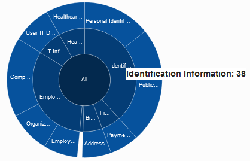

12. With your mouse still over **Identification Information**, click the pie slice to drill down. Notice that the **Identification Information** category is now divided into two smaller categories (**Personal Identifiers** and **Public Identifiers**).

    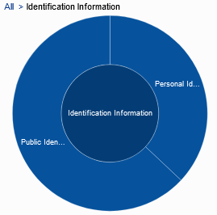

13.  To drill-up, click the **All** link in the chart's breadcrumb.

14. From the drop-down list, select **Sensitive Type View** to sort the sensitive columns by sensitive type. By default, all items are expanded in the view. You can collapse the items by moving the **Expand All** slider to the left.

    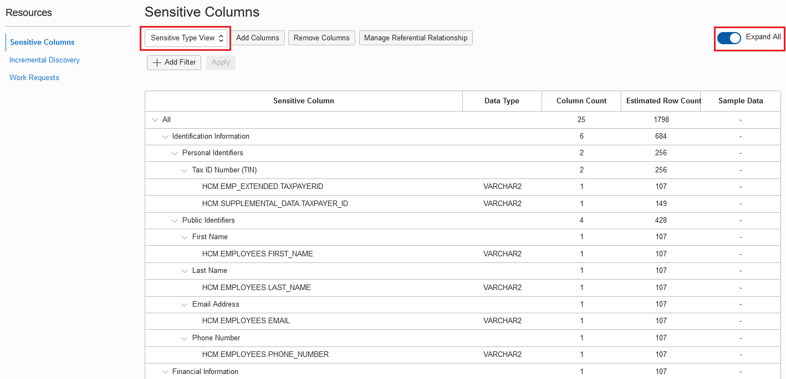

15. From the drop-down list, select **Schema View** to sort the sensitive columns by table name.

    *REVIEWER: Need to replace screenshot because I see ST_Manish in the Sensitive Type column*

    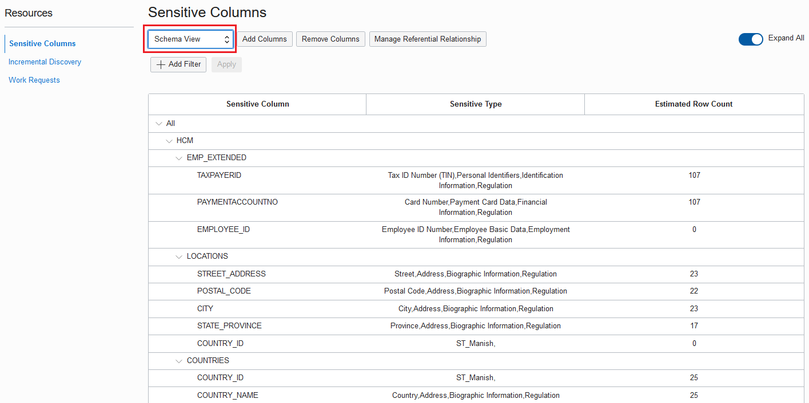

16. Identify sensitive columns through referential relationships. That is, the sensitive columns are discovered because they have a relationship to another sensitive column and that relationship is defined in the database's data dictionary. For example, `MANAGER_ID` in the `EMPLOYEES` table is one such column.

    *Need screenshot - how do these columns stand out?*

## Task 3: Create a PDF of the Sensitive Data Model report

1. Click **Generate Report**. A **Generate Report** dialog box is displayed. Leave **PDF** selected, click **Generate Report**, and wait for the report to be 100% generated. Click **Close**.

    

2. Click **Download Report**. Leave **PDF** selected, and click **Download Report**.

    

3. In the dialog box, leave **Save File** selected, and then click **OK**. Browse to the desktop of your local computer, leave **SDM1.pdf** set as the file name, and then click **Save**. On your desktop, open SDM1.pdf and view the report.

    - The **Summary** table shows totals for columns and values scanned, sensitive types, sensitive types, sensitive columns, and sensitive values.
    - The **Sensitive Columns** table lists the sensitive columns in the sensitive data model. For each sensitive column, the table shows you its sensitive type, schema name, table name, column name, sensitive value count, column data matched, column name matched, and column comment matched. *REVIEWER: What are these last 3 items?*

    

## Task 4: Create a masking policy

Data Masking can generate a masking policy for your target database based on your sensitive data model. It automatically tries to select a default masking format for each sensitive column. You can edit these default selections and select different ones as needed. Occasionally you are prompted to address masking formats in your masking policies that are causing issues.

1. In the breadcrumb at the top of the page, click **Data Safe**.

2. On the left under **Data Safe** click **Security Center**.

3. Click **Data Masking**.

    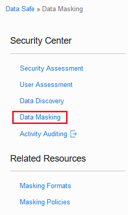

4. Under **Related Resources**, click **Masking Policies**. The **Masking Policies** page is displayed.

5. Click **Create Masking Policy**. The **Create Masking Policy** panel is displayed.

6. Configure the masking policy as follows, and then click **Create Masking Policy**. *Important! Wait in the panel until the masking policy is created and the columns are added from the sensitive data model.*

    - Name: **Mask SDM1**
    - Compartment: **Select your compartment**
    - Description: **Masking policy for SDM1**
    - Choose how you want to create the masking policy: **Using a sensitive data model**
    - Sensitive Data Model: **SDM1**

    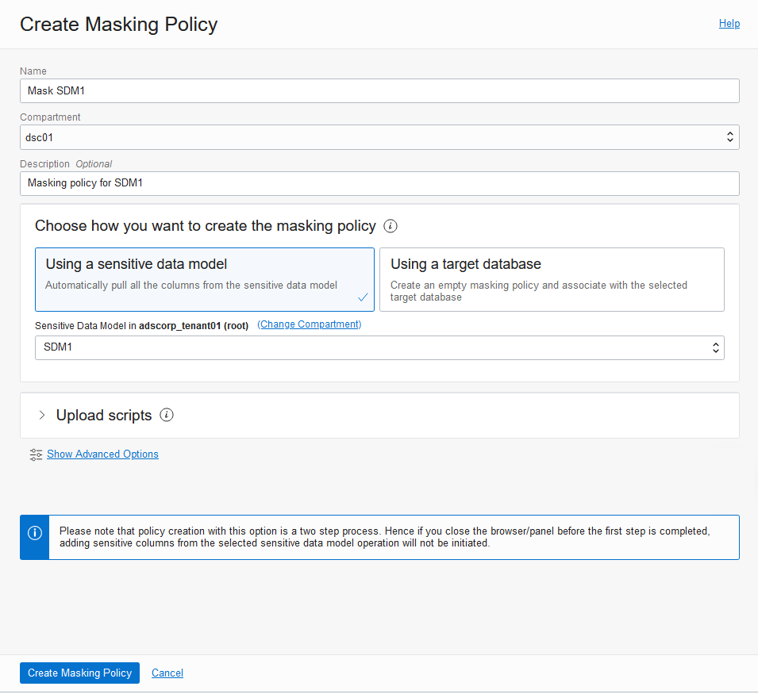

7. Review the Data Masking policy.

    - On the **Masking Policy Information** tab, you can view the masking policy name (and edit it), the Oracle Cloud Identifier (OCID) for the masking policy, the work request for the masking policy, the compartment in which the masking policy is stored, the target database and sensitive data model to which the masking policy is associated, and the date/time in which the masking policy was created and last updated.
    - The **Masking Columns** table lists all the sensitive columns and their associated masking formats. If needed, you can select a different masking policy for any sensitive column. You can click the pencil icon next to a masking format to edit it.

    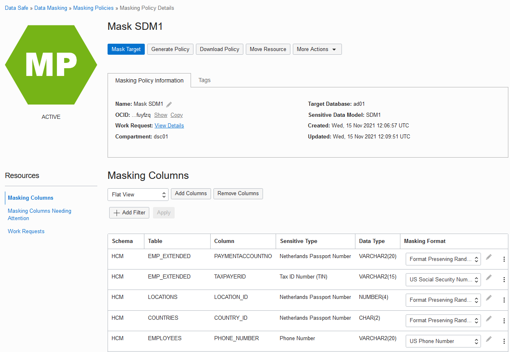

## Task 5: Mask sensitive data by using Data Masking

After you create a masking policy, you can run a data masking job against your target database from the **Masking Policy Details** page. You can also run a data masking job from the **Data Masking** page.

1. On the **Masking Policy Details** page, click **Mask Target**. The **Mask Sensitive Data** panel is displayed.

2. From the **Target Database** drop-down list, select your target database, and then click **Mask Data**. Wait for the data masking job to finish.

    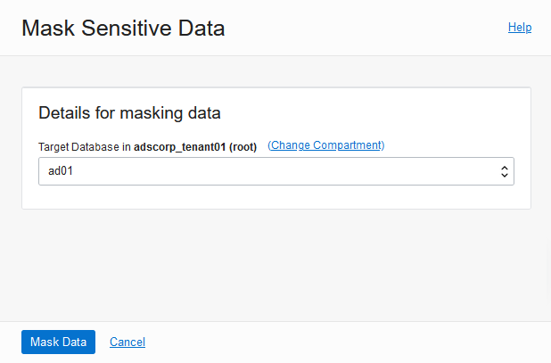

3. When the data masking job is finished, review the **Masking Report** on the **Masking Report Details** page.

    - The **Masking Report Information** tab shows you the target database, masking policy name, Oracle Cloud Identifier (OCID), the date and time when the data masking job started and finished, and the number of masked sensitive types, schemas, tables, columns, and values.
    - The **Masked Columns** table lists each masked sensitive column and its respective schema, table, masking format, sensitive type, parent column, and total masked values.

*Reviewer: I need screenshot*

## Task 6: Create a PDF of the Data Masking report

1. At the top of the page, click **Generate Report**. The **Generate Report** dialog box is displayed.

2. Leave **PDF** selected, and click **Generate Report**. Wait for the report to generate, and then click **Close**.

    

3. Click **Download Report**. A **Download Report** dialog box is displayed.

4. Leave **PDF** selected, and then click **Download Report**.

    

5. In the dialog box, select **Open with**. Leave the default application selected, and then click **OK**.

6. Review the Data Masking report in PDF format, and then close it.

*Reviewer: I need a screenshot for this*

## Task 7: Validate the masked data in your database

1. Return to Oracle Database Actions. You should have a SQL Worksheet open.

2. Take a moment to review the original data.

    

3. On the toolbar, click the **Run Statement** button (green circle with a white arrow) to execute the query.

4. If you receive a message stating that your session has expired, click **OK**, sign in again, and then click the **Run Statement** button.

5. Review the masked data. You can resize the panel to view more data, and you can scroll down and to the right.

    

## Learn More

* [Data Discovery](https://docs.oracle.com/en-us/iaas/data-safe/doc/data-discovery.html)
* [Data Masking](https://docs.oracle.com/en-us/iaas/data-safe/doc/data-masking.html)

## Acknowledgements
* **Author** - Jody Glover, Principal User Assistance Developer, Database Development
* **Last Updated By/Date** - Jody Glover, November 15 2021
