# Discover and Mask Sensitive Data

## Introduction

Data Discovery helps you find sensitive data in your databases. You tell Data Discovery what kind of sensitive data to search for, and it inspects the actual data in your database and its data dictionary, and then returns to you a list of sensitive columns. By default, Data Discovery can search for a wide variety of sensitive data pertaining to identification, biographic, IT, financial, healthcare, employment, and academic information.

Data Masking provides a way for you to mask sensitive data so that the data is safe for non-production purposes. For example, organizations often need to create copies of their production data to support development and test activities. Simply copying the production data exposes sensitive data to new users. To avoid a security risk, you can use Data Masking to replace the sensitive data with realistic, but fictitious data.

Start by discovering sensitive data on your Autonomous Transaction Processing (ATP) database by using the Data Discovery feature. Then, mask that sensitive data using the default masking policy generated by the Data Masking feature. View the before and after effect on the masked data by using the web tool in Oracle Cloud Infrastructure called Database Actions.

> **Note**: If you are working in an Oracle-provided environment, the Data Discovery and Data Masking features are not available at this time.

Estimated Lab Time: 30 minutes

### Objectives

You learn how to perform the following tasks:

- View sensitive data in your database
- Discover sensitive data in your database by using the Data Discovery feature
- Mask sensitive data in your database by using the Data Masking feature
- Create a PDF of the Data Masking report
- Validate the masked data in your database

### Prerequisites

Before starting, be sure that you have completed the following prerequisite tasks:

- You obtained an Oracle Cloud account and signed in to the Oracle Cloud Infrastructure Console.
- You prepared your environment for this workshop. If not, see [Prepare Your Environment](?lab=prepare-environment). It's important that your ATP database is registered with Oracle Data Safe, the Data Discovery and Data Masking features are enabled on your database, and you have the appropriate privileges in Oracle Data Safe to use the Data Discovery and Data Masking features with your database.
- You registered your Autonomous Database with Oracle Data Safe and loaded sample data into it. You know the `ADMIN` password for your database. If not, see [Register an Autonomous Database](?lab=register-autonomous-database).

### Assumptions

- Your data values are most likely different than those shown in the screenshots.

## **STEP 1**: View sensitive data in your database

Use Oracle Database Actions to query sensitive data in your database. You can access Database Actions from your database's Console.

1. Select the browser tab that is signed in to the Oracle Cloud Infrastructure Console. If needed, sign in again.

2. In the Oracle Cloud Infrastructure Console, make sure that the correct region is selected in your tenancy.

3. From the navigation menu, select **Oracle Database**, and then **Autonomous Transaction Processing**.

4. Under **COMPARTMENT**, make sure that your compartment is selected.

5. From the **Workload Type** drop-down list, select **All**.

5. Click the name of your database.

7. On the **Autonomous Database Details** page, click the **Tools** subtab.

8. In the **Database Actions** section, click **Open Database Actions**. A new browser tab is opened displaying the sign in page for Oracle Database Actions.

9. In the **Username** field, enter `ADMIN`, and then click **Next**.

10. In the **Password** field, enter the password for the `ADMIN` user, and then click **Sign In**.

11. Under **Development**, click **SQL**.

12. If a help note is displayed, click the **X** button to close it.

13. On the **Navigator** tab, select the `HCM1` schema from the first drop-down list. In the second drop-down list, leave **Tables** selected.

    

14. Drag the `EMPLOYEES` table to the worksheet.

    

15. When prompted to choose an insertion type, click **Select**, and then click **Apply**.

    

16. View the SQL query on the worksheet.

    

17. On the toolbar, click the **Run Statement** button (green circle with a white arrow) to execute the query.

    

18. Review the query results. If needed, click the **Query Result** tab.

    - Data such as `employee_id`, `first_name`, `last_name`, `email`, `phone_number`, and `hire_date`, are considered sensitive data and should be masked if shared for non-production use, such as development and analytics.
    - Keep this tab open so that you can return to it later.

    

## **STEP 2**: Discover sensitive data by using Data Discovery

The Data Discovery wizard generates a sensitive data model that contains sensitive columns in your target database. When working in the wizard, you select the sensitive types that you want to discover in your target database.

1. Return to the browser tab for the Oracle Cloud Infrastructure Console. If needed, sign in again.

2. From the navigation menu, select **Data Safe**. The **Overview** page for the Oracle Data Safe service is displayed.

3. Click **Service Console**. The **Home** page in the Oracle Data Safe Console is displayed.

4. To access the Data Discovery wizard, click the **Data Discovery** tab.

5. On the **Select Target for Sensitive Data Discovery** page, select your target database, and then click **Continue**.

    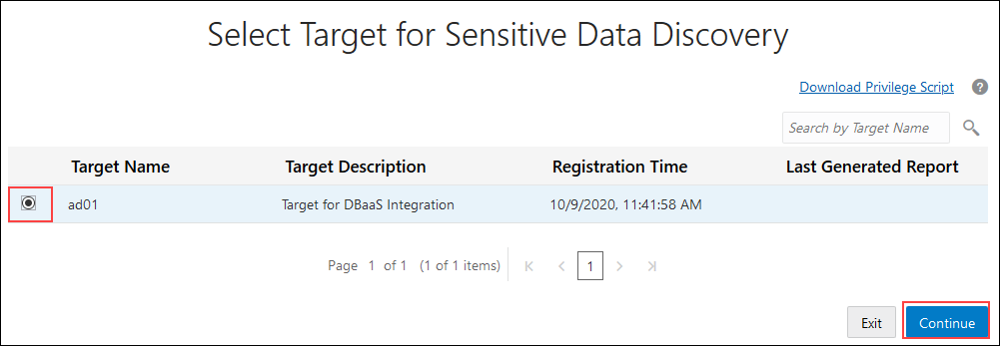

6. On the **Select Sensitive Data Model** page, leave **Create** selected, enter **SDM1** for the name, enable **Show and save sample data**, select your compartment, and then click **Continue**.

7. On the **Select Schemas for Sensitive Data Discovery** page, scroll down and select the **HCM1** schema, and then click **Continue**.

    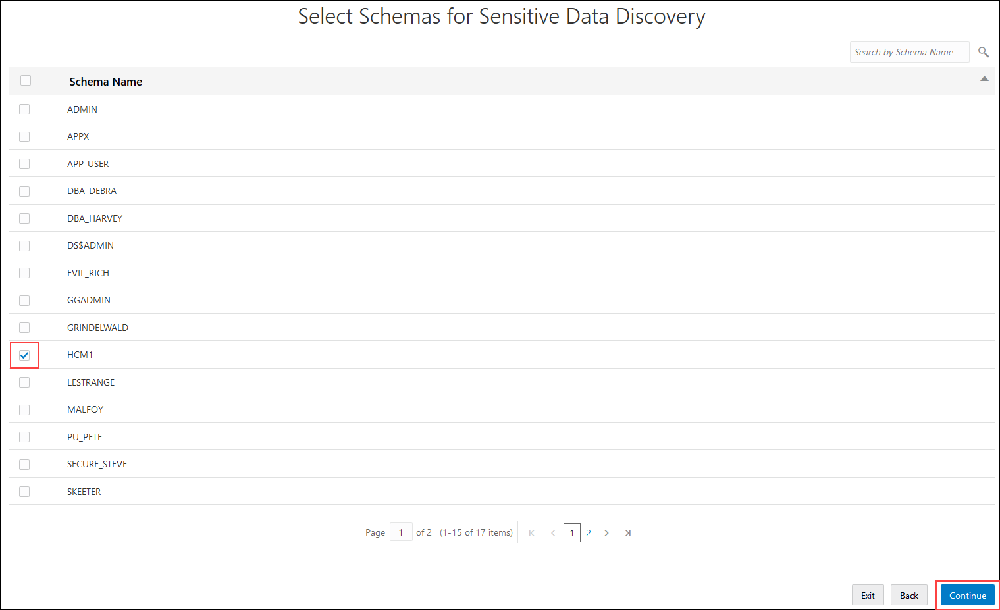

8. On the **Select Sensitive Types for Sensitive Data Discovery** page, expand all of the categories by moving the slider to the right, and then scroll down the page and review the sensitive types. Notice that you can select individual sensitive types, sensitive categories, and all sensitive types.

    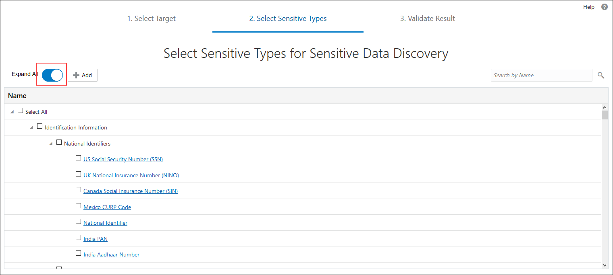

9. At the top of the page, select the **Select All** check box, and then click **Continue** to start the data discovery job.

    

10. When the job is completed, ensure that the **Detail** column states **Data discovery job finished successfully**, and then click **Continue**.

    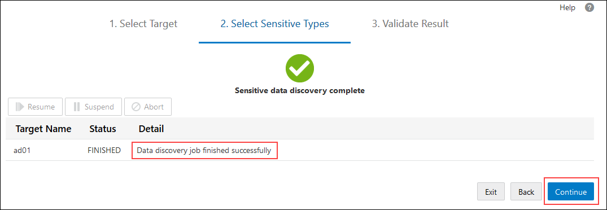

11. On the **Sensitive Data Discovery Result** page, examine the sensitive data model created by the Data Discovery wizard. Oracle Data Safe automatically saves your sensitive data model to the Oracle Data Safe Library.

12. To view all of the sensitive columns, move the **Expand All** slider to the right.

    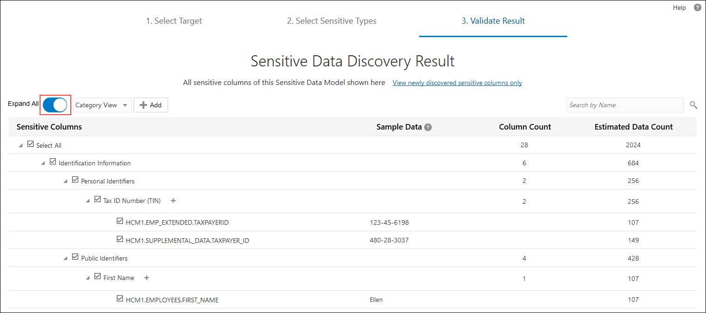

13. From the drop-down list, select **Schema View** to sort the sensitive columns by table name.

    

14. Scroll down the page to view the sensitive columns.

    - You can view sample data (if it's available for a sensitive column) and estimated data counts.
    - In particular, take a look at the sensitive columns that Data Discovery found in the `EMPLOYEES` table. Columns that do not have a check mark, such as `MANAGER_ID`, are called referential relationships. They are included because they have a relationship to another sensitive column and that relationship is defined in the database's data dictionary.
    - Review the sample data provided to get an idea of what the sensitive data looks like.

    

15. To generate the **Data Discovery** report, scroll to the bottom of the page, and then click **Report**.

16. Review the **Data Discovery** report.

    - The chart compares sensitive categories. You can view totals of sensitive values, sensitive types, sensitive tables, and sensitive columns.
    - The table displays individual sensitive column names, sample data for the sensitive columns, column counts based on sensitive categories, and estimated data counts.

    

17. Click the chart's **Expand** button.

    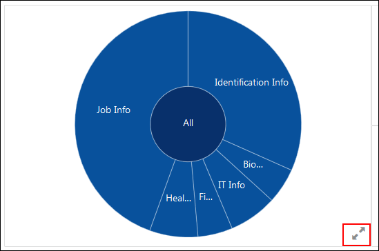

18. Position your mouse over **Identification Info** to view statistics.

    

19. With your mouse still over **Identification Info**, click the **Expand** button to drill down.

    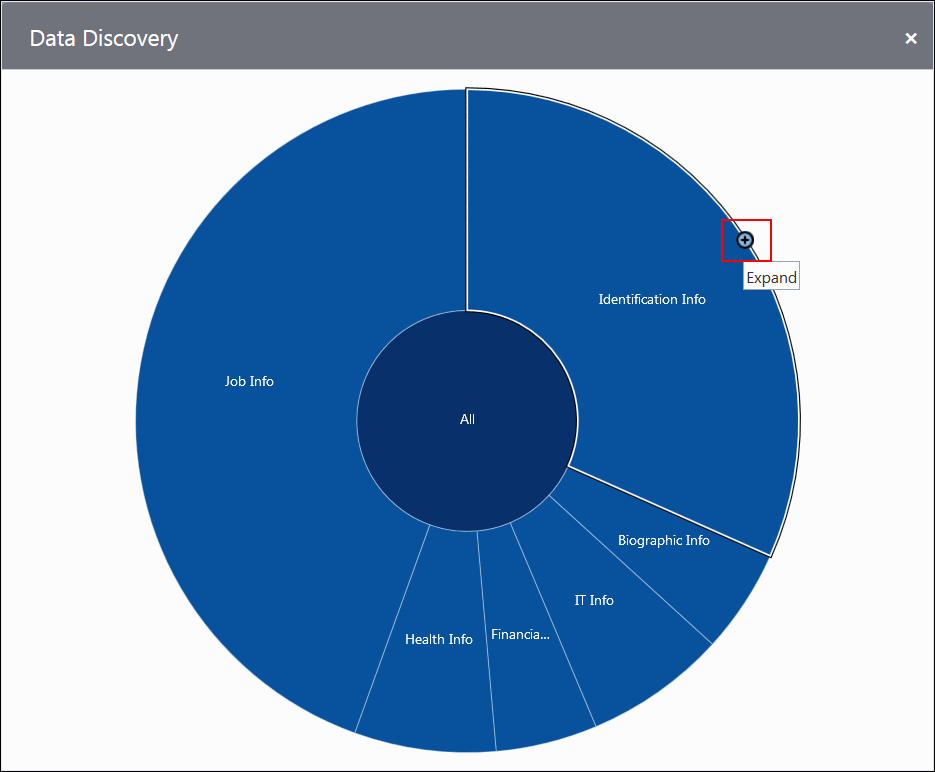

20. Notice that the **Identification Info** category is divided into two smaller categories (**Personal IDs** and **Public IDs**). To drill-up, position your mouse over an expanded sensitive category (for example, **Identification Info**), and then click the **Collapse** button.

    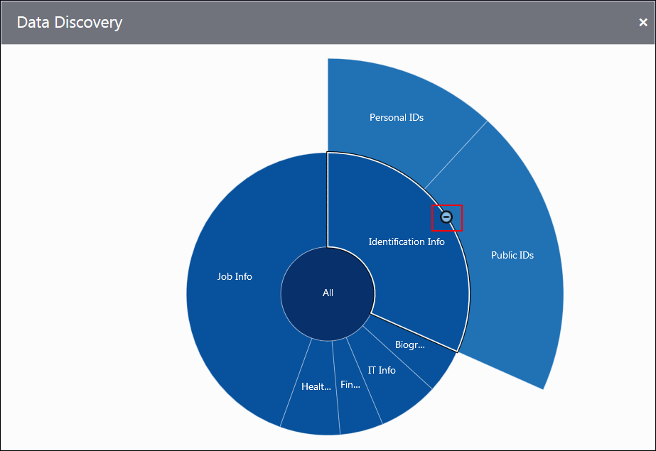

21. Click the **Close** button (**X**) to close the expanded chart. Continue to work in the wizard.

## **STEP 3**: Mask sensitive data by using Data Masking

The Data Masking wizard generates a masking policy for your target database based on a sensitive data model. In the wizard, you select the sensitive columns that you want to mask and the masking formats to use.

1. At the bottom of the Data Discovery report, click **Continue to mask the data**. The Data Masking wizard is displayed.

2. On the **Select Target for Data Masking** page, leave your target database selected, and click **Continue**.

    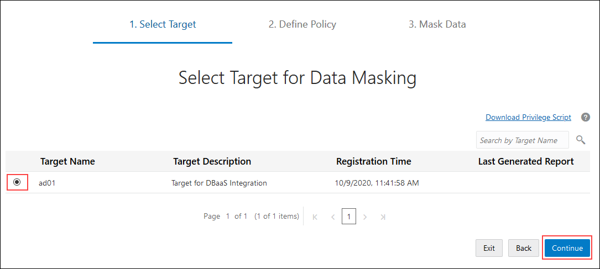

3. On the **Masking Policy** page, move the **Expand All** slider to the right to view all of the sensitive columns. Scroll down the page and review the default masking format selected for each sensitive column.

    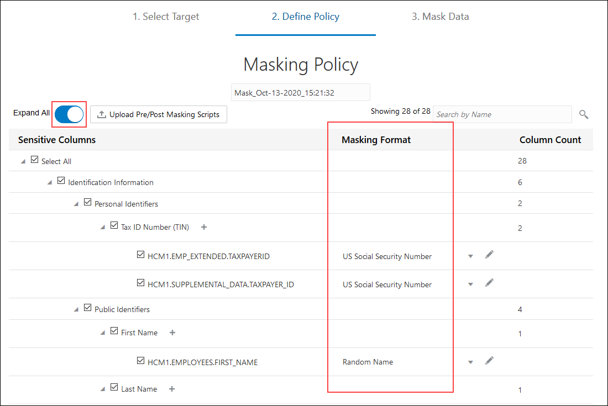

4. For the `HCM1.LOCATIONS.STREET_ADDRESS` column, click the arrow to the right of the masking format to view other masking formats.

    

5. Next to the arrow, click the **Edit Format** button (pencil icon).

    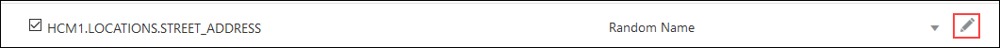

6. In the **Edit Format** dialog box, review the details for the masking format, including the datatype, description, examples, and default configuration. This is where you can modify a masking format, if needed. Click **Cancel**.

    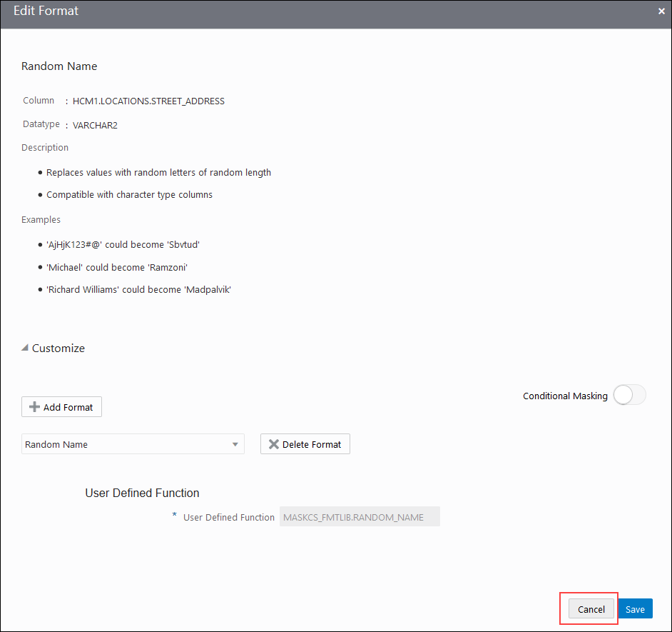

7. At the bottom of the page, click **Confirm Policy**.

8. Wait a moment while Data Masking creates the masking policy.

9. On the **Schedule the Masking Job** page, leave **Right Now** selected, and click **Review**.

    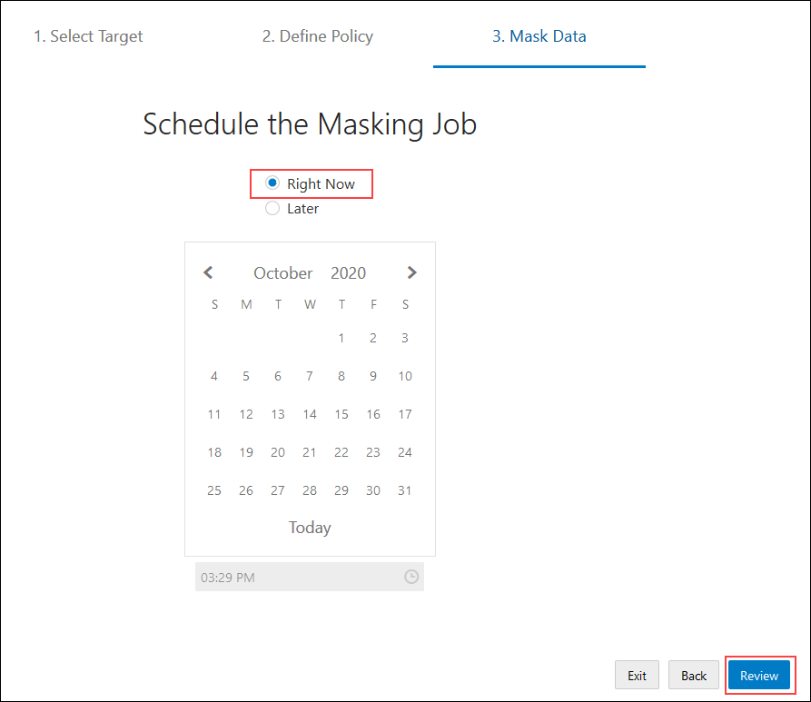

10. On the **Review and Submit** page, review the information, and then click **Submit** to start the data masking job.

    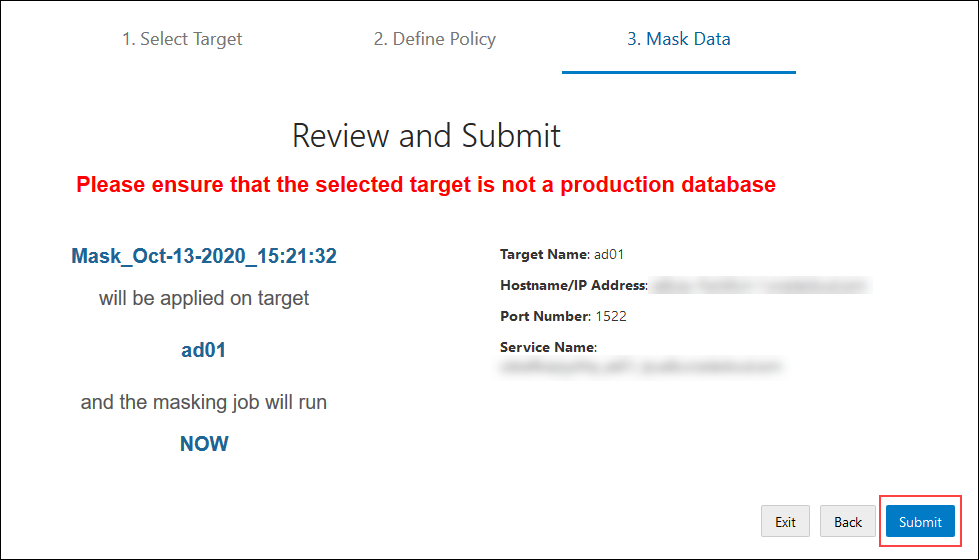

11. Wait for the data masking job to finish. It takes a couple of minutes. You can follow the status of the job on the **Masking Jobs** page.

12. When the job is finished, click **Report**.

    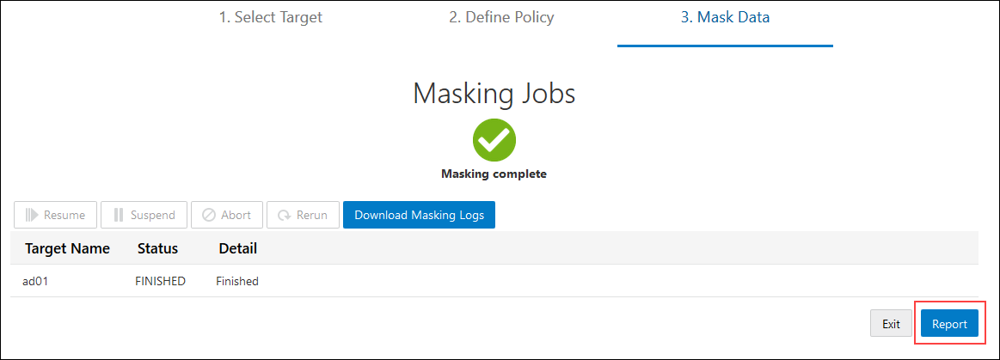

13. Examine the **Data Masking** report.

    - At the top of the report, you can view the number of masked values, masked sensitive types, masked tables, and masked columns.
    - The table shows you column counts for the sensitive categories and types. For each sensitive column, you can view the masking format used and the number of rows masked.

    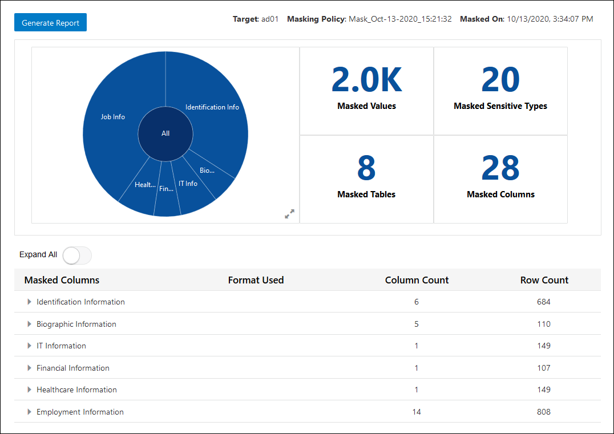

## **STEP 4**: Create a PDF of the Data Masking report

1. At the top of the report, click **Generate Report**. The **Generate Report** dialog box is displayed.

2. Leave **PDF** selected.

3. Enter **Mask1_HCM1** for the description.

4. Select your compartment.

5. Click **Generate Report** and wait for the report to generate.

6. When a confirmation message states that the **Report was generated successfully**, click **Download Report**.

7. Save the report and then open it in Adobe Acrobat.

8. Review the data, and then close the report.

  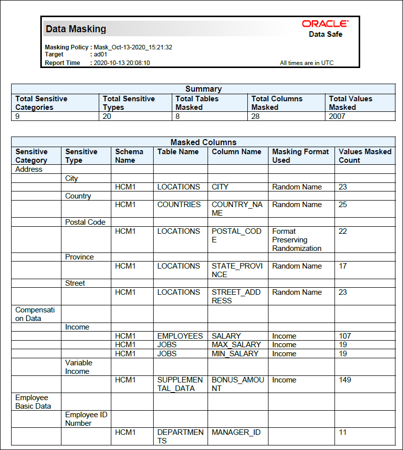

## **STEP 5**: Validate the masked data in your database

1. Return to Oracle Database Actions. You should have a SQL Worksheet open.

2. Take a moment to review the original data.

    

3. On the toolbar, click the **Run Statement** button (green circle with a white arrow) to execute the query.

4. If you receive a message stating that your session has expired, click **OK**, sign in again, and then click the **Run Statement** button.

5. Review the masked data. You can resize the panel to view more data, and you can scroll down and to the right.

    

## Learn More

* [Data Discovery](https://docs.oracle.com/en-us/iaas/data-safe/doc/data-discovery.html)
* [Data Masking](https://docs.oracle.com/en-us/iaas/data-safe/doc/data-masking.html)

## Acknowledgements
* **Author** - Jody Glover, Principal User Assistance Developer, Database Development
* **Last Updated By/Date** - Jody Glover, May 28 2021
