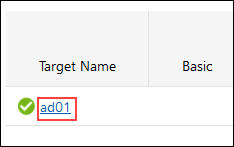
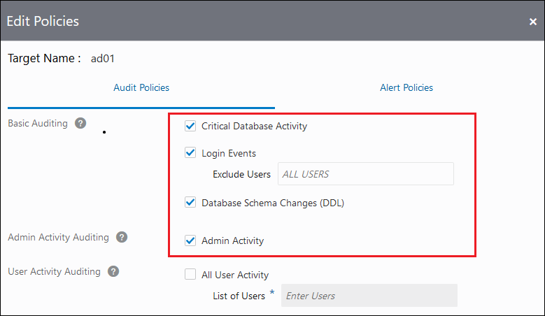
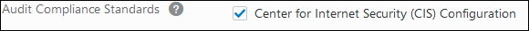
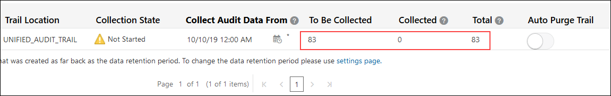
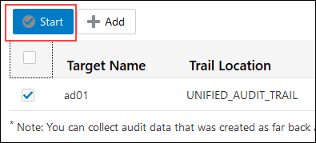

# Provision Audit and Alert Policies

## Introduction
With Oracle Data Safe, you can provision audit and alert policies on your target databases by using the Activity Auditing feature. An audit policy defines specific events to track in a target database. You can provision basic, administrator, user, and custom audit policies, as well as audit policies designed to help you meet compliance standards. An alert is a message that notifies you when a particular audit event happens on a target database. The alerts generated depend on which alert policies you enabled for your database in Activity Auditing. An audit trail is a database table that stores audit data. In Oracle Data Safe, audit data collection copies audit data from the database's audit trail into the Oracle Data Safe audit table.

Start by provisioning the recommended audit and alert policies on your Autonomous Transaction Processing (ATP) database and then review the details for the audit trail. Finish by enabling a custom audit policy on your Autonomous Database.

Estimated Lab Time: 20 minutes

### Objectives

You learn how to perform the following tasks:

- Provision audit and alert policies on your Autonomous Database by using the Activity Auditing wizard
- View details for an audit trail
- Enable a custom audit policy on your Autonomous Database

### Prerequisites

Before starting, be sure that you have completed the following prerequisite tasks:

- You obtained an Oracle Cloud account and signed in to the Oracle Cloud Infrastructure Console.
- You prepared your environment for this workshop. If not, see [Prepare Your Environment](?lab=prepare-environment). It's important that the Activity Auditing feature is enabled on your database and that you have privileges in Oracle Data Safe to use the Activity Auditing feature with your database.
- You registered your Autonomous Database with Oracle Data Safe and loaded sample data into it. If not, see [Register an Autonomous Database](?lab=register-autonomous-database).

### Assumptions

- Your data values are most likely different than those shown in the screenshots.

## **STEP 1**: Provision audit and alert policies on your Autonomous Database by using the Activity Auditing wizard

1. If you are already signed in to the Oracle Data Safe Console, click the **Oracle Data Safe** tab in your browser.

2. If you are not signed in to the Oracle Data Safe Console, do the following:

    1. Click the browser tab named **Oracle Cloud Infrastructure**, and sign in to the Console.

    2. From the navigation menu, select **Oracle Database**, and then **Data Safe**. The **Overview** page for the Oracle Data Safe service is displayed.

    3. Click **Service Console**. The **Home** tab in the Oracle Data Safe Console is displayed.

3. In the Oracle Data Safe Console, click the **Home** tab, and then click the **Activity Auditing** tab to access the Activity Auditing wizard.

4. On the **Select Targets for Auditing** page, select the check box for your target database, and then click **Continue**.

    

5. On the **Retrieve Audit Policies** page, select the check box for your target database, and then click **Retrieve** to retrieve the currently deployed audit policies from your database.

    

6. Wait until a green check mark is displayed in the **Retrieval Status** column, and then click **Continue**. The check mark means that all of the audit policies are successfully retrieved.

    

7. On the **Review and Provision Audit and Alert Policies** page, review the types of audit policies already enabled on your target database.

    - The check mark under **Additional Policies** means that your target database has one or more predefined audit policies enabled on it.
    - The check mark under **Compliance Standards** means that your target database has one or more compliance policies enabled on it; for example, the **Center for Internet Security (CIS) Configuration** audit policy.
    - Currently, there are no basic, admin activity, or user activity audit policies provisioned on your target database, nor are there any alert policies.

    

8. Click your target database name to provision more policies.

    

9. On the **Audit Policies** tab in the **Edit Policies** dialog box, notice that the **Basic Auditing** and **Admin Activity Auditing** policies are selected to be provisioned. Oracle recommends that they be provisioned, so you can leave them selected. They are as follows:

    - Critical Database Activity
    - Login Events
    - Database Schema Changes (DDL)
    - Admin Activity

    

10. Expand **Custom Policies** to view the list of custom policies on your target database.

    - If a custom policy is selected, it means that it is already created and enabled on your target database. There are two such policies on your database: `EMPSEARCH_SELECT_USAGE_BY_PETE` and `EMP_RECORD_CHANGES`.

    - If a custom policy is not selected, it means that it is created on your target database, but not yet enabled. There is one such policy on your database: `APP_USER_NOT_APP_SERVER`.

    

11. Expand **Oracle Pre-defined Policies** to view the list of Oracle predefined audit policies on your target database. By default, the following policies are provisioned on an Autonomous Transaction Processing database:

    - `ORA_ACCOUNT_MGMT`
    - `ORA_DATABASE_PARAMETER`
    - `ORA_SECURECONFIG`
    - `ORA_DV_AUDPOL`
    - `ORA_DV_AUDPOL2`
    - `ORA_RAS_POLICY_MGMT`
    - `ORA_RAS_SESSION_MGMT`
    - `ORA_LOGON_FAILURES`
    - `SYS_USER_ACTIONS`
    - `COMMON_USER`
    - `ADB_ADMIN_AUDIT`
    - `ADB_MANDATORY_AUDIT`

    

12. Next to **Audit Compliance Standards**, notice that the **Center for Internet Security (CIS) Configuration** policy is created and enabled by default.

    

13. Click the **Alert Policies** tab and review the alert policies selected to be provisioned. Oracle recommends that you provision all of these alert policies. They are as follows:

    - Failed Logins by Admin User
    - Profile Changes
    - Database Parameter Changes
    - Audit Policy Changes
    - User Creation/Modification
    - User Entitlement Changes
    - Database Schema Changes

    

14. Click **Provision** to start provisioning the audit and alert policies on your target database.

15. On the **Review and Provision Audit and Alert Policies** page, wait for check marks to appear under all audit policy types, except for **All User Activity**, and then click **Continue**.

    

16. On the **Start Audit Collection** page, observe the following defaults:

    - The audit trail location is automatically set to `UNIFIED_AUDIT_TRAIL`, which is the default audit trail for Autonomous Databases.
    - Audit collection is not yet started.
    - The auto purge feature is not enabled by default. If you are signed in to Oracle Data Safe during a Free Trial, the auto purge option is not displayed.
    - You need to configure an audit collection start date.

    

17. In the **Collect Audit Data From** column, click the calendar widget, and then configure a start date of 12 months ago, and then click **Done**.

    

18. Wait for the **To Be Collected**, **Collected**, and **Total** columns to populate. Don't worry if your numbers are different than those shown in the screenshot below.

    - The **To Be Collected** column shows you the number of records to be retrieved for the selected audit trail since the specified start date.
    - The **Collected** column shows the number of audit records already collected for the current month for the target database (includes audit data collected from all the audit trails for the target database). This value helps you to determine whether you are going to exceed your monthly quota of one million records.
    - The **Total** column totals the **To Be Collected** and **Collected** values for a target database. This value tells you the overall number of audit records you are going to collect for a target database for the current month.

    

19. Click **Start** to start collecting audit data.

    

20. In the **Start Audit Collection** dialog box, click **Start** to confirm that you want to start the `UNIFIED_AUDIT_TRAIL`.

    

21. Wait for the message at the top of the page to state that `UNIFIED_AUDIT_TRAIL` is successfully created.

22. Click **Done**.

    

23. Notice that you are directed to the **Audit Trails** page. From this page, you can manage all of the audit trails for your target databases. 

    

24. Observe that the **Collection State** column value changes from  `RUNNING` to `COLLECTING`, and then to `IDLE`. Collection takes approximately 2 minutes.

## **STEP 2**: View details for an audit trail

1. In the **Collection State** column on the **Audit Trails** page, click **COLLECTING** or **IDLE** (if the audit data is collected).

    

2. In the **Trail Log** dialog box, review the logs, and then click **X** to close the dialog box.

    

## **STEP 3**: Enable a custom audit policy on your Autonomous Database

Enable the custom audit policy named `APP_USER_NOT_APP_SERVER` on your Autonomous Database.

1. Click the **Audit Policies** tab.

2. On the **Audit and Alert Polices** page, click the name of your target database.

3. In the **Edit Policies** dialog box, expand **Custom Policies**, select the `APP_USER_NOT_APP_SERVER` unified auditing policy to enable it, and then click **Provision**.

    

4. Click the **Home** tab and review the dashboard. Notice that the **All Activity**, **Admin Activity**, **Open Alerts**, **Feature Usage**, and **Audit Trails** charts now have data.

    

## Learn More

* [Activity Auditing Overview](https://docs.oracle.com/en-us/iaas/data-safe/doc/activity-auditing-overview.html)
* [Audit Policies](https://docs.oracle.com/en-us/iaas/data-safe/doc/audit-policies.html)
* [Create Activity Auditing Jobs](https://docs.oracle.com/en-us/iaas/data-safe/doc/create-activity-auditing-jobs.html)

## Acknowledgements

* **Author** - Jody Glover, Principal User Assistance Developer, Database Development
* **Last Updated By/Date** - Jody Glover, May 28 2021
