# Provision Audit and Alert Policies

## Introduction
This lab shows you how to provision audit and alert policies on your Autonomous Database by using the Activity Auditing feature in Oracle Data Safe.

Estimated Lab Time: 20 minutes

### Objectives

In this lab, you'll:

- Sign in to the Oracle Data Safe Console
- Provision audit and alert policies on your target database by using the Activity Auditing wizard
- View details for an audit trail
- Enable a custom audit policy on your target database

### Prerequisites

To complete this lab, you need the following:

- An Oracle Cloud account
- Access to an Oracle Data Safe service
- Access to an Autonomous Database, sample data for Oracle Data Safe loaded into the database, and the Activity Auditing feature enabled on your database
- Oracle Data Safe privileges to use the Activity Auditing feature on your database

### Assumptions

- You have a browser tab signed in to the Oracle Cloud Infrastructure Console. If not, please refer to the [Prerequisites](?lab=prerequisites) for this workshop.
- You completed the [Provision and Register and Autonomous Database](?lab=lab-1-provision-register-autonomous) lab in this workshop.

## **STEP 1**: Sign in to the Oracle Data Safe Console

1. If you are already signed in to the Oracle Data Safe Console, click the **Oracle Data Safe** tab in your browser.

2. If you are not signed in to the Oracle Data Safe Console, do the following:

    a) Click the browser tab named **Oracle Cloud Infrastructure**, and sign in to the Console if needed.

    b) From the navigation menu, select **Data Safe**. The **Overview** page for the Oracle Data Safe service is displayed.

    c) Click **Service Console**. The **Home** tab in the Oracle Data Safe Console is displayed.

## **STEP 2**: Provision audit and alert policies on your target database by using the Activity Auditing wizard

1. In the Oracle Data Safe Console, click the **Home** tab, and then click the **Activity Auditing** tab. The first page of the Activity Auditing wizard is displayed.

2. On the **Select Targets for Auditing** page, select the check box for your target database, and then click **Continue**.

  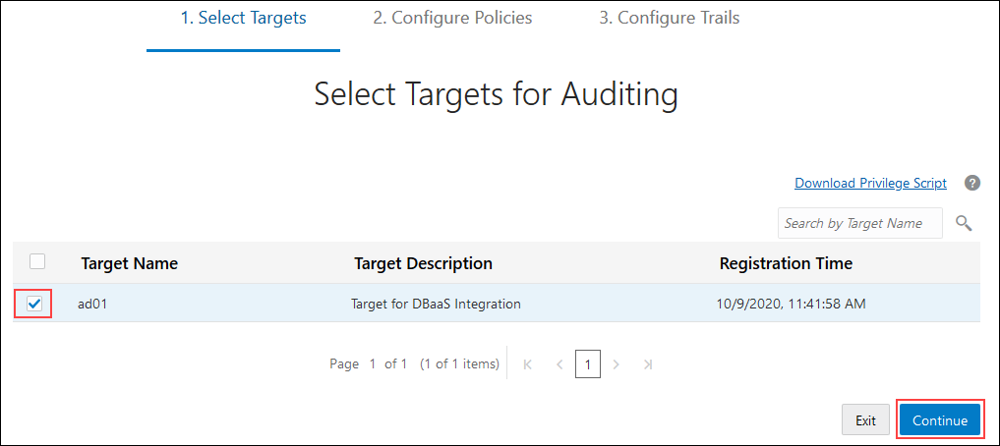

3. On the **Retrieve Audit Policies** page, select the check box for your target database, and then click **Retrieve** to retrieve the currently deployed audit policies from your database.

  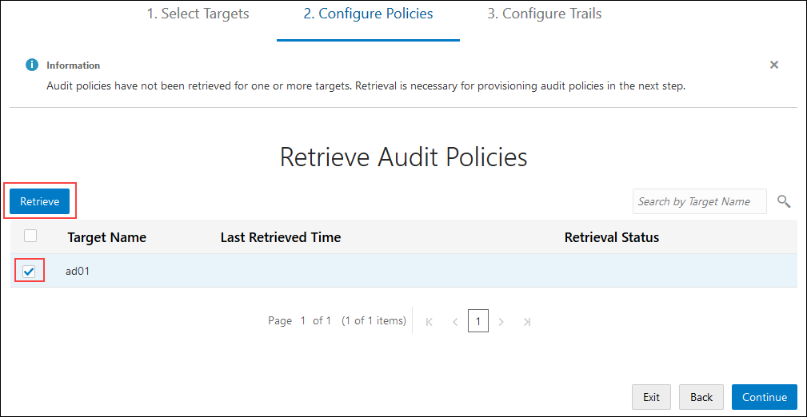

4. Wait until a green check mark is displayed in the **Retrieval Status** column, and then click **Continue**. The check mark means that all of the audit policies are successfully retrieved.

  

5. On the **Review and Provision Audit and Alert Policies** page, review the types of audit policies already enabled on your target database, and then click your target database name to provision more policies.

    - The check mark under **Additional Policies** means that your target database has predefined audit policies enabled on it.

    - **CIS** under **Compliance Standards** means that your target database has the **Center for Internet Security (CIS) Configuration** audit policy enabled on it.

    - Currently, there are no basic, admin activity, or user activity audit policies provisioned on your target database, nor are there any alert policies.

    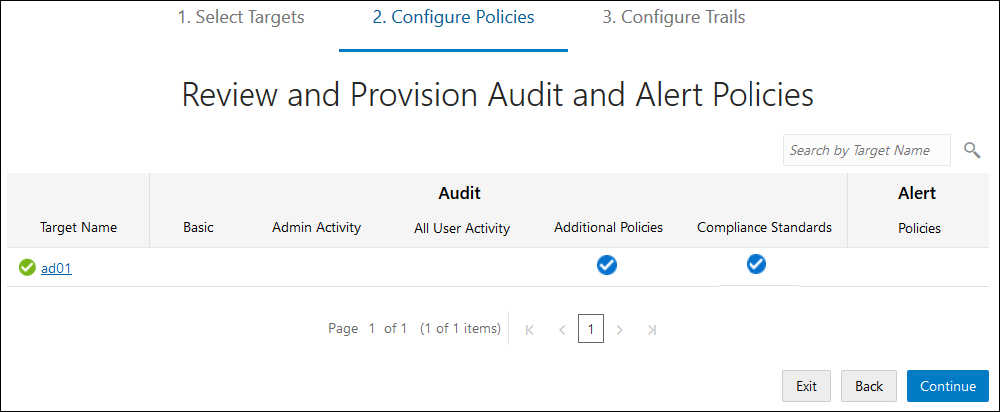

6. In the **Edit Policies** dialog box, the **Audit Policies** tab shows that the following **Basic Auditing** and **Admin Activity Auditing** policies are selected by default. Oracle recommends that you create and enable (provision) these policies. They are not provisioned by default.
      - Critical Database Activity
      - Login Events
      - Database Schema Changes (DDL)
      - Admin Activity

    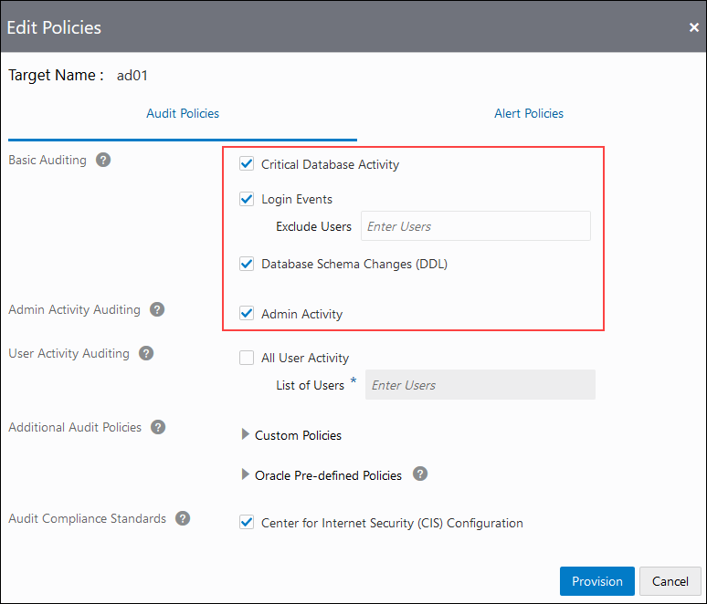

7. Expand **Custom Policies**.

    - If a custom policy is selected, it means that it is already created and enabled on your target database. There are two such policies: `EMPSEARCH_SELECT_USAGE_BY_PETE` and `EMP_RECORD_CHANGES`.

    - If a custom policy is not selected, it means that you can select it to enable it on your target database. There is one such policy: `APP_USER_NOT_APP_SERVER`.

    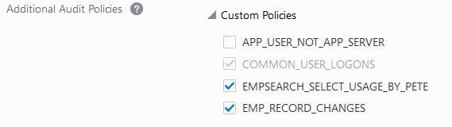

8. Expand **Oracle Pre-defined Policies** to view the list of Oracle predefined audit policies available on your target database. By default, the following policies are provisioned on an Autonomous Transaction Processing database:
    - `ORA_ACCOUNT_MGMT`
    - `ORA_DATABASE_PARAMETER`
    - `ORA_SECURECONFIG`
    - `ORA_DV_AUDPOL`
    - `ORA_DV_AUDPOL2`
    - `ORA_RAS_POLICY_MGMT`
    - `ORA_RAS_SESSION_MGMT`
    - `ORA_LOGON_FAILURES`
    - `SYS_USER_ACTIONS`
    - `COMMON_USER`
    - `ADB_ADMIN_AUDIT`
    - `ADB_MANDATORY_AUDIT`

    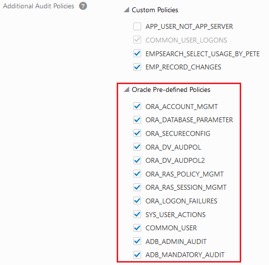

9. Notice that the **Center for Internet Security (CIS) Configuration** policy is created and enabled by default.

  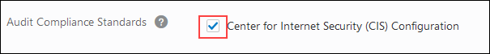

10. Click the **Alert Policies** tab.

11. Review the selected alert policies, and then click **Provision**. Oracle recommends that you provision all of the alert policies, which are as follows:
    - Failed Logins by Admin User
    - Profile Changes
    - Database Parameter Changes
    - Audit Policy Changes
    - User Creation/Modification
    - User Entitlement Changes
    - Database Schema Changes

  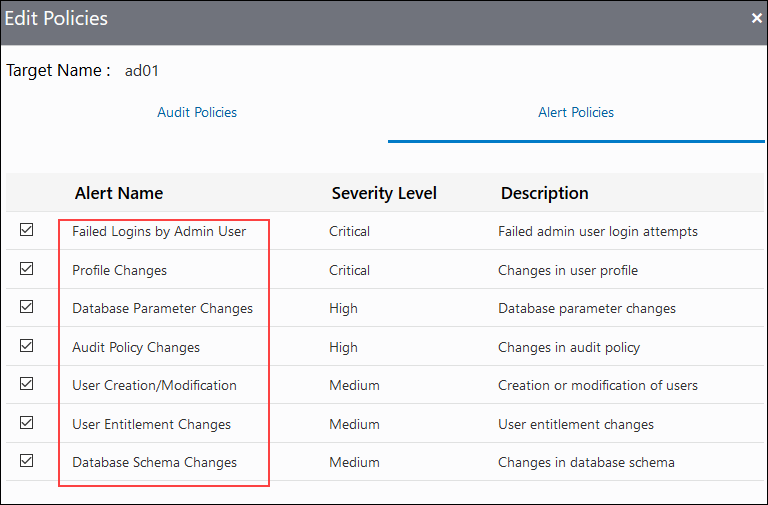

12. On the **Review and Provision Audit and Alert Policies** page, wait for check marks to appear under all audit policy types, except for **All User Activity**, and then click **Continue**.

  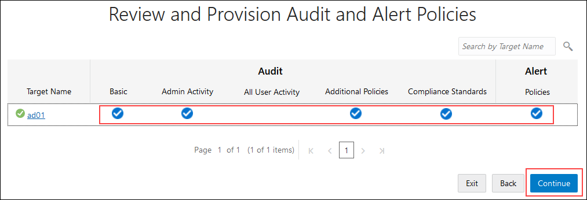

13. On the **Start Audit Collection** page, observe the following defaults:

    - The audit trail location is automatically set to `UNIFIED_AUDIT_TRAIL`, which is the default audit trail for Autonomous Databases.
    - Audit collection is not yet started.
    - The auto purge feature is not enabled by default.
    - You need to configure an audit collection start date.

  

14. In the **Collect Audit Data From** column, click the calendar widget, configure a start date of 12 months ago, and then click **Done**.

  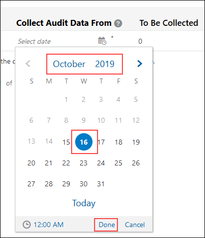

15. Wait for the **To Be Collected**, **Collected**, and **Total** columns to populate, review their values, and then click **Start** to start collecting audit data. Don't worry if your numbers are different than those shown in the screenshot below.

    - The **To Be Collected** column shows you the number of records to be retrieved for the selected audit trail since the specified start date.
    - The **Collected** column shows the number of audit records already collected for the current month for the target database (includes audit data collected from all the audit trails for the target database). This value helps you to determine whether you are going to exceed your monthly quota of one million records.
    - The **Total** column totals the **To Be Collected** and **Collected** values for a target database. This value tells you the overall number of audit records you are going to collect for a target database for the current month.

  

16. In the **Start Audit Collection** dialog box, click **Start** to confirm that you want to start the `UNIFIED_AUDIT_TRAIL`.

  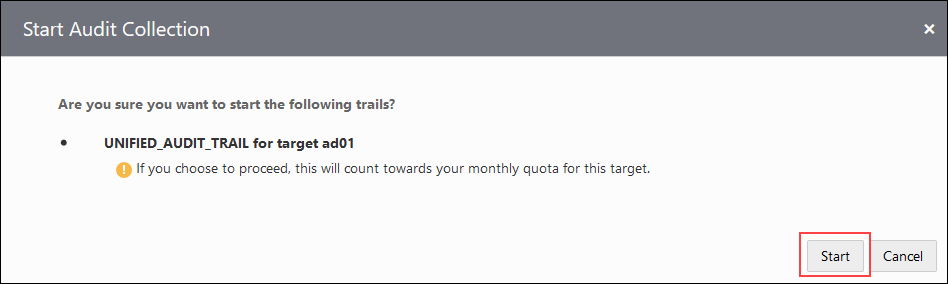

17. Wait for the message at the top of the page, which states that the `UNIFIED_AUDIT_TRAIL` is successfully created.

18. Click **Done**. You are directed to the **Audit Trails** page. From the **Audit Trails** page, you can manage all of the audit trails for your target databases. 

   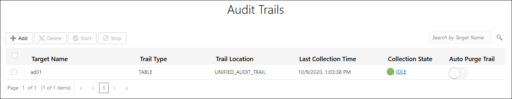

19. Observe that the **Collection State** column value changes from  `STARTING` to `COLLECTING`, and then to `IDLE`. Collection takes approximately 2 minutes.

## **STEP 3**: View details for an audit trail

1. In the **Collection State** column on the **Audit Trails** page, click **COLLECTING** or **IDLE** if the audit data is collected.

  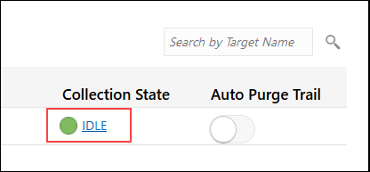

2. In the **Trail Log** dialog box, review the logs, and then click **X** to close the dialog box.

  

## **STEP 4**: Enable a custom audit policy on your target database

1. Click the **Audit Policies** tab.

2. On the **Review and Provision Audit and Alert Polices** page, click the name of your target database.

3. In the **Edit Policies** dialog box, expand **Custom Policies**, select the `APP_USER_NOT_APP_SERVER` unified auditing policy to enable it, and then click **Provision**.

  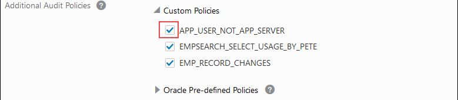

4. Click the **Home** tab and review the dashboard. Notice that the **All Activity**, **Admin Activity**, **Open Alerts**, **Feature Usage**, and **Audit Trails** charts now have data.

  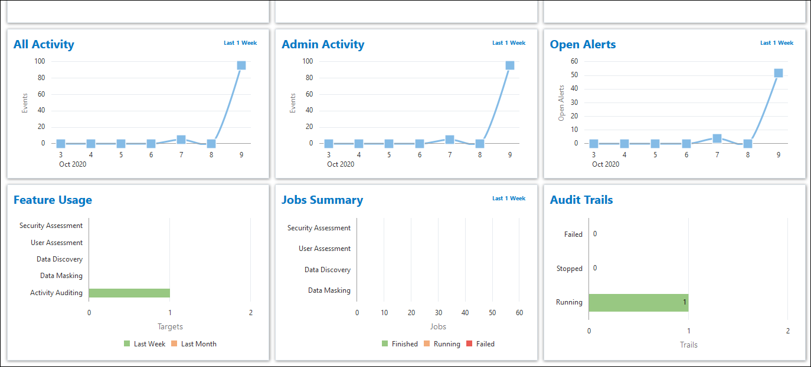

You may now proceed to the next lab.

## Learn More

* [Activity Auditing Overview](https://docs.cloud.oracle.com/en-us/iaas/data-safe/doc/activity-auditing-overview.html)
* [Audit Policies](https://docs.cloud.oracle.com/en-us/iaas/data-safe/doc/audit-policies.html)
* [Create Activity Auditing Jobs](https://docs.cloud.oracle.com/en-us/iaas/data-safe/doc/create-activity-auditing-jobs.html)

## Acknowledgements

* **Author** - Jody Glover, Principal User Assistance Developer, Database Development
* **Last Updated By/Date** - Jody Glover, November 3, 2020

## Need Help?
Please submit feedback or ask for help using our [Data Safe Community Support Forum]( https://community.oracle.com/tech/developers/categories/data-safe). Please click the **Log In** button and login using your Oracle Account. Click the **Ask A Question** button to the left to start a *New Discussion* or *Ask a Question*.  Please include your workshop name and lab name.  You can also include screenshots and attach files.  Engage directly with the author of the workshop.

If you do not have an Oracle Account, click [here](https://profile.oracle.com/myprofile/account/create-account.jspx) to create one.
