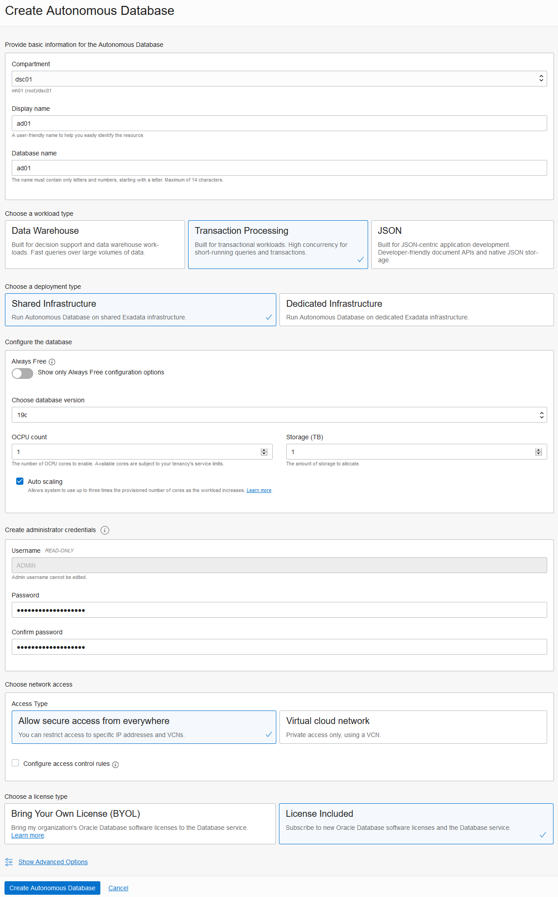
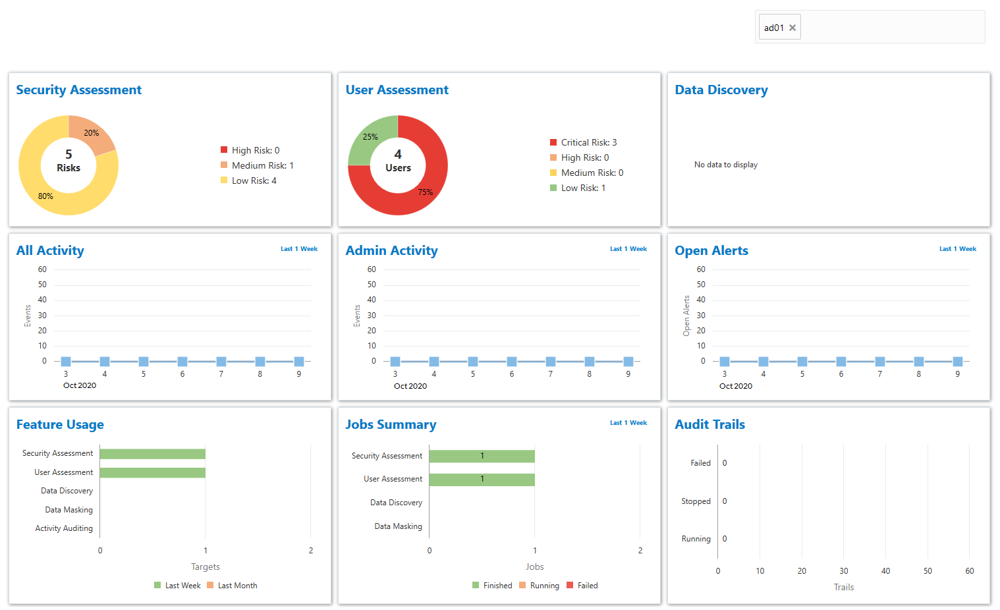
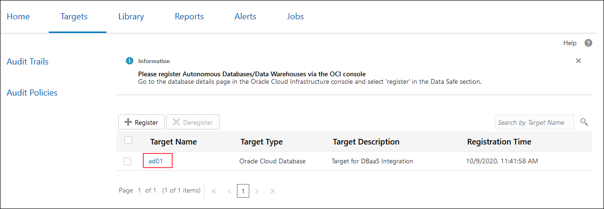
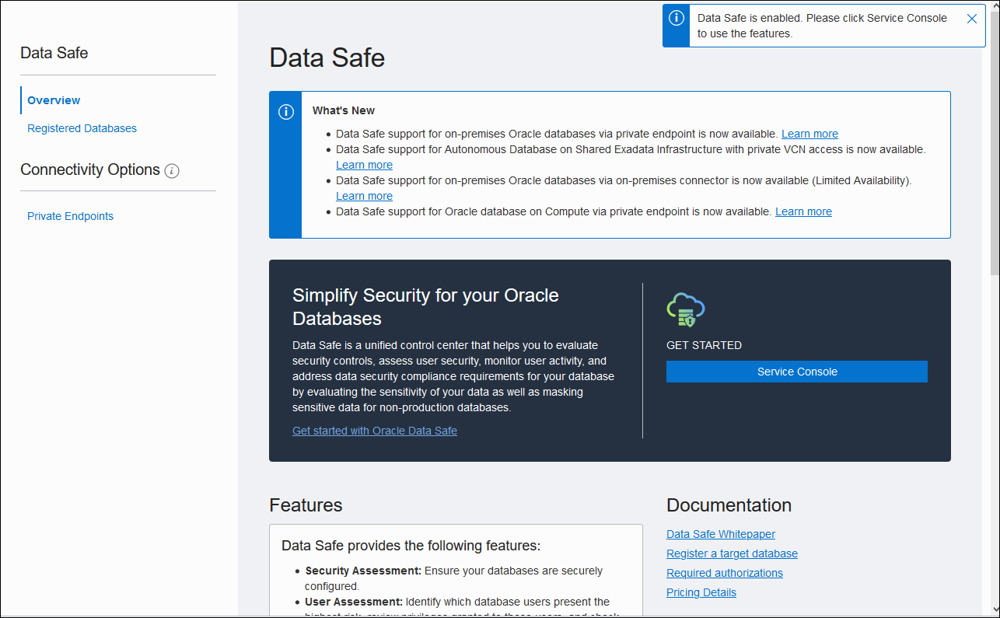

<if type="paid">
# Provision and Register an Autonomous Database</if>

<if type="freetier">
# Provision and Register an Autonomous Database</if>

<if type="livelabs">
# Register an Autonomous Database</if>

## Introduction
<if type="paid">This lab shows you how to create an Autonomous Database in Oracle Cloud Infrastructure, register it with Oracle Data Safe, and load sample data into it. You also view the list of registered target databases from the Oracle Data Safe Console and from the Oracle Data Safe service page in the Oracle Cloud Infrastructure Console.</if>

<if type="freetier">This lab shows you how to create an Autonomous Database in Oracle Cloud Infrastructure, register it with Oracle Data Safe, and load sample data into it. You also view the list of registered target databases from the Oracle Data Safe Console and from the Oracle Data Safe service page in the Oracle Cloud Infrastructure Console.</if>

<if type="livelabs">This lab shows you how to register an Autonomous Database with Oracle Data Safe and load sample data into it. You also view the list of registered target databases from the Oracle Data Safe Console and from the Oracle Data Safe service page in the Oracle Cloud Infrastructure Console.</if>

Estimated Lab Time: 30 minutes

### Objectives

In this lab, you'll:

<if type="paid">
- Provision an Autonomous Transaction Processing (ATP) database</if><if type="freetier">
- Provision an Autonomous Transaction Processing (ATP) database</if><if type="livelabs">
- Access your database in Oracle Cloud Infrastructure</if>
- Register your database with Oracle Data Safe
- Run a SQL script using Oracle Database Actions to load sample data into your database
- Sign in to the Oracle Data Safe Console and view the list of registered target databases
- View the list of registered target databases from the Oracle Data Safe service page in the Oracle Cloud Infrastructure Console

### Prerequisites
To complete this lab, you need to have the following:

- An Oracle Cloud account
- Access to a compartment in Oracle Cloud Infrastructure
<if type="livelabs">- Access to an Autonomous Transaction Processing database in your compartment</if>

<if type="livelabs">Your are provided with all of the above items when using the LiveLabs tenancy.</if>

### Assumptions

- You are signed in to the Oracle Cloud Infrastructure Console. If not, please refer to the [Getting Started](?lab=getting-started) page.

<if type="paid">
## **STEP 1**: Provision an Autonomous Transaction Processing database

1. From the navigation menu in the Oracle Cloud Infrastructure Console, select **Autonomous Transaction Processing**.

2. In the **Filters** section on the left, make sure your workload type is **Transaction Processing** or **All** so that you can see your database listed after you create it.

3. From the **Compartment** drop-down list, select your compartment.

4. Click **Create Autonomous Database**.

5. On the **Create Autonomous Database** page, provide basic information for your database:

      - **Compartment** - If needed, select your compartment.

      - **Display name** - Enter a memorable name for the database for display purposes, for example, **ad01** (short for Autonomous Database 1).

      - **Database Name** - Enter **ad01**. It's important to use letters and numbers only, starting with a letter. The maximum length is 14 characters. Underscores are not supported.

      - **Workload Type** - Leave **Transaction Processing** selected.

      - **Deployment Type** - Leave **Shared Infrastructure** selected.

      - **Always Free** - Leave this option deselected (the slider should be to the left).

      - **Database version** - Leave **19c** selected.

      - **OCPU Count** - Select **1**.

      - **Storage** - Leave **1** selected.

      - **Auto scaling** - Leave this checkbox selected.

      - **Password** and **Confirm Password** - Specify a password for the `ADMIN` database user and make note of it. The password must be between 12 and 30 characters long and must include at least one uppercase letter, one lowercase letter, and one numeric character. It cannot contain your username or the double quote (") character.

      - **Network Access** - Leave **Allow secure access from everywhere** selected.

      - **License Type** - Select **License Included**.

    

6. Click **Create Autonomous Database**. The **Autonomous Database Details** page is displayed.

7. Wait a few minutes for your instance to provision. When it is ready, **AVAILABLE** is displayed below the large ATP icon.

  
</if>

<if type="freetier">
## **STEP 1**: Provision an Autonomous Transaction Processing database

1. From the navigation menu in the Oracle Cloud Infrastructure Console, select **Autonomous Transaction Processing**.

2. In the **Filters** section on the left, make sure your workload type is **Transaction Processing** or **All** so that you can see your database listed after you create it.

3. From the **Compartment** drop-down list, select your compartment.

4. Click **Create Autonomous Database**.

5. On the **Create Autonomous Database** page, provide basic information for your database:

      - **Compartment** - If needed, select your compartment.

      - **Display name** - Enter a memorable name for the database for display purposes, for example, **ad01** (short for Autonomous Database 1).

      - **Database Name** - Enter **ad01**. It's important to use letters and numbers only, starting with a letter. The maximum length is 14 characters. Underscores are not supported.

      - **Workload Type** - Leave **Transaction Processing** selected.

      - **Deployment Type** - Leave **Shared Infrastructure** selected.

      - **Always Free** - Leave this option deselected (the slider should be to the left).

      - **Database version** - Leave **19c** selected.

      - **OCPU Count** - Select **1**.

      - **Storage** - Leave **1** selected.

      - **Auto scaling** - Leave this checkbox selected.

      - **Password** and **Confirm Password** - Specify a password for the `ADMIN` database user and make note of it. The password must be between 12 and 30 characters long and must include at least one uppercase letter, one lowercase letter, and one numeric character. It cannot contain your username or the double quote (") character.

      - **Network Access** - Leave **Allow secure access from everywhere** selected.

      - **License Type** - Select **License Included**.

    

6. Click **Create Autonomous Database**. The **Autonomous Database Details** page is displayed.

7. Wait a few minutes for your instance to provision. When it is ready, **AVAILABLE** is displayed below the large ATP icon.

  
</if>

<if type="livelabs">
## **STEP 1**: Access your Autonomous Database in Oracle Cloud Infrastructure

The LiveLabs tenancy provides you with an Autonomous Transaction Processing database that you can use with Oracle Data Safe.

1. Make sure that you have the correct region in Oracle Cloud Infrastructure selected.

2. From the navigation menu, select **Autonomous Transaction Processing**.

3. From the **Compartment** drop-down list, expand **c4u03 (root)**, expand **Livelabs**, and then select your compartment.

3. On the right, select your database. The **Autonomous Database Information** tab is displayed.
</if>

## **STEP 2**: Register your Autonomous Database with Oracle Data Safe

By default, when you register an Autonomous Database, you are automatically granted privileges in Oracle Data Safe to use the User Assessment, Security Assessment, and Activity Auditing features with your database. On your actual database, all Oracle Data Safe features are enabled by default, except Data Masking.

1. On the **Autonomous Database Information** tab, under **Data Safe**, click **Register**.  <if type="paid">If there is no **Register** option, it is because you are working in a region that does not have the Oracle Data Safe service enabled in it. If you are the tenancy administrator, please enable Oracle Data Safe in your tenancy and region. Otherwise, please contact your tenancy administrator to gain access to an appropriate region.</if> <if type="freetier">If there is no **Register** option, it is because you are working in a region that does not have the Oracle Data Safe service enabled in it. As the tenancy administrator, please refer to the prerequisites to enable Oracle Data Safe in a region of your tenancy.</if><if type="livelabs">If there is no **Register** option, it is because Oracle Data Safe is not yet enabled in the region you have selected. For help, please click the **Need Help** button on the toolbar.</if>

     

2. In the **Register Database with Data Safe** dialog box, click **Confirm**.

3. Wait for the registration process to finish. When registration is completed, the status reads **Registered**.

    

## **STEP 3**: Run a SQL script using Oracle Database Actions to load sample data into your database

The `load-data-safe-sample-data_admin.sql` script creates several tables with sample data that you can use to practice with the Oracle Data Safe features. It also enables the Data Masking feature on your database. After you run this script, all Oracle Data Safe features are enabled on your database. However, to use those features with Oracle Data Safe, you also require privileges in the Oracle Data Safe Console. <if type="paid">You have already granted the appropriate privileges on your compartment during the prerequisite setup.</if><if type="freetier">You have already granted the appropriate privileges on your compartment during the prerequisite setup.</if>

<if type="livelabs">*If you are working in the LiveLabs tenancy, you are granted privileges to use all features in Oracle Data Safe, except for Data Discovery and Data Masking.*</if>

1. On the **Autonomous Database Details** page, click the **Tools** subtab.

2. In the **Database Actions** section, click **Open Database Actions**. A new browser tab is opened displaying the **Oracle Database Actions | Sign in** page.

3. In the **Username** field, enter `ADMIN`, and then click **Next**.

<if type="paid">4. In the **Password** field, enter the password that you created for the `ADMIN` user when you provisioned the database, and then click **Sign In**.</if><if type="freetier">4. In the **Password** field, enter the password that you created for the `ADMIN` user when you provisioned the database, and then click **Sign In**.</if><if type="livelabs">4. In the **Password** field, enter your initial Cloud account password provided by LiveLabs, and then click **Sign In**.</if>

5. Under **Development**, click **SQL**.

6. If a help note is displayed, click the **X** button to close it.

7. Download the [load-data-safe-sample-data_admin.sql](https://objectstorage.us-ashburn-1.oraclecloud.com/p/W0JmKtImWp4e_FXSg4gj0wlwnAEf3OJ75cCpCdicH38ly55qrPaaZbO1el3ayfyR/n/c4u03/b/security-library/o/load-data-safe-sample-data_admin.zip) script, and then unzip it in a directory of your choice. Then, open the file in a text editor, such as NotePad.

8. Copy the entire script to the clipboard and then paste it into a worksheet in Database Actions.

9. To view the script activities, in the bottom pane, click the **Script Output** tab.

10. On the toolbar, click the **Run Script** button.

    

      - The script takes approximately 1 minute to run.

      - In the bottom-left corner, a cog wheel turns as the script is processed. The script output is displayed after the script is finished running.

      - Don't worry if you see some error messages on the **Script Output** tab. These are expected the first time you run the script.

      - The script ends with the message **END OF SCRIPT**.

11. When the script is finished running, on the **Navigator** tab on the left, select the `HCM1` schema from the first drop-down list. In the second drop-down list, leave **Tables** selected.

12. If you don't see `HCM1` listed, you need to sign out and sign in again:

  a) In the upper-right corner, from the `ADMIN` drop-down list, select **Sign Out**.

  b) Click **Sign in**.

  c) In the **Username** field, enter `ADMIN`, and then click **Next**.

  d) In the **Password** field, enter your initial Cloud account password, and then click **Sign in**.

  e) Under **Development**, click **SQL**.

  f) On the **Navigator** tab, select the `HCM1` schema from the first drop-down list.

13. On the toolbar, click the **Clear** button (trash can icon) to clear the worksheet.

14. Click the **Script Output** tab. If needed, click the **Clear output** button (trash can icon) to clear the output.

15. For each table listed below, drag the table to the worksheet and run the script. Choose **Select** as your insertion type when prompted. Make sure that you have the same number of rows in each table as stated below.

      - `COUNTRIES` - 25 rows
      - `DEPARTMENTS` - 27 rows
      - `EMPLOYEES` - 107 rows
      - `EMP_EXTENDED` - 107 rows
      - `JOBS` - 19 rows
      - `JOB_HISTORY` - 10 rows
      - `LOCATIONS` - 23 rows
      - `REGIONS` - 4 rows
      - `SUPPLEMENTAL_DATA` - 149 rows

16. If your data is different than what is specified above, rerun the [load-data-safe-sample-data_admin.sql](https://objectstorage.us-ashburn-1.oraclecloud.com/p/W0JmKtImWp4e_FXSg4gj0wlwnAEf3OJ75cCpCdicH38ly55qrPaaZbO1el3ayfyR/n/c4u03/b/security-library/o/load-data-safe-sample-data_admin.zip) script.

17. Sign out of Database Actions and close the tab.

## **STEP 4**: Sign in to the Oracle Data Safe Console and view the list of registered target databases

1. Return to the browser tab where you are signed in to **Oracle Cloud Infrastructure**. You last left off on the **Tools** tab for your database. If you navigated away from the **Tools** tab, select **Autonomous Transaction Processing** from the navigation menu, and then select your database.

2. Click the **Autonomous Database Information** tab.

3. To access the Oracle Data Safe Console from here, under **Data Safe**, click **View**.

  

    A new **Oracle Data Safe | Home** tab is opened and you are presented with a dashboard. You can also view a list of new features with links to documentation as well as product announcements.

    

4. Review the dashboard.

      - The dashboard lets you monitor several activities at once.
      - Above the dashboard, there is a removable filter set on your database name so that the dashboard displays data for your database only.
      - When you first sign in to the Oracle Data Safe Console, the Security Assessment and User Assessment charts in your dashboard are automatically populated.

5. Click each top tab and review the content on the page.

    - The **Home** tab shows a dashboard.
    - The **Targets** tab lists your registered target databases.
    - The **Library** tab lets you access repository resources, which are used for discovering and masking sensitive data. Resources include sensitive types, sensitive data models, masking formats, and masking policies.
    - The **Reports** tab lets you access prebuilt and custom built reports for all Oracle Data Safe features.
    - The **Alerts** tab shows you all open alerts for the past week, by default. If you need to view more alerts, you can remove the filters.
    - The **Jobs** tab shows you all current, past, and scheduled jobs. Notice that you have two jobs started already - one for User Assessment and one for Security Assessment.

    

6. Click the **Home** tab, and then click each side tab and review the content on the page.

    - The side tabs provide quick access to the wizards for Oracle Data Safe's main features, including **Security Assessment**, **User Assessment**, **Data Discovery**, **Data Masking**, and **Activity Auditing**.
    - You should see your target database listed on each tab.
    - On the **Security Assessment** and **User Assessment** tabs there is a report generated. In a later lab, you review these reports.

    

7. Click the **Targets** tab. Notice that your database is listed as a target database. Your database name is most likely different than the name displayed in the screenshot.

  

8. Click the name of your target database to view its details.

9. In the **Target Details** dialog box, review the read-only connection information for your database.
      - You cannot edit the registration details for an Autonomous Database.
      - You can view the compartment to which the database belongs. The compartment for an Autonomous Database is the same compartment in Oracle Cloud Infrastructure in which the database resides.
      - Oracle Data Safe connects to the database via a TLS connection.

10. Click **Cancel** to close the **Target Details** dialog box.

## **STEP 5**: View the list of registered target databases from the Oracle Data Safe service page in the Oracle Cloud Infrastructure Console

The **Registered Databases** page for the Oracle Data Safe service in the Oracle Cloud Infrastructure Console also lists registered target databases to which you have access.

1. Return to the **Oracle Cloud Infrastructure** browser tab.

2. If you are signed out, sign in again using your Oracle Cloud account credentials. You should be in the Oracle Cloud Infrastructure Console.

3. From the navigation menu, select **Data Safe**.

      - The **Overview** page for the Oracle Data Safe service is displayed. From here you can access the Oracle Data Safe Console and find links to useful information.
      - There is a message in the upper-right corner stating that **Data Safe is enabled**.
      - If there is an error on the page, you need to sign in again to Oracle Cloud Infrastructure.

    

4. On the left, click **Registered Databases**. Your registered database is listed.

5. Click the three dots to the right of your database name, and select **Service Console**. This is another way that you can access the Oracle Data Safe Console.

    

You may now [proceed to the next lab](#next).

## Learn More

  - [Provision Autonomous Data Warehouse](https://docs.oracle.com/en/cloud/paas/autonomous-data-warehouse-cloud/user/autonomous-provision.html#GUID-0B230036-0A05-4CA3-AF9D-97A255AE0C08)
  - [Loading Data with Autonomous Data Warehouse](https://docs.oracle.com/en/cloud/paas/autonomous-data-warehouse-cloud/user/load-data.html#GUID-1351807C-E3F7-4C6D-AF83-2AEEADE2F83E)
  - [Target Database Registration](https://docs.oracle.com/en-us/iaas/data-safe/doc/target-database-registration.html)

## Acknowledgements
  * **Author** - Jody Glover, Principal User Assistance Developer, Database Development
  * **Last Updated By/Date** - Jody Glover, March 29, 2021
