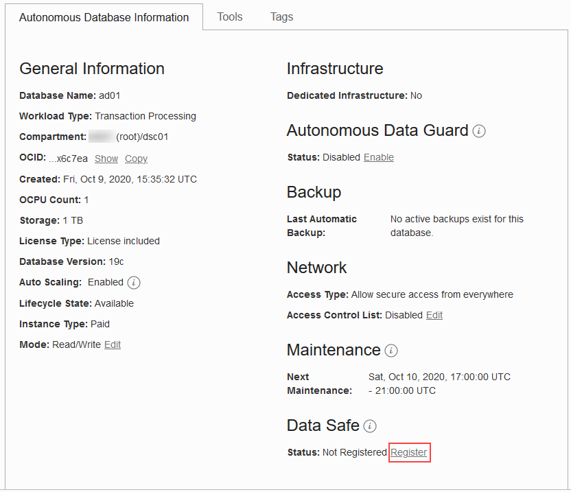
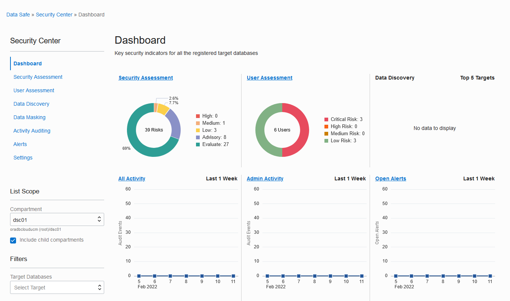
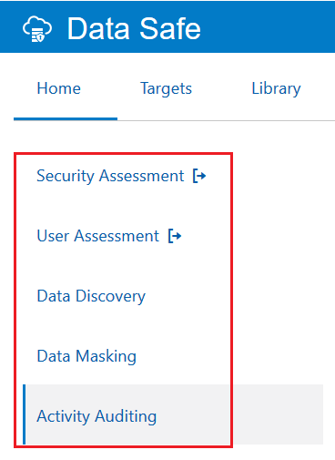

# Register an Autonomous Database with Oracle Data Safe

## Introduction

To use a database with Oracle Data Safe, you first need to register it with Oracle Data Safe. If there is no option to register your database, it is because you are working in a region that does not have the Oracle Data Safe service enabled in it.

The following three security elements need to be configured for you to use a database with Oracle Data Safe:
- A policy in Oracle Cloud Infrastructure Identity and Access Management (IAM) that grants you permission to use the Autonomous Database in your compartment. If you are a tenancy administrator, a policy is not required.
- One or more Oracle Data Safe roles granted to the Oracle Data Safe service account on the Autonomous database. The roles enable Oracle Data Safe features on the database. By default, the Oracle Data Safe service account on an Autonomous Database has all of the roles granted, except for Data Masking.
- An authorization policy in the Oracle Data Safe Console that grants you privileges to use one or more features with your Autonomous Database. By default, when you register an Autonomous Database, your user account is automatically granted Oracle Data Safe privileges for that database. The privileges granted depend on whether you are a regular user or an administrator. A regular user can use the User Assessment, Security Assessment, and Activity Auditing features with the database. A tenancy administrator or an Oracle Data Safe administrator can use all of the Oracle Data Safe features on any database.

> **Note**: In an Oracle-provided environment, you are not granted privileges to use the Data Discovery and Data Masking features with your database.

Begin by registering your Autonomous Transaction Database (ATP). After you register it, run the `load-data-safe-sample-data_admin.sql` SQL script to load sample data into your database. This script creates several tables with sample data that you can use to practice with the Oracle Data Safe features. It also enables the Data Masking feature on your database. Keep in mind, however, that to use Data Masking with your database, it is not enough to just enable Data Masking on the database. You also require the Discovery and Masking privilege on your database in the Oracle Data Safe Console.

Finally, view the list of registered target databases from the Oracle Data Safe Console and from the Oracle Data Safe service page in the Oracle Cloud Infrastructure Console.

Estimated Lab Time: 30 minutes

### Objectives

You learn how to perform the following tasks:

- Register your ATP database with Oracle Data Safe
- Run a SQL script using Oracle Database Actions to load sample data into your database
- Sign in to the Oracle Data Safe Console and view the list of registered target databases
- View details for your registered target database from the Oracle Data Safe service page in the Oracle Cloud Infrastructure Console

### Prerequisites

Before starting, be sure that you have completed the following prerequisite tasks:

- You obtained an Oracle Cloud account and signed in to the Oracle Cloud Infrastructure Console.
- You prepared your environment for this workshop. If not, see [Prepare Your Environment](?lab=prepare-environment).

### Assumptions

- Your data values are most likely different than those shown in the screenshots.

## **STEP 1**: Register your Autonomous Database with Oracle Data Safe

1. Make sure that you have the correct region in Oracle Cloud Infrastructure selected.

2. From the navigation menu, select **Oracle Database**, and then **Autonomous Transaction Processing**.

3. From the **Compartment** drop-down list, select your compartment.

4. On the right, click then name of your database.

    The **Autonomous Database Information** tab is displayed.

5. Under **Data Safe**, click **Register**.

     

6. In the **Register Database with Data Safe** dialog box, click **Confirm**.

7. Wait for the registration process to finish and for the status to read **Registered**.

    

## **STEP 2**: Run a SQL script using Oracle Database Actions to load sample data into your database

1. On the **Autonomous Database Details** page, click the **Tools** subtab.

2. In the **Database Actions** section, click **Open Database Actions**. A new browser tab is opened displaying the sign in page for Oracle Database Actions.

3. In the **Username** field, enter `ADMIN`, and then click **Next**.

4. In the **Password** field, enter the password for the `ADMIN` account, and then click **Sign In**.

    - If you provisioned an Autonomous Database, enter the password that you specified for the `ADMIN` account.
    - If a tenancy administrator provided you an Autonomous Database, obtain the password from your tenancy administrator.
    - If you are using an Oracle-provided environment, enter the `ADMIN` password that was provided to you.

5. Under **Development**, click **SQL**.

6. If a help note is displayed, click the **X** button to close it.

7. Download the [load-data-safe-sample-data_admin.sql](https://objectstorage.us-ashburn-1.oraclecloud.com/p/W0JmKtImWp4e_FXSg4gj0wlwnAEf3OJ75cCpCdicH38ly55qrPaaZbO1el3ayfyR/n/c4u03/b/security-library/o/load-data-safe-sample-data_admin.zip) script, and then unzip it in a directory of your choice. Next, open the file in a text editor, such as NotePad.

8. Copy the entire script to the clipboard and then paste it into a worksheet in Database Actions.

9. To view the script activities, in the bottom pane, click the **Script Output** tab.

10. On the toolbar, click the **Run Script** button.

    

    - The script takes approximately 1 minute to run.
    - In the bottom-left corner, a cog wheel turns as the script is processed. The script output is displayed after the script is finished running.
    - Don't worry if you see some error messages on the **Script Output** tab. These are expected the first time you run the script.
    - The script ends with the message **END OF SCRIPT**.

11. When the script is finished running, on the **Navigator** tab on the left, select the `HCM1` schema from the first drop-down list. In the second drop-down list, leave **Tables** selected.

12. If you don't see `HCM1` listed, you need to sign out and sign in again:

    1. In the upper-right corner, from the `ADMIN` drop-down list, select **Sign Out**.

    2. Click **Sign in**.

    3. In the **Username** field, enter `ADMIN`, and then click **Next**.

    4. In the **Password** field, enter the `ADMIN` password, and then click **Sign in**.

    5. Under **Development**, click **SQL**.

    6. On the **Navigator** tab, select the `HCM1` schema from the first drop-down list.

13. On the toolbar, click the **Clear** button (trash can icon) to clear the worksheet.

14. Click the **Script Output** tab. If needed, click the **Clear output** button (trash can icon) to clear the output.

15. For each table listed below, drag the table to the worksheet and run the script. Choose **Select** as your insertion type when prompted. Make sure that you have the same number of rows in each table as stated below.

    - `COUNTRIES` - 25 rows
    - `DEPARTMENTS` - 27 rows
    - `EMPLOYEES` - 107 rows
    - `EMP_EXTENDED` - 107 rows
    - `JOBS` - 19 rows
    - `JOB_HISTORY` - 10 rows
    - `LOCATIONS` - 23 rows
    - `REGIONS` - 4 rows
    - `SUPPLEMENTAL_DATA` - 149 rows

16. If your data is different than what is specified above, rerun the [load-data-safe-sample-data_admin.sql](https://objectstorage.us-ashburn-1.oraclecloud.com/p/W0JmKtImWp4e_FXSg4gj0wlwnAEf3OJ75cCpCdicH38ly55qrPaaZbO1el3ayfyR/n/c4u03/b/security-library/o/load-data-safe-sample-data_admin.zip) script.

17. Sign out of Database Actions and close the tab.

## **STEP 3**: Sign in to the Oracle Data Safe Console and view the list of registered target databases

1. Return to the browser tab where you are signed in to **Oracle Cloud Infrastructure**. You last left off on the **Tools** tab for your database. If you navigated away from the **Tools** tab, select **Oracle Database** and then **Autonomous Transaction Processing** from the navigation menu, and then click the name of your database.

2. Click the **Autonomous Database Information** tab.

3. To access the Oracle Data Safe Console from here, under **Data Safe**, click **View**.

    

    A new tab for Oracle Data Safe is opened and you are presented with a dashboard. At the top of the page, new features with links to documentation and product announcements are displayed.

    

4. Review the dashboard.

    - The dashboard lets you monitor several activities at once.
    - Above the dashboard, there is a removable filter set on your database name so that the dashboard displays data for your database only.
    - When you first sign in to the Oracle Data Safe Console, the Security Assessment and User Assessment charts in your dashboard are automatically populated.

5. Click each top tab and review the content on the page.

    - The **Home** tab shows a dashboard.
    - The **Targets** tab lists registered target databases to which you have access.
    - The **Library** tab lets you access repository resources, which are used for discovering and masking sensitive data. Resources include sensitive types, sensitive data models, masking formats, and masking policies.
    - The **Reports** tab lets you access prebuilt and custom built reports for all Oracle Data Safe features.
    - The **Alerts** tab shows you all open alerts for the past week, by default. If you need to view more alerts, you can remove the filters.
    - The **Jobs** tab shows you all current, past, and scheduled jobs. Notice that you have two jobs started already - one for User Assessment and one for Security Assessment.

    

6. Click the **Home** tab, and then click each side tab and review the content on the page.

    - The side tabs provide quick access to the wizards for Oracle Data Safe's main features, including **Security Assessment**, **User Assessment**, **Data Discovery**, **Data Masking**, and **Activity Auditing**.
    - Your target database is listed on each tab.
    - On the **Security Assessment** and **User Assessment** tabs, there is a report generated.

    

7. Click the **Targets** tab. Notice that your database is listed as a target database. Registered databases are referred to as *target databases* in the Oracle Data Safe Console.

## **STEP 4**: View details for your registered target database from the Oracle Data Safe service page in the Oracle Cloud Infrastructure Console

The **Registered Databases** page for the Oracle Data Safe service in the Oracle Cloud Infrastructure Console also lists registered target databases to which you have access.

1. Return to the **Oracle Cloud Infrastructure** browser tab.

2. If you are signed out, sign in again using your Oracle Cloud account credentials.

3. From the navigation menu, select **Oracle Database**, and then **Data Safe**.

    - The **Overview** page for the Oracle Data Safe service is displayed. From here you can access the Oracle Data Safe Console and find links to useful information.
    - There is a message in the upper-right corner stating that **Data Safe is enabled**.
    - If there is an error on the page, you need to sign in again to Oracle Cloud Infrastructure.

4. On the left, click **Target Databases**. Your registered target database is listed.

5. Click the name of your target database to view its registration details.

    - On the **Target Database Details** tab, you can view the target database name and description, OCID, when the target database was registered and the compartment to where the target database was registered.

    - You can also view connection information, such as database service name, the protocol (TCP or TLS), and so on. The connection information varies depending on the target database type.

    - The **Target Database Details** page provides options to edit the target database name and description, edit connection details, update the Oracle Data Safe service account and password on the target database (applicable to non-Autonomous Databases), and download a SQL privilege script that enables features on your target database.

    - From the **More Actions** menu, you can choose to move the target database to a different compartment, add tags, deactivate your target database, and deregister your target database.

## Learn More

  - [Provision Autonomous Data Warehouse](https://docs.oracle.com/en/cloud/paas/autonomous-data-warehouse-cloud/user/autonomous-provision.html#GUID-0B230036-0A05-4CA3-AF9D-97A255AE0C08)
  - [Loading Data with Autonomous Data Warehouse](https://docs.oracle.com/en/cloud/paas/autonomous-data-warehouse-cloud/user/load-data.html#GUID-1351807C-E3F7-4C6D-AF83-2AEEADE2F83E)
  - [Target Database Registration](https://docs.oracle.com/en-us/iaas/data-safe/doc/target-database-registration.html)

## Acknowledgements
  * **Author** - Jody Glover, Principal User Assistance Developer, Database Development
  * **Last Updated By/Date** - Jody Glover, June 15 2021
