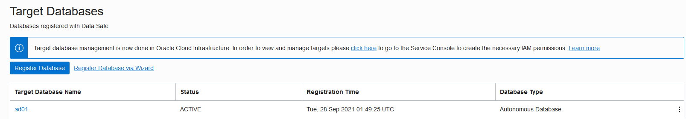
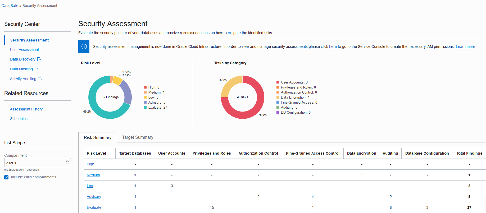

# Register an Autonomous Database with Oracle Data Safe

## Introduction

To use a database with Oracle Data Safe, you first need to register it with Oracle Data Safe. If there is no option to register your database, it is because you are working in a region that does not have the Oracle Data Safe service enabled in it.

The following three security elements need to be configured for you to use a database with Oracle Data Safe:
- A policy in Oracle Cloud Infrastructure Identity and Access Management (IAM) that grants you permission to use the Autonomous Database in your compartment. If you are a tenancy administrator, a policy is not required.
- One or more Oracle Data Safe roles granted to the Oracle Data Safe service account on the Autonomous database. The roles enable Oracle Data Safe features on the database. By default, the Oracle Data Safe service account on an Autonomous Database has all the roles granted, except for Data Masking.
- An authorization policy in the Oracle Data Safe Console that grants you privileges to use one or more features with your Autonomous Database. By default, when you register an Autonomous Database, your user account is automatically granted Oracle Data Safe privileges for that database. The privileges granted depend on whether you are a regular user or an administrator. A regular user can use the User Assessment, Security Assessment, and Activity Auditing features with the database. A tenancy administrator or an Oracle Data Safe administrator can use all the Oracle Data Safe features on any database.

> **Note**: In an Oracle-provided environment, you are not granted privileges to use the Data Discovery and Data Masking features with your database.

Begin by registering your Autonomous Transaction Database (ATP) with Oracle Data Safe. After registering it, run the `load-data-safe-sample-data_admin.sql` SQL script to load sample data into your database. This script creates several tables with sample data that you can use to practice with the Oracle Data Safe features. It also enables the Data Masking feature on your database. Keep in mind, however, that to use Data Masking with your database, it is not enough to just enable Data Masking on the database. You also require the Discovery and Masking privilege on your database in the Oracle Data Safe Console.

Next, access Oracle Data Safe in Oracle Cloud Infrastructure and view the list of registered target databases to which you have access. Access and review both the Security Center and the Oracle Data Safe Console. You can access all features through either interface.

Estimated Lab Time: 30 minutes

### Objectives

In this lab, you will:

- Register your ATP database with Oracle Data Safe
- Run a SQL script using Oracle Database Actions to load sample data into your database
- Access Oracle Data Safe and view the list of registered target databases to which you have access
- Access and review Security Center
- Access and review the Oracle Data Safe Console

### Prerequisites

This lab assumes you have:

- Obtained an Oracle Cloud account and signed in to the Oracle Cloud Infrastructure Console
- Prepared your environment for this workshop (see [Prepare Your Environment](?lab=prepare-environment))

### Assumptions

- Your data values are most likely different than those shown in the screenshots.

## Task 1: Register your Autonomous Database with Oracle Data Safe

1. Make sure that you have the correct region in Oracle Cloud Infrastructure selected.

2. From the navigation menu, select **Oracle Database**, and then **Autonomous Transaction Processing**.

3. From the **Compartment** drop-down list, select your compartment.

4. On the right, click then name of your database.

    The **Autonomous Database Information** tab is displayed.

5. Under **Data Safe**, click **Register**.

     

6. In the **Register Database with Data Safe** dialog box, click **Confirm**.

7. Wait for the registration process to finish and for the status to read **Registered**.

    

## Task 2: Run a SQL script using Oracle Database Actions to load sample data into your database

1. On the **Autonomous Database Details** page, click the **Tools** subtab.

2. In the **Database Actions** section, click **Open Database Actions**. A new browser tab is opened displaying the sign-in page for Oracle Database Actions.

3. In the **Username** field, enter `ADMIN`, and then click **Next**.

4. In the **Password** field, enter the password for the `ADMIN` account, and then click **Sign In**.

    - If you provisioned an Autonomous Database, enter the password that you specified for the `ADMIN` account.
    - If a tenancy administrator provided you an Autonomous Database, obtain the password from your tenancy administrator.
    - If you are using an Oracle-provided environment, enter the `ADMIN` password that was provided to you.

5. Under **Development**, click **SQL**.

6. If a help note is displayed, click the **X** button to close it.

7. Download the [load-data-safe-sample-data_admin.sql](https://objectstorage.us-ashburn-1.oraclecloud.com/p/Y5Wmkg4hP-ijM96-6IR6gIwxkVc8ejvWoDtzyFsOw6uMaU6fcXO_52jd2_mL_tzc/n/c4u04/b/security-library/o/load-data-safe-sample-data_admin.zip) script, and then unzip it in a directory of your choice. Next, open the file in a text editor, such as NotePad.

8. Copy the entire script to the clipboard and then paste it into a worksheet in Database Actions.

9. To view the script activities, in the bottom pane, click the **Script Output** tab.

10. On the toolbar, click the **Run Script** button.

    

    - The script takes a few minutes to run.
    - In the bottom-left corner, the cog wheel sometimes remains still for about a minute, and then turns as the script is processed. The script output is displayed after the script is finished running.
    - Don't worry if you see some error messages on the **Script Output** tab. These are expected the first time you run the script.
    - The script ends with the message **END OF SCRIPT**.

11. When the script is finished running, on the **Navigator** tab on the left, select the `HCM1` schema from the first drop-down list. In the second drop-down list, leave **Tables** selected.

12. If you don't see `HCM1` listed, you need to sign out of Database Actions and sign in again. To do so, in the upper-right corner, from the `ADMIN` drop-down list, select **Sign Out**. Click **Sign in**. In the **Username** field, enter `ADMIN`, and then click **Next**. In the **Password** field, enter the `ADMIN` password, and then click **Sign in**. Under **Development**, click **SQL**. On the **Navigator** tab, select the `HCM1` schema from the first drop-down list.

13. On the toolbar, click the **Clear** button (trash can icon) to clear the worksheet.

14. Click the **Script Output** tab. If needed, click the **Clear output** button (trash can icon) to clear the output.

15. For each table listed below, drag the table to the worksheet and run the script. Choose **Select** as your insertion type when prompted. Make sure that you have the same number of rows in each table as stated below.

    - `COUNTRIES` - 25 rows
    - `DEPARTMENTS` - 27 rows
    - `EMPLOYEES` - 107 rows
    - `EMP_EXTENDED` - 107 rows
    - `JOBS` - 19 rows
    - `JOB_HISTORY` - 10 rows
    - `LOCATIONS` - 23 rows
    - `REGIONS` - 4 rows
    - `SUPPLEMENTAL_DATA` - 149 rows

16. If your data is different than what is specified above, rerun the [load-data-safe-sample-data_admin.sql](https://objectstorage.us-ashburn-1.oraclecloud.com/p/Y5Wmkg4hP-ijM96-6IR6gIwxkVc8ejvWoDtzyFsOw6uMaU6fcXO_52jd2_mL_tzc/n/c4u04/b/security-library/o/load-data-safe-sample-data_admin.zip) script.

17. Sign out of Database Actions and close the tab. You are returned to the Oracle Cloud Infrastructure tab.

## Task 3: Access Oracle Data Safe and view the list of registered target databases to which you have access

1. From the navigation menu, select **Oracle Database**, and then **Data Safe**.

    - The **Overview** page for the Oracle Data Safe service is displayed. From here you can access the Security Center, register target databases, and find links to useful information.

2. On the left, click **Target Databases**.

3. From the **Compartment** drop-down list under **List Scope**, select your compartment. Your registered target database is listed on the right.

    

3. Click the name of your target database to view its registration details.

    - On the **Target Database Details** tab, you can view the target database name and description, OCID, when the target database was registered and the compartment to where the target database was registered.

    - You can also view connection information, such as database type, database service name, and connection protocol (TCP or TLS). The connection information varies depending on the target database type.

    - The **Target Database Details** page provides options to edit the target database name and description, edit connection details, update the Oracle Data Safe service account and password on the target database (applicable to non-Autonomous Databases), and download a SQL privilege script that enables features on your target database.

    - From the **More Actions** menu, you can choose to move the target database to a different compartment, add tags, deactivate your target database, and deregister your target database.

## Task 4: Access and review Security Center

1. In the breadcrumb at the top of the page, click **Target Databases**.

    The **Target Databases** page is displayed.

2. Under **Data Safe** on the left, click **Security Center**.

    - In Security Center, you can access the five main features of Oracle Data Safe, including Security Assessment, User Assessment, Data Discovery, Data Masking, and Activity Auditing.
    - The Security Assessment and User Assessment features are now native in Oracle Cloud Infrastructure. The Data Discovery, Data Masking, and Activity Auditing features as well as the dashboard are available through the Oracle Data Safe Console.
    - By default, the Security Assessment page is displayed.
    - Make sure your compartment is still selected under **List Scope**.

    

## Task 5: Access and review the Oracle Data Safe Console

1. Click **Activity Auditing**.

    - A new tab is opened.
    - Activity Auditing is part of the Oracle Data Safe Console.

2. To view the dashboard, click the **Home** tab.

    - At the top of the page, new features with links to documentation and product announcements are listed.

3. Directly above the dashboard, select your target database in the **Filter** box so that the dashboard displays data for only your database.

    - The dashboard lets you monitor several activities at once.
    - The Security Assessment and User Assessment charts in your dashboard are automatically populated after you register a target database.

    

3. Review the five tabs on the left side.

    - These tabs let you navigate to each feature in Oracle Data Safe.
    - The Security Assessment and User Assessment features are now available in the Oracle Cloud Infrastructure Console. Therefore, if you click either tab, you are returned to Oracle Cloud Infrastructure.
    - The Data Discovery, Data Masking, and Activity Auditing features are part of the Oracle Data Safe Console.

    

4. Click each top tab and review the content on the page.

    - The **Home** tab shows a dashboard.
    - The **Targets** tab shows you a read-only list of registered target databases to which you have access.
    - The **Library** tab lets you access repository resources, which are used for discovering and masking sensitive data. Resources include sensitive types, sensitive data models, masking formats, and masking policies.
    - The **Reports** tab lets you access prebuilt and custom built reports for all Oracle Data Safe features.
    - The **Alerts** tab shows you all open alerts for the past week, by default. If you need to view more alerts, you can remove the filters.
    - The **Jobs** tab shows you all current, past, and scheduled jobs. Notice that you have two jobs started already - one for User Assessment and one for Security Assessment.

    

5. Return to the **Home** tab.

## Learn More

  - [Provision Autonomous Data Warehouse](https://docs.oracle.com/en/cloud/paas/autonomous-data-warehouse-cloud/user/autonomous-provision.html#GUID-0B230036-0A05-4CA3-AF9D-97A255AE0C08)
  - [Loading Data with Autonomous Data Warehouse](https://docs.oracle.com/en/cloud/paas/autonomous-data-warehouse-cloud/user/load-data.html#GUID-1351807C-E3F7-4C6D-AF83-2AEEADE2F83E)
  - [Target Database Registration](https://docs.oracle.com/en/cloud/paas/data-safe/admds/target-database-registration.html)

## Acknowledgements
  * **Author** - Jody Glover, Principal User Assistance Developer, Database Development
  * **Last Updated By/Date** - Jody Glover, September 27 2021
