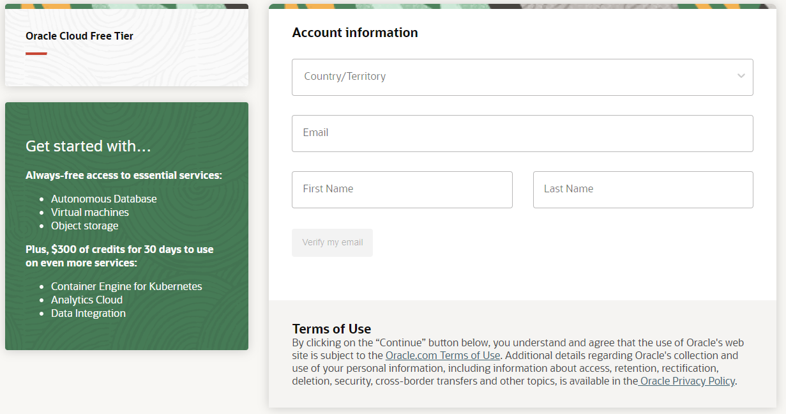
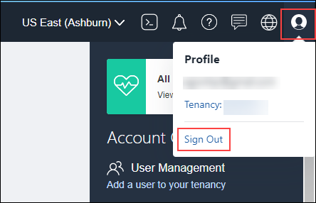
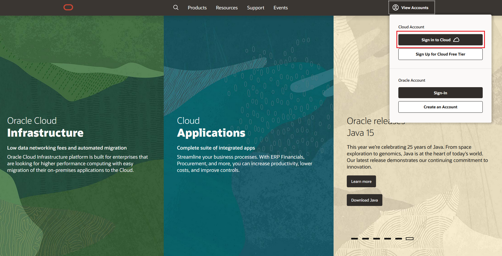
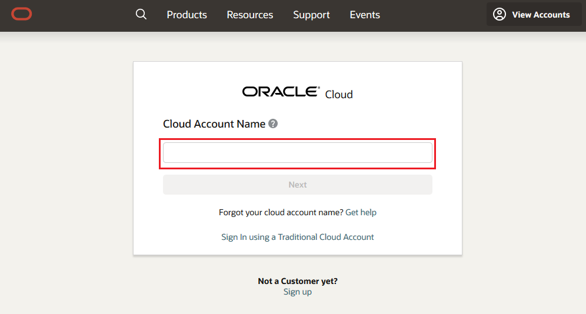
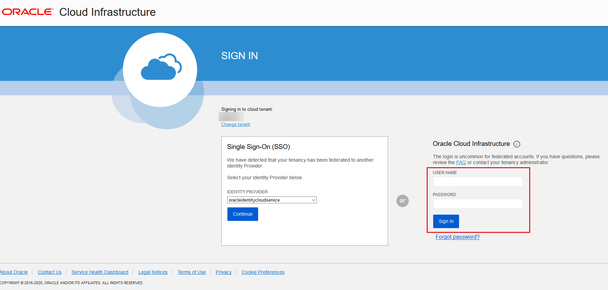
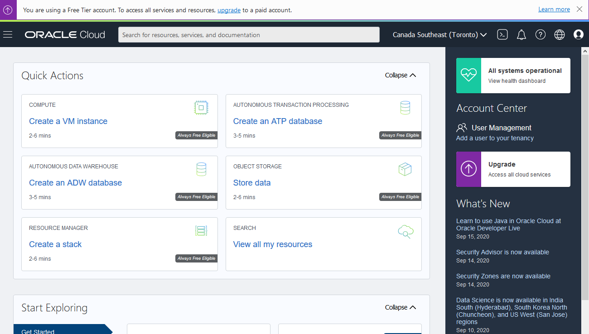
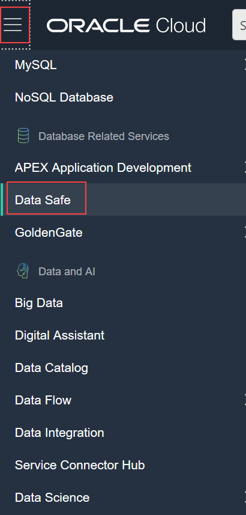

# Prerequisites for the Oracle Data Safe Workshop on the Free Tier

## Introduction

This lab describes the steps that you need to take prior to starting the Oracle Data Safe Workshop when using an Oracle Cloud Free Tier account. The steps assume that you are the tenancy administrator.

If you already have an Oracle Cloud Free Tier account, you can skip step 1.

**Note:** The Oracle Data Safe service is not available to you if your Free Tier trial period has ended and you are now using Always Free resources.

Estimated Lab Time: 15 minutes

### Objectives

In this lab, you'll:

- Create your own free trial account
- Sign in to the Oracle Cloud Infrastructure Console with your account credentials
- Enable Oracle Data Safe
- Create a compartment

### Prerequisites

Be sure you have the following before starting:

- A valid email address
- Ability to receive SMS text verification (only if your email is not recognized)

## **STEP 1**: Create Your Free Trial Account

If you already have an Oracle Cloud Free Tier account, you can skip this step.

1. In a browser, enter the following URL: `https://oracle.com/cloud/free`.

2. Click **Start for free**.

  

3. On the **Oracle Cloud Free Tier** page, do the following:

    a) Select a **country** or **territory**.

    b) Enter your **email address**.

    c) Enter your **first name** and **last name**.

    d) Click **Verify my email**. A verification email titled **OCI Email Verification** is sent to the email address you specified.

  

4. To continue with setting up your Oracle Cloud account, confirm your email address by clicking the link in your email. You are returned to the **Oracle Cloud Free Tier** page.

5. Continue to fill out the form:

    a) Enter a **password**. The password must contain a minimum of 8 characters, 1 lowercase, 1 uppercase, 1 numeric, and 1 special character. Your password cannot exceed 40 characters; contain the user's first name, last name, email address; contain spaces; or contain ` ~ < > \ characters. Remember the cloud account name you enter because you need this name later on to sign in to Oracle Cloud Infrastructure.

    b) Re-enter your password to confirm it.

    c) (Optional) Enter a **company name**.

    d) Specify a **cloud account name**.

    e) Select a **home region**.

    f) Review the **Terms of Use** section, and then click **Continue**.

6. If prompted, in the browser dialog box, click **Save** to save your password or click **Never**.

7. In the **Address information** section, enter your address details, and then click **Continue**.

8. In the **Mobile verification** section, enter your phone number, and then click **Text me a code**. In a few seconds, you should receive a verification code through SMS-text.

9. In the **Verification code** field, enter the code that was sent to your mobile phone, and then click **Verify my code**.

10. In the **Payment verification** section, click **Add payment verification method**. A **Pay** dialog box is displayed. You are not charged unless you elect to upgrade the account later on.

11. Click **Credit Card**. The **Add Verification Method** dialog box is displayed.

12. Scroll to the bottom of the dialog box, enter your credit card information, and then click **Finish**. Your credit card information is processed.

13. Click **Close** to close the **Pay** dialog box.

14. In the **Agreement** section, click the check box to agree to the terms and conditions, and then click **Start my free trial**. Your Oracle Cloud account is provisioned and should be available in a few seconds. When it is ready, you are automatically signed in to the Oracle Cloud Infrastructure Console. You also receive a confirmation email that has the sign-in information.

15. To sign out, in the upper-right corner of the Console, click the **Profile** icon (icon of a person's head), and then select **Sign Out**.

  

## **STEP 2**: Sign in to the Oracle Cloud Infrastructure Console with your Oracle Cloud account credentials
Throughout the workshop, it is assumed that you are signed in to the Oracle Cloud Infrastructure Console so you may need to refer back to this step from time to time.

1. Open a new browser tab.

2. Enter the URL [cloud.oracle.com](https://cloud.oracle.com).

3. On the toolbar, click **View Accounts**, and then in the **Cloud Account** section, select **Sign in to Cloud**.

   

4. Enter your **Cloud Account Name**, and then click **Next**. This is the name you chose while creating your account. It is not your email address. If you forget the name, please refer to the confirmation email.

  

5. In the **Oracle Cloud Infrastructure** section, enter your **username** and **password** for your Oracle Cloud account, and then click **Sign In**. Your username is your email address. The password is what you chose when you signed up for an account.

  

6. You are now signed in to the Oracle Cloud Infrastructure Console. The landing page shows you a dashboard. In the upper-left corner, there is a navigation menu (hamburger menu).

  

## **STEP 3**: Enable Oracle Data Safe

1. At the top of the page on the right, select a region in your tenancy (usually your Home region), for example, **US East (Ashburn)**.

   

2. From the navigation menu, select **Data Safe**.

   

  The **Overview** page is displayed.

3.Click **Enable Data Safe** and wait a couple of minutes for the service to enable.

   

4. When it's enabled, a confirmation message is displayed in the upper-right corner.

## **STEP 4**: Create a compartment

You need to create a compartment in your tenancy to store your Autonomous Database and Oracle Data Safe resources. In the labs, this compartment is referred to as "your compartment."

1. From the navigation menu, select **Identity**, and then **Compartments**. The **Compartments** page in Oracle Cloud Infrastructure Identity and Access Management (IAM) is displayed.

2. Click **Create Compartment**. The **Create Compartment** dialog box is displayed.

3. Enter a name for the compartment, for example, `dsc01` (short for Data Safe compartment 1).

4. Enter a description for the compartment, for example, **Compartment for the Oracle Data Safe Workshop**.

  

5. Click **Create Compartment**.

You are ready to begin the labs. Start with the [**Introduction**](?lab=introduction).

## Learn More

- <a  href="https://www.google.com/url?sa=t&amp;rct=j&amp;q=&amp;esrc=s&amp;source=web&amp;cd=&amp;cad=rja&amp;uact=8&amp;ved=2ahUKEwiV9crfq4LsAhV1lnIEHbzbABwQFjAAegQIARAC&amp;url=https%3A%2F%2Fdocs.cloud.oracle.com%2Fiaas%2F&amp;usg=AOvVaw0AhysJe8ZnjMdve29qGMtZ" >Oracle Cloud Infrastructure documentation</a>
- <a  href="https://www.googleadservices.com/pagead/aclk?sa=L&amp;ai=DChcSEwjpqdLfq4LsAhVMwMgKHXwlCVUYABAAGgJxdQ&amp;ohost=www.google.com&amp;cid=CAASEuRoiOXrrdCP5n-DJ1ywMcKyYQ&amp;sig=AOD64_22iprJaffo5nOe9sztGr9oHNidFQ&amp;q&amp;adurl&amp;ved=2ahUKEwiV9crfq4LsAhV1lnIEHbzbABwQ0Qx6BAgNEAE" >Try Oracle Cloud</a>

## Acknowledgements

* **Author** - Jody Glover, Principal User Assistance Developer, Database Development
* **Last Updated By/Date** - Jody Glover, October 15, 2020

## See an Issue?

Please submit feedback using this <a  href="https://apexapps.oracle.com/pls/apex/f?p=133:1:::::P1_FEEDBACK:1" >form</a>. Please include the **workshop name**, **lab**, and **step** in your request. If you don't see the workshop name listed, please enter it manually. If you would like for us to follow up with you, enter your email in the **Feedback Comments** section.
