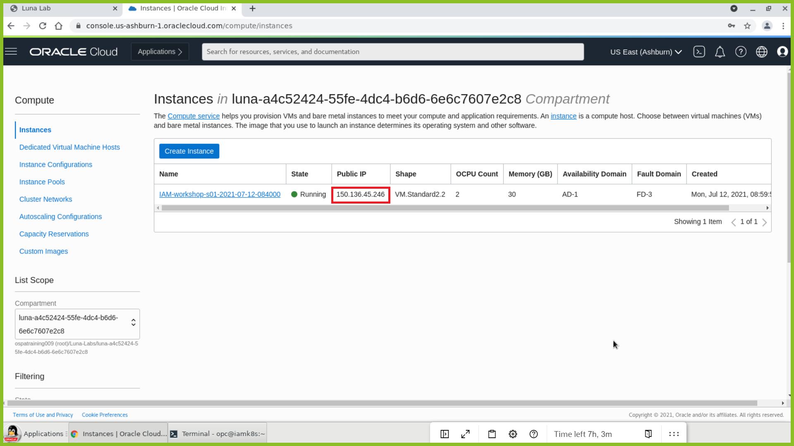

# Initialize the Workshop Environment

## Introduction

In this lab we will review and start all components required to successfully run this workshop.

Estimated Time: 10 minutes

### Objectives <optional>

In this lab, you will:
* Launch the workshop instance
* Verify the Oracle Database
* Create and Initialize Kubernetes nodes

## **Step 1**: Environment Verification

1. Copy the public IP address of the instance. Launch a terminal instance and ssh into your instance using the instance's public IP.

	```
	<copy>ssh -i .ssh/id_rsa opc@<PUBLIC_IP></copy>
	```

	For Example:

	

2. Verify the docker and helm version.

	```
	<copy>docker version</copy>
	```

	```
	<copy>helm version</copy>
	```

	

4. Verify that the OIG Database is running.

	```
	<copy>systemctl status oracle-database.service</copy>
	```

	

	Press Ctrl+C to revert to the terminal.

5. Verify the OIG, OAM and OUD docker images.

	```
	<copy>docker images | grep oracle</copy>
	```

	

## **STEP 2:** Environment Initialization

1. Perform the following prerequisite setup steps to initialize the environment.

	```
	<copy>sudo setenforce 0</copy>
	```

	```
	<copy>sudo sed -i --follow-symlinks 's/SELINUX=enforcing/SELINUX=disabled/g' /etc/sysconfig/selinux</copy>
	```

	```
	<copy>sudo swapoff -a</copy>
	```

2. Note the private IP of the instance.

	```
	<copy>cat /etc/hosts</copy>
	```
	For Example:

	

3. Deploy and initialize the pod network and make sure that the pod network does not overlap with any of the host networks.

	```
	<copy>sudo kubeadm init --pod-network-cidr=10.244.0.0/16</copy>
	```

4. Enable kubectl to work with non-root users.

	```
	<copy>sudo mkdir -p /home/oracle/.kube</copy>
	```

	```
	<copy>sudo cp -i /etc/kubernetes/admin.conf /home/oracle/.kube/config</copy>
	```

	```
	<copy>sudo chown -R oracle:oinstall /home/oracle/.kube</copy>
	```

5. Switch to *oracle* user, verify the Kubernetes version and schedule pods on the control-pane node.

	```
	<copy>sudo su - oracle</copy>
	```

	```
	<copy>kubectl version --short</copy>
	```

	

	```
	<copy>kubectl taint nodes --all node-role.kubernetes.io/master-</copy>
	```

6. List all pods in all namespaces.

	```
	<copy>kubectl get pods --all-namespaces</copy>
	```

7. Update the resources in the cluster and make sure all pods are in the “Running” state.

	```
	<copy>kubectl apply -f https://raw.githubusercontent.com/flannel-io/flannel/master/Documentation/kube-flannel.yml</copy>
	```

	Wait for 1-2 minutes and list all the pods and make sure they are in the Running state.

	```
	<copy>kubectl get pods --all-namespaces</copy>
	```

	


8. Start the VNC server as *oracle* user.

	```
	<copy>vncserver :1</copy>
	```

You may now [proceed to the next lab](#next).


## Acknowledgements
* **Author** - Keerti R, Brijith TG, Anuj Tripathi, NATD Solution Engineering
* **Contributors** -  Keerti R, Brijith TG, Anuj Tripathi
* **Last Updated By/Date** - Keerti R, NATD Solution Engineering, May 2021
