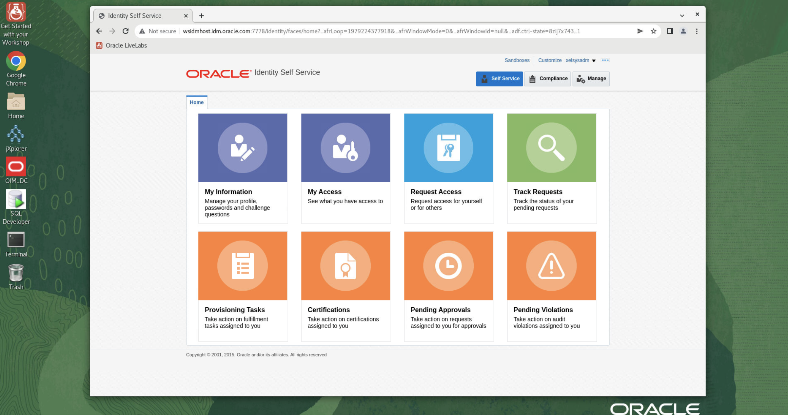

# Initialize the Environment

## Introduction

In this lab we will review and setup all components required to successfully upgrade IAM 11.1.2.3 to 12.2.1.4 version.

*Estimated Lab Time*:  30 minutes

### Objectives
- Initialize the IAM 11.1.2.3 baseline workshop environment.

### Prerequisites
This lab assumes you have:
- A Free Tier, Paid or LiveLabs Oracle Cloud account
- You have completed:
    - Lab: Prepare Setup (*Free-tier* and *Paid Tenants* only)
    - Lab: Environment Setup

## Task 1: Validate That Required Processes are Up and Running

1. Now with access to your remote desktop session, proceed as indicated below to validate your environment before you start executing the subsequent labs. The following Processes should be up and running:

    - Database Listener
        - LISTENER
    - Database Server Instance
        - IAMDB

    


2. Test the base installation by accessing the *Identity Manager Admin Console* which has been pre-launched on the *Chrome* window on your remote desktop session using the below credentials :

    ```
    URL: <copy>http://wsidmhost.idm.oracle.com:7778/oim</copy>
    ```
    ```
    User: <copy>xelsysadm</copy>
    ```
    ```
    Password: <copy>IAMUpgrade12c##</copy>
    ```

    


    


## Task 2: Review the ReadMe.txt and Binaries

1. Review environment details to learn more about the setup. Navigate to the file browser as shown below and open *ReadMe.txt*.

    

2. For your convenience, all software binaries needed throughout the workshop have been staged on the instance. Refer to the details below to review

    - Review 12c Binaries
    ```
    <copy>ls -ltrh /home/oracle/Downloads/12cbits </copy>
    ```
    - Review 11g Binaries
    ```
    <copy>ls -ltrh /home/oracle/Downloads/11gbits </copy>
    ```
    


You may now [proceed to the next lab](#next).


## Appendix 1: Managing Startup Services

1. To *start* all components as **oracle** user :
    ```
    <copy>/u01/app/oracle/config/scripts/startall.sh</copy>
    ```

    

    ***Note:*** This will take between 20-30 minutes.
2. To *restart* all processes you can use one of the following options:

  - Reboot the instance as user *opc* from the SSH terminal session you started using the SSH key (not the remote desktop session).

    ```
    <copy>sudo init 6</copy>
    ```

  - Restart processes

    ```
    <copy>/u01/app/oracle/config/scripts/stopall.sh</copy>
    ```
    ```
    <copy>systemctl restart oracle-database</copy>
    ```

    ```
    <copy>/u01/app/oracle/config/scripts/startall.sh</copy>
    ```

## Learn More
Use these links to get more information about Oracle Identity and Access Management:
- [Oracle Identity Management 12.2.1.4.0](https://docs.oracle.com/en/middleware/idm/suite/12.2.1.4/index.html).

## Acknowledgements
* **Author** - Anbu Anbarasu, Director, Cloud Platform COE
* **Contributors** -  Eric Pollard - Sustaining Engineering, Ajith Puthan - IAM Support, Rene Fontcha
* **Last Updated By/Date** - Sahaana Manavalan, LiveLabs Developer, NA Technology, May 2022
