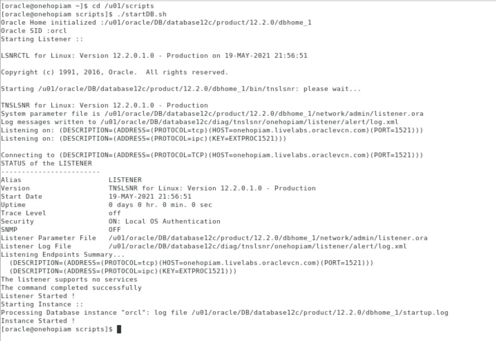

# Initialize the workshop environment

## Introduction

In this lab we will review and startup all components required to successfully run this workshop.

Estimated Lab Time: 20 minutes

### About Product/Technology
Oracle Identity Governance(OIG) is a powerful and flexible enterprise identity management system that automatically manages user's access privileges within enterprise IT resources.

### Objectives

In this lab, you will:
* Start the database
* Start and Verify 11g Domain available for upgrade
* Start and Verify 12c Domain

### Prerequisites

* An Oracle Cloud Account - Please view this workshop's LiveLabs landing page to see which environments are supported
* SSH Private Key to access the host via SSH

*Note: If you have a **Free Trial** account, when your Free Trial expires your account will be converted to an **Always Free** account. You will not be able to conduct Free Tier workshops unless the Always Free environment is available. **[Click here for the Free Tier FAQ page.](https://www.oracle.com/cloud/free/faq.html)***

## **STEP 1:** Login to the instance

Login to the Host using SSH Key based authentication using your preferred SSH client.

1. Open a terminal session and login as "oracle" user

  ```
  <copy>sudo su - oracle</copy>
  ```

2. Start the VNC server and connect to the instance using a preferred VNC client

  ```
  <copy>vncserver :1</copy>
  ```
  ```
  VNC Password: <copy>Welcom@123</copy>
  ```

## **STEP 2:** Start the Database

1. Open a terminal session and Navigate to the */u01/scripts* folder

  ```
  <copy>cd /u01/scripts</copy>
  ```


2. Start the database by running the *startDB.sh* script

  ```
  <copy>./startDB.sh</copy>
  ```
  

## **STEP 3:** Start and Verify the 11g Domain

1. Run the *startDomain11g.sh* script
The Admin server will take about 3-4 mins to start. It may take about 10mins for the SOA and OIM servers to start.

  ```
  <copy>./startDomain11g.sh</copy>
  ```
2. Access the Weblogic console from your browser and verify the version

    - Click on the bookmark *IAM11g* and Click on *WLS* from the dropdown "OR" paste the following URL in the browser:

    ```
    <copy>http://onehopiam:7001/console</copy>
    ```
    ```
    Username: <copy>weblogic</copy>
    ```
    ```
    Password: <copy>Welcom@123</copy>
    ```

    

    - On the Weblogic console, Click on *Servers* under *Environment* and verify that all servers(OIM,SOA) are in the ‘RUNNING’ state.

    

    

3. Access the Identity Self Service console

    - Click on the bookmark *IAM11g* and Click on *OIM* from the dropdown "OR" paste the following URL in the browser:

    ```
    <copy>http://onehopiam:14000/identity</copy>
    ```
    ```
    Username: <copy>xelsysadm</copy>
    ```
    ```
    Password: <copy>Welcom@123</copy>
    ```

    

    - Click on *xelsysadm* on the top right corner and Click on *About* from the dropdown. Verify that the OIM version is 11g

    

    - Click on *Manage* on the top right corner. Then, click on *Users* and notice that 3 test users have been created (*TUSER1, TUSER2, TUSER3*)

    

    

## **STEP 4:** Start and Verify the 12c Domain

1. Run the *startDomain12c.sh* script
The Admin server will take about 3-4 mins to start. It may take about 10mins for the SOA and OIM servers to start.

  ```
  <copy>./startDomain12c.sh</copy>
  ```
2. Access the Weblogic console from your browser and verify the version as 12c

    - Click on the bookmark *IAM12c* and Click on *WLS* from the dropdown "OR" paste the following URL in the browser:

    ```
    <copy>http://onehopiam:7005/console</copy>
    ```
    ```
    Username: <copy>weblogic</copy>
    ```
    ```
    Password: <copy>Welcom@123</copy>
    ```

    

    - On the Weblogic console, Click on *Servers* under *Environment* and verify that all servers(OIM,SOA) are in the ‘RUNNING’ state.

    

3. Access the Identity Self Service console

    - Click on the bookmark *IAM12c* and Click on *OIM* from the dropdown "OR" paste the following URL in the browser:

    ```
    <copy>http://onehopiam:14005/identity</copy>
    ```
    ```
    Username: <copy>xelsysadm</copy>
    ```
    ```
    Password: <copy>Welcom@123</copy>
    ```

    

    - Click on *xelsysadm* on the top right corner and Click on *About* from the dropdown. Verify that the OIM version is 12c

    

    - Click on *Manage* on the top right corner. Then, click on *Users* and notice that there are no new users created.

    

You may now [proceed to the next lab](#next).

## Acknowledgements
* **Author** - Keerti R, Brijith TG, Anuj Tripathi
* **Contributors** -  Keerti R, Brijith TG, Anuj Tripathi
* **Last Updated By/Date** - Keerti R/May 2021
* **Workshop (or Lab) Expiry Date** - Never
