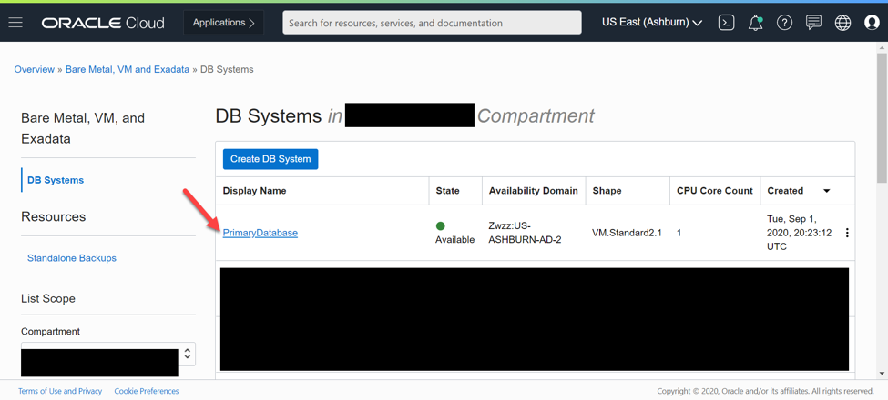
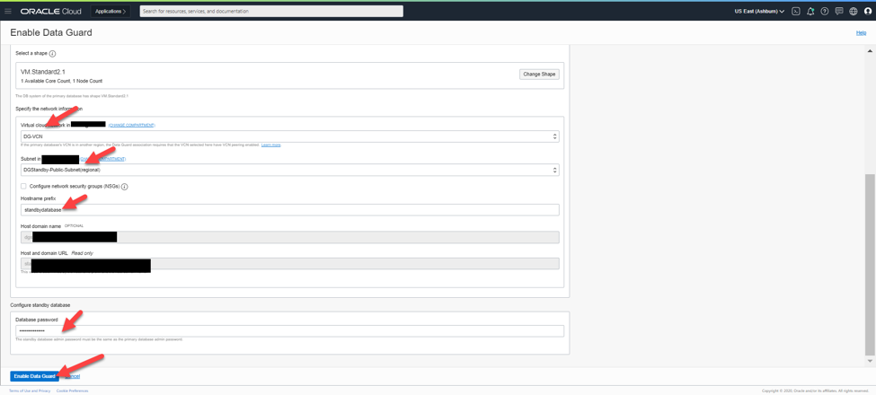
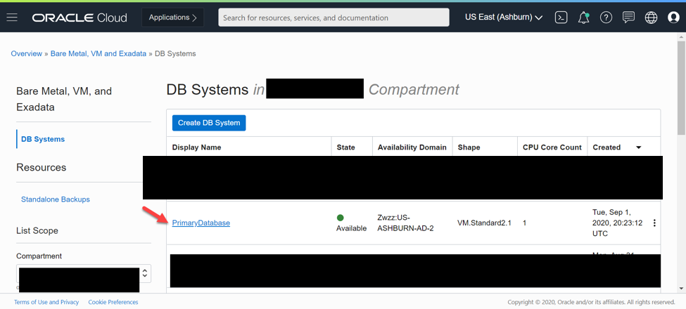
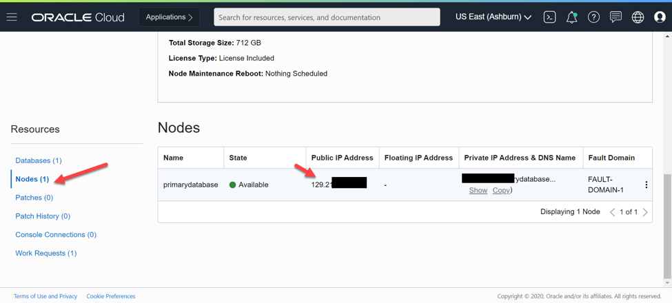
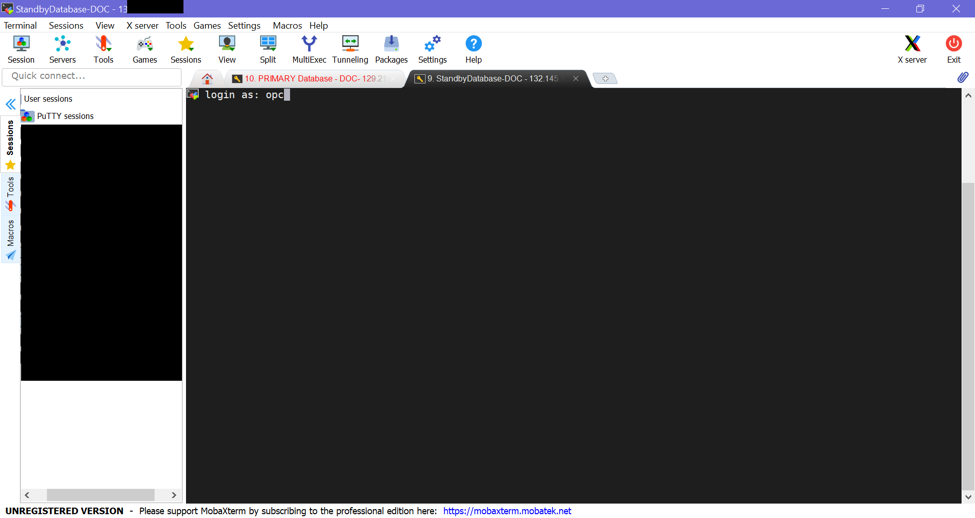
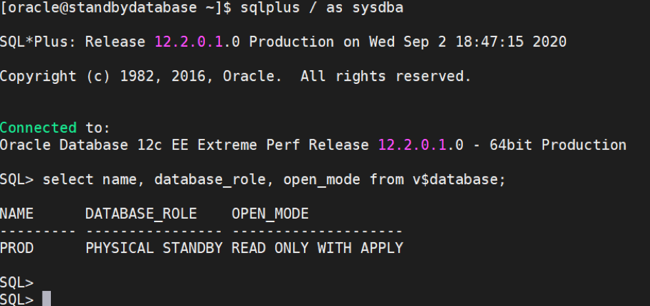
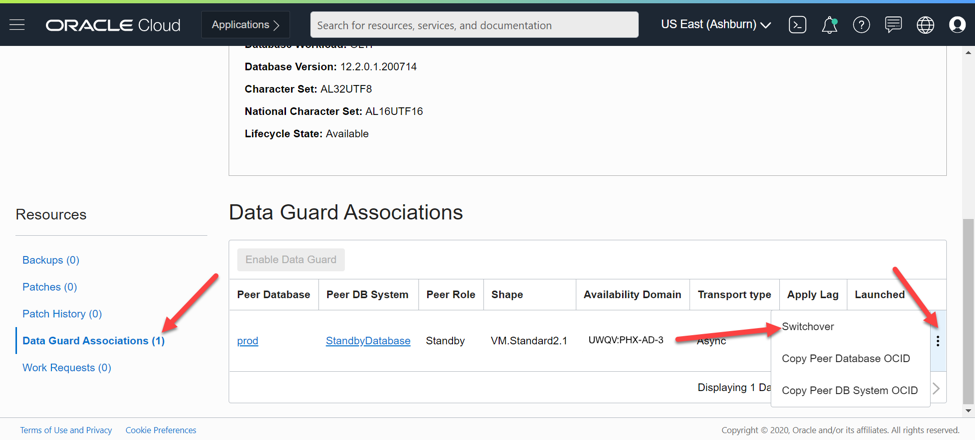
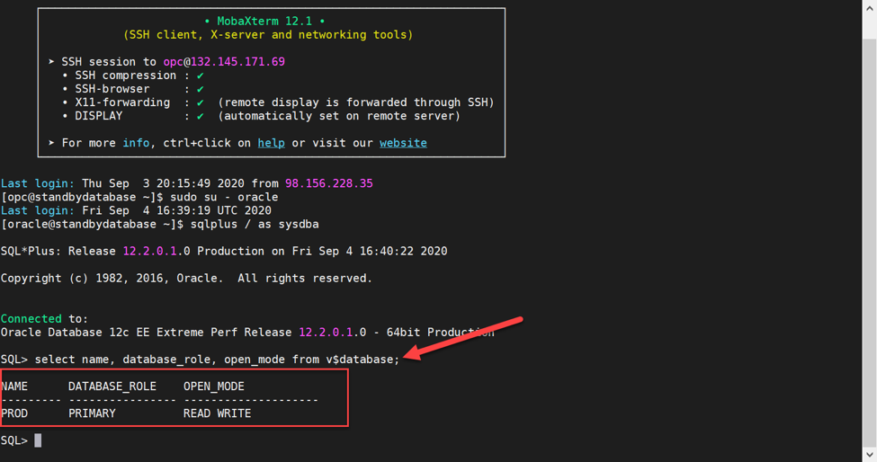
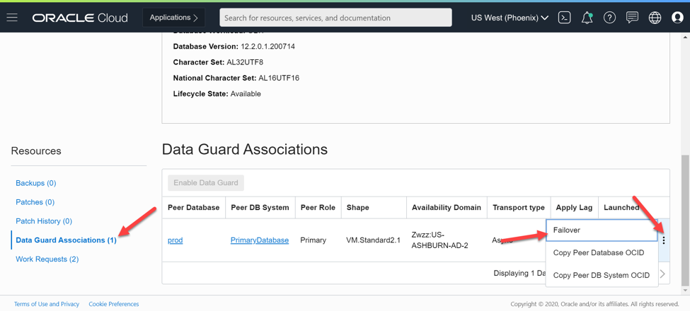
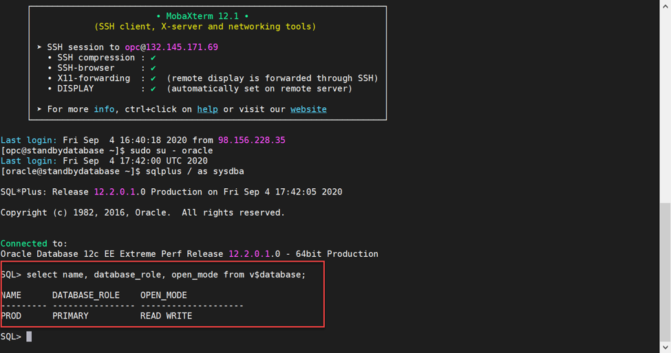

# Oracle Data Guard

## Introduction

Welcome to an introduction to Active Data Guard on OCI. In this portion of the workshop, we'll dive into how to leverage this tool for DR failover. Throughout the lab, we'll demonstrate the ease of use that is available to the end user via the Oracle Cloud console. 

Estimated Lab Time: 120 minutes

### About Oracle Data Guard

Oracle Data Guard provides disaster recovery, high availability and data protection for all enterprise grade data. It comprises of a comprehensive set of services that create, maintain, manage and monitor one or more standby databases to ensure that Oracle databases continue operating past disasters and data corruptions.

### Objectives

In this lab, you will:
* Understand the value of Oracle Active Data Guard.
* Configure Active Data Guard on virtual machine databases.
* Simulate a DR failover scenario using Active Data Guard.

### Prerequisites

* Access to an Oracle cloud account
* Familiarity with Oracle database

## **STEP 1:** Provisioning the Primary database.

1. Spin up a database using Oracle Cloud Infrastructure to serve as the "Primary" database

2. Click on the "Bare Metal, VM, and Exadata" tab under "Oracle Database" on the Cloud Console sidebar. 

  

3. Now let's create a DB System by clicking "Create DB System"

  

4. Fill out the information required. **Note:** for Data Guard to work properly, the shape, software edition **MUST** be the same as the standby database (we will configure this later).

  

  

5. In the following screenshot, please note: **Oracle Database Software Edition** was changed to **Enterprise Edition Extreme Performance**.

  The most common use of Storage Management Software is Oracle Grid Infrastructure, but for quicker deployments you can use Logical Volume Manager.

  

6. Specify the network information. You will use the DR VCN (**drvcn**) and the DB subnet (**db subnet**) created from the terraform script in the previous lab. Note the arrows, meaning action or change is required on your part. Fill in the required information and click **Next**.

  

7. Provide additional information for the initial database. **Provide a PDB name for the database.**

  

8. Click **Create DB System** and let it provision. (_This may take up to an hour or even more depending on your shape configuration_.)

  

  

## **STEP 2:** Creating a Data Guard association.

1. Now that our database is provisioned and available, let's click on the database system name.

  

2. Scroll down and click on the database name.

  

3. Now, scroll down and click on **Data Guard Associations** on the left side, then click on **Enable Data Guard**.

  

4. Enter the **Data Guard Association** details. Then click **Enable Data Guard**. (_Note: this may take up to an hour or more to completely finish. You will also see a new database system appear with the name you provided_.)

  

  

## **STEP 3:** Connecting to databases & testing Data Guard build.

1. After the standby database has provisioned, we will need the IP address of the instance to connect to.

  

  

2. Scroll down and click **Nodes** to find the public IP address of the server. (_Note: do this for both the primary and standby databases_.)

  

  

3. Log into the servers using the IP address and SSH private key. In order to access our DB servers, we'll need to hop through the **DR bastion** server. Please refer back to the previous lab for steps on how to server hop from a bastion. Log in as the **opc** user on **both** servers.

  Primary:

  

  Standby:
  

4. On **BOTH** servers, enter the following commands:

  ```
  $ sudo su - oracle     // Changes the user to oracle.
  $ sqlplus / as sysdba  // Connects to the database.
  ```

5. After you are connected to the database, run the following query to verify both database roles. (_Note: run on **BOTH** databases_.)

  ```
  SQL> select name, database_role, open_mode from v$database;
  ```

  Primary:

  

  Standby:

  

6. Now we can test if Data Guard is working correctly. On the **Primary** database, we will create a table and insert some data into it. (_Note: copying and pasting from this lab may not work due to formatting. Please type the commands manually_.)

  ```
  SQL> create table employees(first_name varchar2(50));
  SQL> insert into employees values ('thomas');
  SQL> commit;
  ```

  

7. Now go to the **Standby** database and query the table that you just created on the primary database. (_Note: it may take a few minutes for the table to appear_.)

  ```
  SQL> select * from employees;
  ```
  

## **STEP 4:** Performing a Data Guard switchover. 

Data Guard switchovers are performed for events that are planned. The primary and standby databases reverse roles so that the needed measures can be performed on the respective database.

1. To start a switchover, click on the database that is currently the **Primary**.

  

2. Click on the database name.

  

3. On the left side, click on **Data Guard Associations**, then click on the **three dots** to open a sub-menu. Then simply click **Switchover**.

  

4. Enter the database password then wait for the work requests to finish (_Note: this usually takes about 10 - 15 minutes to complete_.)

  

5. After it has completed, click on your **NEW PRIMARY** database. In our case, it's called **StandbyDatabase**. (_Remember, the roles have been reversed_!)

  

  

6. Connect to the database and check its role to verify.

  ```
  $ select name, database_role, open_mode from v$database;
  ```

  

## **STEP 5:** Performing a Data Guard failover.

Data Guard failovers are used for unforeseen disasters or downtime that is not planned. Data Guard will failover to the standby database from the primary in the event of any disaster or unplanned downtime. 

1. To failover to the standby database, we will navigate to the current **STANDBY** database (_Note: our **PrimaryDatabase** is our primary and our **StandbyDatabase** is our standby for this scenario_.)

  

2. Click on the database name. It should be inside the **STANDBY DATABASE** DB system.

  

3. On the left side, click on **Data Guard Associations**, then click on the **three dots** to open the sub-menu. Click on **Failover**.

  

4. Enter the database password and click **OK**. This may take a bit to update and complete.

  

5. Log into the **STANDBY DATABASE** server to verify that the database role has been changed to **Primary**. 

  ```
  $ select name, database_role, open_mode from v$database;
  ```

  

6. Now, navigate back to the **StandbyDatabase** DB system and look at the **Peer Role** under **Data Guard Associations**. It shows **Disabled Standby** which also reaffirms that the failover was successful.

  

7. To resume Data Guard after a failover, you will have to **reinstate** the database that is in standby. Simply click on the **three dots** and click **reinstate**.

  

8. Enter the DB password and click **OK**. This should take about 10 - 15 minutes.

  

9. Wait for the databases to update.

  

10. After they are updated and available, log into the **PrimaryDatabase** DB system server to verify that the database role shows **Physical Standby**. (_Note: remember that our **StandbyDatabase** is acting as our Primary database after the failover. So that means that the **PrimaryDatabase** will act as the Standby database_.)

  

## Learn More
* [Introduction to Oracle Data Guard](https://docs.oracle.com/en/database/oracle/oracle-database/12.2/sbydb/introduction-to-oracle-data-guard-concepts.html#GUID-5E73667D-4A56-445E-911F-1E99092DD8D7)

## Acknowledgements
* **Authors** - Humza Meraj, Cloud Engineer; Eben Dunlap, Cloud Engineer; Noah Horner, Cloud Engineer
* **Last Updated By** - Humza Meraj, Cloud Engineering, October 2020

## Need Help?
Please submit feedback or ask for help using our [LiveLabs Support Forum](https://community.oracle.com/tech/developers/categories/livelabsdiscussions). Please click the **Log In** button and login using your Oracle Account. Click the **Ask A Question** button to the left to start a *New Discussion* or *Ask a Question*.  Please include your workshop name and lab name.  You can also include screenshots and attach files.  Engage directly with the author of the workshop.

If you do not have an Oracle Account, click [here](https://profile.oracle.com/myprofile/account/create-account.jspx) to create one.


