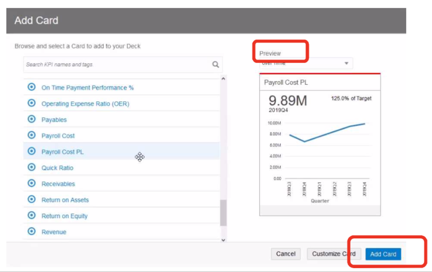
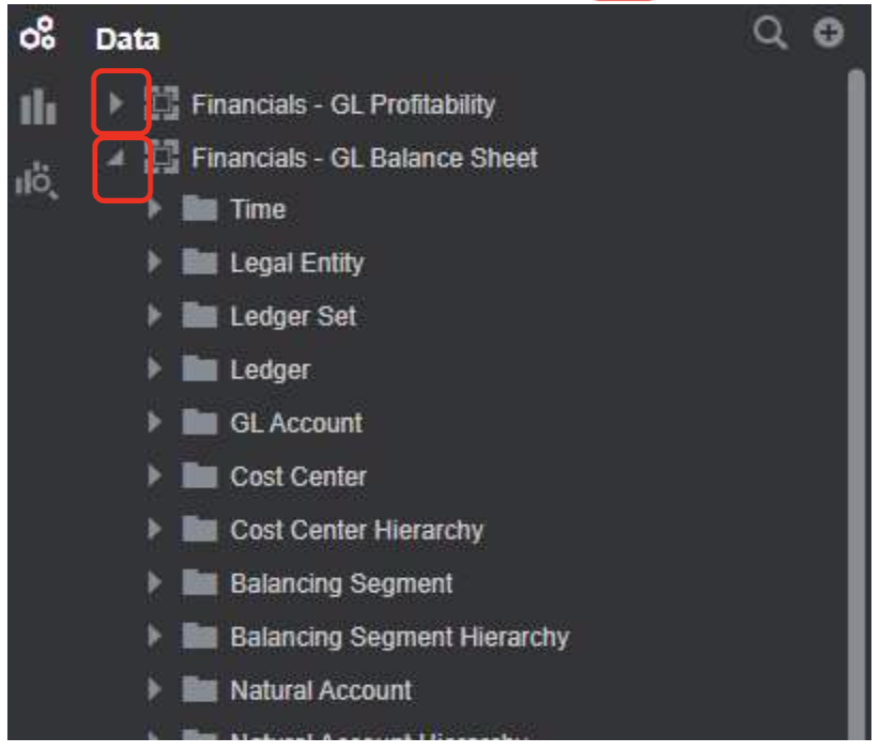
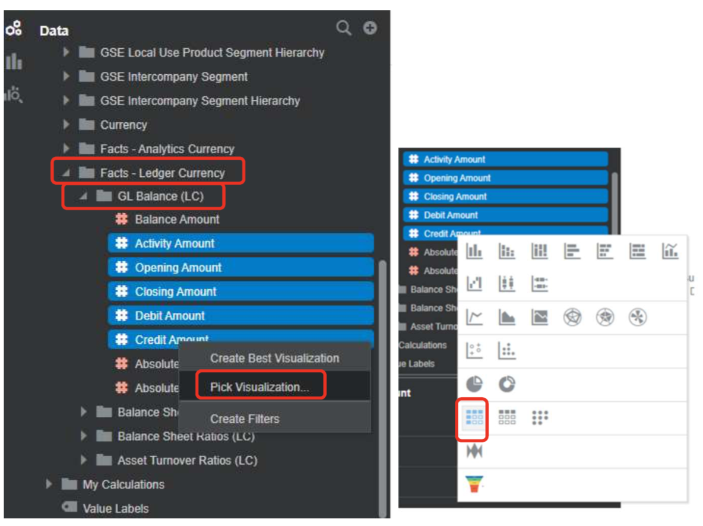
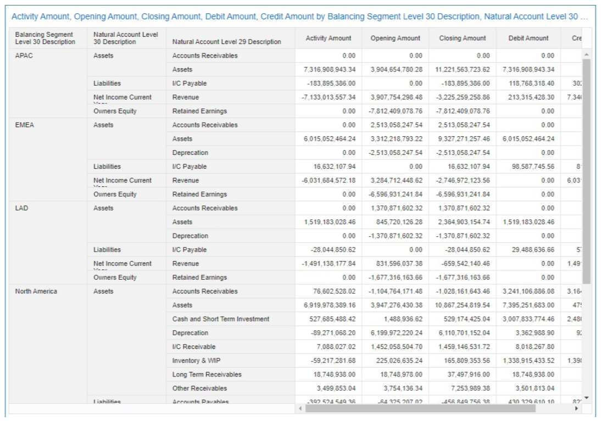
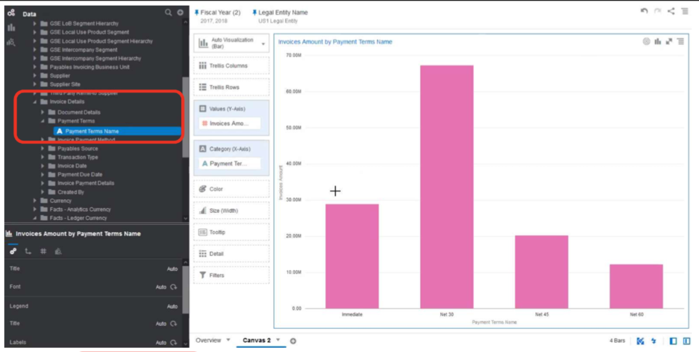
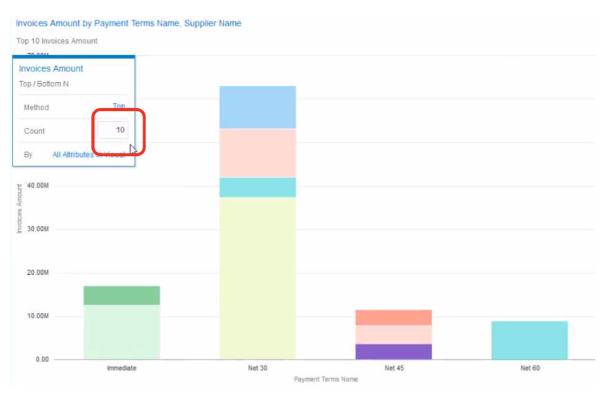
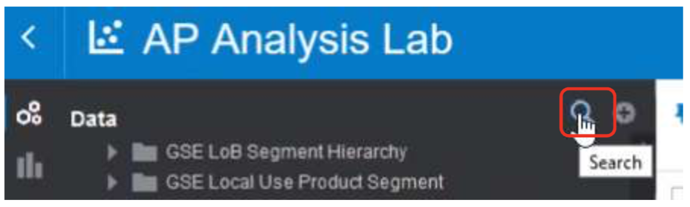
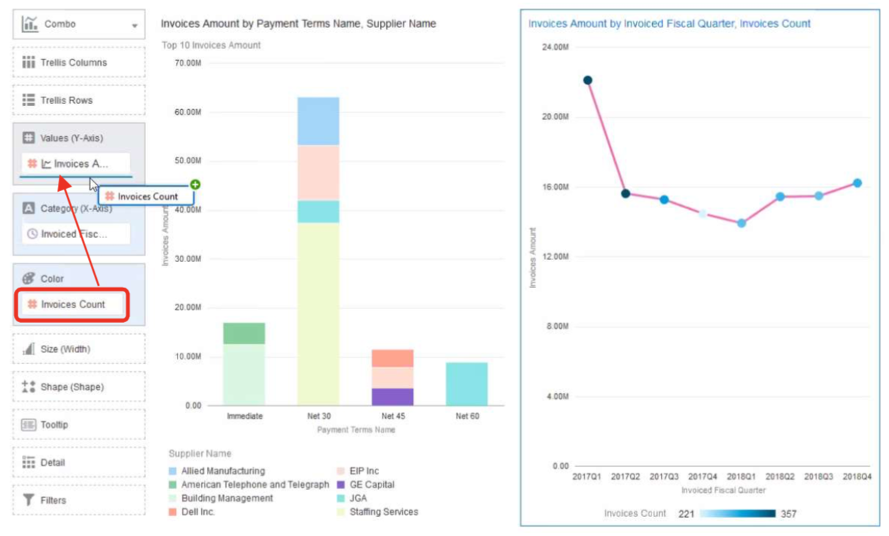

# Oracle Fusion ERP Analytics

## Introduction

In this lab, you will learn about how a finance team can adress analytics questions through Oracle Fusion ERP Analytics.

Finance teams are under enormous pressure to generate more insights, faster, from their financial systems and other critical data sources. But for most organizations, far too much time is spent manually sourcing, managing, preparing, and securing data – leaving far too little time for true analysis and insight.

Oracle Fusion ERP Analytics provides the fastest path to insight with your ERP data, based on its pre-built integration to your ERP Cloud, pre-built data model, and pre-built interfaces – including KPIs, dashboards, and self- service project areas that you can use to easily customize and extend your analysis. And, it’s all built on the foundation of Oracle Analytics Cloud and the self-tuning, self-scaling, self-securing Oracle Autonomous Data Warehouse.

This workshop is designed to give you a hands-on experience with both the pre-built elements of Oracle Fusion ERP Analytics – with a focus on KPIs and dashboards – as well as the intuitive self-service capabilities delivered by the underlying Oracle Analytics Cloud platform.

### Objectives

-   Learn how to use the Oracle Fusion ERP Analytics interface through KPI Cards, Decks, Alerts, and Analysis
-   Learn how to perform a Custom Analysis on a Pre-Built Profitability Subject Area
-   Learn how to explore a Balance Sheet Subject Area and create a Trial Balance
-   Learn how to explore an Account Payables Project and create new reports

### Required Artifacts

-   The following lab requires an Oracle Public Cloud account. You may use your own cloud account, a cloud account that you obtained through a trial, or a training account whose details were given to you by an Oracle instructor.
-   *To access the workshop environment*, you will need internet access and a modern web browser. Your instructor will provide you with a URL for the Oracle Fusion ERP Analytics instance and you will be assigned a username and password. Please refer to your instructor's confluence page for details.
-   The estimated time to complete this lab is 40 minutes.

### Extra Resources
-   To learn more about Oracle Fusion ERP Analytics, feel free to explore the capabilities by clicking on this link: [Oracle Fusion ERP Analytics Getting Started Documentation](https://docs.oracle.com/en/cloud/saas/analytics/fawag/get-started-oracle-analytics-applications.html#GUID-66FF30CB-C4C4-4184-9223-DE5AE3E83C80)

## **Step 1:** Explore the Interface and Pre-Built Content: KPI Cards, Decks, Alerts, and Analysis

-    We’ll start our experience with Oracle Fusion ERP Analytics by getting a good understanding of the out-of-the-box KPIs that finance executives and management can use to stay on top of the business.

-    The product contains a library of 50+ pre-built Key Performance Indicators (KPIs) around profit and loss, balance sheets, financial ratios, receivables, and payables. You will learn to read the KPIs, leverage pre-built Decks or create simple customized decks, set alerts, and perform some additional analysis.

-    **Note**: when going through this lab, your visualizations may looks slightly different from what is seen in the lab guide. This is okay- the data on the backend instance is updated regularly so the visualizations may look differently for you.

1. Enter the credentials you were given and click the **Sign In** button.

2. We start at the homepage, where contains KPIs and Decks that you have marked as favorites. Since this is the first time you have logged in, the screen will be blank. Let’s explore how to navigate within the application.

3. Click on the upper left **hamburger menu** icon to see the following:
    1. **Decks** are how KPIs are presented and organized.
    2. **KPIs** is where you can createand edit the Key Performance Indicators library.
    3. **Projects** is where you can create and edit analysis and reports.
    4. **Data** is where you manage data access and workflows.

4. Click on **Decks**.

5. Now, take a moment to review a few of the pre-built decks. From left to right, click on the following:
    1. **Profit and Loss**
    2. **Payables**
    3. **Balance Sheet**
    4. **Financial Ratios**

6. Take a moment to look at the pre- built KPIs on each deck.

7. From the **Financial Ratios** deck, click the **filter icon** on the top right.

8. **Note** that the current deck is filtered by Current Quarter by default. You can easily change the filter here to focus on a different context, such as business unit, cost center, time, etc.

9. Click the **filter icon** again to make it disappear.

10. Click on **My P&L** – a custom deck that we have created and shared with you. Every user can easily create their own custom decks with the top KPIs they want to monitor.

11. **Note** that a deck contains one or more KPI “cards.”

12. Each KPI card can be customized in numerous ways. In addition to the visualization, observe that the Revenue KPI Card contains the following:
    1. An **Alert** (the top line is green – as Revenue is above target)
    2. A Comparison to **Target**
    3. A Comparison to **Previous Time Period**

13. On this deck, we notice that although Revenue is above target, Operating Expenses are trending up.

14. From each KPI, it’s very easy to drill into deeper insights about your finance data. Let’s drill in to OPEX to explore further.

15. Click on the **OPEX KPI card hamburger menu icon**.

16. Select **Operating Expense Analysis**.

17. This pre-built analysis provides additional visualizations to highlight and accelerate further analysis.

18. Observe the following:
    1. Trailing 12 months and quarterly operating expenses are increasing.
    2. The tree map visualization shows that the Call Center is the top area for expense.
    3. In the bottom bar chart, we see a spike in payroll cost.

19. Finally, click on the **back arrow** at the upper left of the screen to return to the deck.

20. We’re now back on the My P&L deck, which was shared with you with “view only” access. We want to dig deeper into payroll cost, so we’ll create a new custom deck that we can customize to meet our needs:

21. Click the **hamburger menu icon** on the top right.

22. Select **Add Deck**.

23. Name your deck **Payroll Deck ~InsertYourInitialsHere~**

24. Click the **Save** button.

25. First, let’s add the **Payroll Cost KPI** to this new deck.

26. Click the **+ icon**.

27. **Scroll** through the KPI library so you can see all of the out of the box KPIs.

28. Select **Payroll Cost PL KPI**

29. **Note**: You see two Payroll Cost KPIs with very similar names, because one of them is a custom KPI. Be sure to select **Payroll Cost PL**.

30. You will see a Preview of the card, but we want to customize it before we add it to the deck.

31. Click the **Customize Card** button.

32. Note that by default, this KPI is configured as follows:
    1. Target: compares against the payroll cost budget.
    2. Target Value: set to % Variance from Target.

33. Now we’ll customize the KPI. Click **Show Change** checkbox.

34. By default, Last Period is set to display a Qtr over Qtr comparison.

35. Click the **Last Period** value.

36. Select **Same Period Last year**.

37. The Preview updates, and we now see a new +% YoY.

38. We can also customize the visualization itself in this KPI Card.

39. We’ll now do so by adding budget to the visualization.

40. In the **Detail Visualization** section, click **More Options** to expand it.

41. **Scroll down** and under **Additional Data**, look for **Values**.

42. In the Values drop-down, select **Payroll Cost Budget**. We now see the budget in the visualization.

43. To make the visualization easier to read,  go to the **Visualization** box and select **Line Bar Combo**.

44. Observe how we now see actuals (blue bar) trending over budget (green line).

45. Now, click the **Status and Notifications** tab. The colored line (in this case, red) at the top of the KPI Card is an alert. The default rule is that Payroll Cost >110% is set to red (“Critical”).

46. Let’s customize the alert status. Change the 110% value to 130% by typing in **130**%.

47. Click the **Add Card** button.

48. The KPI is now added to the deck. Payroll Cost is trending up plus over budgets. And the alert bar is showing up as yellow (“Warning”).

49. Click the **star icon** to mark as a favorite to put it on our home page.

50. Click the **maximize icon** so we can navigate to a larger card to see more information.

51. KPI Cards are designed to enable fast, immediate collaboration.

52. Click **Enter message** to create a note to the finance analyst to investigate payroll cost.

53. Type the following: **Lizzy – please investigate why Payroll Cost is trending up and over budget.**

54. Click **Add Note**.

55. Notice that at the bottom of the popup window that the system recommends related metrics. In this case, the system recommends Payroll Cost Budget, Sales and Marketing, and Other Operating Expenses.

56. Let's continue with our collaboration example.

57. Click the **camera icon** to attach a snapshot image of the KPI card to the note you sent to Lizzy

58. Click the **back arrow** next to the Notes title.

59. Now let’s fast forward. Our business analyst, Lizzy, has completed additional analysis on this issue. She can easily share it back with us by attaching it right to the KPI. Let’s take a look at her analysis.

60. Click on the **HR Payroll and Attrition Analysis link**.

61. Our financial analyst created a detailed analysis based on both financial as well as HR workforce attrition data.

62. Review the analyst’s note: Lizzy observes that overtime pay started to increase in July, which was the same time the Call Center had a spike in attrition. You can see the spike in the lower left visualization.

63. Two additional items stand out:
    1. Statistical trending and forecasting capabilities enhance several visualizations, including the projected attrition trend as well as the future impact of overtime.
    2. Observe the Turnover narrative on the right was created using point and click natural language generation capabilities applied to the “Turnover by Department” visualization.

64. Let's return to the home page.

65. Click the **Back arrow** in the upper left.

66. Click **My P&L** deck.

67. Congratulations on completing this section! Please delete the deck with the cards you have made, which you named **Payroll Deck ~InsertYourInitialsHere~**, during this workshop by clicking on the decks' **menu bar** and selecting **Delete** for the Deck

68. Additionally, please go back to the console section where you left a **note** in Step 17 for a financial analyst to check out, and **delete** the note similarly.

69. To recap, in this part, you:
    1. Monitored business performance with pre-built KPIs and pre-built Decks
    2. Drilled into deeper analysis, which is available through pre-built reports
    3. Collaborated with the team – within the platform – to answer questions
    4. Observed how an analyst can easily bring additional data sets – like HR data – into the platform to perform cross- functional analysis.

## **Step 2:** Create a KPI with the Prebuilt ERP Data Model and External Data

-    Next, let's use the Financials-AP Invoice prebuilt subject area to create a KPI for Outstanding Invoice Amounts.  We will be also using an excel file that holds the target value the company set for Outstanding Invoices

1. From the browser console, click on the upper left **hamburger menu icon** and then click on **KPIs**.

2. Click the **Create** button.

 

3. A "Add Data Set" window will pop-up. Select the **Financials-AP Invoice** Subject Area and then click on the **Add to KPI** button.

4. A data pane window will appear in the left area of your screen. Click on the **+ icon** next to "Data Elements".

 

 5.  Then, click on the **Data Sets** tab.

6. Select the **Invoice Targets** Data Set and then click on the **Add to KPI** button.

7. You should now see the Overview page of your KPI. Enter the Name of the KPI as **AP Invoices XX** where XX are your initials.

8. Then, in the Tags field, type **invoice**.

9. Proceed to the next step by clicking the **AP Invoices XX** name in the Data Elements pane on the left.

10. In the bottom left settings pane, click the **gear icon**. Then, select **Stay Below Target** for the Target Goal

11. Select **Decrease over time** for Trends Goal

12. Expand the **Financials – AP Invoices** folder by clicking on it. Then, expand the **Facts – Ledger Currency** folder (You will need to scroll to see this folder at the bottom of the data pane) and then drag **Invoices Amount** to the Measurement box in the Data section.

13. Expand the **Invoice Targets** folder in the data pane window on the left. Then, drag **Invoice Target** to the Target box.

14. Scroll back to the **Facts – Ledger Currency** folder and drag **Invoice Count** to the Related Measurement box.

15. Proceed to do the same for a few elements from the **Time** folder by clicking to expanding the folder.

16. Then, drag **Fiscal Year** to the Year box.

17. Drag **Fiscal Quarter** to the Quarter box.

18. Drag **Fiscal Period** to the Month box.

19. Click to open the the **Ledger** folder

20. Drag **Ledger** to the Related Grouping Categories box

21. Click to open the **Payables Invoicing Business Unit** folder

22. Drag Payables Invoicing Business Unit Name to Related Grouping Categories

23. Let's observe some conditions. Scroll down to the bottom of the screen. Notice the **Conditions** and **Links** options. This is where you can specify the target ranges as well as link to other analysis such as a Project, Dashboard or Analyses. We will leave these as the are today.

24.  Click the **Save** button at the top.

25. Let's go back to view the decks. Click on the upper left **hamburger menu icon** and then click on **Decks**.

26. Select the **Payroll Deck**.

27. First, let’s add the **AP Invoices XX** KPI to this new deck by clicking the **+ icon**.

28. Select your **AP Invoices XX** KPI.

29. Then, click the **Add Card** button.

30. Congratulations, your new KPI for AP Invoices is now added to your Payroll Deck and is available for viewing and use!

## **Step 3:** Create an Analysis with the Pre-Built ERP Data Model

1. Now, let's take a look at the out of the box GL profitability analysis and subject area and see how to customize and extend them to create new analysis and reports.

2. Starting from the **My P&L** deck, we’re going to drill into the out of the box Net Income Analysis.

3. Click the **Net Income PL** card **hamburger menu icon**.

4. Select **Income Analysis**.

5. Observe the following:
    1. Net Income for the current quarter in a waterfall viz
    2. A quarterly trend for net Income, Revenue and Net Income Margin %
    3. Net income details.

6. Click the **Edit button** so we can customize this analysis.
7. **Note**: this may take some time. If the linked page does not load in a minute, please try using a different browser.

8. First, begin by clicking on the **small down arrow icon** of the canvas and then **Duplicate Canvas**

9. Rename the canvas by clicking on the **small down arrow icon** of the canvas and then **Rename**
10. Input as the name the following, making sure to input your initials **Overview ~InsertYourInitialsHere~**

11. Let’s take a moment to tour the self-service project.
12. On the canvas are our four familiar visualizations. Click to highlight one.

13. Observe the grammar pane on the immediate left – it is the control panel for each visualization, allowing you to modify the visualization as needed.
14. Observe the data pane on the far left. Oracle Analytics for Fusion ERP contains a pre-built data pipeline that directly imports your ERP Cloud data, as well as a pre-built data model.
15. From this data pane, you can see views of your finance data organized into constructs called subject areas. Here, we see the Financial – GL Profitability subject area. It is organized into folders containing attributes and metrics.
16. Observe at the bottom left, you see the setting pane for whatever object we select.

17. Now we’ll build a few visualizations with the pre-built data in this subject area.

18. Click the **+ icon** at the bottom of the screen to create a new canvas.

19. Rename the canvas by clicking on the **small down arrow icon** of the canvas and then **Rename**
20. Input as the name **Fiscal ~InsertYourInitialsHere~**

21. To build our first visualization, let's make a simple pivot table. In the **Data pane**, do the following:
    1. Click to open the **Time** folder in the **Financials - GL Profitability** folder
    2. Right Click **Fiscal Quarter**
    3. Select **Pick Visualization** from the popup window
    4. Select the **Pivot icon**

22. **Drag** the **Data pane** wider so you can see better.

23. Click the **Balancing Segment Hierarchy** folder to open.

24. Double Click **Balancing Segment Level 30 Description**.

25. Scroll down the **data pane**.

26. Click **Facts – Ledger Currency folder** to open.

27. Click **Profit and Loss (LC)** subfolder to open.

28. Double Click **Net Income**.

29. And it’s as simple as that to create your first visualization – slicing and dicing net income by different dimensions.

30. Let's finish by enabling a filter for two fiscal years by clicking on the **Fiscal Year (2)** filter's **hamburger menu icon** and then on **Enable Filter**

31. Your visualizations should now look similar to the following:

32. We’ll create a second visualization by duplicating this pivot table.

33. On the upper right of the pivot table visualization, click the hamburger menu icon

34. Hover over **Edit**

35. Click on Duplicate Visualization to add a duplicate to the canvas.

36. Select the right pivot table visualization if not selected already

37. Click the **Visualization Type icon**.

38. Select **Area icon** from the dropdown list.

39. Your new “Area” visualization will now look like this. You can see that the combination of the table and the visualization helps tell the story more clearly.
40. **Note**: If your new visualization looks different from what is shown, double-check the fields on the grammar pane and adjust it as necessary.

41. We’ll now further customize this visualization by adding data labels.

42. With **# Net Income** selected, scroll down to the bottom left settings panel.

43. Click on the **#** menu, and make the following modifications:
    1. Data Label: Select **Auto**
    2. Font: Select **Auto** and click the **bold icon**
    3. Number Format: Select **Number**
    4. Decimal: Select **None**
    5. Abbreviate: Select **On**

44. Now your visualization is much more readable with the data values. Let’s create another visualization.

45. On the upper right of the area visualization, click the **hamburger menu icon**

46. Hover over **Edit**

47. Click on **Duplicate Visualization**

48. Let's reorganize the visualizations on the canvas.

49. Click on one of the area visualizations and drag it above the pivot table. Watch for the blue bar to show before releasing your mouse.

50. Select the visualization you just dragged to the top (the visualization will be outlined in blue when it is selected).

51. In the grammar pane on the left, remove **Fiscal Quarter** by clicking the **x**.

52. Let's change the visualization type.

53. In the grammar pane on the left, click **Area**.

54. Select **Donut** from the dropdown list.

55. Scroll up the Data pane.

56. Open the **Time** folder.

57. Click and drag **Fiscal Year** to the **Trellis Columns** area in the grammar pane.

58. The visualization now compares net income by regional segments across fiscal years.

### **Step 15:**

59. We’ll next create a text narrative description of the area visualization. First let’s duplicate the area visualization.

60. On the Upper right of the Area visualization, click the **hamburger menu icon**

61. Hover over **Edit**

62. Click **Duplicate Visualization** to add a duplicate to the canvas.

63. Select the new duplicate Area visualization if not selected already

64. Click the **Visualization Type** icon.

65. Select **Language Narrative icon** from the dropdown list.

66. A generated narrative describing the Area visualization will appear on the left.

## **Step 4:** Blend ERP data with External Data

-    Let's now go through how to extend your analysis by blending in an external data source that provides additional insight to your ERP data.

-    **Note**: when going through this lab, your visualizations may looks slightly different from what is seen in the lab guide. This is okay- the data on the backend instance is updated regularly so the visualizations may look differently for you.

1. Let’s navigate to the Home page.

2. Select the **hamburger menu icon** on the top left.

3. Click **Home**.

4. Below the Get Started banner, you will see shortcuts to pre-built analyses.

5. Click **Projects and Reports**

6. Click **Modified** and Select **Name**

7. Click **AP Analysis Lab**

8. This project contains analyses across two subject areas, AP Invoices and AP Balances. Visualizations include:
    1. AP Balances quarterly trend.
    2. Top 10 suppliers with AP Balances.
    3. Trailing 12 months for AP invoice transactions.

9. Click the **+ icon** at the bottom of the screen to create a new canvas.

10. Please rename this new canvas to **Analysis ~InsertYourInitialsHere~** by clicking on the **small down arrow icon** of the canvas and then **Rename**

11. Let's download an excel dataset file from this workshop to load into your instance. You can download it by clicking on the following text link: [Download supplier\_risk\_ratings.xlsx here](./files/supplier_risk_ratings.xlsx). Then, return back to Fusion ERP Analytics in your browser window.

12. In the data pane, click on the **+ icon** at the top and then select **Add Data Set** in the popup window.

13. Click **Create Data Set** button.

14. Click **Drop data file here or click to browse**.

15. Select the **supplier\_risk\_ratings.xlsx** excel file you downloaded previously and then click on the **Open** button.

16. Observe the following column definitions in the supplier credit ratings file:
    1. The Credit Risk score measures a business’s past payment performance.  
    2. The Ability to Pay rating helps predict the chance a supplier will become inactive or shut down in the next 12 months.

17. Continue by clicking the **Add** button.

18. Click the **Data Diagram** tab at the bottom of the window.

19. The system automatically joins fields with the same name. Click the **blue bubble 1** on the join line to examine how the new spreadsheet is joined to the pre-built subject area data. Observe that it matched on supplier name. If there was no automatic match then you could add the match manually. Proceed by clicking the **OK** button.

20. Then, in the upper right of the screen, click the **Visualize** link.

21. Let’s create a visualization that uses data from both the subject area and the excel file. In the data pane, click the **Supplier** folder to expand it and then double click on **Supplier Name**.

22. Now, click on the **Facts – Ledger Currency** folder to expand it and then double click on **Invoice Amount**.

23. Then, click on the **supplier\_credit\_ratings** folder to expand it and double click on **Credit Risk**.

24. The system automatically creates a scatter chart in which each bubble represents a supplier. A Credit Rating of closer to 10 indicates high risk. Let’s add Ability to Pay into the scatter. In the data pane, double click on **Ability to Pay** from the **supplier\_credit\_ratings** folder. Ability to Pay will then be added to the visualization as the bubble color.

25. Let’s add Invoice count into the scatter. In the data pane, double click on **Invoices Count** from the **Facts – Ledger Currency** folder. Invoices Count is then added to the visualization as the bubble size.

26. Let’s filter for just the top 10 suppliers. In the grammar pane, click on **# Invoices Amount** and drag it to the **Filters** section. Disregard the popup window.

27. In the **Filters** section of the grammar pane, do the following:
    1. Click on **Invoice Amount** in the filter.
    2. Hover over or click on **Filter Type**.
    3. Select **Top Bottom N**.

28. A popup window will appear. The default is 10, which we will accept. Click anywhere on the visualization to close the popup window. Your visualization should look similar to this:

29. Let’s add data labels to the visualization. At the bottom left settings panel, click on the **#** icon to access its menu. Then, click on the **Data Label** option and click on  **Auto**.

30. The visualization helps to identify a supplier that we may introduce some risk, and may require deeper analysis. For now, let's go ahead and save your work.

31. First, click **Save As** at the top. Then, name your project **Net Income Analysis XX** where XX are your initials. Proceed by clicking on the **Save** button. Note: you may see a generating thumbnail message. If you do, click on **Skip** to ignore it.

32. Nice work on making these canvases and visualizations! Please go ahead and delete the canvases with your initials at this time by clicking on the canvas **down arrow icon** and selecting **Delete Canvas**. There should be one canvas you need to delete in this project, **Analysis ~InsertYourInitialsHere~**. Please do the same for your **Net Income Analysis XX** project.

33. When exiting the instance, make sure you don't save any changes made during the workshop by clicking on **Don't Save** when any **Save Changes?** text boxes pop up.

## Summary

-   In this lab, you explored Oracle Fusion ERP Analytics. You navigated the Interface and pre-built content through KPI Cards, Decks, Alerts, and Analysis. You also created a KPI with an ERP Data Model and External Data, constructed an Analysis with an ERP Data Model, and blended ERP data with External Data

## Acknowledgements

- **Author** - NA Cloud Engineering - Austin (Khader Mohiuddin, Philip Pavlov, Jess Rein, Naresh Sanodariya, Parshwa Shah)
- **Last Updated By/Date** - Jess Rein, Cloud Engineer, August 2020

See an issue?  Please open up a request [here](https://github.com/oracle/learning-library/issues).   Please include the workshop name and lab in your request.    Please include the workshop name and lab in your request.
