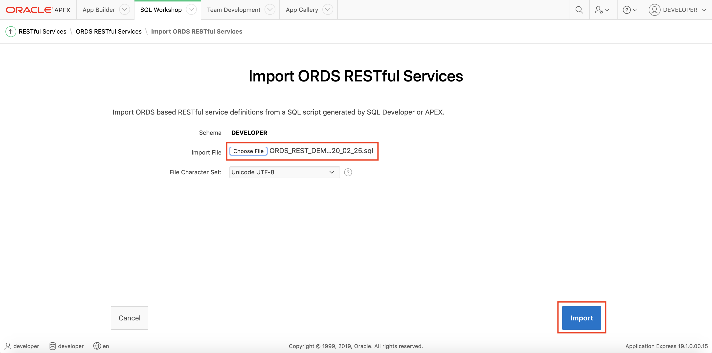

# Lab 300: Enabling Oracle Restful Data Services (ORDS) with APEX to Call and Create APIs

<!-- Comment out table of contents
## Table of Contents
[Introduction](#introduction)
-->

## Introduction

This lab walks you through the steps to enabling Oracle Restful Data Services (ORDS) with APEX in order to call and create APIs.

**_To log issues_**, click here to go to the [github oracle](https://github.com/oracle/learning-library/issues/new) repository issue submission form.

### Objectives
-   Learn how to enable Oracle Restful Data Services (ORDS) with APEX
-   Learn how to import SQL queries as APIs in APEX
-   Learn how to create a REST API using APEX

### Required Artifacts
-   The following lab requires an Oracle Public Cloud account. You may use your own cloud account, a cloud account that you obtained through a trial, or a training account whose details were given to you by an Oracle instructor.
-   The estimated time to complete this lab is 20 minutes.

### Extra Resources
-   To learn more about Oracle REST Data Services (ORDS), feel free to explore the capabilities by clicking on this link: [ORDS Documentation](https://docs.oracle.com/en/database/oracle/oracle-rest-data-services/19.4/index.html)

## Part 1. Enable ORDS

### **STEP 1**: Access Your APEX App

-   Navigate to and click on **Oracle APEX** from the development page of your ADW instance service console.

-   Sign in as **developer** to the **developer** workspace with the appropriate browser.

### **STEP 2**: Enable Oracle Restful Data Services (ORDS)

-   Click on **SQL Workshop** and then on **RESTful Services**.

-   Then, click on **Register Schema with ORDS**.

-   A Schema attributes window will pop up. Click **Save Schema Attributes** to continue.

## Part 2. Import and Create APIs

### **STEP 1**: Import APIs

-   Click on **Import**. 

-   You will download a data file from this workshop for your APIs. You can download it by clicking on the following text link: [Download ORDS-REST-DEMO.sql here](./files/ORDS-REST-DEMO.sql). Then, return back to your browser window.

-   Click on **Choose File** and select **ORDS-REST-DEMO.sql**, the file you just downloaded for this workshop.

-   Finish by clicking on **Import**.

>    *Note: If you encounter the error **"Unable to Import. Insufficient Privileges"** when importing your .sql file, this means that there is a problem with your schema defined in the .sql file.  To solve this issue, you can go into the .sql file and alter the schema names to reflect whatever you named your workspace/username as in Lab 100.  In your .sql file, simply change 'DEVELOPER' to your workspace/username in the lines denoted by the arrows below. Once you have executed this change, save the file, and try again to import.*

>   

-   The APIs have now been imported. You can view them by clicking the arrow button to expand **Modules** and then **warehouseAPI**. The APIs interface with the data that is on the Autonomous Data Warehouse that you have provisioned and APEX serves as the front end.

### **STEP 2**: Create APIs

-   Click on **warehouseAPI** to show the API template list.

-   Then click on **Create Template** to construct your own custom API.

-   We will construct a regions API that showcases all the store regions. Enter **regions** into the URI Template input field.

-   Finish by clicking on **Create Template**.

-   We will now need to create a resource handler in order for the API to run a script. Click **Create Handler** to get started.

-   The API will make a GET REST call to query the data from the ADW.

-   Change the **Source Type** to **Query**.

-   Then, input the following into the Source box:
> select * from OOW\_DEMO\_REGIONS

-   Finish by clicking on **Create Handler**.

### **STEP 3**: Check and Test APIS

-   You have now imported and created various RESTful APIs with APEX. 

-   Grab the **Full URL** of the regions API you just created and paste it into your browser and press the enter button.

-   You will see all the different regions from the data in your ADW. You can now utilize this data however you want.

-   Navigate to the **stores** API and copy and paste the Full URL into your browser (or another tool such as Postman) to see the different stores.

-   Here is what your browser should look like if you copy the Full URL of the API and paste the link into your browser.

## Part 3. Use HTML Web Page to Consume APIs

### **STEP 1**: Copy API URLs

-   Under **warehouseAPI**, click on the **stores** API and copy the **Full URL** and paste it into a separate notes file (i.e. Notepad, Microsoft Word, Apple Notes, etc.) to be used later.

-   Next, do the same with the following 2 APIs, copying each **Full URL** and pasting each into that same separate notes file.  Be sure to label which URL is which so that you do not confuse them later.
> product/inventoryForecastingAPI/{store\_add\}
> product/trendingProductAPI/{store\_add\}

### **STEP 2**: Add API URLs to Web Page Code

-   You will download a data file from this workshop for your web page. You can download it by clicking on the following text link: [Download WebPage.zip here](./files/WebPage.zip).

-   Then, go to your Downloads folder and unzip the .zip file.

-   Once this folder is unzipped, navigate to the Functions.js file and right-click to open it with any text editor or IDE you have available (i.e. TextEdit, Notepad, Script Editor, Visual Studio, etc.)

-   With the .js file open, notice the **DEFINE STORES API REQUEST URL** instructions and follow the steps to paste your ‘stores’ API URL, from your notes, into the "stores api url" variable in the code. (Note: Refer to the next image below.)

-   Next, copy your ‘Inventory Forecasting’ API URL, from your notes, into the "inventory forecast api url" variable in the code using the **DEFINE INVENTORY FORECAST API REQUEST URL** instructions provided in the code. (Note: Be sure to read the instructions carefully, as they are different than the instructions for the ‘stores’ API URL.)

-   **NOTE: When pasting the Inventory Forecasting API URL, erase everything after inventoryForecastingAPI/ . Make sure to keep the / character at the end**. Here is how your .js file should look:

-   Once you have replaced the two URLs, you must resave the file. (Note: Make sure that you keep the .js file type when you save the file in your text editor. Also, be sure that when you are saving the updated file, you are replacing the original file in the **WebPage** folder.)

### **STEP 3**: Test API Calls on Web Page

-   You have now implemented your API URLs from APEX into the code for the HTML Web Page, so your APIs are ready to be consumed!

-   Navigate again to the **WebPage** folder in your downloads.

-   To open the web page, right click on the **Layout.html** file, select **Open With**, and select the web browser of your choice (Google Chrome and Safari supported).

-   When the web page opens up, you can navigate to the **Select Store:** dropdown.  When you click on the dropdown, the list of stores is populated by the response data of your ‘stores’ REST API call using the URL you provided in the code from APEX.

-   Once you select a store from the dropdown, you can click the **See Store Details** button to see the product details for the selected store.

-   The store details table is populated with the response data from the ‘Inventory Forecast’ REST API call using the URL you provided in the code from APEX.

-   Now, you can use the dropdown to view any store’s inventory and inventory prediction details!  Each time you select a new store and click the **View Store Details** button, a new API call is made to get the products for that specific store in order to populate the table.

## Summary

-   In this lab, you enabled Oracle Restful Data Services (ORDS) with APEX, imported SQL queries as APIs in APEX, and created a REST API using APEX.

-   **You are ready to move on to the next lab!**

[Back to top](#introduction)
