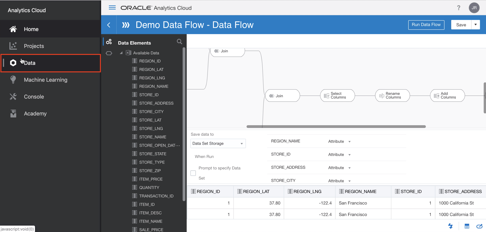
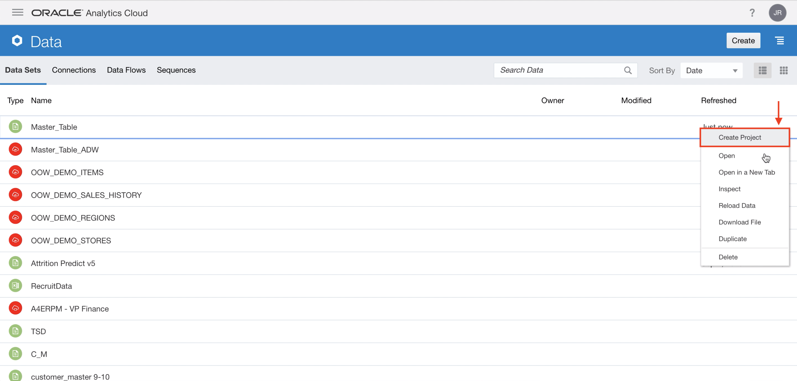
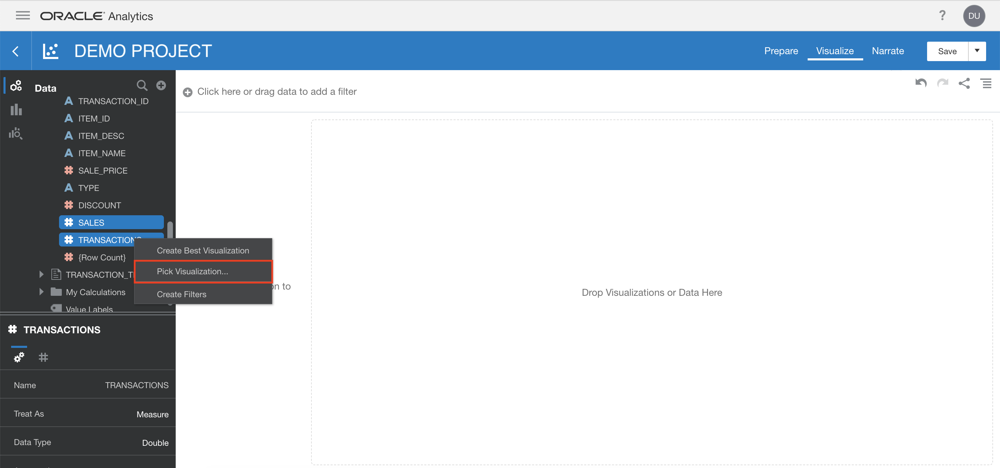
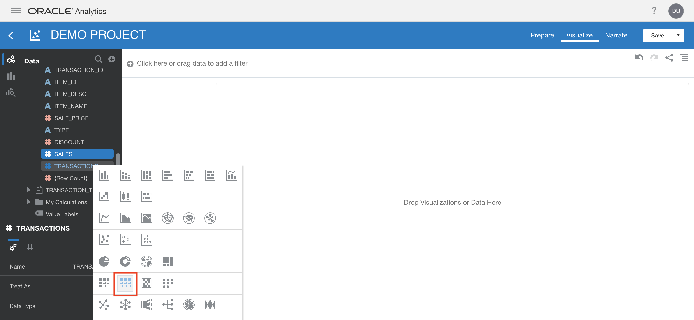
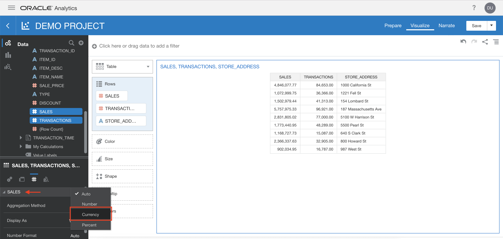

# Visualizations in Oracle Analytics Cloud (OAC)

<!-- Comment out table of contents
## Table of Contents
[Introduction](#introduction)
-->

## Introduction

This lab walks you through the steps on how you can use the Oracle Analytics Cloud to visualize entities from a database such as the results of the model created in OML.

### Objectives
-   Learn how to visualize entities from a database in Oracle Analytics Cloud such as an Oracle Machine Learning generated model.

### Required Artifacts
-   The following lab requires an Oracle Public Cloud account. You may use your own cloud account, a cloud account that you obtained through a trial, or a training account whose details were given to you by an Oracle instructor.
-   The estimated time to complete this lab is 10 minutes.

### Extra Resources
-   To learn more about Oracle Analytics Cloud (OAC), feel free to explore the capabilities by clicking on this link: [OAC Overview](https://www.oracle.com/business-analytics/analytics-cloud.html)

## Part 1. Visualize results in OAC

### **STEP 1**: Create a Project

1. From Oracle Analytics Cloud, click on the hamburger menu icon and click on **Data**. 

    

2. Then, find **Master_Table** and click on it's hamburger menu on the far right. From there, click on **Create Project**. This will make a new project based on the dataset.

    

### **STEP 2**: Create a Visualization

1. If you don't see all the columns, expand **Master_Table** on the left with the **small arrow** in order to see all the columns in the data set.

    

2. Select these three columns **STORE_ADDRESS**, **TRANSACTIONS**, **SALES** together from the dropdown by holding down either ctrl (Windows/Linux) or command (MacOS) depending on your operating system. Once all three are selected together, right click and select **Pick Visualization...**.

    

3. Then, click on the **Table Icon** to make a **Table** visualization. The visualization will appear on the right. The visualization may look slightly different and have different colors from the ones that appear here in the workshop.

    

4. Let's clean up how it looks. In the bottom left window, expand **SALES** by clicking on the **small arrow** and then click on **Number Format** and click on **Currency**.

    

5. Scroll down in the same window and expand **TRANSACTIONS** by clicking on the **small arrow** and then click on **Number Format** and click on **Number**.

    

6. Scroll down again and change **Decimal** for **TRANSACTIONS** to be **None**.

    

7. Finally, drag the column **SALES** from the left to the **Color** box.

    

8. Congratulations! You have made a visualization in just minutes that can help provide insight into the sales and transactions of various different stores. Make sure to hit **Save** in the top right to save your project.

-   The following are some other examples of what kinds of visualizations can be done in Oracle Analytics Cloud.  In the second screen capture, you can see how the machine learning data you created in this lab can be used to make prediction visualizations to give insight into future sales.

## Summary

-   In this lab, you visualized entities from a database (your ADW) in Oracle Analytics Cloud (OAC). These include visualizations such as an Oracle Machine Learning (OML) generated model.

-   **Congratulations, you have completed the main sections of this workshop!**

## Acknowledgements

- **Author** - NATD Solution Engineering - Austin Hub (Jess Rein, Philip Pavlov)
- **Last Updated By/Date** - Jess Rein, Solutions Engineer, March 2020

See an issue?  Please open up a request [here](https://github.com/oracle/learning-library/issues).  
