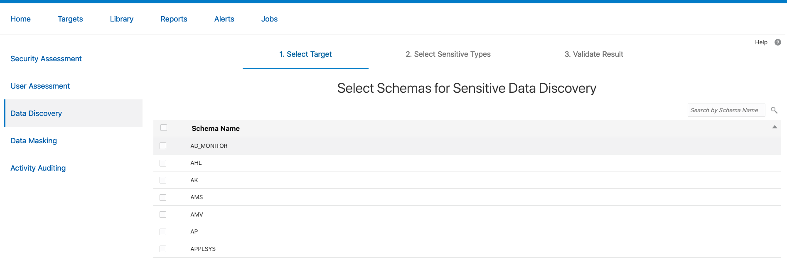
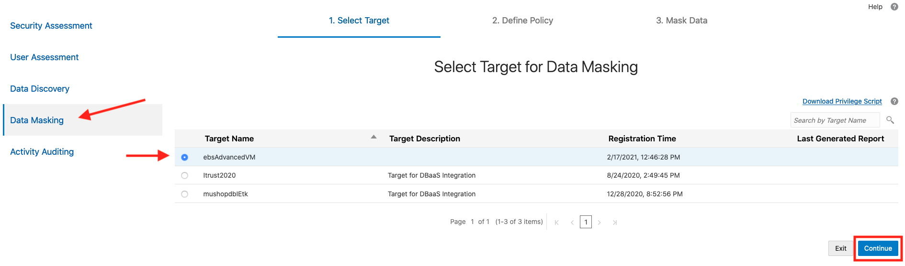
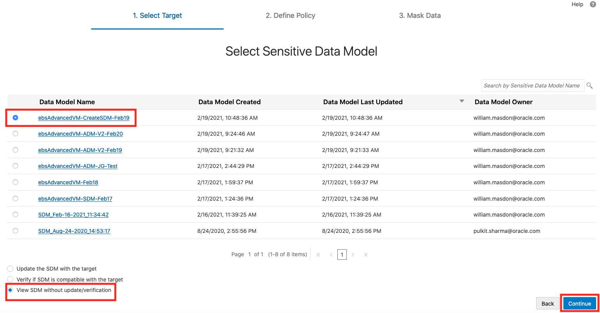
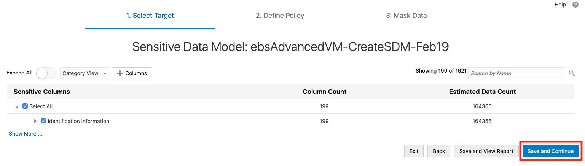
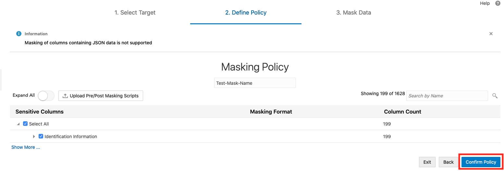
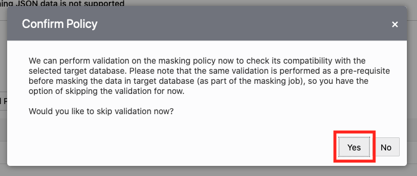
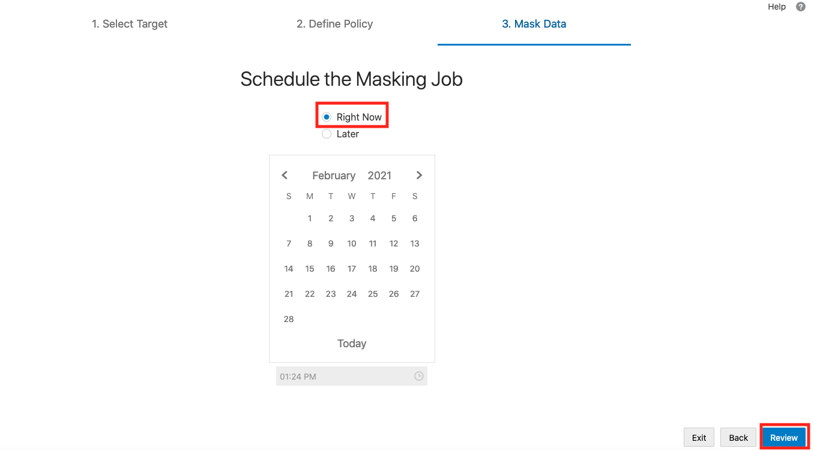
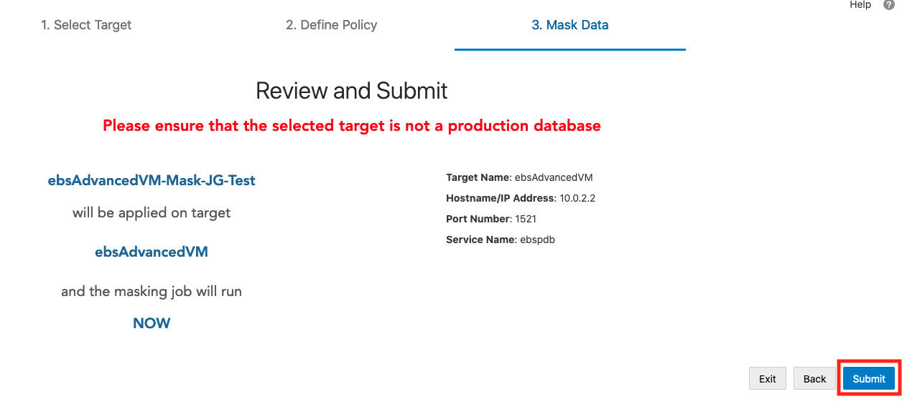

# Set up Oracle Data Safe on your EBS environments 

## Introduction

Data Safe is a cloud-based monitoring tool that allows users to assess, monitor, audit, and mask data and activity from on-premises or cloud-native databases. Database Administrators, or others whose concern includes database security, can use Data Safe to monitor and manage sensitive data on multiple environments and keeps tabs on the accessibility and activities of the database. 

This lab walks you through the setup of Data Safe on a private database provisioned by the EBS Cloud Manager. You will be configuring network settings and creating a user on the database with the appropriate permissions to setup a connection to Data Safe. Then the lab provides a short walkthrough of the features of Data Safe. 

This lab assumes you have completed the **Lift and Shift On-Premises EBS to OCI Workshop** found [here](https://apexapps.oracle.com/pls/apex/dbpm/r/livelabs/view-workshop?wid=672&clear=180&session=5980193088668). It also assumes you have created an EBS environment through advanced provisioning with a Virtual Machine Database System. 

Estimated Lab Time: 30 minutes

### Objectives

In this lab, you will:
* Enable Data Safe on your tenancy
* Set up a private endpoint for Data Safe
* Create a Data Safe user on the target database with the correct permissions
* Add the database as a target to the Data Safe console 
* Monitor the target database on the Data Safe Console

### Prerequisites

* A tenancy admin user
* A paid Oracle Cloud Infrastructure tenancy (not available for Free Tier or Always Free tenancies)
* An advanced-provisioned EBS instance from Cloud Manager with a Virtual Machine Database System.  
* A text file with the following values: 
    - The private IP address of the database to be targeted on Data Safe
    - The public IP address of the EBS Cloud Manager
    - The OCID of the target database

## **STEP 1:** Enable Data Safe

This step is not necessary if Data Safe is already been used in you tenancy and region. If it is not, follow these steps:

1. Using your tenancy admin user account, login to Oracle Cloud Infrastructure.

2. Select the region in which you would like to enable Data Safe. 

3. From the navigation menu, select **Data Safe**. 

4. Click **Enable Data Safe**. 

## **STEP 2:** Create a Private Endpoint for the Database

This step is only necessary if your database is private. Since it is highly recommended to make your EBS databases private, this step should be followed. If for demo purposes the database had been left public, you may skip this step. 

1. From the navigation menu on OCI, go to **Data Safe** and then click on **Private Endpoints**. 

    

2. Click **Create Private Endpoint**.

  a. **Name:** ``EBSPrivateEndpoint``

  b. **Virtual Cloud Network**: ``ebshol_vcn`` (or whichever VCN that was created as part of the EBS to OCI lab)

    Note: Make sure you have the correct compartment selected for the VCN to display. 

  c. **Subnet:** ``ebshol_db_subnet`` (or whichever subnet that houses the database to which you're connecting to Data Safe)

  d. Click **Create Private Endpoint**

  e. Once the endpoint has finished creating, copy its private IP into a text file for later reference. 

    

3. Open Security List rules to allow traffic between the endpoint and the database. Go to **Networking** > **Virtual Cloud Networks** and select the ``ebshol_vcn`` that was created as a part of the EBS to OCI lab. 

  a. Navigate to the subnet that contains the database (most likely ``ebshol_db_subnet``). Modify its Security list.

  b. Create an Ingress Rule that allows TCP traffic from the Private Endpoint's private IP address to port 1521. 

  c. Create an Egress Rule that allows TCP traffic from the database's private IP address to port 1521. 

    

## **STEP 3:** Create a User for Data Safe on the Target Database

In this step, we will create a database user and grant them privileges which will allow them to be used as the Data Safe user. Before we can create the user, we must download a file from the Data Safe console that will give the created user the roles necessary to act as a Data Safe user. 

1. Access the Data Safe console by going to **Data Safe** under the Navigation menu and then selecting the **Service Console** button.

    

2. Click on the **Targets** tab at the top. 

  a. Click **Register**.

    

  b. Click **Download Privilege Script** and save the file to your local computer.

    This will download the .sql file that we will run on the database later to give privileges to our user. 

    

3. Login to your Cloud Manager using ssh and its public IP address.

        <copy>
        ssh -i <private-ssh-key-filepath> opc@<Cloud-Manager-public-IP>
        </copy>

4. Login to your database from the Cloud Manager using the database's private IP address. 

        <copy>
        ssh <database-private-IP>
        </copy>

5. Copy over the ``datasafe_privileges.sql`` file we downloaded in part 2. 

  a. On your local machine, open the file in a text editor (or cat it in terminal) and copy its contents. 

  b. On the database, create a file ``datasafe_privileges.sql``. 

        <copy>
        vi datasafe_privileges.sql
        </copy>

  c. Press ``i`` to start inserting values into the file. 

  d. Now paste in the contents of the downloaded file into the file we just created on the database. 

  e. Save and exit by pressing ``ecs`` and then typing in ``:wq``. 

6. Now connect to SQLPlus as the sysdba user. 

        <copy>
        sqlplus / as sysdba
        </copy>

7. Connect to the pdb 

        <copy>
        alter session set container="<pdb-name>";
        </copy>

    

  Make sure the pdb's name is in quotation marks. If you are unsure of the pdb name, enter the following command into sqlplus. 

        <copy>
        show pdbs;
        </copy>

8. Before we are able to create a user, we must create a tablespace on the database that will act as the user's default tablespace. 

        <copy>
        CREATE TABLESPACE DATASAFE_TABLE
        DATAFILE ‘datasafe_table.dbf’
        SIZE 1m;
        </copy>

9. Now we can create the user that will act as our Data Safe user on this database. 

        <copy>
        CREATE USER DATASAFE_ADMIN IDENTIFIED BY <password>
        DEFAULT TABLESPACE DATASAFE_TABLE
        TEMPORARY TABLESPACE TEMP;
        </copy>

    

10. Grant permissions to this user. 

        <copy>
        GRANT CONNECT, RESOURCE TO DATASAFE_ADMIN;
        </copy>

11. Now run the following command to grant privileges to this user. 

        <copy>
        @datasafe_privileges.sql DATASAFE_ADMIN GRANT ALL
        </copy>

    

12. Lastly run this command in sqlplus on the pdb (you may have to rerun the commands in step 6 and 7 to do so) and write down its output in a text file under "Database Service Name" for later reference. 

        <copy>
        select sys_context('userenv','service_name') from dual;
        </copy>

    

    

## **STEP 4:** Register the Target Database on the Data Safe Console

1. Login to the Data Safe Service Console from OCI. 

  a. Navigate from the menu to Data Safe and click on the **Service Console** button. 

    

2. Click the **Targets** tab at the top. 

3. Click **Register** and fill out the following details. 

  a. **Target Name:** ``AdvancedEBSTarget``

  b. **Target Type:** ``Oracle Cloud Database``

  c. **OCID:** the OCID of your target database

  d. **Compartment:** the compartment of your database

  e. **Database with Private IP:** ``Yes``

  f. **IP address:** private IP address of your database

  g. **Port number:** ``1521``

  h. **Database Service Number:** the value from the SQLPlus command we ran in part 12 of Step 3. 

  i. **Database User Name:** ``DATASAFE_ADMIN``

  j. **Database Password:** the DATASAFE_ADMIN password you specified in part 9 of Step 3. 

4. Click **Test Connection** to verify the connection information is correct. 

5. Once the connection has been verified, click **Register Target**. 

    

Congratulations! You have successfully registered a database with Data Safe. You can now go to the **Home** tab on Data Safe and begin running assessments to gain additional insight into your EBS data. 

## **STEP 5:** Monitor your Target Database on the Data Safe Console

In this step, we will access the data on the target database we registered. Security and User Assessments will give us snapshots into the current security of the database. Data Discovery allows us to run jobs that discover potentially sensitive data on the database while Data Masking would mask the sensitive data (only for use on a non-production database). Activity Auditing allows users to view activity and data manipulation on the database. 

1. In the Data Safe Console, go to the **Home** tab. 

2. Click on **Security Assessment** and select your target database. Click **Assess Now** to run an assessment. Once the report has been generated, you can click on **Set Baseline** to establish a baseline that will be compared to future assessments or **View Report** to see the results of the assessment. You can also select your database and click **Schedule Periodic Assessment** to setup a regularly run security assessment. 

    

3. Now, click on **User Assessment** on the left panel. From here select your database and click **Assess**. Here you can also view a report by clicking **View Report** once the assessment completes. 

    

4. Next we will run a Data Discovery job to create a Sensitive Data Model of all the sensitive data in the database. 

  a. Click on **Data Discovery** on the left panel and select your target database. Click **Continue**.

    

  b. Select **Create** for Sensitive Data Model and provide a name for the model, if desired. 

  c. Leave **Show and save sample data?** unchecked. Select the compartment where you would like to store this model. Click **Continue**. 

    

  d. Select the schemas on which you would like to run the discovery job. Click **Continue**. 

    

  e. Select the sensitive data types which you would like to discovery and then click **Continue**. The job will now run and create a Sensitive Data Model. Once this job has finished, you can click **Continue**. 

    

    

  f. This page will show the results from the data discovery job. You may click **Back** to reconfigure the job and run it again. If satisfied, you can click **Report** to save and view the model. 

    

5. The next job we can run is for Data Masking. This is mask the sensitive data that you discovered in the last step. Note: this should only be done on non-production databases. 

  Note: There is a current issue with running Data Masking on EBS Databases. Please note that this is how the process would work; however, your Data Masking job may encounter errors. 

  a. Click on **Data Masking** on the left panel and select your target database. Click **Continue**. 

    

  b. Select **Create** for Masking Policy and provide a name for the policy, if desired. 

  c. You can either click **Create** for the Sensitive Data Model to create a new model like we did in the last step, or you can click **Pick from Library** to select a saved model that you have already created. 

    

  d. Leave **Show and save sample data?** unchecked. Select the compartment where you would like to store this policy. Click **Continue**.

  e. If you are creating a new Sensitive Data Model, you will follow similar steps to the last step. If you are picking from a library (e.g. the model you created in the previous step), you will select your model from a list available in the Data Safe Console after clicking **Continue**. Select the model you wish and click **View SDM without update/verification** (since we just created it, we know it is verified and updated). Click **Continue**. Lastly click **Save and Continue** on the next page to finish the Sensitive Data Model creation/selection. 

    

    

  f. After selecting or creating your Sensitive Data Model, you will define what entries you should mask with the Masking Policy. Select the appropriate data entries and click **Confirm Policy**. A pop out will ask whether or not you would like to skip validation before you begin masking the data. Since validation will occur while the data is being masked anyway, we will select **Yes**.  

    

    

  g. The next page will ask you to select when the masking job should run. We will run the job **Right Now**. Click **Review** to continue. 

    

  h. On the Review and Submit page, confirm the entered data is correct and click **Submit** to begin the data masking job. The job will begin running and masking the selected data on the target database. You can monitor the job's progress on the resulting page, or under the **Jobs** tab. 

    

6. Lastly, we will configure a target for Activity Auditing. This will allow us to audit certain activities performed on the target database. 

  a. Click on **Activity Auditing** on the left panel and select your target database. Click **Continue**. 

    

  b. Select your target and click **Retrieve** to obtain the valid Audit Policies for your target. Wait for the Audit Policies to be retrieved, then click **Continue**. 

    

  c. On the Review and Provision Audit and Alert Policies page, click on the target database name. This will open a window that allows you to customize which audit and alert policies you would like to enable. Select the desired policies and click **Provision**. Then click **Continue**. 

    

    

    

  d. On the Start Audit Collection page, we will designate from what date we would like to collect audit data. Having selected your target database, click on the calendar icon and select a date to designate as the start of the audit collection. From there, you can click **Start** to begin the audit collection process. After the process begins, you can click **Done**. 

    

  e. You can view the Activity Audit reports by clicking on the **Reports** tab and selecting a subcategory under **Activity Auditing**. 

    

  Congratulations! You have successfully set up and used Data Safe for EBS on OCI. 

## Learn More

* [Oracle Data Safe Documentation](https://docs.oracle.com/en/cloud/paas/data-safe/udscs/get-started-oracle-data-safe.html)
* [Learn how to set up Data Safe with a Compute Database](https://docs.oracle.com/en/cloud/paas/data-safe/udscs/register-oracle-databases-oracle-cloud-infrastructure-compute-instances.html#GUID-304A2F0E-67B1-44E4-AD48-649F1FE59DAC)
* [Learn how to register an on-premise database with a Private Endpoint](https://docs.oracle.com/en/cloud/paas/data-safe/udscs/register-premises-oracle-databases-using-oracle-data-safe-private-endpoint.html#GUID-61F946FF-5AFB-4BB3-9BAB-7BABC9B4A6C4)
* [Learn how to register an on-premise database with an On-Premises Connector](https://docs.oracle.com/en/cloud/paas/data-safe/udscs/register-onpremises-oracle-databases-using-oracle-data-safe-onpremises-connector.html#GUID-ED6C6F89-3123-4A4E-9EBE-30D2C920C1CA)

## Acknowledgements

* **Author:** William Masdon, Cloud Engineering
* **Contributors:** 
    - Quintin Hill, Cloud Engineering
* **Last Updated By/Date:** William Masdon, Cloud Engineering, Feb 2021

## Need Help?
Please submit feedback or ask for help using our [LiveLabs Support Forum](https://community.oracle.com/tech/developers/categories/livelabsdiscussions). Please click the **Log In** button and login using your Oracle Account. Click the **Ask A Question** button to the left to start a *New Discussion* or *Ask a Question*.  Please include your workshop name and lab name.  You can also include screenshots and attach files.  Engage directly with the author of the workshop.

If you do not have an Oracle Account, click [here](https://profile.oracle.com/myprofile/account/create-account.jspx) to create one.
