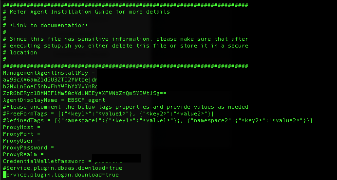

# Implement Logging Analytics

## Introduction

This lab will setup OCI Logging Analytics Service and will walk you through the steps to Setup Logging Analytics, Install management agents for monitoring the instances setup in previous labs, set up the Logging Service to stream Network and Audit Flow logs using the Service Connector, visualize logs in the Log Explorer and finally create a dashboard for visualizing your data. You will create a Dashboard for Operations Analysts and EBS Application Analysts.

**Estimated Lab Time: 2 hours**

### About Logging Analytics

Oracle Cloud Infrastructure Logging Analytics is a machine learning-based cloud service that monitors, aggregates, indexes, and analyzes all log data from on-premises and multicloud environments. Enabling users to search, explore, and correlate this data to troubleshoot and resolve problems faster and derive insights to make better operational decisions.

### Objectives

**In this lab, you will:**
* Setup Logging Analytics Baseline (including policies, users, groups, and dynamic groups for using Logging Analytics Service)
* Pull data from Logging Entities: Servers, EBS Application and Database, Network and Audit Flow logs
* Visualize and Absorb this Data in the Logging Analytics User Interface

### Prerequisites

* An Oracle Cloud Environment
* EBS Cloud Manager, EBS 1-Click and Advanced Provisioned Instance, Network - All setup in previous labs

### Options

Steps 1 and 2 can be completed via automation. To automate the Setup of OCI Logging Analytics and ingestion of logs to the service follow the steps found in **Step 0** Once done skip to **Step 3**
For manual installation follow steps outlined in **Step 1** and **Step 2**

## **Step 0**: Automate Setup and Ingestion for Logging Analytics

Here we will automate setting up Logging Analytics and Ingesting Logs. Once completed go to **Step 3**

## **STEP 1**: Setup Logging Analytics Service

In Step 1 of this lab we will Setup Logging Analytics Service

1. Enable Logging Analytics
    
    a. Navigate to Logging Analytics - Administration

    

    b.Click the **Start Using Logging Analytics** (if this is not an option, it is already done)

    

    c. Click **Continue**

2. Create Logging Analytics Group Logging Analytics Super Admins

    a. Navigate to Identity - Federation - OracleIdentityCloudService

    b. Click on the Url following **Oracle Identity Cloud Service Console**

    

      i. From the IDCS console go to Groups

      ii. Like in the first step of the EBS Lift and Shift Lab Click **+ Add**

      iii. Create a Group called `Logging-Analytics-SuperAdmins`

    

      iv. Click **Next**

      v. Add your OCI Admin User that you are using to navigate OCI not your EBS Cloud Manager

    

      vi.  You can now close this page and go back to your OCI Console

    c. From the OCI Console Navigate to Identity - Groups

      i. Create a new OCI Group with the same name `Logging-Analytics-SuperAdmins`

      ii. Then Go to Identity - Federation - Group Mappings

      iii. Click **Add Mapping**

      iv. Associate the two `Logging-Analytics-SuperAdmins`

    

      v. Click **Add Mapping**

  3. Create Logging Analytics Dynamic Group: Management Agent Admins
    
    a. Now navigate to Identity - Dynamic Groups 

      i. Click **Create Dynamic Group**

      ii. Enter name: `ManagementAgentAdmins`

      iii. Add Description

      iv. Leave `MATCH ANY RULES DEFINED BELOW` checked

      v. Add the following rule:

        All {resource.type = 'managementagent', resource.compartment.id = '<Compartment OCID of ebshol_compartment>'}

      Note: Fill in the Compartment OCID with the OCID of the ebshol compartment.

    

      vi. Click **Create**
    
  4. Create Logging Analytics Policy

    a. Go to Identity - Policies

    b. **Make sure you change to the root compartment**

    c. Click **Create Policy**

      i. Enter name: `Logging-Analytics-Policy` and add description

      ii. In the policy builder click **Customize(Advanced)** 

      iii. Paste the following Policies into the Policy Builder as shown below

      ```
      <copy>
allow service loganalytics to READ loganalytics-features-family in tenancy
allow service loganalytics to read buckets in tenancy
allow service loganalytics to read objects in tenancy
allow service loganalytics to manage cloudevents-rules in tenancy
allow service loganalytics to inspect compartments in tenancy
allow service loganalytics to use tag-namespaces in tenancy where all {target.tag-namespace.name = /oracle-tags /}
allow group Logging-Analytics-SuperAdmins to READ compartments in tenancy
allow group Logging-Analytics-SuperAdmins to MANAGE loganalytics-features-family in tenancy
allow group Logging-Analytics-SuperAdmins to MANAGE loganalytics-resources-family in tenancy
allow group Logging-Analytics-SuperAdmins to MANAGE management-dashboard-family in tenancy
allow group Logging-Analytics-SuperAdmins to READ metrics in tenancy
allow group Logging-Analytics-SuperAdmins to MANAGE management-agents in tenancy
allow group Logging-Analytics-SuperAdmins to MANAGE management-agent-install-keys in tenancy
allow group Logging-Analytics-SuperAdmins to READ users in tenancy
allow dynamic-group ManagementAgentAdmins to MANAGE management-agents in tenancy
allow dynamic-group ManagementAgentAdmins to USE metrics in tenancy
allow dynamic-group ManagementAgentAdmins to {LOG_ANALYTICS_LOG_GROUP_UPLOAD_LOGS} in tenancy
allow dynamic-group ManagementAgentAdmins to USE loganalytics-collection-warning in tenancy
allow service loganalytics to {VNIC_READ} in tenancy
      </copy>
      ```

    

  5. Last we will go to Logging Analytics - Administration - Log Groups

    a. Click **Create Log Group**

    b. For Name enter: `EBS_VCN_Logs` and a description

    c. Click **Create**

    d. Create another Log Group named `Audit_Logs`

    

    e. We will use these log groups when ingesting logs from a service connector in the next step.

## **STEP 2:** Ingest Logs into Logging Analytics

In this Step we will Ingest Flow Logs and Install Management Agents to our instances

  1. Setup Logging to Ingest Audit and Network Logs

    a. Navigate to Logging - Log Groups from the OCI Console (verify you are in your ebshol_compartment)

      i. Click Create Log Group

      ii. Name it `EBS_VCN_Logs` and add a description

    

      iii. Click **Create**

    b. Now navigate to Logging - Logs

      i. Click **Enable Service Log**

      ii. For service select: `Virtural Cloud Network (subnets)`

      iii. Resource select a subnet

      iv. Log Category: `Flow Logs(All records)`

      v. Log Name: `<subnetprefix>_subnetwork_logs`

      vi. Click Advanced and verify the log is being added to your `EBS_VCN_Logs`

      vii. You can change your log retention as well. For now leave as Default

    
    
    

    c. Repeat Step B for the rest of your subnets

    d. Once complete your Logs should look like this:

    

  2. Create Service Connectors for Audit and Network Logs
    
    a. Now navigate to Logging - Service Connectors

      i. Click **Create Connector**

      ii. For name Enter: `EBS_VCN_Flow_Service_Connector` and add a description

      iii. For Source select **Logging** and Target select **Logging Analytics**

      iv. Under **Configure source connection** for **Log Group** select `EBS_VCN_Logs` and for **Logs** select one of your subnet logs.

      v. Click **+ Another Log** and add each of your subnet logs for this log group 

      vi. Once you have added all your subnet logs scroll to **Configure target connection**

      vii. Make sure the Compartment is our `ebshol_compartment` and Log Group `EBS_VCN_Logs` that we created in part 5) of Step 1

      viii. An ask to `Create default policy allowing this service connector to write to Logging Analytics in compartment ebshol_compartment.` will show, click **Create** and then **Create** again.

      
    
    b. Click **Create Connector** again

      i. For name Enter: `Audit_Flow_Service_Connector` and add a description

      ii. For Source select **Logging** and Target select **Logging Analytics**

      iii. Under **Configure source connection** for **Log Group** select `_Audit_` and for **Logs** leave empty.

      iv. Make sure the Compartment is our `ebshol_compartment` and Log Group `Audit_Logs` that we created in part 5) of Step 1

      v. An ask to `Create default policy allowing this service connector to write to Logging Analytics in compartment ebshol_compartment.` will show, click **Create** and then **Create** again.

      

    c. You can now go to Logging Analytics - Administration

        You will now see entities have been automatically created.

        You can also go to Logging Analytics - Log Explorer and should see a pie with data similar to what is shown below
      
      

  3. Now we will walk through installing management agents on our hosts. Because we are using linux servers in this lab we will stick to steps for those servers. For further documentation on installing agents and specifically on Windows servers refer to [Install Management Agents Documentation](https://docs.oracle.com/en-us/iaas/management-agents/doc/install-management-agent-chapter.html#GUID-5F2A1CEF-1185-469C-AF2E-8A94BC95DC35)

    a. In the OCI Console navigate to Management Agents - Downloads and Keys

    b. Click and download **Agent for LINUX** 

  c. Click **Create Key** below 
  
    i. Name the key `ebs_agent_key`

    ii. Select our `ebshol_compartment`

    iii. Click **Create**

    iv. on the right click the three dots in the row of our agent key we just created.

    v. Click `Download Key to File`

  

    vi. Once you have Downloaded the key file, we need to edit it

    vii. open the `ebs_agent_key.txt` file

    Add agent name
      - AgentDisplayName

    Add Password
      - CredentialWalletPassword

    Uncomment the Service Plugins
      - Service.plugin.dbaas.download=true
      - Service.plugin.dbaas.download=true

  

  d. We now need to copy our `oracle.mgmt_agent.rpm` and `ebs_agent_key.txt` to our Cloud Manager Instance.

  e. Verify an SSH connection to our `ebshol_ebscm` instance

    i. Navigate to Compute and find your `ebshol_ebscm` and note the Public IP

    ii. From your terminal SSH to the Cloud Manager

    ```
    ssh opc@<public_ip_of_cloud_manager>
    ```

    iii. After verifying you can connect via ssh exit

  

  f. Secure Copy your management agent and .txt file to cloud manager

    ``` 
    scp ~/Downloads/oracle.mgmt_agent.rpm opc@<public_ip_of_cloud_manager>:~ 
    ```

    ```
    scp ~/Downloads/ebs_agent_key.txt opc@<public_ip_of_cloud_manager>:/tmp
    ```

    ```
    ssh opc@<public_ip_of_cloud_manager>
    ```

    iv. Type ls to verify your .txt and .rpm file are in your home directory

  g. Install Java
  
    ```
    <copy>
    sudo yum install java
    </copy>
    ```

  h. Move agent file to /u01/install/APPS

    ```
    <copy>
    sudo mv oracle.mgmt_agent.rpm /u01/install/APPS
    </copy>
    ```

  i. Edit permissions on the `ebs_agent_key.txt` file

  ```
  <copy>
  sudo su - oracle
  cd /tmp
  sudo chmod 755 ebs_agent_key.txt
  </copy>
  ```

  k. Go back to Oracle Home and run management agent

  ```
  <copy>
  cd ~
  sudo rpm -ivh oracle.mgmt_agent.rpm
  </copy>
  ```

    Note: If successful your terminal should see this response ending with Agent install successful

  

  l. Setup and the management agent with info from Install Key

  ```
  <copy>
  sudo /opt/oracle/mgmt_agent/agent_inst/bin/setup.sh opts=/tmp/ebs_agent_key.txt
  </copy>
  ```

  

  m. Now to install our agent on the other instances built with our cloud manager we will move the `ebs_agent_key.txt` to our Oracle Home Directory

  ```
  <copy>
  sudo mv /tmp/ebs_agent_key.txt ~
  </copy>
  ```

  n. Now scp your management agent and key file to each of the other instances via their private IP address.

  ```
  scp oracle.mgmt_agent.rpm <privateIPofebsinstance>:~
  scp ebs_agent_key.txt opc@<privateIPofebsinstance>:/tmp
  ```

  o. Once the files are on the new instance you will repeat the steps starting from 'g.' on each instance.

    Note: You can also follow the recommended procedure of deleting your key file from your instance one the agent has been installed and is configured properly 
    
  ```
  $ rm /tmp/ebs_agent_key.txt
  ```

**Note:** If you have other instances not created with the cloud manager follow the same steps to add the agent and key file to those instances and install.

## **STEP 3:** Create Entities and associate Log Sources

## **STEP 4:** Visualize Data in Log Explorer and Create Dashboards

You may now [proceed to the next lab](#next).

## Learn More

*(optional - include links to docs, white papers, blogs, etc)*

## Acknowledgements
* **Author** - Quintin Hill, Cloud Engineering, Packaged Applications
* **Contributors** -  Kumar Varun, Logging Analytics Product Management
* **Contributors** -  Kaylien Phan, Cloud Engineering, Packaged Applications
* **Contributors** -  Chris Wegenek, Cloud Engineering, Packaged Applications
* **Last Updated By/Date** - Quintin Hill, Cloud Engineering, Feb 5 2021

## Need Help?
Please submit feedback or ask for help using our [LiveLabs Support Forum](https://community.oracle.com/tech/developers/categories/livelabsdiscussions). Please click the **Log In** button and login using your Oracle Account. Click the **Ask A Question** button to the left to start a *New Discussion* or *Ask a Question*.  Please include your workshop name and lab name.  You can also include screenshots and attach files.  Engage directly with the author of the workshop.

If you do not have an Oracle Account, click [here](https://profile.oracle.com/myprofile/account/create-account.jspx) to create one.
