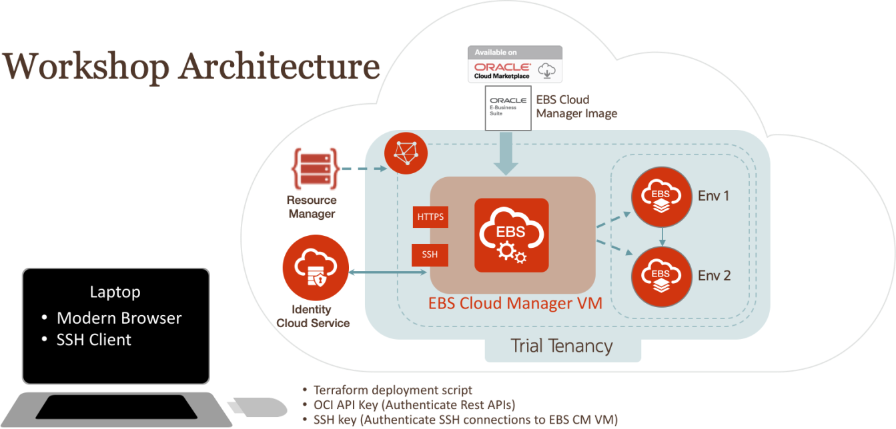
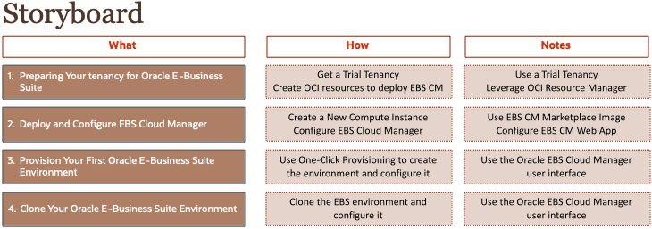

# Introduction

## Lift and Shift on-premises E-Business Suite to Oracle Cloud Infrastructure (OCI)

Approximately 1.5 hours are required to complete this workshop.

This workshop showcases the use of the Oracle E-Business Suite Cloud Manager graphical user interface to provision and clone environments on Oracle Cloud Infrastructure. In addition, a demonstration of the lift and shift of an on-premises Oracle E-Business Suite environment to Oracle Cloud Infrastructure will be conducted.

Notes:

* The workshop is quite detailed and technical. PLEASE take your time and DO NOT skip any steps.
* IP addresses and URLs in the screenshots in this workbook may differ from what you use in the labs as these are dynamically generated.
* For security purposes, some sensitive text (such as IP addresses) may be redacted in the screenshots in this workbook.

UNIX commands (usually executed in an SSH session using PuTTY) are displayed in a monospace font within a box, as follows: 

```
$ sudo yum install wget -y $ wget -O bitnami-mean-linux-installer.run https://bitnami.com/stack/mean/download_latest/linux-x64
```

## Prepare for Workshop Exercises

### Review Prerequisites

You will need the following in order to complete this workshop:

* A laptop with the following:

1. A modern browser
2. A secure remote login (Secure Shell, or SSH) utility 
        - Such as PuTTY - downloaded from https://www.ssh.com/ssh/putty/download
3. A secure copy program
        - Such as WinSCP - downloaded from https://winscp.net/eng/index.php
4. Knowledge of basic UNIX commands

## Setup Lab Workstation

In this section, you will prepare your workstation with the required files for the hands-on lab exercises. Your instructor will provide you a USB flash drive or use [this](https://objectstorage.us-ashburn-1.oraclecloud.com/p/mAWDPAT5jDjg34fUnSHtu-u_ztJ0_D9igCl1Bpoi7_E/n/orasenatdecanational01/b/EBS-Folder/o/EBSHOL-EBS.zip) link to download the files.

Proceed to the appropriate section, depending on your workstation operating system:

* Using a Windows Workstation
* Using a Mac Workstation

Using a Windows Workstation

1. Create a folder named HOL-EBS on the desktop of your workstation.

2. Perform either step (a) or (b):

    a. Plug in the USB flash drive into your workstation.

    b. If you are using the download link:

        i. Download the HOL zip file into a temporary location (such as in \Documents\HOL-Download).

        ii. Unzip the files.

3. Open Windows Explorer and navigate to the mounted USB flash drive or unzipped HOL files.

4. Copy the directory HOL-EBS and all files from the USB flash drive or temporary unzipped file location and paste to the Desktop\HOL-EBS folder on your workstation.

Using a Mac Workstation

1. Create a folder named HOL-EBS on the desktop of your workstation.

2. Perform either step (a) or (b):

    a. Plug in the USB flash drive into your workstation.

    b. If you are using the download link:

        i. Download the HOL zip file into a temporary location (such as in /Documents/HOL-Download).

        ii. Unzip the files.
        
3. Open Finder and navigate to the mounted USB flash drive or unzipped HOL files.

4. Copy the directory HOL-EBS and all files from the USB flash drive of temporary unzipped file location and paste to the Desktop/HOL-EBS folder on your workstation.


## Review and Open Hands-On Lab Files
The following table describes the directories and files that were copied to the Desktop\HOL-EBS directory on your workstation:

Table S-1
| Name          | Description       | 
| ------------- |:-------------:|
| /documents/EBS-HOL-Workbook-January-2020.pdf     | A digital copy of this workbook, Introduction to Oracle E-Business Suite Cloud Manager Hands-On Lab. |
| /documents/Key-Data.txt      | The document used to capture key data items needed throughout the lab.     |
| /artifacts/oci-api-keys      | Keys used to authenticate API calls to Oracle Cloud Infrastructure.
| /artifacts/ssh-keys    | Keys used to establish an SSH session with Oracle E-Business Suite Cloud Manager Compute instance. |
| /artifacts/terraform     | Set of Terraform scripts which automate the creation of the infrastructure required to deploy Oracle E-Business Suite Cloud Manager.|

## Terminology

The following terms are commonly employed in Oracle E-Business Suite cloud operations and used throughout our documentation:

**Availability Domain** – One or more data centers located within a region.

**Bucket** – A logical container used by Object Storage for storing your data and files. A bucket can contain an unlimited number of objects.

**Compartments** – Allows you to organize and control access to your cloud resources. A compartment is a collection of related resources (such as instances, virtual cloud networks, block volumes) that can be accessed only by certain groups.

**Oracle E-Business Suite Cloud Backup Module** – The Oracle E-Business Suite Cloud Backup Module is a stand-alone tool that interviews the user to establish settings, and then uses those settings to back up an Oracle E-Business Suite environment to Oracle Cloud Infrastructure Object Storage.

**Oracle E-Business Suite Cloud Manager** - Oracle E-Business Suite Cloud Manager is a graphical user interface used for creating, managing, and configuring Oracle E-Business Suite environments on Oracle Cloud Infrastructure. Oracle E-Business Suite Cloud Manager can be used with the Oracle E-Business Suite Cloud Backup Module to lift and shift or clone environments from on-premises to Oracle Cloud Infrastructure.

**EBS Cloud Manager infrastructure** – Virtual network resources, compute resources, and policies required to run EBS Cloud Manager on Oracle Cloud Infrastructure.

**EBS Sandbox Virtual Cloud Network (VCN)** – Networking and compute resources required to run EBS on Oracle Cloud Infrastructure. The EBS Sandbox VCN includes the recommended networking resources (VCN, subnets routing tables, internet gateway, security lists, and security rules) to run Oracle E-Business Suite on OCI.

**Oracle Cloud Infrastructure Load Balancing Service** - The Oracle Cloud Infrastructure Load Balancing service provides automated traffic distribution from one entry point to multiple servers reachable from your virtual cloud network (VCN). The service offers a load balancer with your choice of a public or private IP address, and provisioned bandwidth.

**Oracle Cloud Infrastructure (OCI)** – Combines the elasticity and utility of public cloud with the granular control, security, and predictability of on-premises infrastructure to deliver high-performance, high availability, and cost-effective infrastructure services.

**Region** – Oracle Cloud Infrastructure are hosted in regions, which are located in different metropolitan areas. Regions are completely independent of other regions and can be separated by vast distances – across countries or even continents. Generally, you would deploy an application in the region where it is most heavily used, since using nearby resources is faster than using distant resources.

**Tenancy** – When you sign up for Oracle Cloud Infrastructure, Oracle creates a tenancy for your company, which is a secure and isolated partition within Oracle Cloud Infrastructure where you can create, organize, and administer your cloud resources.

**Virtual Cloud Network (VCN)** – A virtual version of a traditional network – including subnets, route tables, and gateways – on which your instances run. A cloud network resides within a single region, but can cross multiple availability domains.

## Workshop Overview

The following figure (W-1) outlines the workshop architecture.
Figure W-1: Workshop Architecture



This workshop uses the following components:

• Trial accounts (one per attendee)

    o Virtual Cloud Network and related resources 
         - User-generated using Resource Manager and provided Terraform script

    o Oracle E-Business Suite Cloud Manager Compute instance 
        - User-provisioned using Oracle Marketplace image 
        - Oracle E-Business Suite Cloud Manager application 
        - EBS sandbox network deployment script

    o Oracle E-Business Suite environment 1 Compute instance 
        - User-provisioned environment 
        - Application and database tiers on this compute instance

    o Oracle E-Business Suite environment 2 Compute instance 
        - Cloned from environment 1 
        - Application and database tiers on this Compute instance

• Attendee-provided laptop

The following figure (W-2) describes the exercises that you will perform in this workshop.
Figure W-2: Storyboard



## Accounts for Hands-On Lab Exercises

The following table provides a list of user names, personas, and related roles that will be used throughout the hands-on lab.

Table W-1: User Names and Personas

| User Name          | Application       |  Description |
| ------------- |:-------------:|:-------------:|
|  < trial user name> | OCI service console login | An IT administrator in your organization responsible for managing the EBS environments|

You may now proceed to the next lab.

## Acknowledgements

- **Last Updated By/Date** - Santiago Bastidas, Product Management Director, July 2020

## See an issue?
Please submit feedback using this [form](https://apexapps.oracle.com/pls/apex/f?p=133:1:::::P1_FEEDBACK:1). Please include the *workshop name*, *lab* and *step* in your request.  If you don't see the workshop name listed, please enter it manually. If you would like for us to follow up with you, enter your email in the *Feedback Comments* section. 