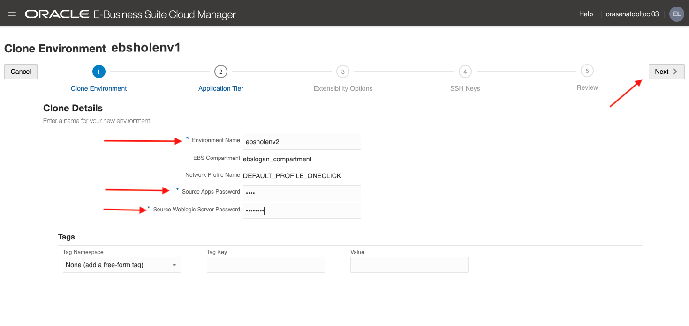
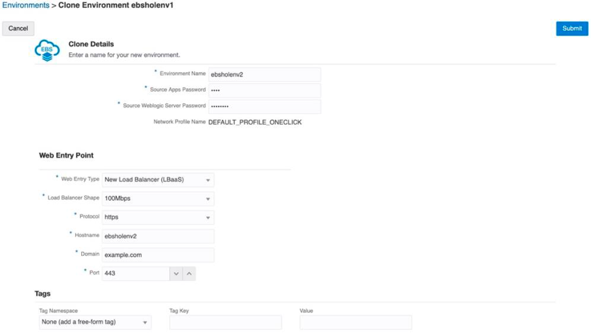
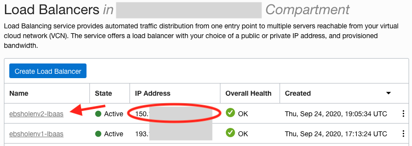

# Clone Your Oracle E-Business Suite Environment

## Introduction
In this lab, we will use the Cloning feature of Oracle E-Business Suite Cloud Manager to clone your Oracle E-Business Suite environment.

Estimated Lab Time: 15 minutes

### Objectives
* Cloning your EBS environment
* Configure Local Host Files for the Cloned Environment and Log in to Cloned Oracle E-Business Suite

### Prerequisites
* Tenancy Admin User
* Tenancy Admin Password
* Cloud Manager Admin Credentials

## **STEP 1:** Access the Clone Environment Page

1. Navigate to the Cloud Manager Environments page.

2. For ebsholenv1, click the stacked lines to the right of the environemtn and select **Clone**. 

  

  Enter Details (see screenshot and points below)

  

3. Enter the following values for the clone details (Note these variables in your key-data.txt):

    a. **Environment Name**: ebsholenv2

    b. **Source Apps Password**: apps

    c. **Source WebLogic Server Password**: welcome1

4. **Web Entry Point**: Select **New Load Balancer (LBaaS)**

5. **Load Balancer Shape**: Select 100Mbps

6. Enter these values for the following Web Entry properties.

    a. **Protocol**: https

    b. **Hostname**: ebsholenv2

    c. **Domain**: example.com

    d. **Port**: 443

7. Click **Submit**

8. You can check the status of the activity to clone the environment in the Activities page. The new environment is listed on the Environments page.

## **STEP 2:** Configure Local Host Files for the Cloned Environment and Log in to Oracle E-Business Suite

1. In the Oracle Cloud Infrastructure console, find the IP address for the Oracle E-Business Suite web entry point by navigating to **Networking** > **Load Balancers**.


2. On the Load Balancers page, you will find a load balancer named ebsholenv2-lbaas. Obtain the public IP address of this load balancer and record in your ```key-data.txt``` file.



3. Edit the local hosts file on your laptop and add an entry.

  **For Windows users**

    1. Navigate to Notepad in your start menu.

    2. Hover over Notepad, right-click, and select the option **Run as Administrator**.

    3. In Notepad, navigate to ``File > Open``.

    4. Browse to ``C:\\Windows\System32\drivers\etc``

    5. Find the **file hosts**

        

    6. In the hosts file, scroll down to the end of the content.

    7. Add the following entry to the very end of the file:
    ``<ip_address> ebsholenv2.example.com``

    8. Save the file.

  **For Mac users**

    1. Open a Terminal Window.

    2. Enter the following command:

        ```
        <copy>
        $ sudo vi /etc/hosts
        </copy>
        ```

      This will then require your local computer password to edit the file. Enter and you should see a screen similar to the one shown below.

    3. Type 'i' to edit the file.

    4. Go to the last line and add the following entry as show below:
    ``<ip_address> ebsholenv2.example.com``

    5. Once you have finished editing the file hit 'esc' and type ':wq' to save and exit.

        

4. Log in to Oracle E-Business Suite:

  a. Click [here](https://ebsholenv2.example.com/OA_HTML/AppsLocalLogin.jsp) to navigate to the URL in your browser.

  b. When prompted, accept the warning concerning the certificate coming from an unauthorized certificate authority as we are using a self-signed certificate. (You will change the certificate with your own when executing this procedure outside of this hands-on lab.)

  c. On this page, you will log in to Oracle E-Business Suite with the credentials you generated in Lab 3, part 3.

  

## Acknowledgements

* **Author:** Quintin Hill, Cloud Engineering
* **Contributors:** 
  - Santiago Bastidas, Product Management Director
  - William Masdon, Cloud Engineering
  - Mitsu Mehta, Cloud Engineering
* **Last Updated By/Date:** Quintin Hill, Cloud Engineering, Sept 2020

## See an issue?
Please submit feedback using this [form](https://apexapps.oracle.com/pls/apex/f?p=133:1:::::P1_FEEDBACK:1). Please include the *workshop name*, *lab* and *step* in your request.  If you don't see the workshop name listed, please enter it manually. If you would like us to follow up with you, enter your email in the *Feedback Comments* section. 
