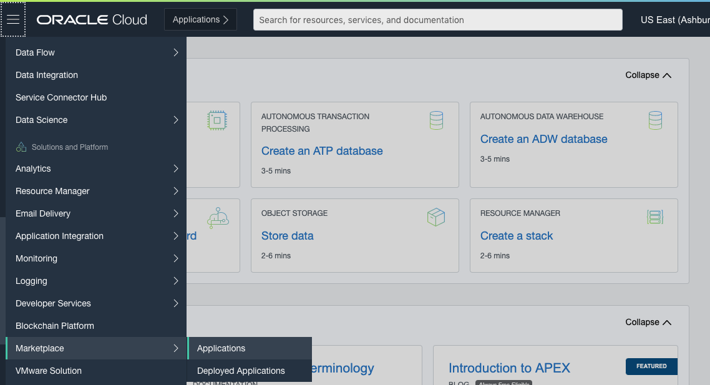
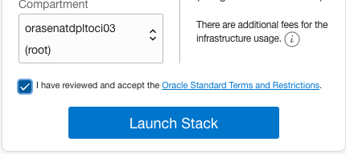

# Oracle E-Business Suite Cloud Manager Deployment and Configuration

## Introduction
In this 30 mins lab, we will deploy the Oracle E-Business Suite Cloud Manager Compute instance using an Oracle Cloud Infrastructure Marketplace image and configure Oracle E-Business Suite Cloud Manager.

## Step 1. Sign in to the Oracle Cloud Infrastructure Console

Use the tenancy administrator credentials to sign in to Oracle Cloud Infrastructure console.

1. Reference your ``Key-Data.txt`` file and locate the tenancy administrator credentials.

2. Sign in to the Oracle Cloud Infrastructure console using the following:

* **User name**: ``Tenancy Admin User``

* **Password**: ``Tenancy Admin Password``

## Step 2. Deploy and Configure Oracle E-Business Suite Cloud Manager

You will now create a Resource Manager Stack that will perform the following tasks:

* Create the resources required to deploy the Oracle E-Business Suite Cloud Manager. Here is a list of resources which will be created automatically for you:

    a. A compartment

    b. The EBS Cloud Manager IAM group, user and policies to allow the group to operation on the above compartment

    c. Network resources – including a VCN, an internet gateway, subnets, route tables, security lists, and security rules
    
* Deploy a Compute Instance for running the Oracle E-Business Suite Cloud Manager

* Configure Oracle E-Business Suite Cloud Manager to work with your OCI Tenancy

1. In the Oracle Cloud Infrastructure console navigation menu, under **Solutions and Platform** select **Marketplace** and then click **Applications**.



2. Find and click **Oracle E-Business Suite Cloud Manager Stack for Demos**.

3. In the version drop-down list, ensure that the default of ```Oracle-EBS-Cloud-Manager-Stack-for-Demos-<date>``` is selected.

4. In the Compartment drop-down list, select the parent compartment of the compartment where the Oracle E-Business Suite Cloud Manager Compute instance will be deployed. For example, mycompanytenancy(root).



5. Review and accept the Terms of Use.

6. Click Launch Stack.

7. On the Configure Variables screen, enter the following values:

    a. Resource Prefix: ``ebshol``

    b. Leave Single Compartment Setup checked

    c. Select your root compartment as the parent compartment for your resources

    d. Enter ``ebscm.admin@example.com`` under EBS Cloud Manager Administrator username

    e. Make sure **Create New REST API key** is selected

    

    f. Enter ``myebscm.ebshol.org`` for Server host for EBS Cloud Manager Login URL

    g. Select ``VM.Standard.E2.2`` for EBS Cloud Manager Shape

    h. Enter a password which matches the criteria: 8 to 30 characters, at least one lower character, one upper case character, one special character from _#$.

    i. Open the file ``Desktop/HOL-EBS/artifacts/ssh-keys/ebs_hol_key.pub`` with a text editor and copy its contents into Public Key

    j. Choose the availability domain that ends in **-1** from the list under **EBS Cloud Manager Availability Domain**.

    

    k. Leave Custom CIDR Ranges unchecked

    l. Enter ``0.0.0.0/0`` under EBS Cloud Manager Access CIDR

    m. Enter the values from ``KeyData.txt`` file - **IDCS Client ID**, **IDCS Client Secret** and **IDCS Client Tenant** under the IDCS Details section as shown       in the screen below.

    

8. On the Review screen, verify the information and click **Create**.


9. This takes you to the Stack Details page for your newly created stack. On this page, click the Terraform Actions drop-down list and select **Apply**.


10. In the Apply dialog window, leave the default settings as-is and click **Apply**.


11. On the Job Details page, you will see the job status which will cycle through **Accepted, In Progress**, and **Succeeded**.


``After the job succeeds, you will have all the network resources (VCN, load balancer, subnets, and so on) required to deploy the Oracle E-Business Suite Cloud Manager Compute instance.``

12. On the **Application Information** tab you will find the details related to the EBS Cloud Manager instance and Load balancer.


13. Copy and paste **Private IP, Public IP, Login URL** and **LB Public IP** to your ``Key-Data.txt``. These variables are needed for the remainder of the procedures in this lab.

## Step 3. Log in to Oracle E-Business Suite Cloud Manager

Before login in to the Oracle E-Business Suite Cloud Manager web application, you need to add the **hostname** in the Login URL to your local computer hosts file. 

Follow the instructions below to perform this configuration:

Edit the local ``hosts`` file on your laptop and add an entry. 

  **a. For Windows users**

   i. Navigate to Notepad in your start menu.
    
   ii. Hover over Notepad, right-click, and select the option **Run as Administrator**.
    
   iii. In Notepad, navigate to ``File > Open``.
    
   iv. Browse to ``C:\\Windows\System32\drivers\etc``
    
   v. Find the **file hosts**

   

   vi. In the hosts file, scroll down to the end of the content.

   vii. Add the following entry to the very end of the file: ``<Lb Public IP> myebscm.ebshol.org``

   viii. Save the file.

 **b. For Mac users**

   i. Open a Terminal Window.

   ii. Enter the following command: ``$ sudo vi /etc/hosts``

   iii. Go to the last line and add the following entry: ``<LB Public IP> myebscm.ebshol.org``

   iv. Save the file.

Using the Login URL generated previously, log into the Oracle E-Business Suite Cloud Manager using your IDCS credentials as found in your ``Key-Data.txt`` file.


Once logged in, you are on the **Environments page**.


You may now proceed to the next lab.

## Acknowledgements

- **Last Updated By/Date** - Santiago Bastidas, Product Management Director, July 2020

## See an issue?
Please submit feedback using this [form](https://apexapps.oracle.com/pls/apex/f?p=133:1:::::P1_FEEDBACK:1). Please include the *workshop name*, *lab* and *step* in your request.  If you don't see the workshop name listed, please enter it manually. If you would like for us to follow up with you, enter your email in the *Feedback Comments* section. 
