# Oracle E-Business Suite Cloud Manager Deployment and Configuration

## Introduction
In this lab, we will deploy the Oracle E-Business Suite Cloud Manager using the Marketplace Application:
Oracle E-Business Suite Cloud Manager Stack for Demos.

Estimated Lab Time: 30 minutes

Watch this short video to preview how to deploy your Oracle E-Business Suite cloud manager.

[](youtube:vzIJ4LFOi0s)

### Objectives

* Deploy and Configure Oracle E-Business Suite Cloud Manager
* Verifying login into Oracle E-Business Suite Cloud Manager

### Prerequisites

* Tenancy Admin User
* Tenancy Admin Password
* Lab 1 for preparing your tenancy completed with your IDCS information documented in your key-data.txt file.
    * `Cloud_Manager_Admin_Username`
    * `Cloud_Manager_Admin_Password`
    * `Client_Tenant`
    * `Client_ID`
    * `Client_Secret`

## **STEP 1:** Sign in to the Oracle Cloud Infrastructure Console

Use the tenancy administrator credentials to sign in to Oracle Cloud Infrastructure console.

1. Reference your ``key-data.txt`` file and locate the tenancy administrator credentials.

2. Sign in to the Oracle Cloud Infrastructure console using the following:

    * **User name**: ``Tenancy Admin User``
    * **Password**: ``Tenancy Admin Password``

## **STEP 2:** Deploy and Configure Oracle E-Business Suite Cloud Manager

You will now deploy an E-Business Suite Cloud Manager using a Marketplace stack. The stack creates the following cloud resources:

  - A compartment to contain resources required by Oracle E-Business Suite Cloud Manager.

  - An EBS Cloud Manager Administrators IAM user and group, as well as the policies required to manage the compartment.

  - Network resources – including a VCN, an internet gateway, subnets, route tables, security lists, and security rules.

  - A Compute instance for running the Oracle E-Business Suite Cloud Manager.

Then, the stack will configure Oracle E-Business Suite Cloud Manager to work with your OCI tenancy and the newly created OCI resources.

1. In the Oracle Cloud Infrastructure console navigation menu, under **Solutions and Platform** select **Marketplace** and then click **Applications**.

  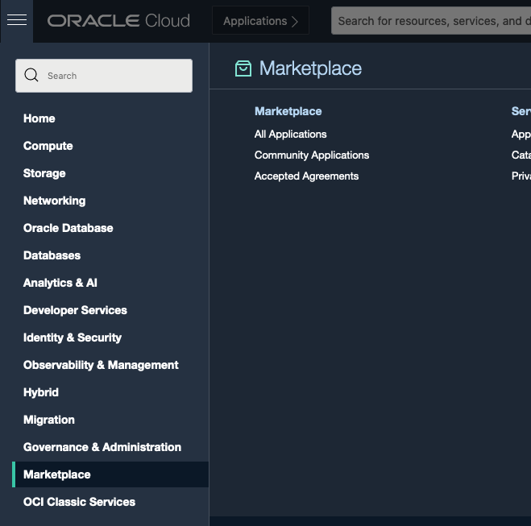

2. From the Marketplace applications page:

    a. Select **Stack** under Filter > Type

    b. In the search bar type "E-Business Suite"

    c. Click the application **Oracle E-Business Suite Cloud Manager Stack for Demos**

    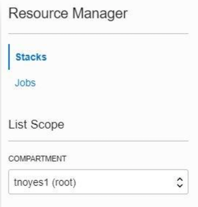

3. In the version drop-down list, ensure that the default of ```Oracle-EBS-Cloud-Manager-Stack-RM-20.1.1-<date>``` is selected.

4. In the Compartment drop-down list, select the parent compartment of the compartment where the Oracle E-Business Suite Cloud Manager Compute instance will be deployed. For example, mycompanytenancy(root).

5. Review and accept the Terms of Use.

6. Click **Launch Stack**.

  

7. On the Stack Information screen, enter the following values:

    a. **Name**: (default: Oracle E-Business Suite Cloud Manager Stack for Demos-<date&time>)

    b. **Description**: Add a description for the stack

    c. The last two variables should be greyed out.

      1. **Compartment**: (the one chosen previously)

      2. **Terraform Version**: 0.11.x

    d. Click Next

    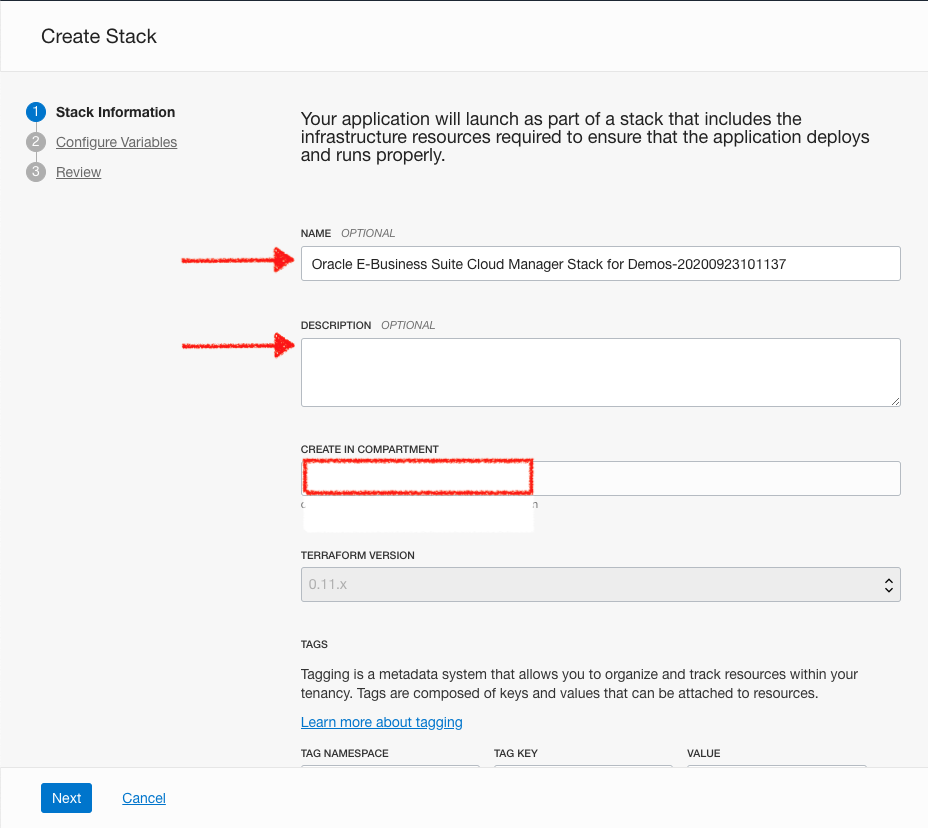

8. On the Configure Variables screen, enter the following values:

    a. **Resource Prefix**: ``ebshol``

      - Note: This value must be a unique identifier to your tenancy.

    b. **Single Compartment Setup**: Make sure it is checked

    c. **Parent Compartment**: Select your compartment as the parent compartment for your resources

    d. **EBS Cloud Manager Administrator Username**: ``ebscm.admin@example.com``

    e. **Create New REST API key**: Make sure it is checked

    

    f. **Server Host for EBS Cloud Manager Login URL**: ``myebscm.ebshol.org``

    g. **EBS Cloud Manager Shape**: ``VM.Standard.E2.2``

    h. **EBS Cloud Manager Admin Password**:
      - Note: This password should be saved as: `Cloud_Manager_Admin_Password` in your key-data.txt

    i. **Public Key**:

      1. Use an existing or generate a new ssh key. Paste the public key pair.

      For more information on ssh keys, visit: [Generating an SSH Key Pair](https://www.oracle.com/webfolder/technetwork/tutorials/obe/cloud/compute-iaas/generating_ssh_key/generate_ssh_key.html)

    j. **EBS Cloud Manager Availability Domain**: Choose the availability domain that ends in **-1** from the list

      

    k. **Custom CIDR Ranges**: leave unchecked

    l. **EBS Cloud Manager Access CIDR**: ``0.0.0.0/0``

    m. Enter the values from ``key-data.txt`` file as shown below.

      1. **IDCS Client ID**: `Client_ID`

      2. **IDCS Client Secret**: `Client_Secret`

      3. **IDCS Client Tenant**: `Client_Tenant`

    n. Click **Next**

    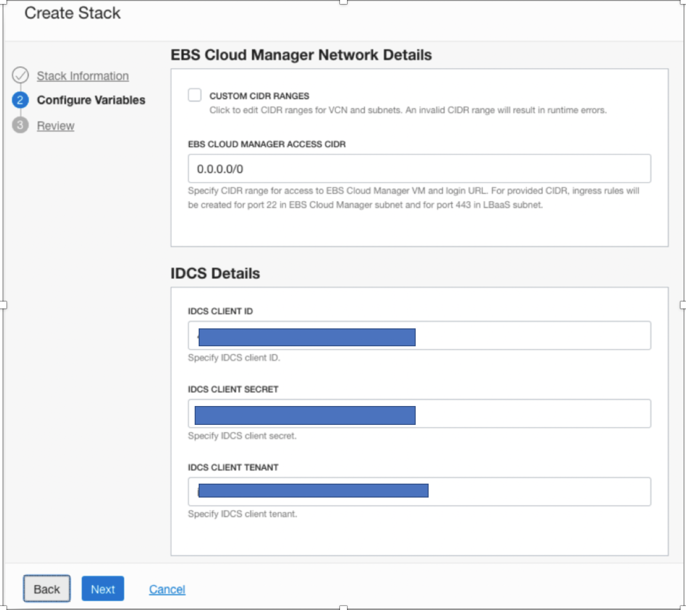

9. On the Review screen, verify the information and click **Create**.

  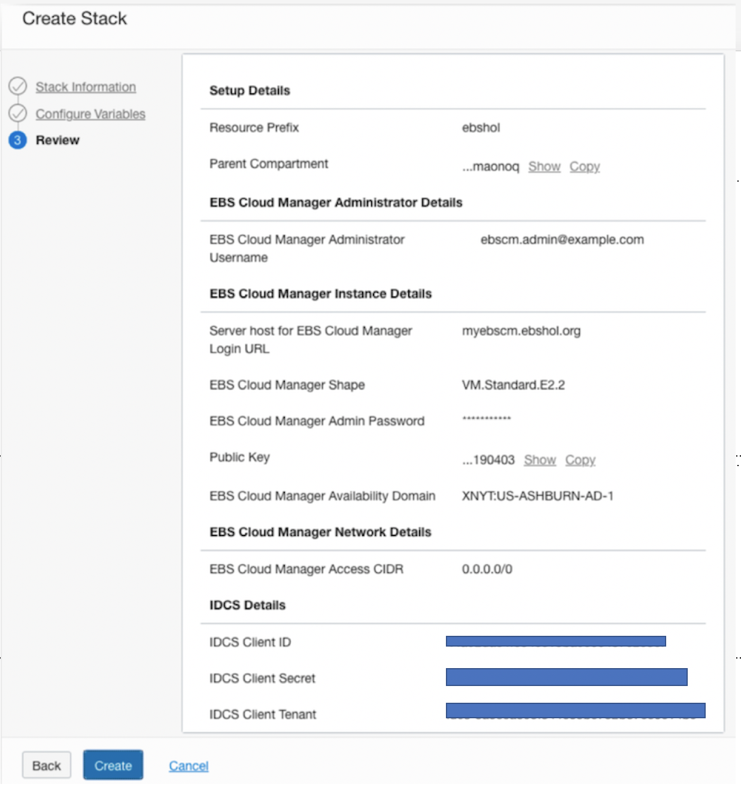

10. This takes you to the Stack Details page for your newly created stack. You will notice that the job status will cycle through **Accepted, In Progress**, and **Succeeded**. This will take some time to complete.

  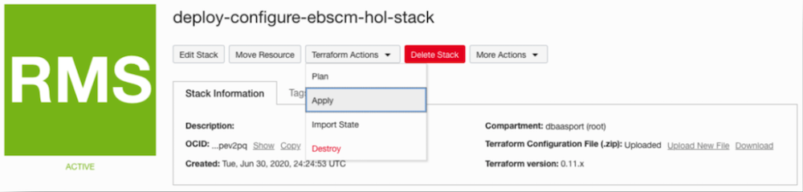

  After the job succeeds, you will have all the network resources (VCN, load balancer, subnets, and so on) required to deploy the Oracle E-Business Suite Cloud Manager Compute instance.

11. On the **Application Information** tab you will find the details related to the EBS Cloud Manager Instance and Load Balancer.

  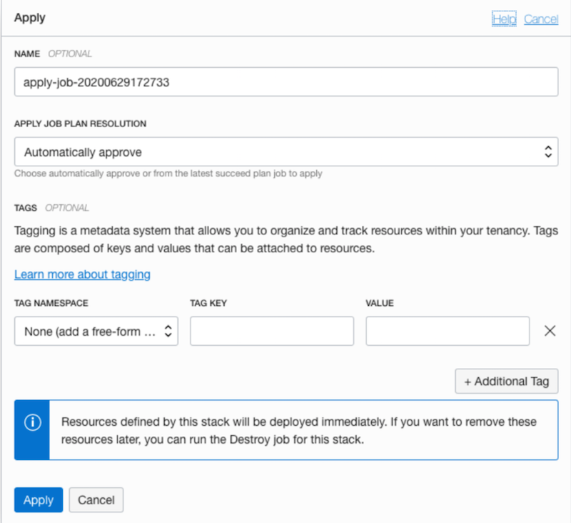

12. This information can also be found at the bottom of your log outputs as shown below:

  Copy and paste **Private IP, Public IP, Login URL** and **LB Public IP** to your ``key-data.txt``. These variables are needed for the remainder of the procedures in this lab.

  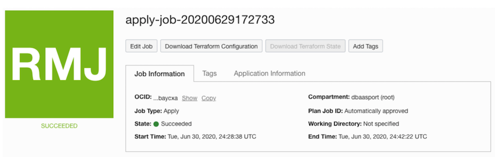

## **STEP 3:** Log in to Oracle E-Business Suite Cloud Manager

Before logging into the Oracle E-Business Suite Cloud Manager web application, you need to add the **hostname** in the Login URL to your local computer hosts file.

Follow the instructions below to perform this configuration:

Edit the local ``hosts`` file on your laptop and add an entry.

**For Windows users**

  1. Navigate to Notepad in your start menu.

  2. Hover over Notepad, right-click, and select the option **Run as Administrator**.

  3. In Notepad, navigate to ``File > Open``.

  4. Browse to ``C:\\Windows\System32\drivers\etc``

  5. Find the **file hosts**

      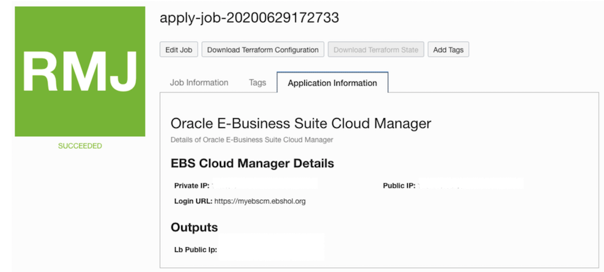

  6. In the hosts file, scroll down to the end of the content.

  7. Add the following entry to the very end of the file: ``<lb_public_ip> myebscm.ebshol.org``

  8. Save the file.

**For Mac users**

  1. Open a Terminal Window.

  2. Enter the following command:

    ```
    <copy>
    sudo vi /etc/hosts
    </copy>
    ```

  This will then require your local computer password to edit the file. Enter and you should see a screen similar to the one shown below.

  3. Type 'i' to edit the file.

  4. Go to the last line and add the following entry as show below: ``<lb_public_ip> myebscm.ebshol.org``

  5. Once you have finished editing the file hit 'esc' and type ':wq' to save and exit.

  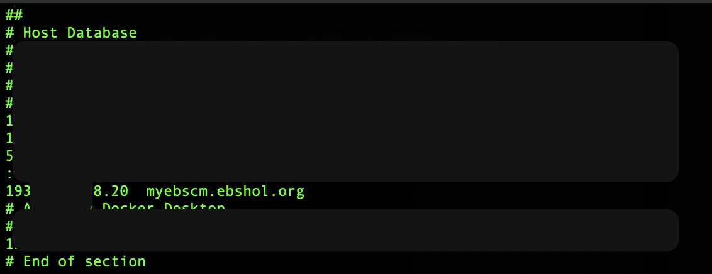

Type the Login URL generated and documented to your key-data.txt previously into your browser.

Log into the Oracle E-Business Suite Cloud Manager using your IDCS credentials for the EBS Cloud Manager account as documented in your ``key-data.txt`` file.

  Note: It may take some additional time for the load balancer to be properly configured. Sometimes it may take up to 30 minutes or an hour to configure. If you would like to check on the status of the load balancer,  in OCI go to **Networking** > **Load Balancers** and then check the **Overall Heatlh** status. If it is OK, the connection can be established. 

  Note: Your browswer may give you an error when attempting to access the EBS Cloud Manager. If you run into an error using the EBS login URL try using a different browser or an incognito session. 

  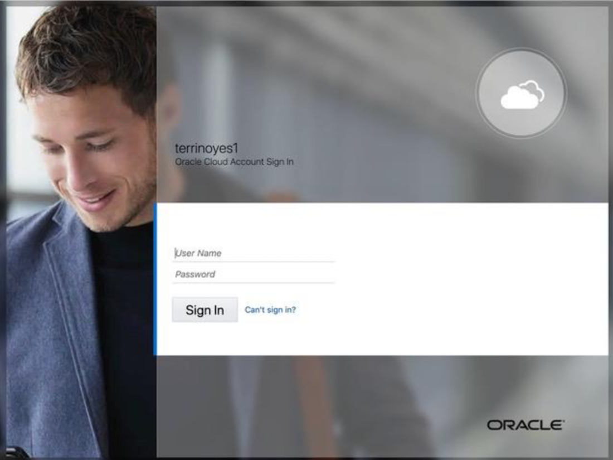

Once logged in, you are on the **Environments page**.

  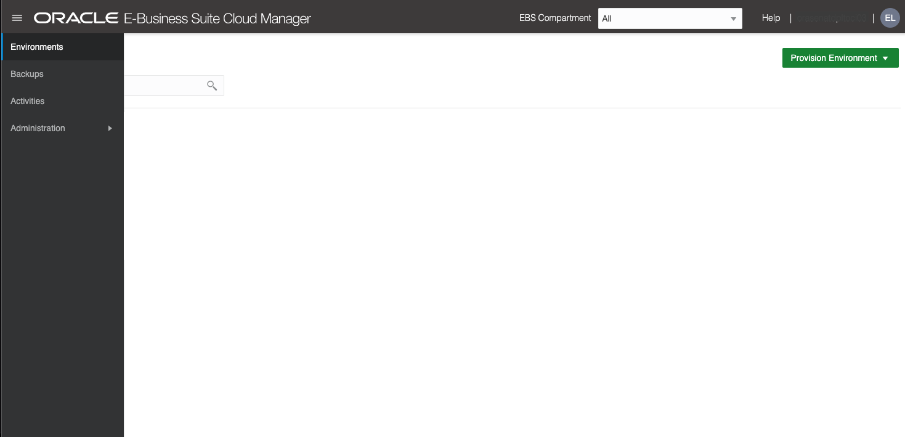

You may now proceed to the next lab.

## Acknowledgements

* **Author:** Quintin Hill, Cloud Engineering
* **Contributors:** 
  - Santiago Bastidas, Product Management Director
  - William Masdon, Cloud Engineering
  - Mitsu Mehta, Cloud Engineering
* **Last Updated By/Date:** Quintin Hill, Cloud Engineering, Sept 2020

## Need Help?
Please submit feedback or ask for help using our [LiveLabs Support Forum](https://community.oracle.com/tech/developers/categories/ebs-on-oci-automation). Please click the **Log In** button and login using your Oracle Account. Click the **Ask A Question** button to the left to start a *New Discussion* or *Ask a Question*.  Please include your workshop name and lab name.  You can also include screenshots and attach files.  Engage directly with the author of the workshop.

If you do not have an Oracle Account, click [here](https://profile.oracle.com/myprofile/account/create-account.jspx) to create one. 
