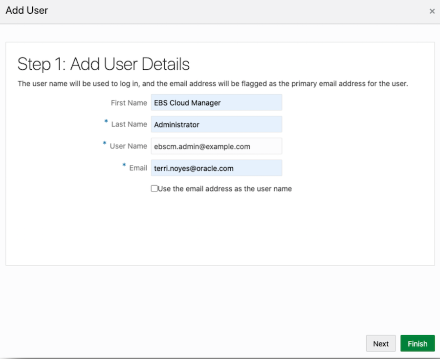
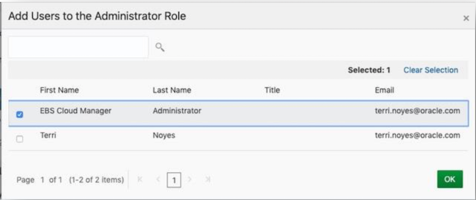
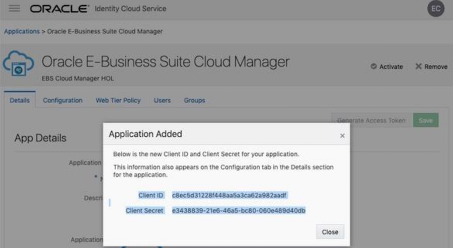
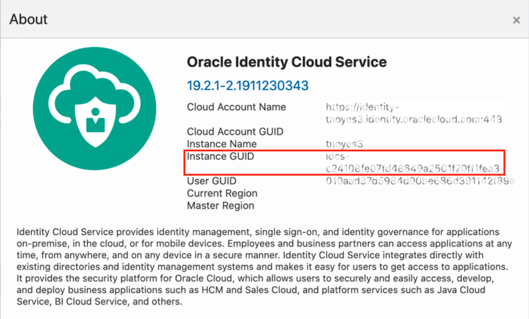

# Preparing Your Tenancy for Oracle E-Business Suite

## Introduction
In this 30 mins exercise, you will prepare your tenancy for Oracle E-Business Suite. 

Before starting this lab, please make sure to record your trial user name and password to Tenancy\_Admin\_User and Tenancy_Admin_Password in your Key-Data.txt file for ease of access.

## Step 1. Setup EBS Cloud Manager Authentication with Identity Cloud Service (IDCS)

### Part 1 - Create the EBS Cloud Manager Administrators group and user in IDCS

1. As the Tenancy Administrator, log in to the Oracle Cloud Infrastructure console.

2. In the Oracle Cloud Infrastructure console menu, under Governance and Administration, navigate to **Identify > Federation**.

3. Click on the link next to Oracle Identity Cloud Service Console.

4. From the IDCS console, create your Oracle E-Business Suite Cloud Manager group:

    a. Click the navigation menu and select **Groups**.

    b. Click the **Add** button.

    c. In the Add Group dialog box (Step 1: Group Details), supply the following information:
    
         i. Name: Enter the name idcs-ebscm-grp
     
        ii. Description: Enter a description of your choice.

    d. Click **Finish**.

5. While still in the IDCS console, create your Oracle E-Business Suite Cloud Manager Administrator user:

    a. Click the navigation menu and select **Users**.

    b. Click **Add**.

    c. In the Add User dialog box (Step 1: Add User Details), supply the following information:
    
        i. First Name: Enter EBS Cloud Manager

        ii. Last Name: Enter Administrator

        iii. User Name: Enter ebscm.admin@example.com

        iv. Email: Use the same email addressed you used when registering.

        v. Deselect the check box Use email address as the user name.
        
    
    
    d. Click **Next**.
    
    e. On the Step 2: Assign User to Groups dialog window, select the check box for the group you just created (``idcs-ebscm-grp``).
    
    
    
    f. Click **Finish**.
    
6. From the IDCS console navigation menu, click **Security** to expand the menu. Then click **Administrators**.

7. On the Administrators page:

   
    
   a. Expand the **Application Administrators** section.
    
   b. Click **Add**.

8. In the Add Users to the Administrator Role dialog box, select the check box for the EBS Cloud Manager Administrator (``ebscm.admin@example.com``).



9. Click **OK**.

```
Note: The Cloud Manager administrator will register the app as a confidential application in the next section.
```

10. Log out of the IDCS console by clicking on your user avatar icon at the top right of your screen. Then, click **Sign Out**.

### Part 2 - Register Oracle E-Business Suite Cloud Manager as a Confidential Application in IDCS

```
Note: The ebscm.admin@example.com performs the tasks in this section.
```

In this section, you will register the Oracle E-Business Suite Cloud Manager as a Confidential Application.

1. Open the Welcome email that was received in the previous section.

2. Click the yellow **Activate Your Account** button in the email.

3. Enter a new password, confirm, and click Submit. We suggest you reuse the password from ``Key-Data.txt``, field ``Cloud_Manager_Admin_Password``.

4. Click **OK** to continue, which will take you to the IDCS Login screen.

5. Enter the EBS Cloud Manager user name (``ebscm.admin@example.com``) and password you just entered in the previous screen to log in.

6. Click on your user avatar menu in the top right corner. This will display a drop-down menu.

7. Select **Admin Console**. This will display the IDCS Administration Console.

8. In the top right of the Applications tile, click the icon to Add an Application.

9. Select **Confidential Application**. This takes you to the Add Confidential Application page.

10. On the Details screen, enter the following:

    a. **Name**: Enter ``Oracle E-Business Suite Cloud Manager``

    b. **Description**: Enter a description.

    c. Click **Next**.

11. On the Client screen:

    a. Select **Configure this application as a client now**.

    b. Under **Allowed Grant Types**, select the following check boxes:

        i. Client Credentials

        ii. Refresh Token

        iii. Authorization Code

    c. **Redirect URL**: ``<Cloud_Manager_URL>/cm/auth/callback``

    See value for <Cloud_Manager_URL> in key-data.txt file.

    d. **Logout URL**: Leave this field empty.

    e. **Post-Logout Redirect URL**: ``<Cloud_Manager_URL>/cm/ui/index.html?root=login``

    f. Select the **Introspect** option for **Allowed Operations**.

    g. Under **Grant the client access to Identity Cloud Service Admin APIs**:

        i. Click Add.

        ii. Select Authenticator Client and Me in the pop-up window.

        iii. Click Add again.

    h. Click **Next**.
    
12. On the Resources screen, click **Next**.

13. On the Web Tier Policy screen, click **Next**.

14. On the Authorization screen, click **Finish**.

15. Make note of the following values in your ``Key-Data.txt`` file (under ``Client_ID`` and ``Client_Secret``, respectively) when they are displayed in a pop-up window:

        i. Client ID

        ii. Client Secret



16. Click **Close**.

17. Click **Activate** to activate the Confidential Application.

18. Click on the avatar icon on the top right hand side of the screen.

19. Select the **About** option.

20. Copy the value displayed for Instance GUID. Record this as ``Client_Tenant`` in the ``Key-Data.txt``. Your IDCS Client Tenant begins with the characters ``idcs-`` and then is followed by a string of numbers and letters, for example, ``idcs-6572bfeb183b4becad9e649bfa14a488``.



You may now proceed to the next lab.

## Acknowledgements

- **Last Updated By/Date** - Santiago Bastidas, Product Management Director, July 2020

## See an issue?
Please submit feedback using this [form](https://apexapps.oracle.com/pls/apex/f?p=133:1:::::P1_FEEDBACK:1). Please include the *workshop name*, *lab* and *step* in your request.  If you don't see the workshop name listed, please enter it manually. If you would like for us to follow up with you, enter your email in the *Feedback Comments* section. 