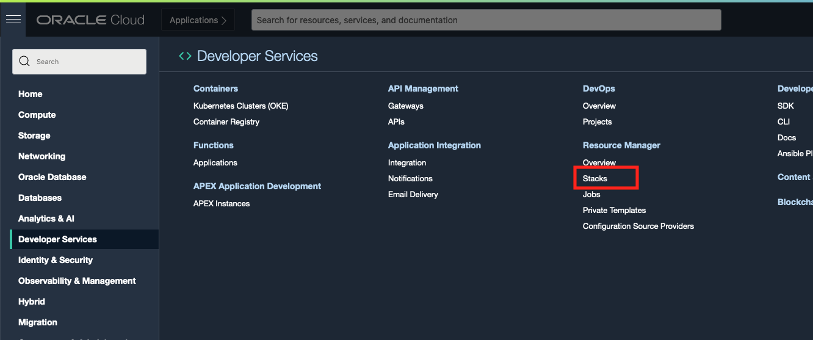

# Teardown Your Oracle E-Business Suite Environments

## Introduction
In this lab, we will use the Oracle E-Business Suite Cloud Manager to destroy your Oracle E-Business Suite environments. Then we will delete all the resources in OCI with the Stack we created in Lab 2. 

Estimated Lab Time: 15 minutes

### Objectives
* Delete your EBS environments
* Destroy OCI Resources used for Cloud Manager

### Prerequisites
* Tenancy Admin User
* Tenancy Admin Password
* Cloud Manager Admin Credentials

## **STEP 1:** Delete the EBS Environment from Cloud Manager

1. Navigate to the Cloud Manager Environments page.

2. For ebsholenv1, click the stacked lines to the right of the environment and select **Delete**. Confirm deletion by selecting **Yes** on the popup. 

    

    The environment will begin the deletion process. This will teardown all resources created by the environment. You can check the progress of the deletion by clicking the link next to Latest Activity. 

    

    Once the environment has been destroyed, it will no longer appear on the Cloud Manager Environements page. 

    You can repeat this step for all other EBS environments you wish to delete. 

## **STEP 2:** Teardown the Cloud Manager Instance

1. Navigate to the OCI console and login as the tenancy admin user. Go to **Resource Manager** > **Stacks** and select the stack you used to create the Cloud Manager environment (ensure that you are in the correct compartment if no items display).

    

2. In the Stack Details Page, select **Terraform Actions** > **Destroy**. Name your destroy job whatever you like and then click **Destroy**.

    

    The job will run and teardown all resources created by the stack, including the Cloud Manager instance and the Networking components. 

3. Once the destroy job has finished and the Cloud Manager has been deleted, you may go to **Governance** > **Compartment Explorer** and then select **ebshol_compartment** on the left side of the screen to validate that it is empty. 

    Note: There may be resources still listed in the compartment, but they should have a status of **Terminated**. If there are still active resources in the compartment, you will need to destroy them before deleting the compartment. 

    

    

    In the Compartment Explorer when viewing the **ebshol\_compartment** parent compartment (in this case the root compartment), you can click on the three dots to the right of **ebshol\_compartment** and then delete the compartment.

    

    You have now torn down all the resources you created for the EBS Cloud Manager Instance and its EBS Environments. 

## Acknowledgements

* **Author:** William Masdon, Cloud Engineering
* **Contributors:** 
  - Santiago Bastidas, Product Management Director
  - Quintin Hill, Cloud Engineering
  - Mitsu Mehta, Cloud Engineering
* **Last Updated By/Date:** William Masdon, Cloud Engineering, Oct 2020

## Need Help?
Please submit feedback or ask for help using our [LiveLabs Support Forum](https://community.oracle.com/tech/developers/categories/ebs-on-oci-automation). Please click the **Log In** button and login using your Oracle Account. Click the **Ask A Question** button to the left to start a *New Discussion* or *Ask a Question*.  Please include your workshop name and lab name.  You can also include screenshots and attach files.  Engage directly with the author of the workshop.

If you do not have an Oracle Account, click [here](https://profile.oracle.com/myprofile/account/create-account.jspx) to create one. 
