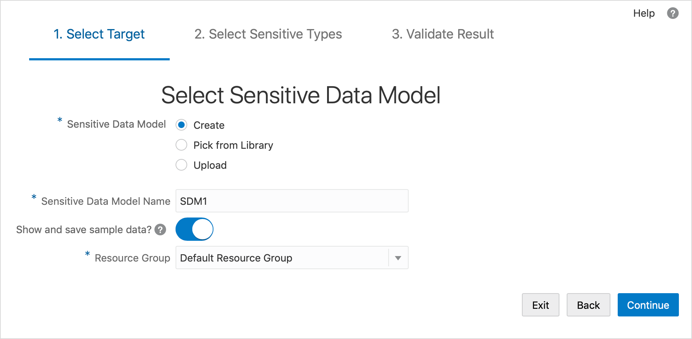
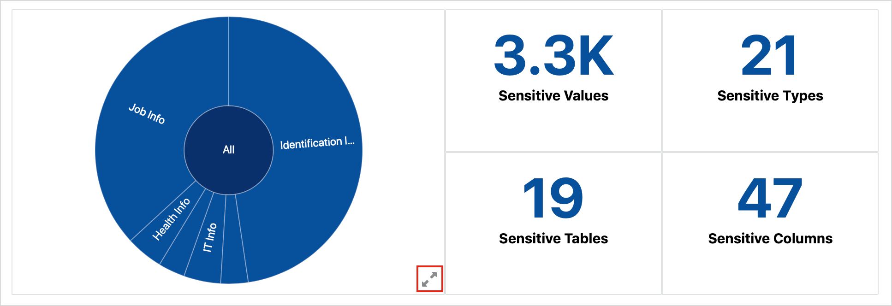
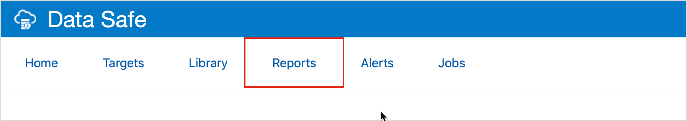

# Discover Sensitive Data with Oracle Data Safe

## Introduction

Using Oracle Data Safe, discover sensitive data in a target database with the Data Discovery wizard and identify dictionary-based and non-dictionary referential relationships, in a sensitive data model, to modify and analyze results and reports.

### Objectives

In this lab, you learn how to do the following:
* Discover sensitive data in a target database with the Data Discovery wizard.
* Identify dictionary-based and non-dictionary referential relationships in a sensitive data model.
* Modify a sensitive data model in the Data Discovery wizard and perform incremental updates.
* Analyze the data discovery results and report.
* View, download, and delete a sensitive data model from the Library.

## **Step 1:** Sign into the Oracle Data Safe Console for Your Region

1. From the navigation menu, click **Data Safe**

    

2. You are taken to the **Registered Databases** Page.

3. Click on **Service Console**

    

4. You are taken to the Data Safe login page. Sign into Data Safe using your credentials.

    

## **Step 2:** Use the Data Discovery Wizard to Discover Sensitive Data

1. To access the Data Discovery wizard, click the **Home** tab, and then click **Data Discovery**.

    

2. On the Select Target for Sensitive Data Discovery page, your target database is listed. Often, you want to perform data discovery against a production database where you can get an accurate and up-to-date picture of your sensitive data. You can discover sensitive data in the source database (a production or copy) and mask the cloned copies of this source database. Or, you can simply run a data discovery job on the actual database that you want to mask.

3. Select your target database, and then click **Continue**.

    

4. Next, the **Select Sensitive Data Model** page is displayed. On this page, you can create a new sensitive data model, select an existing one from the Library, or import a file-based sensitive data model.

    

5. Leave **Create** selected.

6. Name the sensitive data model as **<username>SDM1**.

7. Enable **Show and save sample data** so that Data Discovery retrieves sample data for each sensitive column, if it's available.

8. Select your resource group.

9. Click **Continue**.

10. On the **Select Schemas for Sensitive Data Discovery** page, select the schema that you want Data Discovery to search. In this case, select the **HCM1** schema, and click **Continue**.

    

11. On the **Select Sensitive Types for Sensitive Data Discovery** page, you select the sensitive types that you want to discover. Data Discovery categorizes its sensitive types as Identification Information, Biographic Information, IT Information, Financial Information, Healthcare Information, Employment Information, and Academic Information.

12. **Expand all** the categories by moving the Expand All slider to the right to view each sensitive type. Notice that you can select individual sensitive types, sensitive categories, and all sensitive types.

13. Scroll down the list and review the sensitive types available.

    

14. Return to the top of the list and select the **Select All** check box.

15. At the bottom of the page, select the **Non-Dictionary Relationship Discovery** check box. Oracle Data Safe automatically discovers referential relationships defined in the data dictionary. The **Non-Dictionary Relationship Discovery** feature helps to identify application-level parent-child relationships that are not defined in the data dictionary. It helps discover application-level relationships so that data integrity is maintained during data masking.

16. When you are ready to start the data discovery job, click **Continue**.

17. Wait for the job to finish.

    

18. If the job is successful, the **Detail** column states Data discovery job finished successfully, and you can click **Continue**. Otherwise, you need to click **Back** or **Exit** and investigate the issue.

## **Step 3:** Review and Fine Tune Your Sensitive Data Model

1. On the **Non-Dictionary Referential Relationships** page, you are presented with a list of potential non-dictionary (application level) referential relationships that Data Discovery found by using column name patterns and column data patterns.

2. To view all of the columns, move the **Expand All** slider to the right. Data Discovery found some potentially sensitive columns (non-dictionary referential relationships) in the `HR` schema.

    

3. Click **Save** and **Continue**. The **Sensitive Data Discovery Result** page is displayed. On this page, you can view and manage the sensitive columns in your sensitive data model. Your sensitive data model is saved to the Library.

    

4. Notice that Data Discovery found sensitive columns in all three sensitive categories that you selected. To view the sensitive columns, move the **Expand All** slider to the right. The list includes the following:

    a. Sensitive columns discovered based on the sensitive types that you selected
    b. Dictionary-based referential relationships
    c. Non-dictionary referential relationships

5. Take a look at how the sensitive columns are organized. Initially, they are grouped by sensitive categories and sensitive types.

6. To list the sensitive columns by schema and table, select **Schema View** from the drop-down list next to the **Expand All Slider**. **Schema View** is useful for quickly finding a sensitive column in a table and for viewing the list of sensitive columns in a table. For example, in the `EMPLOYEES` table there are several sensitive columns listed.

7. If needed, you can add and remove sensitive columns from your sensitive data model. Sensitive columns that have a check box are removable. To remove a sensitive column from your sensitive data model, you deselect its check box. You can use the **Add** button to add more sensitive columns.

8. Notice that some of the sensitive columns do not have a check box. These are dependent columns. They have a relationship with their parent column. For example, in the `EMPLOYEES` table, `JOB_ID` is listed. It has a relationship defined in the Oracle data dictionary to the `JOBS.JOB_ID` sensitive column. If you remove a sensitive column that has a referential relationship, both the sensitive column and referential relationship are removed from the sensitive data model. Therefore, if you deselect `JOBS.JOB_ID`, then `EMPLOYEES.JOB_ID` is removed too.

9. View the sample data for the `HCM1.SUPPLEMENTAL_DATA.LAST_INS_CLAIM` column. The sensitive type is **Healthcare Provider** and the discovered sensitive column is `LAST_INS_CLAIM`, which has values such as `Cavity` and `Hair Loss`. Your value may be different. This column isn't a Healthcare Provider type of column and thus it is a false positive. You can deselect this column. Being able to remove a sensitive column is important when your sensitive data model includes false positives. To be able to recognize false positives, it helps to know your data well.

## **Step 4:** Modify Your Search for Sensitive Data and Re-Run the Data Discovery Job

Suppose that you're missing some sensitive columns in your sensitive data model. While working in the Data Discovery wizard, you can backtrack to reconfigure and rerun the data discovery job. You can repeat the process as many times as you need until you feel that your sensitive data model is accurate. Try the following:

1. Click **Back**. Now you are on the **Select Sensitive Types for Sensitive Data Discovery** page. Here you can change your sensitive type selections and choose whether to include non-dictionary referential relationships in the search.

2. Select all of the sensitive categories.

    

3. Deselect **Non-Dictionary Relationship Discovery**.

    

4. To rerun the data discovery job, click **Continue**.

5. When the job is finished, click **Continue**. Because you chose to not discover non-dictionary referential relationships, the wizard takes you directly to the **Sensitive Data Discovery Result** page.

6. Expand all of the sensitive columns and review the results.

    

7. To view the newly discovered sensitive columns, click **View newly discovered sensitive columns only**. Notice that Data Discovery found additional sensitive columns.

## **Step 5:** View the Sensitive Data Discovery Report and Analyze the Report Data

1. Scroll down and click **Report** at the bottom right corner of the screen. The report shows you a chart that compares sensitive categories. You can also view totals of sensitive values, sensitive types, sensitive tables, and sensitive columns. The table at the bottom of the report displays individual sensitive column names, sample data for the sensitive columns, column counts based on sensitive categories, and estimated data counts.

    

2. Analyze the data. To drill-down into a sensitive category in the chart, position your mouse over the chart, and then click the **Expand** button.

    

    

3. To drill-up, position your mouse over an expanded sensitive category, and then click the **Collapse** button.

4. To enlarge the chart, click the **Expand** button (double-arrows) in the bottom right corner. View the chart and click **Close**.

5. Expand the list of sensitive columns and review the information.

    

6. Click **Exit**.

    

7. Click the **Reports** tab.

    

8. Scroll down, and under **Discovery Reports**, click **Data Discovery**.

9. Click your sensitive data model to open the report.

## **Step 6:** View Your Sensitive Data Model in the Library

1. Click the **Library** tab.

2. Click **Sensitive Data Models**. The Sensitive Data Models page is displayed, listing the sensitive data models to which you have access. For each sensitive data model, you can view information about when your sensitive data model was created, when it was last updated, and who owns it.

    

3. Click the name of your sensitive data model to open it.

    

4. To return to the **Sensitive Data Models** page, click the **Library** tab, and then click **Sensitive Data Models**.

5. If you need to remove your sensitive data model from the Library, you can select the check box for it, and click **Delete**. Note: Keep your sensitive data model so that later you can use it for masking sensitive data in **Masking Lab 4 - Configure a Variety of Masking Formats with Oracle Data Safe**.

## **Step 7:** Download Your Sensitive Data Model

1. Select the check box for your sensitive data model.

2. Click **Download**. Your sensitive data model is downloaded to your browser.

3. Open the file, and review the XML code.

4. Save the file to your desktop as **<username> SDM1.xml**, and then close the file. In **Masking Lab 4 - Configure a Variety of Masking Formats with Oracle Data Safe**, you import this file-based sensitive data model into the Data Masking wizard.

You may proceed to the next lab.

## Acknowledgements

- **Author** - Tejus Subrahmanya, Phani Turlapati, Abdul Rafae, Sathis Muniyasamy, Sravya Ganugapati, Padma Natarajan, Aubrey Patsika, Jacob Harless
- **Last Updated By/Date** - Jess Rein - Cloud Engineer, November 2020

## See an issue?
Please submit feedback using this [form](https://apexapps.oracle.com/pls/apex/f?p=133:1:::::P1_FEEDBACK:1). Please include the *workshop name*, *lab* and *step* in your request.  If you don't see the workshop name listed, please enter it manually. If you would like for us to follow up with you, enter your email in the *Feedback Comments* section.
