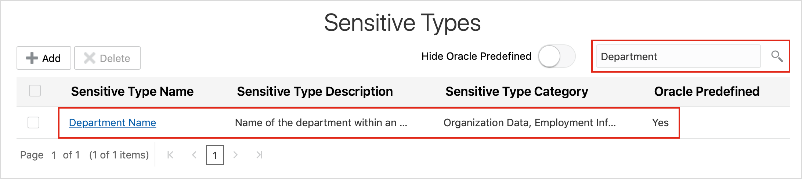

# Create a Sensitive Type and Sensitive Category with Oracle Data Safe

## Introduction
Using Oracle Data Safe, create your own sensitive type and sensitive category.

### Objectives

In this lab, you learn how to do the following:
* Create your own sensitive type in Oracle Data Safe
* Create your own sensitive category in Oracle Data Safe

## **Step 1:** Sign into the Oracle Data Safe Console for Your Region

1. From the navigation menu, click **Data Safe**

    

2. You are taken to the **Registered Databases** Page.

3. Click on **Service Console**.

    

4. You are taken to the Data Safe login page. Sign into Data Safe using your credentials.

    

## **Step 2:** Review the Predefined Sensitive Types in the Oracle Data Safe Library

1. In the Oracle Data Safe Console, click the **Library** tab, and then click **Sensitive Types**. The **Sensitive Types** page is displayed. On this page you can view predefined sensitive types and manage your own sensitive types.

    

2. Scroll through the list and become familiar with the different sensitive types available. The list contains `predefined` sensitive types only.

    

3. Move the **Hide Oracle Predefined** slider to the right.
The list removes the Oracle defined sensitive types, showing only the ones that you have defined.

    

4. Move the slider back to the left.

5. To find out how many sensitive types exist in the Library, scroll to the bottom of the page. The list contains 128 items.

6. To sort the list by sensitive category, position your cursor over the **Sensitive Type Category** header, and then click the arrow.

7. To sort the list by sensitive types, position your cursor over the **Sensitive Type Name** header, and then click the arrow.

8. To view the definition for a sensitive type, click directly on any one of the sensitive types. The **Sensitive Type Details** dialog box is displayed.

    

9. View the sensitive type's short name, description, column name pattern (regular expression), column comment pattern (regular expression), column data pattern (regular expression), the search pattern semantic (And or Or), the default masking format associated with the sensitive type, and the sensitive category and resource group to which the sensitive type belongs.

10. Click **Close** to close the dialog box.

11. To check if there is a sensitive type that discovers department IDs, in the search field, enter **Department**. The search finds **Department Name**, but nothing for department IDs.

    

12. Clear the search field, and then press **Enter** to restore the list.

13. Keep this page open because you return to it later in the lab.

## **Step 3:** Connect to Your ExaCS Database as the SYS User with SQL Developer

Please visit [Lab 4: Configuring a development system for use with your EXACS database](?lab=lab-4-configure-development-system-for-use) for instructions to securely configure ExaCS to connect using Oracle SQL Developer, SQLXL and SQL*Plus.

## **Step 4:** Analyze the HCM1.DEPARTMENTS.DEPARTMENT_ID Column in Your ExaCS Database

1. In SQL Developer, run the following command to connect to PDB1 pluggable database:

    ```
    <copy>ALTER SESSION SET CONTAINER=YOUR_PDB_NAME;</copy>
    ```

2. Run the following script:

    ```
    <copy>SELECT * FROM HCM1.DEPARTMENTS;</copy>
    ```

3. Notice that the department ID values are 10, 20, 30, up to 270.

## **Step 5:** Create a Sensitive Type and Sensitive Category

1. Return to the **Sensitive Types** page in the Oracle Data Safe Console.

2. Click **Add**. The **Create Sensitive Type** dialog box is displayed.

    

3. From the **Create Like** drop-down list, select **Employee ID Number**.

4. In the **Sensitive Type Name** field, enter **<username> Custom Department ID Number**.

5. In the **Sensitive Type Short Name** field, enter **Custom Dept ID**.

6. It is helpful to use a word like "Custom" when naming your own sensitive types to make them easier to search for and identify.

7. In the **Sensitive Type Description** field, enter **Identification number assigned to departments. Examples: 10, 20, 30...1000**.

8. In the **Column Name Pattern** field, enter:

    ```
    <copy>(^|[_-])(DEPT?|DEPARTMENT).?(ID|NO$|NUM|NBR)</copy>
    ```

9. In the **Column Comment Pattern** field, enter:

    ```
    <copy>(DEPT?|DEPARTMENT).?(ID|NO |NUM|NBR)</copy>
    ```

10. In the **Column Data Pattern** field, enter:

    ```
    <copy>^[0-9]{2,4}$</copy>
    ```

11. For **Search Pattern Semantic**, select **And**.

12. In the **Default Masking Format** field, enter **Identification Number**.

13. In the **Sensitive Category** field, enter **<username> Sensitive Category**. If you do not specify a sensitive category, the category is automatically named "Uncategorized."

14. Select your resource group.

15. Click **Save**. Your sensitive type is included in the list and is available in the Data Discovery wizard.

    

16. Move the **Hide Oracle Predefined** slider to the right to view your custom sensitive type in the list.

You may now proceed to the next lab.

## Acknowledgements

- **Author** - Tejus Subrahmanya, Phani Turlapati, Abdul Rafae, Sathis Muniyasamy, Sravya Ganugapati, Padma Natarajan, Aubrey Patsika, Jacob Harless
- **Last Updated By/Date** - Jess Rein - Cloud Engineer, November 2020

## See an issue?
Please submit feedback using this [form](https://apexapps.oracle.com/pls/apex/f?p=133:1:::::P1_FEEDBACK:1). Please include the *workshop name*, *lab* and *step* in your request.  If you don't see the workshop name listed, please enter it manually. If you would like for us to follow up with you, enter your email in the *Feedback Comments* section.
