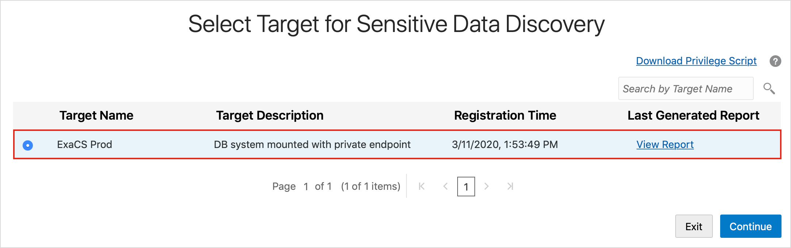

# Update a Sensitive Data Model with Oracle Data Safe

## Introduction
Using Oracle Data Safe, perform an incremental update to a sensitive data model by using the Data Discovery wizard.

### Objectives

In this lab, you learn how to do the following:
* Perform an incremental update to a sensitive data model by using the Data Discovery wizard

## **Step 1:** Connect to Your ExaCS Database as the SYS User with SQL Developer

Please visit [Lab 4: Configuring a development system for use with your EXACS database](?lab=lab-4-configure-development-system-for-use) for instructions to securely configure ExaCS to connect using Oracle SQL Developer, SQLXL and SQL*Plus.

## **Step 2:** Add an `AGE` Column to the `HCM1.EMPLOYEES` Table

1. In SQL Developer, run the following command to connect to PDB1 pluggable database:

    ```
    <copy>ALTER SESSION SET CONTAINER=YOUR_PDB_NAME;</copy>
    ```

2. On the SQL Worksheet, run the following commands to add an `AGE` column to the `EMPLOYEES` table.

    ```
    <copy>ALTER TABLE HCM1.EMPLOYEES ADD AGE NUMBER;</copy>
    ```

3. On the Navigator tab, click the Refresh button. `AGE` is added to the bottom of the list in the `EMPLOYEES` table.

4. Run the following command to gather schema statistics.

    ```
    <copy>EXEC DBMS_STATS.GATHER_SCHEMA_STATS('HCM1');</copy>
    ```

## **Step 3:** Sign into the Oracle Data Safe Console in Your Region

1. From the navigation menu, click **Data Safe**

    

2. You are taken to the **Registered Databases** Page.

3. Click on **Service Console**

    

4. You are taken to the Data Safe login page. Sign into Data Safe using your credentials.

    

## **Step 4:** Update Your Sensitive Data Model Using the Data Masking Wizard

1. In the Oracle Data Safe Console, click the **Home** tab, and then click Data Discovery. The Select Target for **Data Discovery** page is displayed.

    

2. Select your target database, and then click **Continue**. The **Select Sensitive Data Model** page is displayed.

    

3. For Sensitive Data Model, click **Pick from Library**.

    

4. Click **Continue**. The **Select Sensitive Data Model** page is displayed.

5. Select your sensitive data model (**<username> SDM1**).

    

6. Leave **Update the SDM with the target** selected.

7. Click **Continue**. The wizard launches a data discovery job.

8. When the job is finished, notice that the **Detail** column reads **Data discovery job finished successfully**.

9. Click **Continue**. The **Sensitive Data Model: <username> SDM1** page is displayed.

10. Notice that you have the newly discovered sensitive column, `AGE`. Only newly discovered columns are displayed at the moment.

11. **Expand all** of the nodes.

12. To view all of the sensitive columns in the sensitive data model, click **View all sensitive columns**.

13. You can toggle the view back and forth between displaying all of the sensitive columns or just the newly discovered ones.

14. Click **Exit**.

You may proceed to the next lab.

## Acknowledgements

- **Author** - Tejus Subrahmanya, Phani Turlapati, Abdul Rafae, Sathis Muniyasamy, Sravya Ganugapati, Padma Natarajan, Aubrey Patsika, Jacob Harless
- **Last Updated By/Date** - Jess Rein - Cloud Engineer, November 2020

## See an issue?
Please submit feedback using this [form](https://apexapps.oracle.com/pls/apex/f?p=133:1:::::P1_FEEDBACK:1). Please include the *workshop name*, *lab* and *step* in your request.  If you don't see the workshop name listed, please enter it manually. If you would like for us to follow up with you, enter your email in the *Feedback Comments* section.
