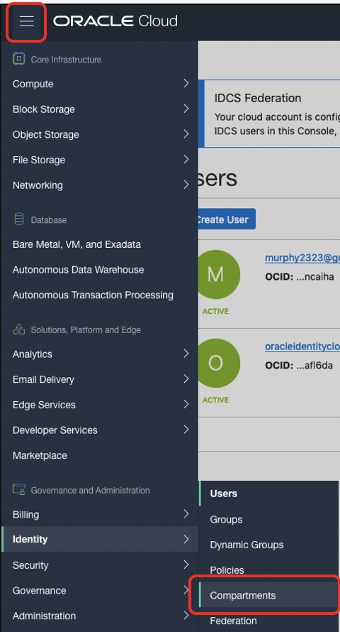
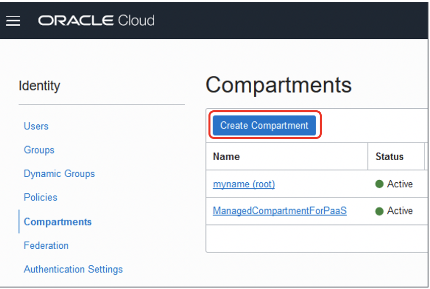

# Set Up OCI for JDE Trial Edition Deployment

## Introduction

To establish proper access to a JDE Trial Edition, the OCI tenancy needs to be set up.

In this lab, the recently provisioned OCI Trial tenancy will be set up for JDE Trial Edition deployment.

Estimated Lab Time: 10 minutes

### About Product/Technology

A compartment will be created to organize your tenancy. A compartment is essentially a folder within the Oracle Cloud Infrastructure (OCI) console. A Virtual Cloud Network will then be created. The Oracle virtual cloud networks (VCNs) provide customizable and private cloud networks on Oracle Cloud Infrastructure (OCI). Lastly, security list rules for JDE, which are virtual firewall to control traffic at the packet level, will be created.

### Objectives

To set up the OCI tenancy, in this lab, you will:
*   Create a Compartment
*   Create a Virtual Cloud Network (VCN)
*   Establish Security List Rules for JDE

### Prerequisites

To have the greatest success in completing this lab make sure you meet the following criteria:
* You have a general knowledge of OCI and its web interface

## **STEP 1**: Generate an SSH Key Pair

In this section you will generate a Secure Shell (SSH) key pair that you will use to connect to your instance.

**NOTE:**  If you have a previously generated key available, you can use that key and skip to **STEP 2**.

### FOR MAC/LINUX

1. Generate ssh-keys for your machine if you don’t have one. If an id\_rsa and id\_rsa.pub key pair is present, they can be reused. By default, these are stored in ~/.ssh folder. 

2. Enter the following command if you are using MAC or Linux Desktop:  

    ```
    # ssh-keygen
    ```

3. Make sure permissions are restricted, sometimes ssh will fail if private keys have permissive permissions. Enter the following to ensure this.

    ```
    # chmod 0700 ~/.ssh  
    # chmod 0600 ~/.ssh/id_rsa  
    # chmod 0644 ~/.ssh/id_rsa.pub
    ```

### FOR WINDOWS

There are many tools available for Windows users to create SSH key pairs and connect to a Linux server.  In this guide, we provide instructions for both Git Bash and Putty, but you only need to follow the steps below for either Git Bash ***OR*** Putty, but not both.

### Git Bash:

1.  Install Git for windows if not already Installed. Download the latest release of [Git](https://github.com/git-for-windows/git/releases/) for Windows and install accepting all the default settings.

2.  Open Git Bash by either checking the ***Launch Git Bash*** option in the installer ***OR*** by navigating to it from the Windows Start Menu:
     
     

3.  Generate ssh-keys by the command ssh-keygen in Git Bash and then simply hit “Enter” for all steps:

        # ssh-keygen  

        Generating public/private rsa key pair. Enter file in which to save the key
        (/c/Users/username/.ssh/id_rsa): (Press enter for this step)
        Created directory '/c/Users/username/.ssh'.
        Enter passphrase (empty for no passphrase): (Press enter for this step)
        Enter same passphrase again: (Press enter for this step)
        Your identification has been saved in /c/Users/username/.ssh/id_rsa.
        Your public key has been saved in /c/Users/username/.ssh/id_rsa.pub

    **Note:**

    *   In Git Bash, C:\Users\username\ is shown as /c/Users/username/

    *   These instructions will create a minimally secure ssh key for you (and one well suited for this tutorial). For production environments we recommend an SSH-2 RSA key with 4096 bits and a passphrase. For example: ssh-keygen -t rsa -b 4096 -N "<myPassphrase>" -f ~/keys/id_rsa -C "This is my comment"

### Puttygen:

1.  Install Puttygen (PUTTY) for Windows if not already installed. Download the latest release of [PuTTY](https://www.chiark.greenend.org.uk/~sgtatham/putty/latest.html), 64-bit MSI Installer and install accepting all the default settings.

2.  Open PuTTY Gen: 
    

3.  In the PuTTY Key Generator, ensure that the ***Type of key to generate*** is set to ***RSA*** and the Number of bits in a generated key is set to ***2048***, and then click the ***Generate*** button.
    

4.  After clicking the ***Generate button***, move the mouse around the blank area to generate randomness for the SSH key to be generated.
    

5.  In the PuTTY Key Generator dialog, select all the characters in the ***Public key for pasting into OpenSSH authorized_keys file*** field, and then right-click and select ***Copy***.

    **Note:** Ensure that you select all the characters and not just the ones shown in the narrow window. Scroll down as necessary.
        

6.  Paste the copied string into a plain text editor (such as Notepad) and save the plain text file. Save it to a known location with any file name but ensure that it has the extension .pub (example: OCISSHKey.pub) to indicate that it is a public key.  Make note of this file name as you will need it later.

7.  Next, save the OpenSSH private key. In the same PuTTY Key Generator window, from the ***Conversions*** menu, select the ***Export OpenSSH key*** option.
    

8.  PuTTYgen will ask you to verify that the key will be saved without a passphrase. Click the ***Yes*** button.
    

9.  Again, save the file to the same known location with any file name but ensure that the file has ***NO extension*** on it (example: OCISSHKey).  Make note of this file name as you will need it later.

10. Save the Windows private key. In the same PuTTY Key Generator window, click the ***Save private key*** button. 
    

11. Again, click the ***Yes*** button to verify saving the key without a passphrase.

12. Save this file to the same known location with any file name and a .ppk extension (example: OCISSHKey.ppk).


## **STEP 2**: Create a Compartment 

In this part of the lab, we create a compartment to organize the resources we will create.

Compartments are the primary building blocks you use to organize your cloud resources. You use compartments to organize and isolate your resources to make it easier to manage and secure access to them.

When your tenancy is provisioned, a root compartment is created for you. Your root compartment holds ***all*** your cloud resources.

1.  Please log into to your OCI tenancy, if you are not already signed in. Example for Ashburn location:

    https://console.us-ashburn-1.oraclecloud.com/ 

2.  On the Oracle Cloud Infrastructure Console Home page, click the Navigation Menu   in the upper-left corner, select Identity, and then select the Compartments option.
    

3.	Click the Create Compartment button.
    

4.  Choose a Name (e.g. “**TestDrive**”), fill out the form and click the   button. Note: that the parent compartment should be the root compartment.
    

## **STEP 3:**  Create a Virtual Cloud Network (VCN)

To create a VCN on Oracle Cloud Infrastructure:

1.	On the Oracle Cloud Infrastructure Console Home page, under the Quick Actions header, click on Set up a network with a wizard.
    

2.	Select VCN with Internet Connectivity, and then click Start VCN Wizard.
    

3.  In this window, fill in the following fields with the information shown below:

    * **VCN NAME:**
    TestDriveVCN     (or any other unique name for the VCN)

    * **COMPARTMENT:**
    TestDrive        (or any other compartment previously created)

    * **VCN CIDR BLOCK:**
    10.0.0.0/16

    * **PUBLIC SUBNET CIDR BLOCK:**
    10.0.2.0/24

    * **PRIVATE SUBNET CIDR BLOCK:**
    10.0.1.0/24 

    * **USE DNS HOSTNAMES IN THIS VCN:**
    Make sure this is checked
    

4.  Then, scroll down to the bottom and click the ***Next*** button.

5.	On the “Review and Create” page, click on the ***create*** button.

6.  On the “Created Virtual Cloud Network” page wait until you see the following graphic.
    

7.  Then click on the View Virtual Cloud Network Button shown
    

 
## **STEP 4:**  Establish Security List Rules for JDE 

With the VCN in place, define the open inbound and outbound ports that will be available to instances created within the VCN.

1.	From the details page of the TestDriveVCN, under the ***Resources*** section in the left pane, select ***Security Lists***. 
    

2.	In the Security Lists section, click the Default ***Security List*** for ***TestDriveVCN*** link.  
    

3.	On Default Security List, under Resources, click the ***Add Ingress Rules*** button.
    

4.  Set a new ingress rule with the following properties:
    *   **STATELESS**: unchecked
    *   **SOURCE TYPE**: CIDR
    *   **SOURCE CIDR**: 0.0.0.0/0
    *   **IP PROTOCOL**: TCP
    *   **SOURCE PORT RANGE**: All
    *   **DESTINATION PORT RANGE**: 443,7005-7006,7072,7077,9703,9705,8080
    *   **DEESCRIPTION**: JDE Trial

    Click the ***Add Ingress Rules***  button when complete. 
        

    These Ingress Rules will be sufficient to allow the network traffic required for JDE Trial Edition.

## Summary

In this lab, OCI has been set up for the networking required to be able to access a JDE Trial Edition that will be created in the next lab.

You may now proceed to the next lab.

## Acknowledgements
* **Author:** AJ Kurzman, Cloud Engineering
* **Contributors:**
    * Jeff Kalowes, Principal JDE Specialist
    * Mani Julakanti, Principal JDE Specialist
    * Marc-Eddy Paul, Cloud Engineering
    * William Masdon, Cloud Engineering
    * Chris Wegenek, Cloud Engineering 
* **Last Updated By/Date:** AJ Kurzman, Cloud Engineering, 11/18/2020


## Need Help?
Please submit feedback or ask for help using our [LiveLabs Support Forum](https://community.oracle.com/tech/developers/categories/migrate-saas-to-oci). Please click the **Log In** button and login using your Oracle Account. Click the **Ask A Question** button to the left to start a *New Discussion* or *Ask a Question*.  Please include your workshop name and lab name.  You can also include screenshots and attach files.  Engage directly with the author of the workshop.

If you do not have an Oracle Account, click [here](https://profile.oracle.com/myprofile/account/create-account.jspx) to create one.
