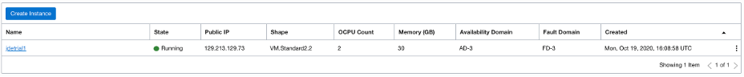
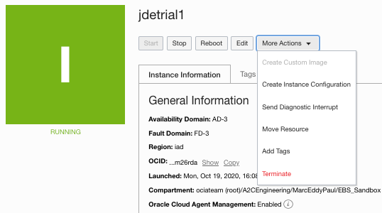
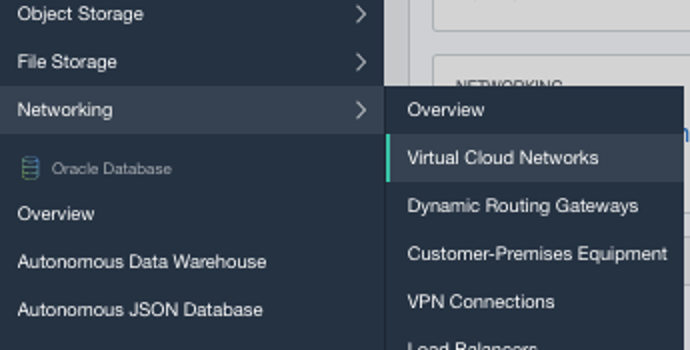
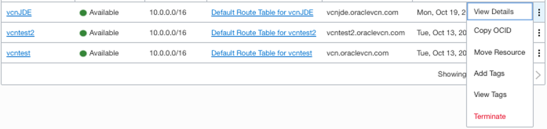

# Tear down Your JDE Environment

## Introduction
Now that the tutorial has been completed, we will use the Oracle Cloud Console to destroy your JD Edwards (JDE) Trial Edition to make sure all resources are properly managed.

Estimated Time: 5 minutes

### Objectives
* Delete your JDE instance.
* Destroy all associated Oracle Cloud Infrastructure (OCI) resources.

### Prerequisites
* Tenancy admin user name
* Tenancy admin password

## Task 1: Delete the JDE instance

1. To delete instances, if you are not already, sign in to the OCI tenancy.

2. On the Oracle Cloud Console home page, click the navigation menu in the upper-left corner and open **Compute** and then select **Instances**.

3. Navigate to your Compartment. Select the JDE trial instance in the list of instances.

   

4. Click **More Actions** and select **Terminate** to terminate the instance.

   

5. Wait for the instance to terminate. Once terminated, your instance should be gone from the instance list.

## Task 2: Delete the Associated Oracle Cloud Infrastructure Resources

1. To delete the virtual cloud network (VCN), on the Oracle Cloud Console home page, click the navigation menu in the upper-left corner and open **Networking** and then select **Virtual Cloud Networks**.

   

2. Under the list of VCN, click **Action** on the right-side and select **Terminate**.

    

3. Wait for the VCN to finish terminating and reload the page. The item should be removed from the list.

## Acknowledgements
* **Author:** AJ Kurzman, Cloud Engineering
* **Contributors:**
    * Jeff Kalowes, Principal JDE Specialist
    * Mani Julakanti, Principal JDE Specialist
    * Marc-Eddy Paul, Cloud Engineering
    * William Masdon, Cloud Engineering
    * Chris Wegenek, Cloud Engineering
* **Last Updated By/Date:** AJ Kurzman, Cloud Engineering, 11/18/2020
