# Lifting a LAMP Stack Application to the Cloud

## Introduction
This lab walks you through the steps to install MySQL on local system, setup MySQL-shell and spin up MySQL Database on OCI.
First you will create MySQL database on locally and then migrate the database to MySQL on OCI using MySQL Shell tool. The MySQL Shell uses OCI CLI to move the database dump to Object storage.

Estimated Lab Time:  1 hour

### Objectives
* Create a MySQL Database on OCI
* Leverage Object Storage
* Migrate Database from on-prem MySQL to MDS on OCI

### Prerequisites
* An Oracle Paid or LiveLabs Cloud account.
* Please install MySQL version 8+ on your local system depending on your OS
* [Install MySQL](https://dev.mysql.com/downloads/mysql/)
* [Install OCI CLI](https://docs.cloud.oracle.com/en-us/iaas/Content/API/SDKDocs/cliinstall.htm)
* [Configure OCI CLI](https://docs.cloud.oracle.com/en-us/iaas/Content/API/Concepts/sdkconfig.htm)
* [Install MySQL Shell](https://dev.mysql.com/doc/mysql-shell/8.0/en/mysql-shell-install.html)
* [Install MySQL WorkBench](https://dev.mysql.com/downloads/workbench/)
* [Spin MySQL on OCI](https://oracle.github.io/learning-library/data-management-library/mysql/mds-intro/workshops/freetier/?lab=introduction)

### Administrative Note
Please ensure you have MySQL Database installed on your local machine. Before proceeding with the lab ensure you have installed all the mentioned pre-requisites. This section outlines how to migrate database from On-Premises MySQL to MDS on OCI. For this workshop we will use the provided database. [here](https://objectstorage.us-ashburn-1.oraclecloud.com/p/LTguZ7S_JQ_v7rBhNX8qOoSAw3dU4cgMoY7tdtv6JBpuj4DB7T-sYEk0DnwC_ALI/n/orasenatdpltintegration03/b/mysql_test/o/library-dump.sql). Please note in this workshop we are using Mac-OS.

## **Step 1:** Download the Database to your local MySQL Database
1. If you do not have it on your local machine, make sure to download the database file.[Database Dump](https://objectstorage.us-ashburn-1.oraclecloud.com/p/LTguZ7S_JQ_v7rBhNX8qOoSAw3dU4cgMoY7tdtv6JBpuj4DB7T-sYEk0DnwC_ALI/n/orasenatdpltintegration03/b/mysql_test/o/library-dump.sql).

2. Open the terminal and connect to your local MySQL Database. Enter the password you specified when installing MySQL.

    
    ```
       /usr/local/mysql/bin/mysql -u root -p
    ```

3. Once you have connected to the database, we would dump the data into local MySQL. But first lets create database and use the database. Then we load the data into the database.

    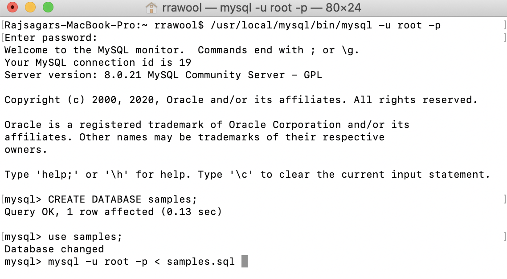
```
   create database library;
   use library;
   source library-dump.sql
```

4. Once complete, you can verify the database was created with tables.

    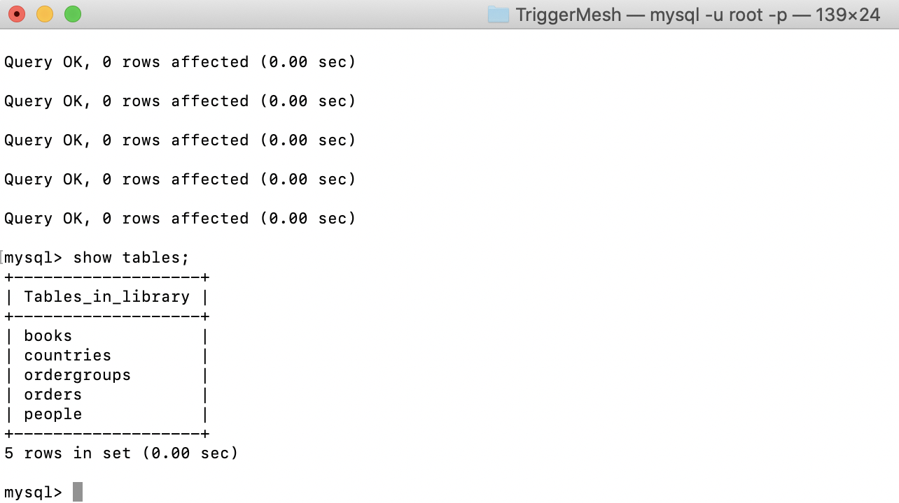

    ```
       show tables;
    ```

## **Step 2:** Load data from On-Prem MySQL to Object Storage

In this section we will create bucket in Object Storage of OCI and move the library database from local MySQL database to OCI using MySQL Shell tool.

1. Before proceding with below steps, ensure you have OCI CLI Configure and running. Test OCI CLI connection with below command. Open local terminal and try, this will give your tenancy name.
```
   oci os ns get
```

2. Create Bucket in Object Storage. Go to your OCI Console and click Object Storage as show below
Click create bucket and give some name, example - mysql_test.

    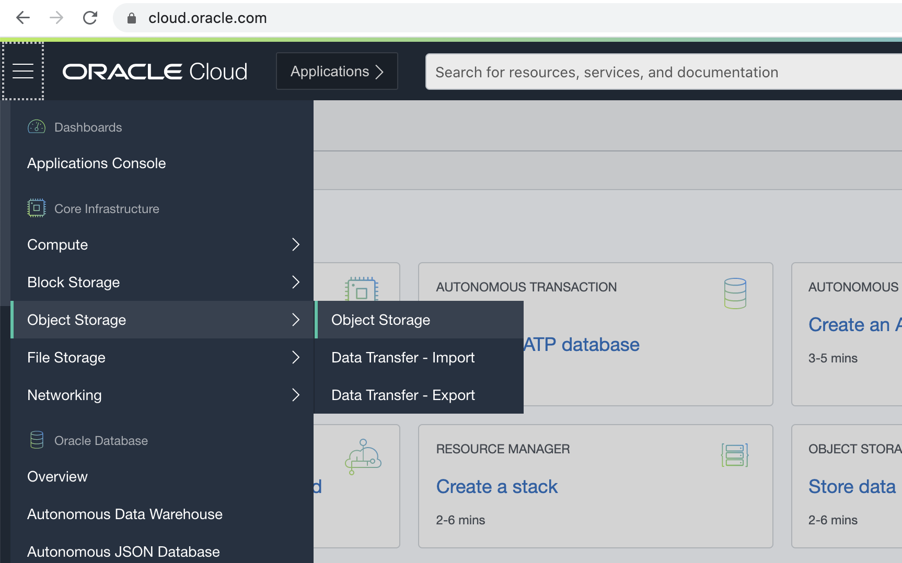
    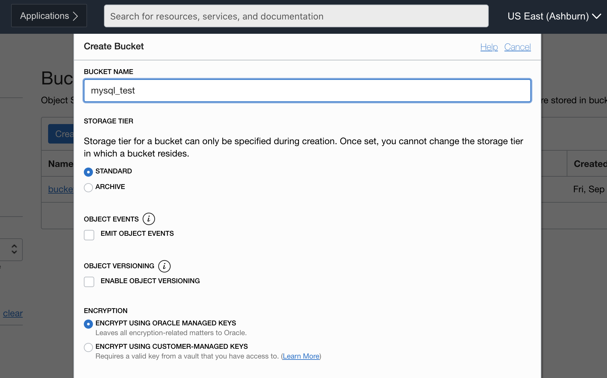

3. Now go back to local terminal and open mysql-shell tool using below command.

  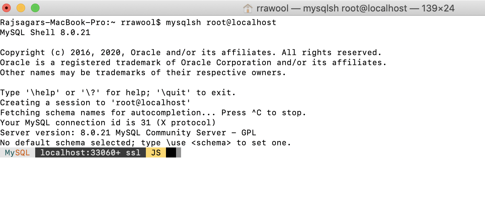
```
   mysqlsh root@localhost
```
4. Once inside the MySQL Shell, run below command to load the database to Object Storage.

  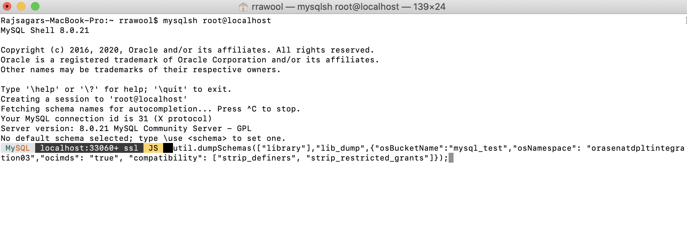
```
   util.dumpSchemas(["<database_name>"],"<new_file_on_object_storage>",{"osBucketName":"<bucket_name>","osNamespace": "<tenancy_name>","ocimds": "true", "compatibility": ["strip_definers", "strip_restricted_grants"]})

   Example,
   util.dumpSchemas(["library"],"lib_dump",{"osBucketName":"mysql_test","osNamespace": "orasenatdpltintegration03","ocimds": "true", "compatibility": ["strip_definers", "strip_restricted_grants"]})
```
4. Now check on OCI Console under mysql_test bucket, there would be folder lib_dump generated as below.

  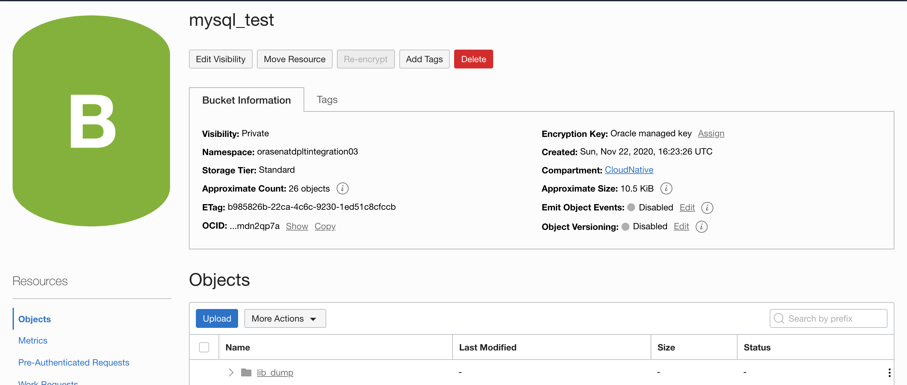

## **Step 3:** Load data from Object Storage to MySQL on OCI (MDS).

1. Please ensure you have MySQL instance running on OCI. Now let's create a compute instance on OCI. This compute instance will be required by MySQL-Shell to connect with MySQL on OCI and move the data from Object Storage to MySQL.
Please ensure the compute instance is created in public subnet of same VCN where you have MySQL instance.

  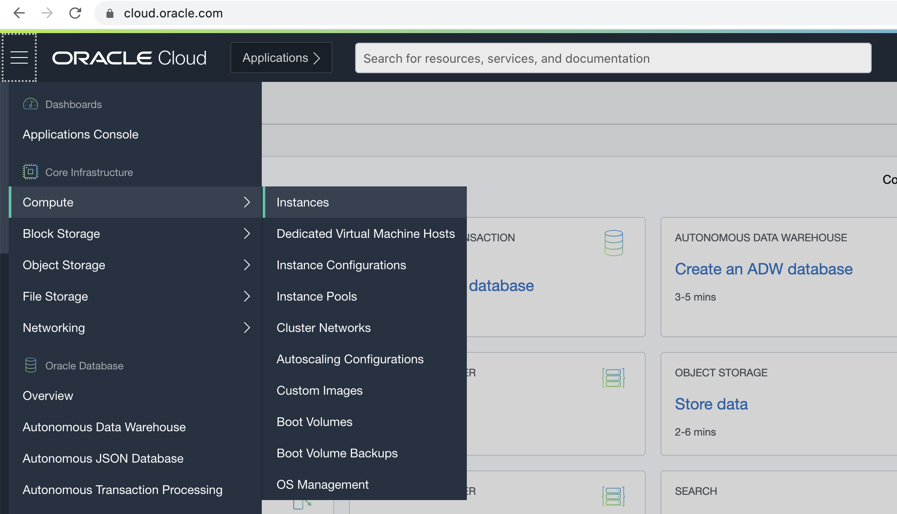
  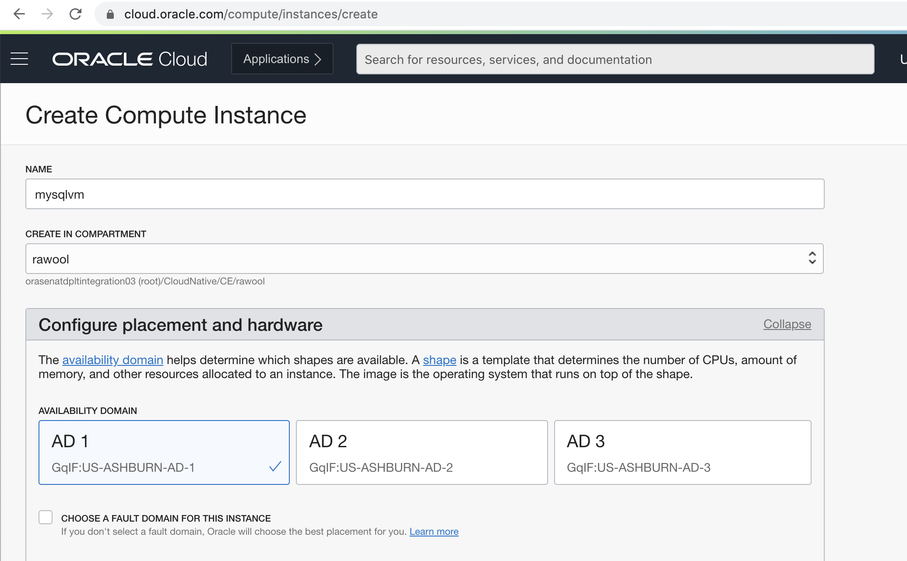
  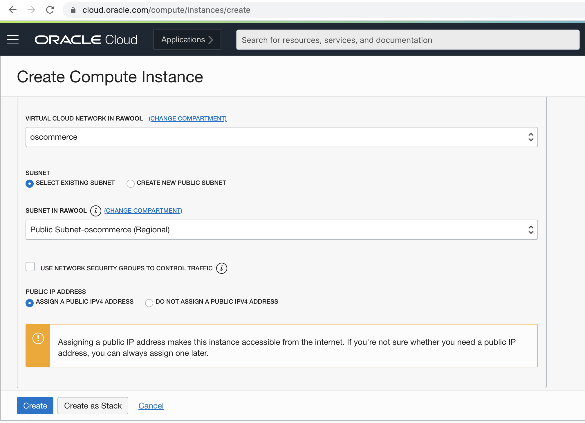

2. Now we have to SSH into the instance. Open terminal and run below command.

  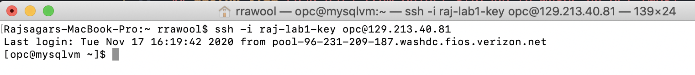
```
   ssh -i <private_key> opc@<ip_address>
```

3. Please install OCI CLI on this VM

* [Install OCI CLI](https://docs.cloud.oracle.com/en-us/iaas/Content/API/SDKDocs/cliinstall.htm)
* [Configure OCI CLI](https://docs.cloud.oracle.com/en-us/iaas/Content/API/Concepts/sdkconfig.htm)

Once installed, please ensure you are able to get tenancy name.
```
   oci os ns get
```

4. Let's connect to MySQL using MySQL-shell.

  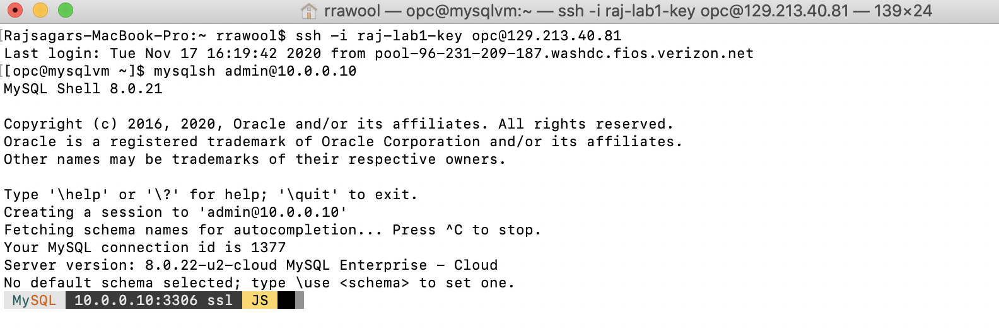
```
   mysqlsh admin@<ip_address_mysql>

   Example,
   mysqlsh admin@10.0.0.10
```
4. Once inside the MySQL Shell, run below command to load the database with dump from Object Storage

  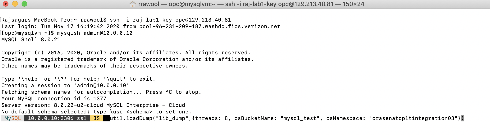
```
   util.loadDump("<new_file_on_object_storage>",{threads: 8, osBucketName: "<bucket_name>", osNamespace: "<tenancy_name>"})

   Example,
   util.loadDump("lib_dump",{threads: 8, osBucketName: "mysql_test", osNamespace: "orasenatdpltintegration03"})
```
5. Once the data is migrated. You can verify using MySQL Workbench that the library database was migrated to MySQL on OCI

  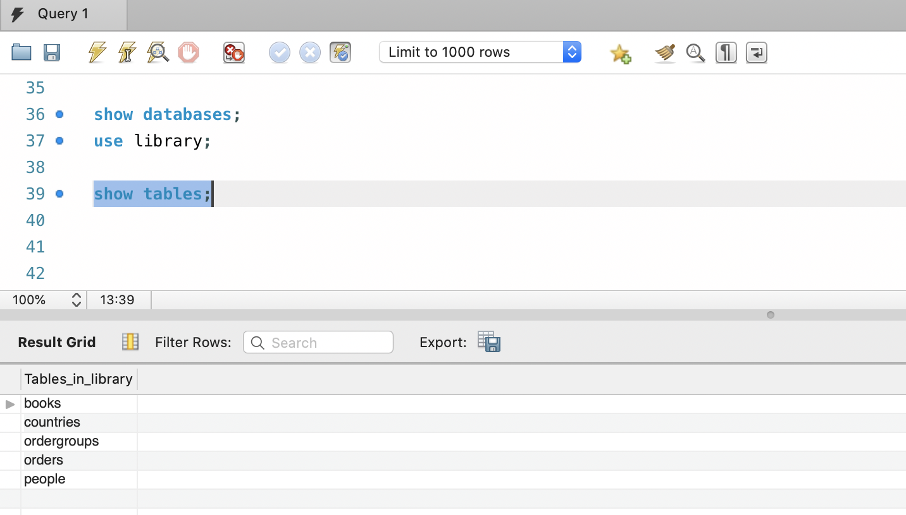
```
   show databases;
   use library;
   show tables;
```


You may now **proceed to the next lab**.

## Learn More
* To learn about provisioning Networks and Network Security check out this [link](https://docs.cloud.oracle.com/en-us/iaas/Content/Network/Concepts/overview.htm)
* To learn about Object Storage in the cloud please see the following [link](https://docs.cloud.oracle.com/en-us/iaas/Content/Object/Concepts/objectstorageoverview.htm)
* How to Connect to MySQL on OCI [link](https://docs.cloud.oracle.com/en-us/iaas/mysql-database/doc/connecting-db-system.html)

## Acknowledgements
* **Author** - Mitsu Mehta, Oladipupo Akinade, Saurabh Salunkhe
* **Adapted for Cloud by** -  Mitsu Mehta, Oladipupo Akinade
* **Last Updated By/Date** - Saurabh Salunkhe, September 2020


## See an issue?
Please submit feedback using this [form](https://apexapps.oracle.com/pls/apex/f?p=133:1:::::P1_FEEDBACK:1). Please include the *workshop name*, *lab* and *step* in your request.  If you don't see the workshop name listed, please enter it manually. If you would like us to follow up with you, enter your email in the *Feedback Comments* section.
