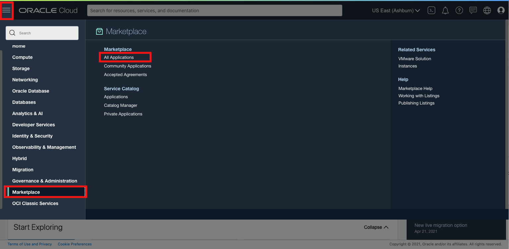
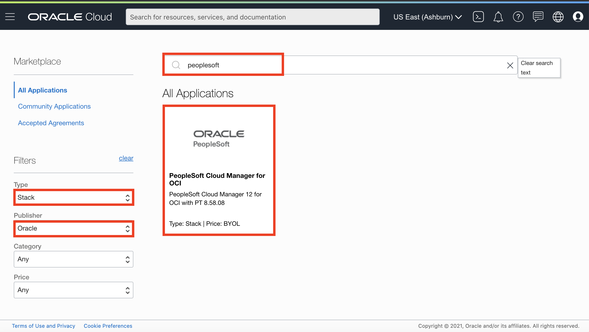
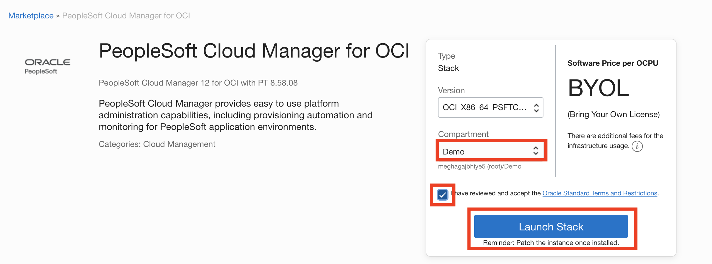
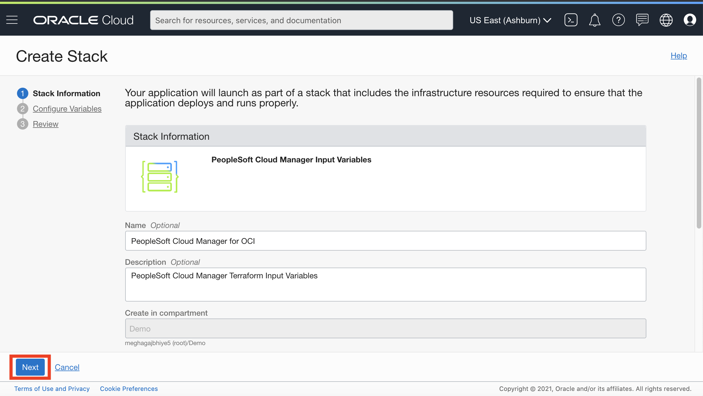

# Provisioning Cloud Manager from Resource Manager 

## Introduction
Resource Manager is an Oracle Cloud Infrastructure service that helps you install, configure, and manage resources. Resource Manager uses Terraform (which is part of the service) to codify your infrastructure in declarative configuration files, which allows you to review and edit, version, persist, reuse, and share them across teams. You can then use Resource Manager to provision Oracle Cloud Infrastructure resources using your Terraform configurations.

In this tutorial, you obtain the configuration files, or stack, for Cloud Manager from the Oracle Cloud Infrastructure Marketplace, and use Resource Manager to create an instance and link it with associated resources such as a Virtual Cloud Network (VCN), subnet, gateways, and route tables. You enter the necessary passwords and other information in the Resource Manager interface and choose the types of resources created.

Estimated Lab Time: 30 minutes + 90 minutes for provisioning

### Objectives
The purpose of this lab is to show you how to create a PeopleSoft Cloud Manager instance from the Marketplace. 

In this lab, you will:
* Configure a stack for the Cloud Manager 
* Provision a Cloud Manager instance from the Marketplace Stack 
* Login to the Cloud Manager

### Prerequisties
- Oracle Cloud Infrastructure account credentials.
    * User
    * Password
    * Tenant
- Admin privileges on your local machine or Windows instance on Cloud.


## **STEP 1**: Obtain the PeopleSoft Cloud Manager Stack from the Marketplace

To obtain the PeopleSoft Cloud Manager stack:

1. On the Oracle Cloud Infrastructure console home page, click the top left three-line menu icon and select **Marketplace** > **Applications**.

    

2. Under Filters on the left, select **Stack** from the Type drop-down list, and **Oracle** from the Publisher drop-down list. Search for **Peoplesoft** on the search bar. Select **PeopleSoft Cloud Manager for OCI**.

    

3. On the Overview page for the PeopleSoft Cloud Manager stack, select the compartment to install the instance. If it's a nested compartment, make sure to click on **+** to navigate to your **Demo** sub-compartment.   
Review the **Oracle terms**, and then select the option indicating that you have reviewed and understand the conditions.
Click **Launch Stack**. 

    

4. On the Create Stack, Stack Information page, enter a stack name and description if desired.

    Click **Next** 

    

    Continue with the steps in Enter Cloud Manager Instance Variables.

## **STEP 2**: Configure Cloud Manager Instance Variables

The Create Stack, Configure Variables page includes a list of the parameters needed to create and configure the Cloud Manager instance.

1. In the Cloud Manager Instance section, select the **Availability Domain** as **US-ASHBURN-AD-1** (or AD-1 of your selected region noted down in **Details.txt #4)
2. For **Shape**, select **VM.Standard2.1**. 
3. Select the **storage volume size in GBs** for the secondary block volume for the Cloud Manager instance. We will set it as **200 GBs**.
4. For SSH public key, enter the contents of your ``id_rsa.pub`` from your keys folder in a single line, with no line feeds or spaces.
5. Enter your **User OCID** (you have copied this in your **Details.txt** #5) in a single line, with no line feeds or spaces.
6. For API private key, enter the contents of your ``api_key`` file.   
7. Leave API Private passphrase as blank (Enter if you have created one).
8. For **Tenancy Home Region**, Select the home region for your tenancy from the drop-down list. (**Details.txt** #4)

    

## **STEP 3**: Enter Cloud Manager Passwords

1. Enter following password values:

    *Note*: They are all the same **except** DB Admin Password (in screenshot it is blue)

    Attribute | Value
    --------- | -----
    DB CONNECT PASSWORD	| Psft1234
    ACCESS PASSWORD | Psft1234
    DB ADMIN PASSWORD | Psft1234#
    CLOUD MANAGER ADMINISTRATOR PASSWORD | Psft1234
    INTEGRATION GATEWAY USER PASSWORD | Psft1234
    WEBLOGIC ADMINISTRATOR USER PASSWORD | Psft1234
    WEB PROFILE USER PASSWORD | Psft1234
    DOMAIN CONNECT PASSWORD | Psft1234

    

## **STEP 4**: Enter My Oracle Support Credentials

1. My Oracle Support (MOS) credentials are the same as the username and password you enter when you access [http://support.oracle.com](http://support.oracle.com). Please sign in now to ensure that you have an account and the accurate credentials for My Oracle Support. This is required to download DPKs and PRPs automatically. 

    

## **STEP 5**: Enter Networking Information

We will be provisioning our Cloud Manager instance in Private Cloud. Click [here](https://www.oracle.com/webfolder/technetwork/tutorials/obe/cloud/compute-iaas/install_cloud_manager_resource_manager_psft_cm_oci/index.html#EnterValuesforaNewVirtualCloudNetwork) for more information on the default subnets and ports that will automatically get created in the following steps.

1. In the Networking section, enter a host name for the Cloud Manager instance. We'll use **psftcm**.
2. Select the option **Create Network Resources**
3. For **Network Name**, enter **OCIHOLVCN** (Oracle Cloud Infrastructure, Hands On Lab, Virtual Cloud Network)
4. Select the option **Create Private Subnets**
5. Select the option **Create Subnets for Peoplesoft Components**
6. Select the option for **Create a Jump Host**
7. Using the drop-down, select **US-ASHBURN-AD-1** for the **Availability Domain for Jump Host** 
8. Using the drop-down, select **VM.Standard2.1** for the **Shape for Jump Host** 

    

9. Click **Next**. 
10. Review the configuration variables, and then click **Create**.  
    

## **STEP 6**: Monitor Stack Creation and Gather Outputs

This page shows the terraform job status and details. Under the yellow box that has **RMJ** (Resource Manager Job), you'll see the status is **"Accepted"** 
    

Refresh the page, and you should see the status has now changed to **"In Progress"**. All the information we provided in the Marketplace is now being used to create our Cloud Manager Stack.
Spinning up resources, such as our Virtual Cloud Network, compute instances for Jump Host and Cloud Manager will take a few minutes. 
    

Over these few minutes, you can refresh the page until you see the **RMJ** has succeeded as indicated with a green box and **Succeeded** status. Once you do:
1. Click on **Logs** under **Resources** on the left side. 
2. Scroll all the way down in the black box, copy and paste these values into **Details.txt** (#9). 
    

    Close up view:
    

    *NOTE*: If you don't have admin access in your laptop, before proceeding with Step 7 or 8, please follow the 
    **Windows VM Compute Lab:** 

    

Depending on your workstation, choose Step 7 (for Mac) OR Step 8 (for Windows)

## **STEP 7**: FOR MAC USERS- Accessing Cloud Manager using SSH 

SSH key pair  (``` id_rsa ``` & ```id_rsa.pub ```) is required to access Cloud Manager instance which was downloaded/created in Lab 1: IAM, Step 8: Generating Keys. 

**NOTE**: Make sure you are off VPN.

1. Retrieve the **Cloud Manager Output Variables** you just copied to **Details.txt** 
2. In **Details.txt** #10, edit the **sample\_command\_for\_ssh\_tunnel** by adding **-i id_rsa** like so:
    


    -    The overall format of the command should look like this:
    

    
3. Launch terminal and navigate to the keys folder. (For example: ```cd ~/Downloads/psftKeys ```) Now, paste in the ssh tunnel command we just edited . 
4. Type in "yes" to continue connecting.
5. Now, let's connect through SSH. Run this command (**Details.txt** #11) in the keys directory as well.

    ```ssh -p 2222 opc@localhost -i id_rsa```
5. Again, type in "yes" to authenticate the host.

    All together, it should look like this:
    

    Now that you've SSH'ed into your Cloud Manager instance, let's check status of the deployment. 

6. Monitor Cloud Manager bootstrap installation using the below command.

    ```
    <copy>
    tail -f /home/opc/bootstrap/CloudManagerStatus.log
    </copy>
    ```

    

7. After Cloud Manager bootstrap is complete, the CloudManagerStatus.log will show the following messages. 

		The PeopleSoft Environment Setup Process Ended.
		CM installed successfully
		Cloud Manager PIA URL: http://psftcm.cm.ociholvcn.oraclevcn.com:8000 
		Cloud Manager PIA SSL URL: https://psftcm.cm.ociholvcn.oraclevcn.com:8443

    *NOTE*: Usually, it takes an hour for Cloud Manager to finish the bootstrap script. Until the script is successfully executed and you get the above message, you won't be able to access cloud manager URL. This is a long process. 

You may skip down to Step 9 while waiting for Cloud Manager to finish deploying.

## **STEP 8**: FOR WINDOWS USERS- Accessing Cloud Manager using SSH 
Reminder of Prerequisites: PuTTY, Git Bash, and Firefox. Please download those if you haven't already.

1. Open up PuTTYgen. Click **Conversions** --> **Import key**. 
    

    Now, select the ```id_rsa``` key from Step 8 of Lab 1, and click **Open**

    

    Click **Save private key**.

    

    Now, rename the file to ```id_rsa_ppk``` and click **Save**.

    

2. Open up PuTTY and create a **Session** by filling in the following fields:
    * Host Name: **`<`jumphost`_`public`_`ip`>`** (get this value from the Outputs you copied in your Notepad)
    * Port: **22**
    * Saved Sessions: **CMtunnel**

    Click **Save**

    
3. Under SSH --> **Tunnels**, fill in:
    * Source Port: **2222**
    * Destination: **`<`cm`_`private`_`ip`>`:22** 

    Click **Add** and you should see an entry added in the forwarded ports box like the one here in blue:
    

4. Under SSH --> **Auth**, Click **Browse**. 
    
    Select the ```id_rsa_ppk``` file we just created above. Click **Open**
    
5. Go back to **Session**. Click **Save** and then **Open**.
     
    A dialog box will pop up with a Security Alert. Go ahead and click **Yes** to add this key.
    
    In the window, login as: **opc**.
    If you see this, you've successfully connected to the jumphost.
    

6. Now open up GitBash. Navigate to the folder in which your keys are located. Type in this command:

    ```
    <copy>
    ssh -p 2222 opc@localhost -i id_rsa
    </copy>
    ```
    
    If you see something like this, you are now connected to Cloud Manager.

    


7. Now that you've SSH'ed into your Cloud Manager instance, let's check status of the deployment. 

    Monitor Cloud Manager bootstrap installation using the below command.

    ```
    <copy>
    tail -f /home/opc/bootstrap/CloudManagerStatus.log
    </copy>
    ```

    

8. After Cloud Manager bootstrap is complete, the CloudManagerStatus.log will show the following messages. 

		The PeopleSoft Environment Setup Process Ended.
		CM installed successfully
		Cloud Manager PIA URL: http://psftcm.cm.ociholvcn.oraclevcn.com:8000 
		Cloud Manager PIA SSL URL: https://psftcm.cm.ociholvcn.oraclevcn.com:8443

    *NOTE*: Usually, it takes an hour for Cloud Manager to finish the bootstrap script. Until the script is successfully executed and you get the above message, you won't be able to access cloud manager URL. This is a long process. 

You may complete Step 9 while waiting for Cloud Manager to finish deploying.


## **STEP 9**: Set up SOCKS Proxy to Access Cloud Manager in Browser

**NOTE**: Make sure you are off VPN. 

1. Launch Firefox and go to **Preferences** by clicking the gear in the top right. (If you don't see the gear, open up a new tab)

    

2. Click **General** on the left and scroll all the way down to the bottom to **Network Settings**

    

3. Make the following changes to configure Proxy access to the internet.

    * Toggle Manual Proxy Configuration
    * SOCKS host: localhost and Port: 8123
    * Toggle SOCKS v5
    * No proxy for: localhost, 127.0.0.1
    * Select Proxy DNS when using SOCKS v5 

    Click OK


    

4.  Go back to your outputs and edit **Details.txt** #12, the **sample\_command\_for\_socks\_proxy** as shown below, adding in **-i id_rsa** like so:

    

    -   The overall format of the command should look like this:
    ssh -i id_rsa -D 8123 -f -C -q -N opc@jumphost\_public\_ip

## **STEP 10**: Sign-In to Cloud Manager via Browser
1. Once Cloud Manager has finished deploying, launch terminal (Mac) or Git Bash (Windows) and navigate to the keys folder again. Then, run the command we just edited to create the SOCKS proxy.

    *Example:* ``` ssh -i id_rsa -D 8123 -f -C -q -N opc@XXX.XXX.XXX.XXX ```

    

    *NOTE:* You will need to run this command each time you access Cloud Manager in the furute.

2. Enter your **Cloud Manager PIA URL** (``CM_http_url`` from the Outputs) in Firefox

3. To login, use the username **CLADM** and password as **Psft1234**. (**Details.txt** #13 & 14)
    ```
    <copy>CLADM</copy>
    ```
    ```
    <copy>Psft1234</copy>

    ```
     
    
You have now signed into Cloud Manager 12.

You may now **proceed to the next lab.**

## Acknowledgments

**Created By/Date**   
* **Authors** - Megha Gajbhiye, Cloud Solutions Engineer; Sara Lipowsky, Cloud Engineer
* **Last Updated By/Date** - Sara Lipowsky, Cloud Engineer, May 2021


## Need Help?
Please submit feedback or ask for help using our [LiveLabs Support Forum](https://community.oracle.com/tech/developers/categories/Migrate%20SaaS%20to%20OCI). Please click the **Log In** button and login using your Oracle Account. Click the **Ask A Question** button to the left to start a *New Discussion* or *Ask a Question*.  Please include your workshop name and lab name.  You can also include screenshots and attach files.  Engage directly with the author of the workshop.

If you do not have an Oracle Account, click [here](https://profile.oracle.com/myprofile/account/create-account.jspx) to create one.


