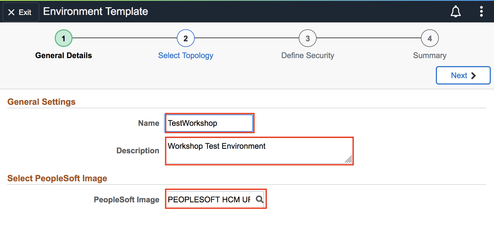
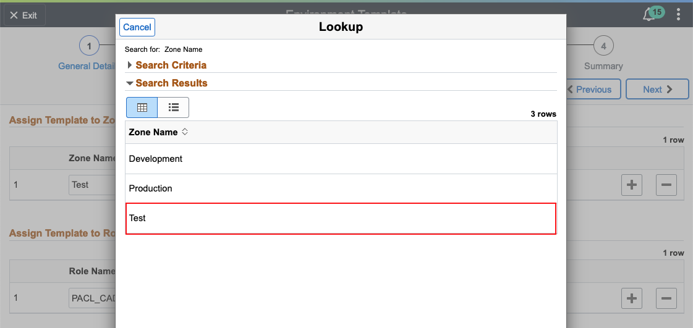

# Creating New Environment Template

## Introduction

This lab walks you through the steps to create a new environment template from the previously downloaded PeopleSoft Image

Estimated Lab Time: 10 minutes

### Objectives
The purpose of this lab is to show you how to create a new environment template from a downloaded PeopleSoft Image in order to create a new PeopleSoft Environment.

In this lab, you will:
* Create a new environment template

Let's take a look at the Network Topology again, so we can understand what we are configuring.

We have already provisioned Cloud Manager in a private subnet and the Jump Host in a public Subnet. We are now working towards provisioning our PeopleSoft Environment in Availability Domain-3. 

*Note:* The reason we have separated it out into 3 ADs for this workshop is because of compute Service Limit constraints in a trial environment. For production environment, it is suggested to have all the tiers of Peoplesoft in one Availability Domain, maintaining High Availability through Fault Domain.

### Prerequisites
- A PeopleSoft Cloud Manager Instance
- A downloaded PeopleSoft Image

## **STEP 1**: Creating a New Environment Template

Navigate to Cloud Manager Dashboard -> **Environment Template**.  
  Click **Add New Template** button.

1. On the General Details page, provide the values below: 
    * Give your environment a unique **Name** such as **TestWorkshop** 
    * For **Description**, we'll use **Workshop Test environment**
    * Click on the **Search Icon**. Do NOT type anything. If your DPK was downloaded properly, it should appear in the Search Results. If you can't see it yet, please wait and refresh the page after awhile. Since we subscribed to the HCM channel in the previous lab, we see **PEOPLESOFT HCM UPDATE IMAGE 9.2.037 - NATIVE OS** (see 2nd screenshot below).

  

  

  Click **Next**.

2. On the Select Topology page: 
    * Click on the **Search Icon** to search for a topology and select **Fulltier** topology. 
    * Expand the **Custom Attributes** section and select **Fulltier** again in the dropdown. 
    * Click on **Edit Custom Attributes**

  

    * Expand the **Region and Availability Domains** section and select the following from the corresponding dropdowns:

  

    * Expand the **Full Tier** -> **General Settings** and make the following 2 changes:
      - Database Operator Id: **PS** 
      - Database Name: **MYPUMDB**

  

    * Expand **Subnet Settings** and select **cm**

  

  Click **Next**

3. 	On the Define Security page:

    * Click on the Search Icon and Select **Test** for Zone Name from the Search Results
  
    * Click on the Search Icon again for Role Name. This time, expand **Search Criteria**, type **PACL_CAD** and click Search. Select it under Role Name. 

  

  Your screen should look like this:

  

  Click **Next**

4. On the Summary page:

    * Review the details and click **Submit** to save the template. 

  

You may proceed to the next lab.

## Acknowledgements

**Authors** 
* **Authors** - Rich Konopka, Peoplesoft Specialist, Megha Gajbhiye, Cloud Solutions Engineer
* **Contributor** -  Sara Lipowsky, Cloud Engineer
* **Last Updated By/Date** - Sara Lipowsky, Cloud Engineer, February 2021

## Need Help?
Please submit feedback or ask for help using our [LiveLabs Support Forum](https://community.oracle.com/tech/developers/categories/Migrate%20SaaS%20to%20OCI). Please click the **Log In** button and login using your Oracle Account. Click the **Ask A Question** button to the left to start a *New Discussion* or *Ask a Question*.  Please include your workshop name and lab name.  You can also include screenshots and attach files.  Engage directly with the author of the workshop.

If you do not have an Oracle Account, click [here](https://profile.oracle.com/myprofile/account/create-account.jspx) to create one.